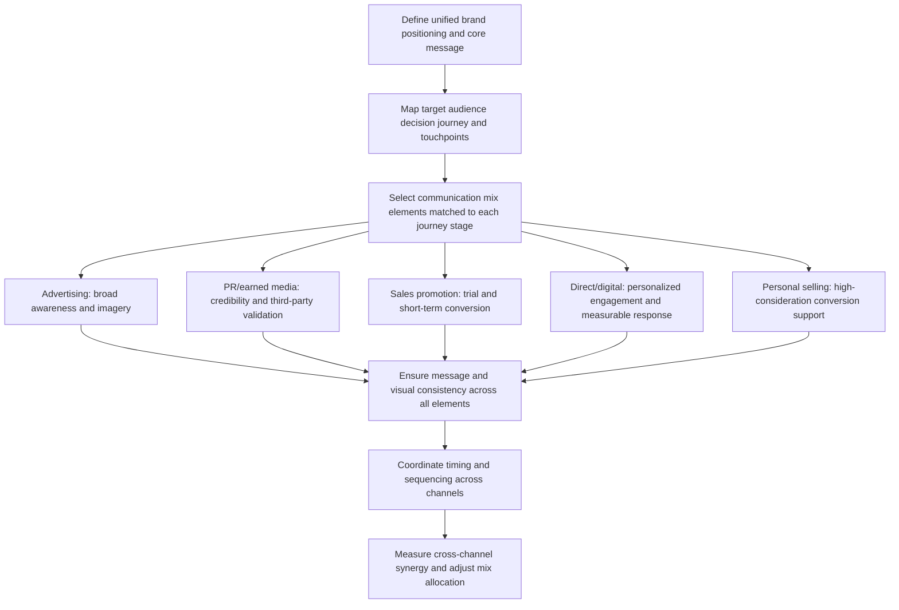

## The IMC Concept and Communication Mix

### Definition

**Integrated Marketing Communications (IMC)** is a strategic planning philosophy and process in which all forms of marketing communication — advertising, public relations, sales promotion, direct marketing, personal selling, digital/social media, and packaging — are coordinated to deliver a consistent, unified brand message and maximize combined persuasive impact, rather than being planned and executed as independent, siloed disciplines. The foundational academic definition (Don Schultz and colleagues at Northwestern University, early 1990s) framed IMC as a shift from a media-centric, function-by-function planning model to a consumer-centric model organized around the total communication experience a target audience receives.

### Theoretical Rationale for Integration

**Key Points**

- **Consumer contact-point reality**: Consumers do not experience a brand's advertising, PR, packaging, and sales promotion as separate, unrelated inputs — they synthesize all brand contact points into a single cumulative brand impression, meaning fragmented or inconsistent messaging across channels can actively undermine, rather than merely fail to reinforce, an intended positioning.
- **Message consistency and schema reinforcement**: From a cognitive perspective, consistent messaging across multiple touchpoints reinforces the same associative brand schema in memory (see the mere exposure and processing fluency concepts discussed under Repetition, Wear-Out, and Recency Effects), while inconsistent messaging can create competing or diluted associations that weaken overall brand memory structure.
- **Synergy vs. additive effects**: A central IMC claim — supported by research on multi-channel advertising effects — is that well-coordinated cross-channel communication can produce persuasive effects greater than the simple sum of each individual channel's isolated effect (a synergy or interaction effect), because different channels can perform complementary roles across the consumer decision journey rather than duplicating the same function.
- **Efficiency rationale**: Beyond the consumer-experience argument, IMC is also motivated by organizational efficiency — coordinated planning reduces duplicated creative development costs, prevents contradictory messaging that can require costly correction, and enables shared brand assets (visual identity, tone, core message architecture) to be reused and adapted across channels rather than developed independently by siloed teams or agencies.

### The Communication Mix: Component Disciplines

The "communication mix" (sometimes called the promotional mix) refers to the specific set of tools an IMC strategy coordinates. Each discipline brings distinct strengths, cost structures, and audience-reach characteristics:

**Key Points**

- **Advertising**: Paid, non-personal, identified-sponsor communication through mass or targeted media — strong for building broad awareness and consistent brand imagery at scale, but comparatively weak for deep individualized engagement or immediate transaction completion.
- **Public relations (PR) and publicity**: Communication mediated through third-party channels (press coverage, earned media, influencer commentary) not directly paid for as advertising space — carries higher perceived credibility than paid advertising (since it appears independently validated by a third party) but offers less message control, since the advertiser cannot dictate the exact framing a journalist or independent commentator will use.
- **Sales promotion**: Short-term incentives designed to stimulate immediate purchase or trial (see Promotions, Discounts, and Their Framing) — highly effective at driving short-term volume and trial but carries risks of reference-price erosion and brand equity dilution if overused (see the boundary conditions discussed in that topic).
- **Direct marketing**: Personalized, addressable communication (direct mail, email, targeted digital messaging) allowing individualized offers and messaging — offers strong measurability and personalization but can suffer from lower attention/credibility than earned or even paid mass media if perceived as intrusive or overly frequent.
- **Personal selling**: Direct, interpersonal communication between a company representative and a prospective buyer — offers the highest degree of message adaptability and immediate objection-handling but at substantially higher per-contact cost, generally reserved for high-value, high-consideration, or B2B purchase contexts.
- **Digital and social media**: A more recently formalized component encompassing owned (brand-controlled social accounts, websites), earned (organic social sharing, user-generated content), and paid (social/search advertising, retail media — see Retail Media Networks and In-Store Advertising) digital channels, notable for enabling two-way, interactive communication distinct from the largely one-way communication flow of traditional mass advertising.
- **Packaging and point-of-purchase**: Often underweighted in traditional communication-mix frameworks but functionally a communication channel in its own right, since packaging design communicates brand positioning and product attributes at the precise moment of in-store decision-making (see Layout, Traffic Flow, and Product Placement; Point-of-Sale Displays and Impulse-Purchase Triggers).

### The Earned-Owned-Paid Media Framework

A widely used contemporary organizing structure for the communication mix, distinguishing channels by ownership and control rather than by discipline:

**Key Points**

- **Paid media**: Any channel where the brand pays directly for placement and message control (traditional advertising, paid search, paid social, retail media) — highest control, but also generally viewed with the most inherent consumer skepticism given the explicit commercial framing (see Persuasion Knowledge Model discussion under Native Advertising and Sponsored Content Perception).
- **Owned media**: Channels the brand directly controls without paying a third party for placement (brand website, owned social accounts, email list, packaging) — high control and no direct per-exposure media cost, but reach is limited to audiences who already choose to engage with brand-owned properties.
- **Earned media**: Exposure generated by third parties without direct payment (press coverage, organic word-of-mouth, user-generated content, influencer mentions not arranged as paid partnerships) — lowest control but highest inherent credibility, since the message appears to originate independently of the brand's own commercial interest.
- **Integration implication**: A mature IMC strategy explicitly plans how paid, owned, and earned media should interact and reinforce each other (e.g., paid media driving traffic to owned properties, owned content designed to be shareable and generate earned amplification) rather than treating the three categories as unrelated, independently-managed workstreams.

### IMC Planning Process

### Matching Communication Mix Elements to the Decision Journey

**Key Points**

- **Awareness stage**: Broad-reach advertising and earned media/PR are typically prioritized, since the objective is maximizing reach and initial brand schema formation rather than driving immediate transaction.
- **Consideration/evaluation stage**: Content marketing, digital/owned media, and comparative or evidence-based rational appeals (see Advertising Appeals: Rational, Emotional, Moral; Message Structure and Argument Strength) become more central, supporting the deeper information processing associated with this stage.
- **Purchase/conversion stage**: Sales promotion, direct marketing, personal selling, and point-of-purchase/packaging communication carry disproportionate weight, since these disciplines are best suited to prompting immediate action rather than building longer-term brand associations.
- **Post-purchase stage**: Owned media (email, loyalty communication), customer service interactions, and earned media (encouraging reviews, user-generated content) support retention, advocacy, and repurchase — a stage frequently underweighted in communication mix planning relative to its long-term value, since acquisition-stage disciplines often receive disproportionate planning attention.

### Barriers to Effective Integration

**Key Points**

- **Organizational silos**: A persistent practical barrier to IMC implementation is organizational structure — advertising, PR, digital, and sales promotion functions are frequently managed by separate internal teams or entirely separate external agencies with distinct budgets, timelines, and incentive structures, creating structural friction against message and timing coordination regardless of the strategic rationale for integration.
- **Measurement fragmentation**: Different communication mix elements are frequently measured using incompatible metrics and systems (e.g., PR measured by media impressions/sentiment, digital measured by click-through and conversion, traditional advertising measured by reach/frequency/GRPs), making unified cross-channel effectiveness measurement and optimization a persistent methodological challenge — directly related to the cross-channel attribution difficulties discussed under Showrooming, Webrooming, and Channel-Switching Behavior and Repetition, Wear-Out, and Recency Effects.
- **Agency and vendor fragmentation**: Brands frequently work with multiple specialized external agencies (a creative agency, a PR agency, a media buying agency, a digital/performance marketing agency) each with limited visibility into or incentive to coordinate with the others' work, requiring deliberate client-side orchestration to achieve genuine integration rather than assuming agencies will self-coordinate.

### Example: Coordinated IMC Campaign Structure

A new consumer electronics product launch might integrate: broad-reach video advertising establishing core positioning and awareness; PR outreach to technology journalists and reviewers timed to coincide with the advertising launch (earned media reinforcing paid messaging with independent credibility); paid and organic social content translating the core positioning into platform-native formats; a limited-time launch promotion (sales promotion) to convert early consideration into trial purchase; retail media and point-of-sale displays at physical retail partners reinforcing the same visual identity and core message established in the advertising; and post-purchase email communication (direct/owned media) encouraging reviews and social sharing to generate additional earned media. Each element uses a format appropriate to its specific discipline and channel, but all share consistent core messaging, visual identity, and positioning — the defining characteristic distinguishing this from a set of independently-planned, uncoordinated communications.

### Boundary Conditions and Moderators

**Key Points**

- **Category and audience appropriateness**: Not every communication mix element is appropriate or cost-effective for every product category or target audience — high-value B2B or considered-purchase categories generally warrant heavier personal selling and direct marketing investment, while low-consideration consumer packaged goods generally warrant heavier advertising and sales promotion investment, meaning the "right" communication mix allocation is category- and audience-contingent rather than a fixed universal formula.
- **Message consistency vs. channel-native adaptation tension**: A documented practical tension exists between maintaining strict message consistency across channels and adapting creative execution to each channel's native format and audience expectations (e.g., a message that works as a 30-second broadcast ad may need substantial reformatting, not just resizing, to function natively on a short-form social video platform) — effective IMC generally requires consistent core positioning and message architecture while allowing genuine format-level creative adaptation, rather than literal cross-channel duplication of identical creative assets.
- [Inference] The specific optimal balance between strict consistency and channel-native adaptation likely varies by brand maturity and category, with newer or lesser-known brands generally benefiting more from strict consistency (to build initial schema) and more established brands having more latitude for channel-adapted creative variation without risking brand confusion, though this specific trade-off would benefit from campaign-specific testing rather than a fixed rule.

### Related Topics

- Advertising appeals: rational, emotional, moral
- Promotions, discounts, and their framing
- Native advertising and sponsored content perception
- Retail media networks and in-store advertising
- Showrooming, webrooming, and channel-switching behavior
- Repetition, wear-out, and recency effects
- Consumer decision journey mapping
- Marketing attribution and cross-channel measurement