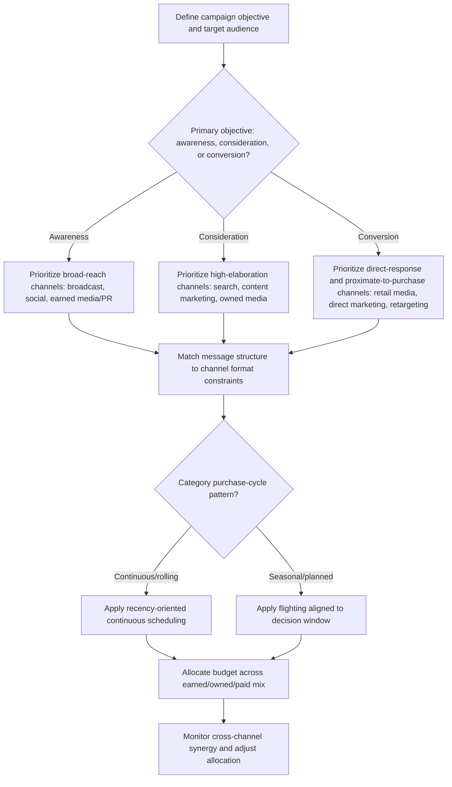

## Media Planning and Channel Selection Psychology

### Definition and Scope

**Media planning** is the strategic process of determining which channels, vehicles, and scheduling patterns will deliver a marketing message to a target audience most effectively and efficiently, encompassing decisions about reach, frequency, timing, and channel mix allocation. **Channel selection psychology** refers specifically to the behavioral and cognitive research explaining *why* different channels produce different psychological effects on an audience — differences in attention, credibility, receptivity, and processing mode — that should inform media planning decisions beyond pure cost-efficiency or audience-size metrics.

### Core Media Planning Metrics and Concepts

**Key Points**

- **Reach**: The proportion or number of unique individuals within a target audience exposed to a message at least once during a defined period — a measure of breadth rather than depth of exposure.
- **Frequency**: The average number of times a unique individual within the reached audience is exposed to the message during the period — a measure of exposure depth, directly relevant to the repetition and wear-out dynamics discussed under Repetition, Wear-Out, and Recency Effects.
- **Gross Rating Points (GRPs)**: A traditional broadcast-era metric calculated as reach × frequency, representing the total weight of media delivered without distinguishing how that weight is distributed across unique individuals (the same GRP total could reflect either broad reach with low frequency or narrow reach with high frequency).
- **Effective frequency**: The specific frequency threshold within which a message is believed to achieve its intended communication objective — historically debated (see the "rule of three" discussion under Repetition, Wear-Out, and Recency Effects) but now generally treated as contingent on message complexity and category factors rather than a fixed universal number.
- **Recency planning**: An alternative to effective-frequency-centric planning that prioritizes continuous, broad reach at minimal frequency for categories with rolling, unpredictable purchase triggers (see Repetition, Wear-Out, and Recency Effects for the full theoretical treatment).

### The Psychology of Channel-Specific Processing

Different media channels are not interchangeable delivery mechanisms for identical content — each channel's format constraints, consumption context, and audience mindset produce systematically different psychological processing conditions.

**Key Points**

- **Consumption context and attentional state**: Channels differ substantially in the attentional and motivational state of the audience at the moment of exposure — a search engine result is encountered during active, goal-directed information-seeking (high situational motivation to process, aligning with central-route conditions per the Elaboration Likelihood Model), while a social media feed ad is encountered during a low-motivation, entertainment-oriented browsing state (favoring peripheral-route processing).
- **Format constraints on message structure**: Channel format directly constrains which message structure techniques (see Message Structure and Argument Strength) are feasible — a six-second bumper video ad cannot support a two-sided refutational argument structure the way a long-form content-marketing article or podcast sponsorship read can, meaning channel selection is not independent of message strategy but rather jointly determines what message design options remain available.
- **Perceived channel credibility**: Channels vary in inherent audience-attributed credibility independent of specific message content — earned media and PR-mediated channels generally carry higher perceived credibility than paid advertising channels precisely because the message appears to originate from an independent third party rather than the advertiser (see the Earned-Owned-Paid framework under The IMC Concept and Communication Mix), a structural credibility difference that exists prior to any evaluation of the specific message's argument strength.
- **Interruption vs. permission-based exposure**: Some channels interrupt an ongoing activity to deliver a message (broadcast advertising, pre-roll video, display advertising), while others are consumed by explicit audience choice or opt-in (owned email lists, subscribed content, search advertising responding to an active query) — permission-based or query-responsive channels generally align with higher situational receptivity, since the audience has either self-selected into exposure or is actively seeking related information at that moment.

### Channel Psychology Comparison Framework

| Channel Type | Typical Audience Mindset | Elaboration Likelihood | Perceived Credibility | Best-Fit Message Structure |
| --- | --- | --- | --- | --- |
| Search advertising | Active, goal-directed information seeking | High (central route) | Moderate (known to be paid, but query-responsive) | Rational, feature-benefit, comparative |
| Social media feed | Passive, entertainment-oriented browsing | Low (peripheral route) | Lower (native ad skepticism applies — see Native Advertising and Sponsored Content Perception) | Emotional, visually salient, short-form |
| Broadcast/streaming video | Semi-passive, interruption-based | Variable, often low-moderate | Moderate (established format, but clearly commercial) | Emotional or hybrid, primacy-weighted structure |
| Earned media/PR | Passive consumption of independent content | Variable, but credibility pre-established | High (independent third-party framing) | Rational and evidence-based content performs well given elevated trust |
| Direct/email (owned) | Variable, but audience has opted in | Moderate to high (permission-based) | Moderate to high (existing relationship) | Personalized, direct-response oriented |
| Retail media/in-store | Low-elaboration, proximate to purchase decision | Low (peripheral route, terminal position) | Lower awareness of being "advertising" in-store | Simple, salient, low-cognitive-load |

### Media Planning Decision Process

### Cross-Channel Synergy and Sequencing

**Key Points**

- **Sequential message role assignment**: Media planning increasingly assigns different channels distinct sequential roles within a single consumer journey rather than treating each channel as an independent, redundant awareness driver — for example, broadcast or social video establishing initial awareness and emotional positioning, followed by search and retargeted display serving a consideration-stage informational role for the same individuals who showed initial engagement, followed by retail media or email serving a final conversion-stage role.
- **Cross-channel synergy effects**: Research on multi-channel advertising has generally found that exposure across complementary channels (e.g., television plus digital) can produce persuasive effects exceeding the sum of either channel's isolated effect, consistent with the IMC synergy rationale (see The IMC Concept and Communication Mix), though the specific magnitude of synergy effects is contingent on genuine message and positioning consistency across the channels involved rather than being a guaranteed automatic outcome of simple multi-channel presence.
- **Frequency capping across channels**: Contemporary digital media planning increasingly attempts to manage frequency at the individual level across channels (rather than per-channel in isolation) to avoid the aggregate wear-out risk discussed under Repetition, Wear-Out, and Recency Effects, though cross-channel identity resolution remains a persistent measurement challenge (see The IMC Concept and Communication Mix regarding measurement fragmentation).

### Example: Channel Selection for Contrasting Objectives

A financial services brand launching a new investment product for a considered, high-involvement purchase decision would likely prioritize search advertising (capturing active information-seeking with high elaboration likelihood, supporting a rational, evidence-based message structure) and long-form content marketing or PR placements in trusted financial publications (leveraging higher inherent channel credibility for a claim-heavy category subject to elevated substantiation scrutiny — see Regulatory Constraints on Advertising Claims), while deprioritizing high-frequency, low-elaboration channels like social media feed advertising for the core persuasive message, though social channels might still serve an initial-awareness role earlier in the funnel. A snack food brand, by contrast, operating in a low-involvement, hedonic, impulse-prone category, would likely prioritize high-reach, emotionally-driven channels (social video, broadcast, retail media at the point of purchase) where peripheral-route processing and affective association are the dominant persuasion mechanisms, with less reliance on high-elaboration channels like long-form content given the category's inherently low audience motivation to deeply process detailed product information.

### Boundary Conditions and Moderators

**Key Points**

- **Audience media consumption fragmentation**: Increasing fragmentation of audience attention across a growing number of channels and platforms has made single-channel reach maximization progressively less viable, generally favoring diversified cross-channel strategies over concentrated single-channel investment, though the optimal degree of diversification is contingent on audience-specific media consumption data rather than a fixed universal allocation. [Inference] This directional shift toward diversification is a reasonable inference from well-documented media fragmentation trends, though the specific optimal channel mix for any given audience and category requires audience-specific data rather than a generalized allocation formula.
- **Individual differences in channel receptivity**: Audience segments vary in trait-level receptivity to different channel types (e.g., some segments show systematically higher trust in earned/PR content relative to paid advertising, others show the reverse or show little differentiation), meaning channel psychology principles derived from aggregate research should be validated against the specific target audience's demonstrated behavior rather than applied as a universal rule.
- **Emerging channel evaluation lag**: Newer or rapidly evolving channels (emerging social platforms, evolving retail media formats — see Retail Media Networks and In-Store Advertising) often lack the mature measurement infrastructure and accumulated behavioral research available for established channels, meaning channel selection decisions involving newer platforms carry inherently higher uncertainty and should be treated as more provisional/testable than decisions involving well-established channels. [Unverified] The specific measurement maturity and audience behavior patterns of any given emerging channel change quickly; current platform-specific data should be consulted rather than relying on general channel-psychology principles alone for fast-evolving platforms.

### Related Topics

- The IMC concept and communication mix
- Repetition, wear-out, and recency effects
- Elaboration Likelihood Model and dual-process persuasion theory
- Message structure and argument strength
- Native advertising and sponsored content perception
- Retail media networks and in-store advertising
- Marketing attribution and cross-channel measurement
- Consumer decision journey mapping