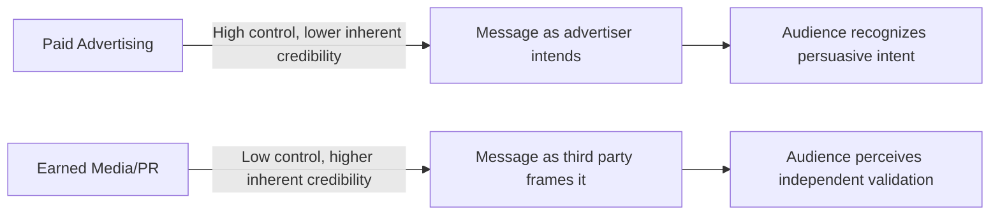
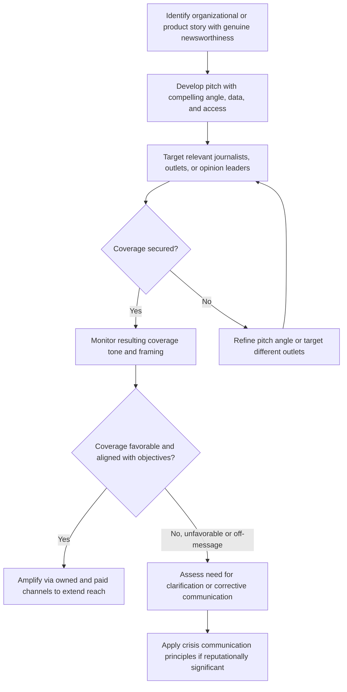

## Public Relations and Earned Media Perception

### Definitions

**Public relations (PR)** is the strategic management function focused on cultivating and maintaining relationships between an organization and its various publics (media, consumers, investors, communities, regulators) through communication activities that are typically not directly paid for as advertising placements. **Earned media** is the resulting communication output — press coverage, independent commentary, organic social sharing, and third-party mentions — that an organization receives without directly purchasing the specific placement, distinguishing it from paid media (purchased placements) and owned media (brand-controlled channels), per the earned-owned-paid framework introduced under The IMC Concept and Communication Mix.

### Theoretical Foundation: Source Credibility and the Third-Party Endorsement Effect

The central psychological mechanism explaining PR and earned media's distinctive effectiveness is **source credibility theory**, which holds that a message's persuasive impact depends not only on its content but on the perceived trustworthiness and expertise of its source.

**Key Points**

- **Independent validation mechanism**: Because earned media coverage appears to originate from a source (a journalist, an independent commentator, an ordinary consumer) with no direct financial stake in the advertiser's success, audiences generally extend it higher credibility than paid advertising making an equivalent claim — a message about a product's quality carries different persuasive weight depending on whether it comes from the brand itself or from an ostensibly disinterested third party.
- **Persuasion knowledge non-activation (or reduced activation)**: Per the Persuasion Knowledge Model (see Native Advertising and Sponsored Content Perception), genuine earned media does not trigger the same "this is a persuasion attempt" recognition and associated skepticism that paid advertising and even native advertising can trigger, since the third party publishing the content is not understood by the audience to have the same self-interested motive as the advertiser — this is the core structural advantage earned media holds over paid channels, and precisely the property that native advertising attempts to partially borrow by mimicking earned/organic content format.
- **Two-step flow and opinion leader mediation**: Classical communication theory (Katz & Lazarsfeld's two-step flow model, 1955) proposed that media messages often reach the broader public indirectly, filtered and reinterpreted through opinion leaders (individuals with disproportionate influence within their social networks) — a foundational precursor to contemporary influencer marketing and a continuing rationale for PR's emphasis on cultivating relationships with journalists, analysts, and other opinion-leading intermediaries rather than only targeting end consumers directly.

### PR Functions and Activities

**Key Points**

- **Media relations**: Cultivating relationships with journalists and media outlets to secure coverage, including press releases, media pitches, press events, and briefings — the traditional core PR activity most directly generating earned media coverage.
- **Product publicity**: PR activity specifically focused on generating media coverage of new products, launches, or product-related news, functioning as a lower-cost, higher-credibility complement to paid product advertising.
- **Corporate communications and reputation management**: Broader organizational-level communication addressing company reputation, corporate social responsibility, leadership visibility, and stakeholder relationships beyond specific product promotion.
- **Crisis communication**: A specialized PR function managing organizational communication during events threatening reputation or stakeholder trust, requiring rapid, carefully calibrated response strategies distinct from routine promotional PR activity.
- **Influencer relations**: Increasingly formalized as a PR (or hybrid PR/marketing) function, managing relationships with individual content creators whose endorsement or coverage functions similarly to traditional earned media, though the boundary between genuinely organic influencer coverage (earned) and compensated influencer partnerships (a form of paid or native advertising — see Native Advertising and Sponsored Content Perception) requires careful distinction and disclosure.

### The Credibility-Control Trade-off

A defining structural characteristic of PR and earned media, in direct contrast to paid advertising, is an inherent trade-off between message credibility and message control:

**Key Points**

- **Loss of message control**: Because earned media coverage is created and framed by an independent third party, the advertiser cannot dictate the exact wording, emphasis, or even the overall favorability of the resulting coverage — a journalist may cover a story with a critical angle, omit key points the organization wanted emphasized, or frame the story in an unanticipated way, a risk entirely absent from paid advertising where the advertiser controls the final message completely.
- **Pitching and framing as partial mitigation**: PR practice mitigates, without eliminating, this control loss through strategic pitching (providing journalists with compelling, well-substantiated angles, data, and access) designed to increase the likelihood that resulting coverage aligns with organizational objectives, though the final editorial decision remains with the independent outlet.
- **Amplified risk in negative scenarios**: The same low-control, high-credibility property that makes positive earned media disproportionately valuable also makes negative earned media disproportionately damaging — negative third-party coverage carries the same credibility premium as positive coverage, meaning a critical news story is generally perceived as more credible (and thus more damaging) than an equivalent negative claim would be if it somehow originated from paid advertising, which is a core reason crisis communication receives such intensive PR practitioner attention.

### Measuring Earned Media Effectiveness

**Key Points**

- **Media impressions and reach metrics**: Traditional PR measurement has often relied on estimated audience reach of secured coverage (circulation figures, estimated viewership) — a metric criticized within the industry for measuring potential exposure rather than actual impact or persuasion.
- **Sentiment and tone analysis**: More qualitative measurement approaches assess whether resulting coverage is favorable, neutral, or unfavorable in tone toward the organization, addressing the control-loss risk by explicitly tracking whether pitched narratives were adopted as intended.
- **Share of voice**: Comparing an organization's earned media volume and prominence against competitors within the same category or conversation, providing a relative rather than absolute effectiveness benchmark.
- **Integration with business outcome metrics**: Contemporary PR measurement increasingly attempts to link earned media activity to downstream business metrics (website traffic, search interest, sales lift) though this connection is generally harder to establish with the same directness as paid digital advertising's more instrumented, closed-loop measurement capability (see Retail Media Networks and In-Store Advertising for a contrasting example of highly instrumented closed-loop measurement), representing a persistent measurement-fragmentation challenge for PR specifically within broader IMC effectiveness evaluation (see The IMC Concept and Communication Mix).
- [Unverified] Specific measurement methodology standards and their adoption vary considerably across the PR industry and continue to evolve; organization-specific and platform-specific current measurement practices should be verified rather than assuming a single universal standard.

### PR and Earned Media Strategy Process

### Interaction with Paid and Owned Media (IMC Integration)

**Key Points**

- **Earned media amplification via paid/owned channels**: A common contemporary practice involves using paid social promotion or owned channels (email, website) to extend the reach of favorable earned media coverage beyond its organic audience — effectively using paid/owned tools to amplify, rather than replace, earned media's inherent credibility advantage, a direct application of the cross-channel synergy logic discussed under The IMC Concept and Communication Mix and Media Planning and Channel Selection Psychology.
- **PR-advertising message consistency**: Because earned media coverage often occurs independently of and asynchronously with paid advertising campaigns, maintaining consistent core positioning and messaging across both — despite PR's inherent lower message control — requires deliberate organizational coordination, directly illustrating the organizational-silo barrier to integration discussed under The IMC Concept and Communication Mix.

### Example: Product Launch PR Strategy

A technology company launching a new product might brief select technology journalists under embargo ahead of the public launch date, providing early access, technical briefings, and executive interviews (media relations tactics) designed to generate launch-day earned media coverage. If secured coverage is broadly favorable, the company might promote links to the resulting articles via paid social advertising and its owned email newsletter (amplification), extending the earned media's reach and credibility advantage beyond the original publication's organic audience — while simultaneously running paid advertising with consistent core positioning and message architecture, ensuring the higher-credibility earned narrative and the paid advertising message reinforce rather than contradict each other.

### Boundary Conditions and Moderators

**Key Points**

- **Category and issue newsworthiness dependency**: PR effectiveness is fundamentally constrained by genuine newsworthiness — unlike paid advertising, which can be purchased regardless of a story's independent news value, earned media coverage requires that journalists or other independent gatekeepers judge the story worth covering on its own merits, meaning PR strategy is inherently more constrained by external editorial judgment than paid media strategy.
- **Erosion of the earned-paid distinction in some formats**: The boundary between earned and paid/native media has become increasingly blurred in some contexts (e.g., compensated influencer content that resembles organic earned coverage — see Native Advertising and Sponsored Content Perception), creating both strategic complexity for practitioners and disclosure obligations under advertising and endorsement regulation (see Regulatory Constraints on Advertising Claims) to ensure audiences are not misled about a placement's earned versus paid nature.
- **Declining traditional media landscape considerations**: Ongoing shifts in traditional journalism and media consumption patterns (declining traditional newsroom capacity in some markets, fragmentation of media consumption across digital platforms) have altered the practical landscape for securing traditional earned media coverage, generally increasing PR's reliance on digital and influencer-mediated channels alongside traditional press relations. [Unverified] The specific pace and magnitude of these media landscape shifts vary by market and continue to evolve; current market-specific media landscape data should inform PR channel strategy rather than assumptions based on the traditional press-relations model alone.

### Related Topics

- The IMC concept and communication mix
- Native advertising and sponsored content perception
- Persuasion Knowledge Model and consumer skepticism
- Media planning and channel selection psychology
- Source credibility and endorser effects in advertising
- Crisis communication and reputation management
- Influencer marketing and endorsement disclosure regulation
- Two-step flow theory and opinion leadership