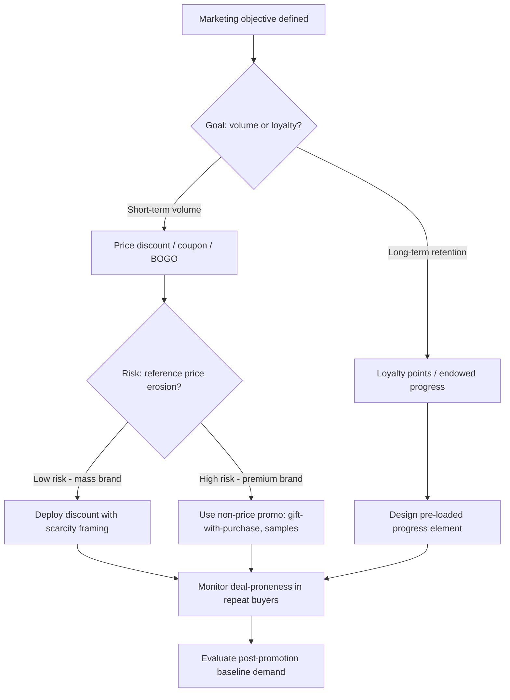

## Sales Promotion Psychology

### Definition and Scope

Sales promotion psychology is the study of how short-term incentives (discounts, coupons, contests, samples, rebates, loyalty points, bundling) alter consumer decision-making, perceived value, and purchase timing. Unlike advertising, which builds brand attitudes over time, sales promotions target immediate behavioral change by manipulating the perceived cost-benefit ratio of a transaction. The discipline draws on behavioral economics, cognitive psychology, and consumer research to explain why promotions work, when they backfire, and how they interact with brand equity.

### Core Psychological Mechanisms

#### Reference Price and Transaction Utility

Consumers evaluate deals against an internal "reference price" — an expectation of what an item should cost, formed through past purchases, competitor pricing, or the item's regular price.

Thaler's concept of **transaction utility** separates two components of a purchase decision:

$$\text{Total Utility} = \text{Acquisition Utility} + \text{Transaction Utility}$$

- **Acquisition utility**: value from the product itself relative to its price.
- **Transaction utility**: perceived pleasure from getting a "good deal" relative to the reference price, independent of the product's intrinsic worth.

A promotion increases transaction utility by widening the gap between reference price and offer price, which can drive purchase even when acquisition utility alone would not.

#### Loss Aversion and Framing

Promotions are more persuasive when framed as avoiding a loss ("Save $10 before Friday") than as gaining a benefit ("Get $10 off"), consistent with prospect theory's asymmetric value function, where losses loom larger than equivalent gains. Scarcity-based promotions ("Only 3 left," "Ends tonight") exploit this by framing inaction as a loss of opportunity rather than a neutral non-purchase.

#### Anchoring

Displaying an inflated "original price" next to a discounted price anchors the consumer's valuation, making the discount appear larger than an equivalent standalone low price would. This is a direct application of the anchoring-and-adjustment heuristic: consumers insufficiently adjust away from the first number seen.

#### Endowment and Ownership Effects

Free trials, samples, and "try before you buy" promotions leverage the **endowment effect** — once consumers psychologically possess an item (even temporarily), they value it more highly than before possession, increasing the pain of giving it up (returning it or not converting to purchase).

#### Mental Accounting

Consumers segment money into mental "accounts" (e.g., grocery budget, entertainment budget, windfall money). Promotions that reframe spending — such as "bonus" loyalty points positioned as found money — reduce the psychological friction of spending, since money in a windfall account is spent more freely than money from a fixed budget. [Inference: the strength of this effect varies by individual budgeting style and has not been universally quantified across contexts.]

### Types of Sales Promotions and Their Psychological Levers

| Promotion Type | Primary Mechanism | Consumer Effect |
| --- | --- | --- |
| Price discounts | Reference price shift, transaction utility | Immediate purchase acceleration |
| Coupons | Effort-reward pairing, mental accounting | Perceived savings feel "earned," increasing satisfaction |
| BOGO (Buy One Get One) | Perceived free value > equivalent % discount | Higher perceived value than mathematically equal discount |
| Free samples | Endowment effect, reciprocity norm | Lowers trial barrier, obligates reciprocal purchase |
| Contests/sweepstakes | Variable reward, gamification | Engagement via intermittent reinforcement |
| Loyalty/points programs | Endowed progress effect, sunk cost | Encourages continued patronage to "complete" rewards |
| Rebates | Delayed gratification, redemption friction | Attracts price-sensitive buyers; many rebates go unredeemed, which affects real margin |
| Bundling | Reduced choice complexity, perceived aggregate savings | Increases average transaction value |

### The BOGO vs. Percentage Discount Asymmetry

A well-documented finding is that "Buy One Get One Free" is often perceived as more attractive than a mathematically equivalent 50% discount, even though both halve the effective per-unit price.

**Example**: A $10 item offered as "Buy One Get One Free" (effectively $5/unit for two units) is frequently preferred over "50% Off" (also $5/unit), because:

- The word "free" triggers a distinct, disproportionately positive emotional response (the "zero price effect" — Shampanier, Mazar, and Ariely's research found demand for free items is disproportionately higher than a small positive price would predict).
- BOGO frames the transaction as gaining an extra unit rather than losing money on the original, which is a more favorable mental frame under loss aversion.
- Quantity-based framing is often processed more heuristically (less effortful mental math) than percentage-based framing, particularly for consumers with lower numeracy.

### The Endowed Progress Effect

Consumers persist more toward a goal when they believe they have already made partial progress toward it — even artificially.

**Example**: A loyalty card with 10 stamp slots where 2 are pre-stamped at issuance (giving a customer "2 of 10 free" framing) produces faster completion rates than a card with 8 empty slots requiring the same number of actual purchases, despite both requiring 8 additional purchases to complete. This was demonstrated in car-wash loyalty card research by Nunes and Drèze (2006). [Unverified: exact effect sizes may not replicate identically across all reward-program contexts, and results can vary with program design and audience.]

### Scarcity and Urgency

Two distinct scarcity types affect promotion response differently:

- **Quantity scarcity** ("Only 5 left in stock") — signals social proof/popularity and triggers competitive urgency.
- **Time scarcity** ("Sale ends midnight") — triggers deadline-driven loss aversion, compressing decision time and reducing deliberate evaluation.

Combining both types tends to produce stronger urgency than either alone, though excessive or transparently manufactured scarcity ("permanent flash sales") can erode credibility and trigger reactance — a psychological pushback against perceived manipulation. [Inference: reactance thresholds are individually and culturally variable, and are difficult to generalize into a fixed rule.]

### Reciprocity Norm in Free Samples

Free samples operate on the reciprocity norm: receiving something of value creates a felt social obligation to reciprocate, often through purchase. This is distinct from mere trial-reduces-uncertainty logic — the obligation is a social-psychological pressure that operates even when product quality uncertainty has been fully resolved after tasting/trying.

### Reference Points in Rebate Design

Rebates deliberately introduce redemption friction (forms, mailing, waiting periods). This friction is functionally used by marketers to segment consumers:

- Highly price-sensitive, low-time-value consumers redeem, capturing the discount as intended.
- Time-constrained or effort-averse consumers purchase at the higher near-term price point but fail to redeem, converting the rebate into an unrealized-liability at point of sale that supports a higher headline "discount" without a proportional real margin loss.

[Note: redemption rate figures vary significantly by product category, rebate value, and process complexity, and should not be treated as universal constants without category-specific data.]

### Sales Promotion and Brand Equity Interaction

Frequent or deep discounting can erode brand equity through several mechanisms:

1. **Reference price erosion**: repeated discounting lowers the consumer's internal "normal price" anchor, making future full-price purchases feel like a loss.
2. **Quality inference bias**: consumers sometimes infer that frequently discounted goods are lower quality or overpriced at their "regular" price, since deep or frequent discounts violate the expectation that price signals quality.
3. **Deal-proneness conditioning**: habitual promotion exposure can train a segment of the customer base to delay purchase until a discount appears, a documented category of consumer termed "deal-prone" in the promotions literature.

Premium and luxury brands typically restrict promotion frequency and depth, or substitute promotions with lower reference-price-risk (e.g., gift-with-purchase, exclusive access) rather than price cuts, to protect the price-quality inference.

### Promotion Psychology Decision Flow

### Consumer Response Model (Illustration)

<svg xmlns="http://www.w3.org/2000/svg" viewBox="0 0 700 380">
<text x="350" y="25" font-size="16" font-weight="bold" text-anchor="middle" fill="#1a1a2e">Perceived Value vs. Discount Depth (svg_diagram)</text>
<line x1="70" y1="320" x2="650" y2="320" stroke="#333" stroke-width="2" />
<line x1="70" y1="320" x2="70" y2="50" stroke="#333" stroke-width="2" />
<text x="360" y="355" font-size="13" text-anchor="middle" fill="#333">Discount Depth (%)</text>
<text x="25" y="185" font-size="13" text-anchor="middle" fill="#333" transform="rotate(-90 25 185)">Perceived Value</text>
<path d="M 70 300 Q 200 180 350 120 T 630 90" stroke="#2a6f97" stroke-width="3" fill="none" />
<text x="430" y="100" font-size="12" fill="#2a6f97">Perceived deal value (rising)</text>
<path d="M 70 310 L 250 290 Q 400 250 500 180 Q 570 130 630 200" stroke="#c1121f" stroke-width="3" fill="none" stroke-dasharray="6,4" />
<text x="420" y="255" font-size="12" fill="#c1121f">Quality inference (declines past threshold)</text>
<line x1="500" y1="60" x2="500" y2="320" stroke="#888" stroke-width="1" stroke-dasharray="3,3" />
<text x="505" y="70" font-size="11" fill="#666">Credibility threshold</text>
<circle cx="70" cy="320" r="4" fill="#1a1a2e" />
<text x="60" y="335" font-size="11" text-anchor="middle" fill="#333">0%</text>
<text x="630" y="335" font-size="11" text-anchor="middle" fill="#333">70%+</text>
</svg>

### Behavioral Segmentation of Promotion Responders

Promotion psychology research commonly identifies consumer segments by deal responsiveness:

- **Deal-prone consumers**: purchase timing is primarily driven by promotion availability; high switching behavior between brands based on which is currently discounted.
- **Loyalists**: maintain brand purchase regardless of promotion; promotions to this segment largely subsidize purchases that would have occurred anyway (a margin cost without incremental volume — sometimes called promotional "leakage").
- **Brand switchers**: use promotions to justify trial of a non-habitual brand; the promotion's real incremental value is highest with this segment since it can produce net-new volume.
- **Stockpilers**: react to promotions by purchasing larger quantities for future consumption rather than making an otherwise-unplanned purchase, which can distort the appearance of promotional lift without corresponding lift in the underlying consumption rate.

[Inference: precise segment proportions are category- and market-specific and should be estimated from purchase-panel data rather than assumed as fixed ratios.]

### Practical Application Example

A mid-tier apparel retailer wants to clear seasonal inventory without damaging its regular-price credibility for the coming season.

**Approach using promotion psychology principles**:

1. Frame markdowns as time-limited ("End of Season — 5 Days Only") to invoke time scarcity rather than an open-ended sale, limiting the duration over which the discounted price can become the new reference point.
2. Use tiered percentage-off thresholds (e.g., "30% off 1 item, 40% off 2+") to leverage anchoring on the higher discount tier while increasing basket size.
3. Avoid combining with loyalty point promotions in the same window, which would compound discount depth and accelerate reference-price erosion.
4. Route the promotion primarily through channels (clearance section, outlet email list) that segment deal-prone shoppers away from full-price buyers, protecting the quality inference of the standard product line.

### Measurement Considerations

Standard metrics used to evaluate sales promotion effectiveness include:

- **Promotional lift**: incremental sales volume during the promotion period versus a non-promoted baseline.
- **Post-promotion dip**: reduced sales immediately following a promotion, often attributable to stockpiling and demand pull-forward rather than true demand generation.
- **Redemption rate**: proportion of distributed coupons/rebates actually redeemed.
- **Net incremental margin**: promotional lift revenue minus the discount cost and cannibalized full-price sales; this figure is frequently overestimated when pull-forward and stockpiling effects are not isolated in the analysis.

[Behavior may vary: actual lift, dip magnitude, and redemption figures depend heavily on product category, promotion depth, distribution channel, and competitive response, and should be validated against a specific brand's own purchase data rather than treated as universal benchmarks.]

**Related Topics**

- Price bundling strategies and psychological pricing thresholds ($X.99 effects)
- Behavioral economics foundations: prospect theory, heuristics and biases
- Loyalty program design and gamification mechanics
- Coupon distribution channels and redemption friction design
- Brand equity measurement and price-quality inference models
- Cross-promotion and co-branding incentive structures
- Digital promotion psychology: flash sales, countdown timers, and dynamic pricing displays