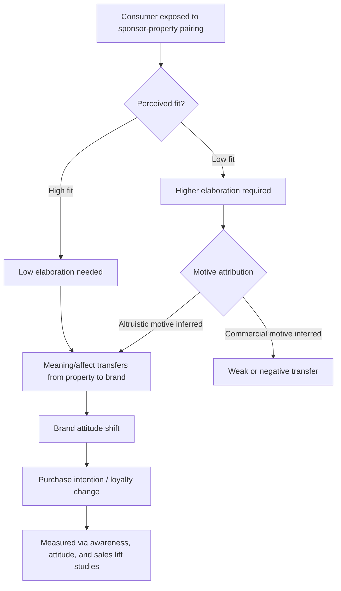

## Event Marketing and Sponsorship Effects

### Definition and Scope

Event marketing involves creating or participating in live experiences (brand-owned events, trade shows, product launches, festivals) to engage audiences directly. Sponsorship is a subset in which a brand pays for association with a third-party property (sports team, music festival, cause, media property) to transfer the property's equity, image, or audience attention to the brand. Both operate on experiential and associative psychological mechanisms distinct from traditional one-way advertising.

### Core Psychological Mechanisms

#### Classical Conditioning and Meaning Transfer

Sponsorship effectiveness is frequently explained through associative learning: repeated pairing of a brand (conditioned stimulus) with a liked or valued property (unconditioned stimulus, e.g., an exciting sport or an admired artist) causes the positive affect from the property to transfer to the brand over repeated exposure.

McCracken's **meaning transfer model** extends this beyond simple conditioning, proposing meaning moves in a directional sequence:

The property (e.g., the Olympics, a music festival) already carries culturally embedded meanings (excellence, rebellion, prestige, community); sponsorship transfers a portion of that meaning to the brand, and consumption/purchase transfers meaning further to the consumer's identity.

#### Congruence/Fit Effects

The degree of perceived logical or image-based fit between sponsor and property strongly moderates transfer effectiveness.

- **Functional fit**: the sponsor's product category is logically related to the event (a sports drink sponsoring a marathon).
- **Image fit**: the sponsor's brand personality aligns with the property's image even without functional overlap (a luxury watch brand sponsoring a prestigious golf tournament).

Low-fit sponsorships require more cognitive elaboration from the audience to make sense of the pairing, which can either (a) increase recall due to the "surprise" of an unusual pairing, or (b) reduce believability and perceived sincerity of the sponsor's motive, depending on how the mismatch is resolved by the individual consumer. [Inference: whether low fit helps or hurts recall versus attitude is contingent on execution and audience elaboration, and is not a fixed universal rule across all low-fit pairings.]

#### Attribution Theory and Perceived Sponsor Motive

Consumers attribute sponsorship activity to one of two broad motives:

1. **Commercial/self-serving motive** ("they're doing this to sell more product") — associated with lower trust and weaker attitude transfer.
2. **Altruistic/values-driven motive** ("they genuinely support this cause/community") — associated with stronger goodwill and stronger long-term brand attitude effects.

Sincerity cues — such as long-term/multi-year sponsorship commitment versus one-off activations, and the sponsor's visible investment beyond logo placement — shift attribution toward the altruistic end, strengthening the psychological payoff. This is grounded in attribution theory as applied to cause-related marketing and corporate sponsorship research.

#### Mere Exposure and Repetition

Passive, repeated exposure to a sponsor's brand mark within an enjoyable event context (e.g., stadium signage seen many times during a broadcast) can increase brand liking through the **mere exposure effect**, even without conscious processing or explicit recall of having seen the logo. This explains why sponsorship value is sometimes measured in exposure time/frequency (e.g., seconds of logo visibility) even when explicit recall metrics are modest.

#### Experiential/Flow-State Engagement

Live event marketing (brand activations, immersive experiences) leverages **flow theory** (Csikszentmihalyi) — a state of deep absorption in an activity — to create memorable, emotionally intense encounters with a brand. Emotionally arousing experiences are encoded more strongly into memory (per affect-and-memory research), giving experiential marketing an advantage over passive media exposure in generating vivid, retrievable brand memories, though this advantage typically comes at a much higher cost-per-contact.

### Sponsorship Effect Pathway

### Types of Event Marketing and Sponsorship

| Type | Mechanism Emphasis | Example Context |
| --- | --- | --- |
| Sports sponsorship | Meaning transfer, mere exposure, fan identity | Jersey sponsorship, stadium naming rights |
| Cause/cultural sponsorship | Attribution of altruistic motive, values alignment | Sponsoring a music or arts festival |
| Trade show/B2B events | Direct engagement, information processing, relationship building | Product demos, live Q&A with technical buyers |
| Brand-owned experiential events | Flow state, emotional memory encoding | Pop-up activations, immersive brand houses |
| Product launch events | Novelty, anticipation, social proof via media coverage | Live-streamed reveal events |
| Esports/gaming sponsorship | Parasocial identification with players/streamers, niche community fit | In-game branding, streamer partnerships |

### Fan/Community Identity and In-Group Transfer

For sponsorships tied to fan communities (sports teams, gaming, fandoms), social identity theory explains an additional transfer mechanism: a sponsor supporting the consumer's in-group (their team, their community) is perceived as an ally of the group, and positive in-group feelings extend to the sponsor by association. This effect tends to be strongest among highly identified fans (those with strong psychological attachment to the team/community) and weaker or negligible among low-identification audience members who merely happen to be present. [Inference: identification strength as a moderator is well supported directionally in sponsorship research, though exact effect magnitudes are study- and context-specific.]

### Negative and Boundary Effects

#### Ambush Marketing Confusion

Sponsorship value can be diluted when a non-sponsoring competitor creates marketing activity that implies association with the event (ambush marketing) without paying sponsorship fees. This can cause **sponsor misattribution** — audiences incorrectly recalling the ambusher as the official sponsor — which undermines the intended meaning transfer to the actual paying sponsor.

#### Sponsorship Fatigue and Clutter

Events with many co-sponsors create attentional clutter, diluting exposure and recall for any single sponsor. This mirrors general advertising clutter effects, where increased volume of competing stimuli in a shared attention space reduces per-stimulus encoding depth.

#### Negative Event Spillover

If the sponsored property experiences scandal, poor performance, or controversy, negative affect can transfer back to the sponsor by the same associative mechanism that would otherwise transfer positive affect — a documented risk termed **negative sponsorship spillover**. This is a primary reason brands include morality/conduct clauses in sponsorship contracts and diversify sponsorship portfolios rather than concentrating exposure in a single property.

### Measurement Approaches

Common metrics used to evaluate event marketing and sponsorship effectiveness:

- **Media equivalency value**: estimated cost if sponsor exposure (logo seconds, mentions) had been purchased as paid advertising instead.
- **Aided/unaided brand recall**: post-event surveys measuring whether attendees/viewers can identify the sponsor, with or without prompting.
- **Brand attitude shift**: pre/post surveys measuring change in favorability or purchase intent attributable to event exposure.
- **Social media engagement lift**: mentions, hashtag usage, and sentiment during and after the event window.
- **Sales lift attribution**: incremental sales during/after the sponsorship period versus a comparable non-sponsorship baseline, though isolating causal sponsorship contribution from concurrent marketing activity is methodologically difficult.

[Behavior may vary: recall and attitude-lift figures differ substantially by event type, audience size, sponsorship tier (title sponsor vs. minor sponsor), and category, and should not be generalized as fixed benchmarks across contexts.]

### Practical Application Example

A mid-sized athletic footwear brand is deciding between sponsoring a regional marathon (functional fit, moderate reach) versus a popular local music festival (low functional fit, image-based fit with an "active/energetic lifestyle" positioning, higher reach among a younger target demographic).

**Application of the principles above**:

1. If the brand's strategic goal is direct product credibility (performance claims), the marathon offers higher functional fit, reducing the cognitive work needed for the audience to accept the association, and supports stronger attribute-based meaning transfer (e.g., "durable," "built for endurance").
2. If the goal is broader brand image-building among a younger demographic not yet loyal to any athletic brand, the music festival's higher reach and image-congruent context (energy, self-expression) may support stronger affective transfer despite lower functional fit — provided the activation goes beyond logo placement (e.g., an interactive brand experience) to avoid low-fit skepticism about commercial motive.
3. Multi-year commitment to whichever property is chosen, rather than a single-year deal, would support attribution toward altruistic/genuine-support motive rather than opportunistic exposure-buying, strengthening long-term goodwill transfer.

### Illustration: Meaning Transfer and Fit Continuum

<svg xmlns="http://www.w3.org/2000/svg" viewBox="0 0 700 320">
<text x="350" y="25" font-size="16" font-weight="bold" text-anchor="middle" fill="#1a1a2e">Sponsor-Property Fit and Transfer Strength (svg_diagram)</text>
<line x1="80" y1="270" x2="620" y2="270" stroke="#333" stroke-width="2" />
<text x="80" y="295" font-size="12" text-anchor="middle" fill="#333">Low Fit</text>
<text x="620" y="295" font-size="12" text-anchor="middle" fill="#333">High Fit</text>
<text x="350" y="315" font-size="13" text-anchor="middle" fill="#333">Sponsor–Property Congruence</text>
<rect x="80" y="230" width="150" height="30" fill="#e5989b" opacity="0.7" />
<text x="155" y="250" font-size="11" text-anchor="middle" fill="#333">Elaboration required</text>
<rect x="230" y="230" width="150" height="30" fill="#f4a261" opacity="0.7" />
<text x="305" y="250" font-size="11" text-anchor="middle" fill="#333">Attribution-dependent</text>
<rect x="380" y="230" width="240" height="30" fill="#84a98c" opacity="0.7" />
<text x="500" y="250" font-size="11" text-anchor="middle" fill="#333">Direct/efficient transfer</text>
<path d="M 100 220 Q 250 100 400 130 T 600 150" stroke="#2a6f97" stroke-width="3" fill="none" />
<text x="420" y="110" font-size="12" fill="#2a6f97">Transfer strength (with sincere motive attribution)</text>
<path d="M 100 220 Q 250 200 400 220 T 600 230" stroke="#c1121f" stroke-width="3" fill="none" stroke-dasharray="6,4" />
<text x="420" y="215" font-size="12" fill="#c1121f">Transfer strength (commercial motive suspected)</text>
</svg>

**Related Topics**

- Meaning transfer model and McCracken's celebrity/property endorsement theory
- Attribution theory in cause-related marketing
- Ambush marketing tactics and legal/trademark protections
- Fan identification and social identity theory in sports marketing
- Experiential marketing and flow theory applications
- Sponsorship portfolio risk management and morality clauses
- Media equivalency valuation methodologies