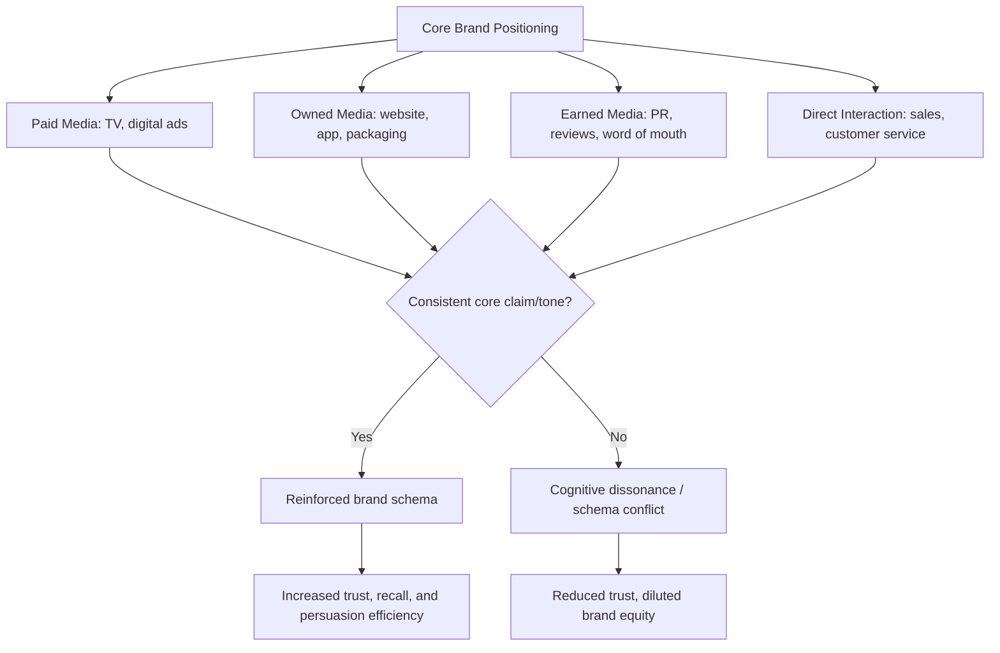

## Message Consistency Across Touchpoints

### Definition and Scope

Message consistency across touchpoints refers to maintaining coherent brand positioning, tone, core claims, and visual identity across every channel and format through which a consumer encounters a brand — advertising, packaging, retail environment, digital/social media, customer service, sales interactions, and word-of-mouth-influencing content. It is a foundational principle of Integrated Marketing Communications (IMC): that a unified message across dispersed touchpoints produces stronger, more efficient persuasion than fragmented or contradictory messaging, even when channels differ in format and creative execution.

### Core Psychological Mechanisms

#### Schema Theory and Cognitive Consistency

Consumers store brand knowledge as a cognitive **schema** — an organized mental structure of associated attributes, feelings, and expectations linked to a brand node in memory. Each touchpoint exposure is an opportunity to either reinforce that schema (consistent messaging) or introduce conflicting information (inconsistent messaging).

Consistent reinforcement strengthens associative links in an associative network model of memory, making the schema more accessible (faster retrieval, higher recall) and more resistant to competitive interference. Inconsistent or contradictory messaging forces consumers to either update the schema (cognitive effort, potential confusion) or discount one of the conflicting inputs as untrustworthy — both of which weaken overall brand equity relative to reinforced consistency.

#### Cognitive Dissonance from Contradictory Cues

When a consumer encounters conflicting brand signals (e.g., a premium-positioned ad campaign paired with a discount-store retail environment, or a sustainability claim contradicted by customer service behavior), the resulting **cognitive dissonance** produces discomfort that consumers resolve by:

1. Discounting one of the conflicting signals (often the most recent or most credible one wins), or
2. Downgrading overall trust in the brand's communications broadly, since the contradiction signals unreliable information.

This is why IMC theory positions consistency not just as an efficiency matter but as a trust-preservation mechanism.

#### Mere Exposure and Cumulative Reinforcement

Message consistency compounds the **mere exposure effect**: repeated exposure to the same core message (even across different creative executions and channels) increases familiarity and liking through cumulative reinforcement, whereas fragmented messaging distributes exposure across effectively different "stimuli" that do not reinforce a single memory trace as efficiently.

#### The Elaboration Likelihood Model (ELM) and Touchpoint Role Differentiation

Under the ELM, different touchpoints often engage consumers at different processing depths:

- **High-elaboration touchpoints** (owned website, detailed product pages, sales conversations) support central-route processing — detailed, argument-based persuasion.
- **Low-elaboration touchpoints** (social ads, out-of-home, packaging glance) rely on peripheral cues — logos, color, tone, spokesperson, emotional tone.

Message consistency theory does not require identical creative execution across these; it requires that the **core positioning and claims remain non-contradictory** across both processing routes, so that a consumer moving from low- to high-elaboration engagement (e.g., seeing an ad, then visiting the website) experiences confirmation rather than contradiction.

### Consistency Framework Across Touchpoint Types

### Layers of Consistency

IMC practice typically distinguishes several layers, each requiring a different management approach:

| Layer | Description | Example of Inconsistency Risk |
| --- | --- | --- |
| Positioning consistency | Core value proposition and target-differentiation claim | Ad claims "premium quality" while pricing/promotion strategy signals discount positioning |
| Visual identity consistency | Logo, color palette, typography, imagery style | Packaging redesign not reflected in digital ad creative |
| Tone/voice consistency | Formality, personality, humor level | Playful social media voice contradicted by overly formal customer service scripts |
| Factual/claim consistency | Specific product claims, pricing, guarantees | Website states one return policy; in-store staff communicate a different one |
| Experiential consistency | The felt quality of interacting with the brand | High-end advertising imagery contradicted by a poor in-store or app experience |

### Sources of Inconsistency in Practice

1. **Organizational silos**: separate teams (advertising, PR, sales, customer service, product) developing messaging independently without a shared brand brief.
2. **Channel-specific optimization pressure**: performance marketing teams optimizing ad copy/claims for channel-specific conversion metrics, drifting from brand-level positioning guidelines.
3. **Agency fragmentation**: multiple external agencies (creative, media, PR, social) working without a unified creative brief or brand governance document.
4. **Localization without central oversight**: regional or local teams adapting messaging for cultural relevance in ways that unintentionally alter core claims.
5. **Legacy content persistence**: outdated messaging remaining live on some channels (older packaging still in retail, cached web pages) after a positioning update on primary channels.

### Governance Mechanisms for Maintaining Consistency

- **Brand guidelines/style guides**: centralized documentation of approved claims, tone, visual identity, and prohibited combinations, distributed to all internal teams and external agencies.
- **Message house/messaging hierarchy**: a structured document defining the single core positioning statement, supporting proof points, and channel-specific message adaptations that must all trace back to the core statement.
- **Cross-functional brand councils**: recurring governance reviews involving marketing, sales, customer service, and product teams to catch emerging inconsistencies before wide distribution.
- **Content audits**: periodic systematic review of live touchpoints (website, social profiles, in-store signage, sales scripts) against current brand guidelines to identify legacy or drifted content.
- **Single customer view / unified customer data**: technical infrastructure (CDPs, CRM integration) ensuring a consumer's message history is known across channels, preventing contradictory sequential messaging (e.g., receiving a "come back" win-back email the day after a complaint).

### Illustration: Consistency Reinforcement vs. Fragmentation Effect on Recall

<svg xmlns="http://www.w3.org/2000/svg" viewBox="0 0 700 340">
<text x="350" y="25" font-size="16" font-weight="bold" text-anchor="middle" fill="#1a1a2e">Cumulative Brand Recall: Consistent vs. Fragmented Messaging (svg_diagram)</text>
<line x1="80" y1="290" x2="640" y2="290" stroke="#333" stroke-width="2" />
<line x1="80" y1="290" x2="80" y2="50" stroke="#333" stroke-width="2" />
<text x="360" y="320" font-size="13" text-anchor="middle" fill="#333">Number of Touchpoint Exposures</text>
<text x="30" y="170" font-size="13" text-anchor="middle" fill="#333" transform="rotate(-90 30 170)">Brand Recall Strength</text>
<path d="M 80 280 L 180 230 L 280 190 L 380 150 L 480 115 L 580 85" stroke="#2a6f97" stroke-width="3" fill="none" />
<circle cx="580" cy="85" r="4" fill="#2a6f97" />
<text x="440" y="100" font-size="12" fill="#2a6f97">Consistent core message (compounding reinforcement)</text>
<path d="M 80 280 L 180 255 L 280 265 L 380 240 L 480 250 L 580 220" stroke="#c1121f" stroke-width="3" fill="none" stroke-dasharray="6,4" />
<circle cx="580" cy="220" r="4" fill="#c1121f" />
<text x="440" y="235" font-size="12" fill="#c1121f">Fragmented/contradictory messaging (weak reinforcement)</text>
</svg>

### Practical Application Example

A B2B software company runs paid LinkedIn ads emphasizing "enterprise-grade security" as the primary differentiator, while its sales team's standard pitch deck emphasizes "ease of use" and rarely mentions security certifications, and its customer support documentation uses a third framing centered on "cost savings."

**Diagnosis under the consistency framework**:

- This is a **positioning consistency failure** — three different core value propositions are being communicated depending on touchpoint, none reinforcing the others.
- A prospect who clicks the security-focused ad and then engages a salesperson pitching ease-of-use experiences a mismatch between the reason they engaged and the reason being offered to convert, which can create doubt ("is security actually a real strength, or just ad copy?") rather than reinforcing the initial claim.

**Corrective action**:

1. Establish a single messaging hierarchy document defining one primary positioning claim (e.g., "enterprise-grade security") with ease-of-use and cost savings repositioned as supporting proof points rather than competing primary claims.
2. Update the sales deck and support documentation to lead with the same primary claim, using channel-appropriate elaboration (a security-focused, evidence-heavy explanation for sales; a lighter mention for support docs) without contradicting the primary claim.
3. Conduct a recurring content audit across ads, sales collateral, and documentation to catch future drift as each team updates content independently over time.

### Measurement Considerations

- **Cross-channel brand tracking studies**: surveys measuring whether consumers associate the same core attributes with the brand regardless of which channel they were surveyed after encountering.
- **Message audit scoring**: systematic content review scoring live touchpoints against the approved messaging hierarchy for claim and tone alignment.
- **Customer journey mapping with sentiment tracking**: identifying specific points in the journey (e.g., transition from ad to website to support) where sentiment or trust measurably drops, often signaling a consistency break at that touchpoint.

[Behavior may vary: the relative importance of each consistency layer (visual vs. tonal vs. claim-level) differs by industry, purchase complexity, and journey length, and should be validated against a brand's own customer journey research rather than treated as uniformly weighted across all business contexts.]

**Related Topics**

- Brand positioning statements and messaging hierarchy design
- Customer journey mapping across omnichannel touchpoints
- Schema theory and associative network models of brand memory
- Elaboration Likelihood Model (central vs. peripheral processing)
- Brand governance structures and cross-functional marketing councils
- Customer data platforms (CDPs) for unified customer view
- Cognitive dissonance theory in consumer trust and persuasion