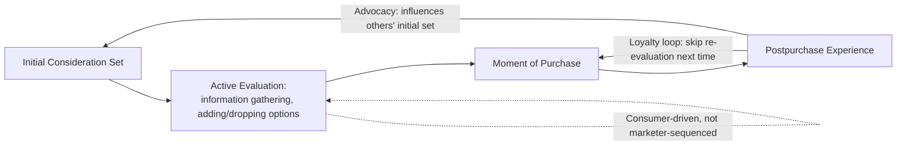
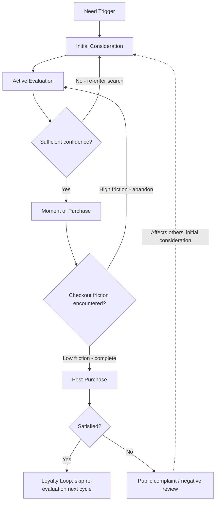

## The Online Consumer Decision Journey

### Definition and Scope

The online consumer decision journey describes the sequence of cognitive and behavioral stages a consumer moves through when making a purchase decision in digital environments — from initial need recognition through post-purchase evaluation. Unlike the traditional linear "purchase funnel" model, the online journey is characterized by non-linearity, multiple touchpoint re-entries, and consumer-driven information control, reflecting how digital search, social proof, and comparison tools have restructured decision-making relative to offline contexts.

### From Linear Funnel to Nonlinear Journey

#### The Traditional Funnel (AIDA)

The classical model — **Attention, Interest, Desire, Action** — assumes a linear, marketer-controlled progression where each stage narrows the audience toward purchase.

#### McKinsey's Consumer Decision Journey (CDJ) Model

McKinsey's widely cited alternative reframes the journey as a circular, consumer-controlled loop rather than a narrowing funnel:

Key distinctions from the linear funnel:

- **Active evaluation** often expands the consideration set (adding brands discovered via search or social proof) before narrowing it, rather than monotonically narrowing throughout.
- **The loyalty loop** allows repeat customers to bypass full re-evaluation, going directly from a triggered need to repurchase without an active evaluation phase — a critical retention mechanic in e-commerce (e.g., one-click reorder, subscription models).
- **Post-purchase experience feeds forward** into other consumers' initial consideration sets via reviews, word-of-mouth, and social content, making the journey a network effect rather than an isolated individual path.

### Stage-by-Stage Psychological Mechanisms

#### 1. Need Recognition / Trigger

A gap between a current and desired state activates purchase motivation. Online-specific triggers include algorithmically surfaced content (recommendation feeds, retargeted ads), social proof exposure (seeing a product used/reviewed by a peer or influencer), and search-driven triggers (a problem prompting an information search that surfaces a category need previously unrecognized).

#### 2. Initial Consideration Set Formation

Consumers form an initial set of brands/products from memory (unaided recall) and immediately visible options (search engine results, marketplace rankings, social feed exposure). Online consideration sets are heavily shaped by:

- **Algorithmic curation**: search ranking and recommendation algorithms determine which options are visible at all, functioning as a gatekeeping layer absent from offline browsing.
- **Choice overload**: unlike physical retail's limited shelf space, digital catalogs can present near-unlimited options, which — per choice overload research (Iyengar and Lepper) — can increase decision difficulty and, past a threshold, reduce satisfaction or purchase likelihood if not mitigated by filtering/sorting tools.

#### 3. Active Evaluation

Consumers gather information across multiple sources, exhibiting behaviors distinct to digital contexts:

- **Webrooming**: researching online before purchasing in a physical store.
- **Showrooming**: examining products in a physical store before purchasing online (often at a lower price).
- **Cross-device journey fragmentation**: research and purchase frequently occur across different devices/sessions (mobile research, desktop purchase), requiring journey tracking to span sessions rather than single visits.
- **Social proof aggregation**: reviews, ratings, and user-generated content function as a distributed, crowd-sourced credibility signal, often weighted more heavily by consumers than brand-generated claims due to perceived source independence (this reflects source credibility theory — non-brand sources are perceived as having less self-interested motive).
- **Anchoring via comparison tools**: price-comparison sites and on-platform filtering set reference prices during evaluation, shaping which options seem "reasonably priced" for the remainder of the session.

#### 4. Moment of Purchase

Digital purchase environments introduce a distinct set of friction and facilitation variables not present offline:

- **Checkout friction**: number of steps, required account creation, and form complexity function as micro-barriers; each additional step introduces an opportunity for abandonment, consistent with **cart abandonment** research showing checkout complexity as a leading cause of non-completion.
- **Trust signals at point of purchase**: security badges, clear return policies, and visible customer service options reduce perceived transaction risk immediately before commitment, a critical intervention point given that perceived risk peaks just before payment commitment.
- **Payment method diversity**: availability of preferred payment options (digital wallets, buy-now-pay-later) removes a category of friction specific to how comfortable a consumer is entering financial information.
- **Urgency/scarcity cues**: countdown timers, low-stock indicators, and limited-time offers (see sales promotion psychology) are frequently deployed precisely at this stage to counteract last-moment hesitation, exploiting loss aversion at the point of maximum commitment proximity.

#### 5. Post-Purchase Experience

Digital environments extend post-purchase evaluation into a highly visible, shareable phase:

- **Cognitive dissonance reduction**: consumers seek confirming information after purchase (reading further reviews, checking for post-purchase communications) to reduce dissonance about the decision made — a process facilitated by the ease of continued online searching.
- **Unboxing and experience-sharing behavior**: unlike offline purchases, digital-native consumers frequently document and share purchase experiences (social posts, review submissions), converting the individual post-purchase stage into public input for others' initial consideration sets.
- **Service recovery visibility**: negative post-purchase experiences (shipping issues, product defects) are more likely to be publicly documented (reviews, social complaints) in digital contexts than equivalent offline experiences, raising the stakes of post-purchase service quality.

### The Loyalty Loop and Retention Mechanics

The loyalty loop is the mechanism by which repeat purchase behavior bypasses full active evaluation. E-commerce-specific facilitators of the loyalty loop include:

- **Saved payment/shipping information**: reduces the effort barrier for repurchase to near-zero.
- **Subscription and auto-replenishment models**: remove the need for active decision-making entirely for recurring-need categories.
- **Personalized recommendation algorithms**: reduce search effort by pre-surfacing relevant options based on purchase history, functioning as an algorithmic substitute for active evaluation.
- **Loyalty/rewards programs**: introduce switching costs (via the endowed progress effect and accumulated point value) that make re-evaluation of competitors psychologically and practically more costly.

### Nonlinearity and Multi-Touchpoint Re-Entry

Digital journeys frequently loop backward or skip stages rather than progressing linearly:

### Key Psychological Constructs Specific to Digital Journeys

| Construct | Description | Journey Stage Most Affected |
| --- | --- | --- |
| Choice overload | Excessive options increase decision difficulty, potentially reducing satisfaction or completion | Initial consideration, active evaluation |
| Source credibility | Non-brand sources (reviews, UGC) trusted more than brand claims due to perceived independence | Active evaluation |
| Cart abandonment | Checkout friction and unexpected costs (shipping, fees) causing non-completion at high-commitment stage | Moment of purchase |
| Present bias | Preference for immediate gratification (fast shipping, instant digital delivery) over delayed alternatives | Moment of purchase |
| Cognitive dissonance | Post-decision discomfort resolved via confirming information-seeking | Post-purchase |
| Algorithmic curation dependency | Consideration sets shaped by what algorithms surface rather than pure organic recall | Initial consideration |

### Practical Application Example

An online furniture retailer observes high add-to-cart rates but low completed-purchase rates, concentrated at the checkout stage.

**Journey-based diagnosis**:

1. This pattern isolates the drop-off to the **moment of purchase** stage rather than earlier consideration/evaluation stages, since consumers are reaching intent-signaling behavior (adding to cart) but not converting.
2. Likely contributing frictions per the framework above: unexpected shipping costs revealed only at checkout (violating the established reference price from the product page), a multi-step checkout process, or insufficient trust signals for a relatively high-consideration, higher-price category like furniture.

**Corrective actions aligned to mechanism**:

- Display total cost (including shipping estimate) earlier in the journey (e.g., on the product page) to prevent late-stage reference-price violation, which is a well-documented driver of abandonment.
- Reduce checkout to the minimum viable number of steps, and offer guest checkout to remove the account-creation friction point.
- Add trust signals (return policy, assembly guarantee, customer service chat access) directly at the checkout stage, since perceived risk for a high-ticket item like furniture peaks immediately before payment commitment.

### Measurement Considerations

- **Funnel/stage conversion analytics**: measuring drop-off rates at each defined journey stage (landing → product view → cart → checkout → purchase) to isolate friction points.
- **Cross-device/session stitching**: analytics infrastructure (login-based tracking, probabilistic matching) required to capture the fragmented, multi-session nature of real online journeys, since single-session data undercounts true consideration behavior.
- **Attribution modeling**: given the non-linear, multi-touchpoint nature of the journey, single-touch attribution models (first-click, last-click) tend to misrepresent the actual influence of upper-funnel touchpoints (e.g., initial social discovery) relative to the touchpoint that received final credit.
- **Post-purchase sentiment tracking**: review monitoring and NPS/CSAT surveys to capture the loop-back effect of post-purchase experience into future consideration sets.

[Behavior may vary: the relative weight and typical duration of each journey stage differs substantially by product category (low-involvement/frequent-purchase vs. high-involvement/infrequent-purchase goods), and specific conversion or abandonment rate benchmarks should be validated against a business's own analytics rather than assumed universal.]

**Related Topics**

- Choice overload and decision paralysis in digital retail environments
- Cart abandonment causes and checkout optimization
- Attribution modeling: first-touch, last-touch, and multi-touch approaches
- User-generated content and review psychology in purchase decisions
- Personalization algorithms and recommendation system design
- Subscription and auto-replenishment retention mechanics
- Cross-device and cross-session customer journey tracking infrastructure