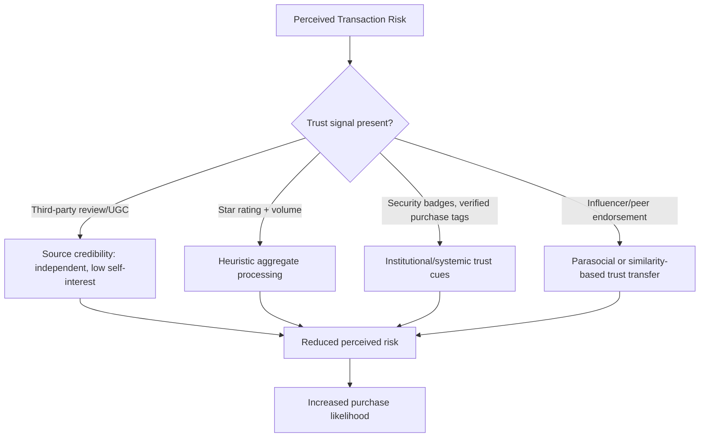

## Online Trust, Reviews, and Social Proof

### Definition and Scope

Online trust refers to a consumer's willingness to accept vulnerability in a digital transaction based on positive expectations about a seller, platform, or product, formed in the absence of the direct sensory and interpersonal cues available in offline commerce. Reviews and social proof are the primary substitute mechanisms consumers use to establish this trust remotely, functioning as distributed, crowd-sourced credibility signals that partially replace the trust-building role of direct inspection, salesperson interaction, and physical store reputation in offline retail.

### Core Psychological Mechanisms

#### Social Proof Theory

Cialdini's principle of **social proof** holds that people determine correct behavior by observing what others do, particularly under uncertainty. Online reviews operationalize this directly: a high volume of positive reviews signals that "most people who bought this were satisfied," reducing the individual consumer's perceived risk of deviating from the crowd's apparent judgment.

Social proof strength is moderated by:

- **Similarity to the observer**: reviews from people perceived as similar to oneself (similar use case, demographic, stated needs) carry more weight than generic reviews, consistent with source-similarity effects in persuasion research.
- **Uncertainty of the observer**: social proof effects are strongest when the individual consumer has low personal expertise or high uncertainty about the product category, since they have fewer independent bases for judgment and rely more heavily on aggregate crowd behavior.

#### Source Credibility Theory

Reviews and user-generated content (UGC) are typically perceived as more credible than brand-generated marketing claims because they are attributed to a source without an obvious commercial incentive to misrepresent the product — an application of source credibility theory's core dimensions of **trustworthiness** and **expertise**. A brand's own claim about product quality carries an inherent credibility discount because the source's self-interest is transparent; a peer reviewer's claim does not carry the same discount unless the reviewer is suspected of incentivized or fake activity.

#### Heuristic Processing of Aggregate Signals

Consumers frequently process review information heuristically rather than by reading full review text, using aggregate cues as a mental shortcut:

- **Star rating average**: a fast, low-effort proxy for overall quality, often the single most weight-bearing element in purchase decisions when evaluation time is limited.
- **Review volume/count**: functions as a secondary credibility signal — a high rating with very few reviews is often perceived as less reliable than a slightly lower rating with a large review count, reflecting an implicit sample-size intuition.
- **Recency of reviews**: recent reviews are weighted more heavily, functioning as a proxy for current product/service quality rather than historical quality that may no longer be representative.

[Inference: exact heuristic weighting between rating average, volume, and recency varies by product category and platform UI design, and has not been reduced to a single universal formula in the literature.]

#### The Negativity Bias in Review Weighting

Consistent with general negativity bias in information processing (negative information is weighted more heavily than equivalent positive information in impression formation), a small number of negative reviews can disproportionately offset a larger number of positive ones in shaping overall purchase intent — particularly when the negative reviews describe outcomes relevant to the specific consumer's use case (e.g., a durability complaint mattering more to a buyer planning heavy use).

#### Extremity Bias in Review Distributions

Online review distributions are frequently **bimodal** (J-shaped or U-shaped) rather than normally distributed — skewed toward 5-star and 1-star ratings with fewer moderate ratings. This reflects **purchase-decision self-selection**: consumers with moderate/neutral experiences are less motivated to write a review than those with strongly positive or strongly negative experiences, since review-writing itself requires effort that is more readily justified by strong affect in either direction. This means the visible review population is not necessarily representative of the full purchaser population's actual satisfaction distribution.

### Trust Signal Taxonomy

### Categories of Online Trust Signals

| Signal Type | Mechanism | Example |
| --- | --- | --- |
| Verified purchase reviews | Reduces suspicion of fake/incentivized reviews | "Verified Purchase" tag on marketplace listings |
| Review volume and rating average | Heuristic quality proxy, sample-size intuition | 4.6 stars, 12,000 ratings |
| User-generated content (UGC) | Peer demonstration reduces functional uncertainty | Customer photos/videos of product in use |
| Influencer/creator endorsement | Parasocial trust transfer, perceived expertise or relatability | Sponsored or organic product mentions by creators |
| Third-party certification badges | Institutional trust transfer from a recognized authority | Security seals, industry certification logos |
| Return policy transparency | Reduces perceived financial/functional risk of the transaction | Clearly stated free-returns policy at point of purchase |
| Live chat/responsive customer service visibility | Signals accountability and reduces perceived abandonment risk post-purchase | Visible chat widget with fast response indicators |
| Social media engagement volume | Secondary social proof signal (follower count, comment activity) | Public follower/engagement counts on brand profiles |

### Fake Reviews and Trust Erosion

The credibility advantage of reviews depends on consumers believing reviews are genuine and unincentivized. Awareness of fake or manipulated reviews (incentivized reviews, review farms, brand self-seeding) introduces a **source-credibility discounting** dynamic: once a consumer suspects manipulation, review information is processed with the same skepticism previously reserved for brand-generated claims, collapsing the primary advantage reviews hold over advertising.

Platforms and regulators (e.g., FTC guidance on endorsements and testimonials) have responded with disclosure requirements for incentivized/sponsored reviews, since undisclosed incentivization is understood to materially mislead consumers who rely on the assumption of source independence. [Note: specific regulatory requirements vary by jurisdiction and are updated periodically; current compliance requirements should be verified against the applicable regulator's current guidance rather than assumed static.]

### The Role of Response to Negative Reviews

A brand's visible response to negative reviews functions as an independent trust signal beyond the review content itself:

- **No response**: can be interpreted as indifference or unaccountability.
- **Defensive/dismissive response**: can amplify negative perception, since it signals poor service disposition beyond the original complaint.
- **Empathetic, solution-oriented response**: can partially offset the negative review's impact by demonstrating **service recovery** — research on the service recovery paradox suggests that a well-handled complaint resolution can, in some cases, result in higher satisfaction among observers than if no problem had occurred at all, since it demonstrates accountability under adversity. [Inference: the service recovery paradox effect size and consistency is debated in the literature and should not be assumed to reliably exceed baseline (no-failure) satisfaction in all contexts.]

### Practical Application Example

A direct-to-consumer skincare brand has strong product quality but a low review count (fewer than 20 reviews) on a new product launch, resulting in lower conversion than an equivalent competitor product with 500+ reviews at a similar star rating.

**Diagnosis under the trust/social-proof framework**:

- The gap is likely driven by the **review volume heuristic** rather than actual quality perception — consumers use review count as a proxy for sample reliability and popularity independent of the rating value itself.
- Low review count also limits exposure to **similarity-based social proof** (a consumer with a specific skin type or concern is less likely to find a matching reviewer in a small sample).

**Corrective actions aligned to mechanism**:

1. Implement a post-purchase review request flow (e.g., automated email after expected delivery/use window) to accelerate review volume accumulation, since organic review rates alone are typically insufficient in early product life.
2. Encourage photo/video UGC submission specifically, since visual UGC provides stronger functional-uncertainty reduction than text alone for a visually evaluated category like skincare.
3. Ensure "Verified Purchase" tagging is enabled and visible, since this specific credibility marker is well-established as counteracting fake-review skepticism.
4. Avoid incentivizing reviews with product-specific outcome expectations (e.g., requiring a positive review for a discount) to remain compliant with endorsement disclosure norms and to preserve genuine source-credibility perception.

### Measurement Considerations

- **Conversion rate by review-exposure segment**: comparing purchase completion rates among users who view the reviews section versus those who do not, isolating the review-viewing behavior's incremental effect.
- **Rating/volume threshold analysis**: identifying whether conversion rate changes are associated with specific review-count or rating thresholds (e.g., a possible step-change once past a review-count minimum).
- **Sentiment analysis of review text**: beyond star ratings, textual sentiment and topic extraction can surface specific recurring product issues or strengths not captured by the aggregate numeric score.
- **A/B testing of trust-signal placement**: testing variations in where and how UGC, badges, or verified-purchase tags are displayed to isolate their incremental conversion contribution.

[Behavior may vary: the relative influence of star rating, review volume, UGC, and influencer endorsement differs by product category, price point, and platform, and specific conversion-lift figures should be derived from a business's own testing rather than assumed to generalize universally across contexts.]

**Related Topics**

- Cialdini's principles of persuasion and social proof theory
- Source credibility theory: trustworthiness and expertise dimensions
- Fake review detection and regulatory disclosure requirements (e.g., FTC endorsement guides)
- Service recovery paradox and complaint-handling psychology
- User-generated content strategy and incentive design
- Influencer marketing and parasocial relationship theory
- Negativity and extremity bias in aggregated rating systems