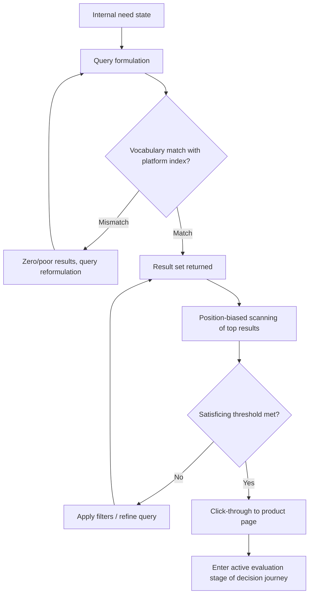

## Search Behavior in Digital Marketplaces

### Definition and Scope

Search behavior in digital marketplaces refers to how consumers formulate queries, evaluate result sets, and navigate ranked listings when locating products across e-commerce platforms, search engines, and marketplace apps. Unlike physical retail browsing, digital marketplace search is mediated by algorithmic ranking systems, query-interpretation logic, and interface design choices that jointly determine which options a consumer even perceives as available — making search behavior a distinct psychological and technical layer within the broader online consumer decision journey.

### Core Psychological Mechanisms

#### Bounded Rationality and Satisficing

Consumers operate under **bounded rationality** (Simon) — limited time, attention, and cognitive processing capacity prevent exhaustive evaluation of all available options in a marketplace with potentially thousands of listings. Rather than optimizing (finding the objectively best option), most consumers **satisfice**: selecting the first option that meets an acceptable threshold of relevant criteria, rather than continuing to search for a marginally better alternative. This underlies the outsized behavioral importance of ranking position: a "good enough" result presented first is frequently chosen over a superior result presented later, simply because search is terminated once satisficing criteria are met.

#### Position Bias and the Serial Position Effect

Search results exhibit strong **position bias**: click-through rates decay sharply with rank position, largely independent of true relevance differences between adjacent positions. This reflects a digital-context application of the serial position effect combined with an implicit trust heuristic — consumers infer that higher-ranked results are more relevant or higher quality because the platform's algorithm "chose" to rank them first, even when consumers have limited or no understanding of the actual ranking logic (which may include paid placement, historical popularity, or personalization factors unrelated to objective quality).

#### Cognitive Load and Query Formulation

Query formulation itself is a cognitively effortful translation step: consumers must convert an internal, often vague need state into a specific text string or filter selection the system can process. This creates several friction points:

- **Vocabulary mismatch**: the consumer's natural language terms may not match the marketplace's indexed product terminology (a documented problem in information retrieval known as the vocabulary problem), requiring either sophisticated semantic search on the platform side or query reformulation effort on the consumer side.
- **Under-specification**: early queries in a search session are often broad and exploratory, followed by progressive refinement as the consumer learns what options exist and clarifies their own criteria through exposure to the result set — a process sometimes described as "berry-picking" in information-seeking research, where the query itself evolves iteratively rather than being fixed at the outset.

#### Choice Overload in Result Sets

Excessive result volume without adequate filtering tools can trigger **choice overload** (Iyengar and Lepper), where an abundance of options increases decision difficulty and can, past a threshold, reduce both satisfaction with the eventual choice and the likelihood of completing a purchase at all. Effective marketplace search interfaces counteract this through progressive filtering (faceted search) that allows consumers to narrow the choice set incrementally rather than confronting the full catalog at once.

### The Search-to-Decision Pipeline

### Types of Marketplace Search Behavior

| Behavior Type | Description | Psychological Driver |
| --- | --- | --- |
| Navigational search | Searching for a specific known brand/product by name | Low uncertainty, direct schema retrieval |
| Exploratory/broad search | Vague category-level query with no fixed target in mind | High uncertainty, need for category orientation |
| Comparative search | Search combined with side-by-side evaluation of similar options | Active evaluation, reference-price formation |
| Re-search/repeat search | Repurchase or reorder search using prior purchase history | Loyalty loop, reduced active evaluation |
| Voice/conversational search | Natural language query via voice assistant | Reduced formulation effort, but limited result-set visibility (typically single or few results returned) |
| Visual search | Image-based query (e.g., photo of a product) | Bypasses vocabulary mismatch entirely via non-textual matching |

### Ranking Algorithm Influence on Perceived Choice

Marketplace ranking systems (search engine results pages, e-commerce platform search, app store rankings) typically weight a combination of factors that are largely invisible to the consumer:

- **Relevance matching**: textual/semantic match between query and listing.
- **Popularity/conversion signals**: historical click-through and purchase rates for a given query-listing pairing.

  2- **Paid placement**: sponsored listings integrated into or above organic results.
- **Personalization**: individual browsing/purchase history influencing ranking for that specific user.
- **Platform-specific business logic**: factors such as seller ratings, fulfillment speed, or margin considerations that may be weighted by the platform operator.

Because consumers generally cannot distinguish paid from organic placement with full accuracy (despite disclosure labels such as "Sponsored"), position bias extends a trust-transfer effect to paid listings that would not exist if consumers fully discounted sponsored results as advertising rather than as algorithmically validated relevance. This has direct implications for regulatory disclosure requirements and for marketer strategy in bidding on marketplace ad placements. [Inference: the degree to which consumers consciously discount sponsored labeling varies by platform, disclosure design, and consumer digital literacy, and is not uniform across all marketplace contexts.]

### Faceted Search and Filter Design as Choice Architecture

Filter/facet design functions as a form of **choice architecture** (Thaler and Sunstein) — the way filtering options are structured and ordered shapes which product attributes consumers even consider as decision criteria:

- **Default filter states**: pre-applied sort orders (e.g., "Best Match" vs. "Price: Low to High" as default) anchor the initial result presentation and disproportionately influence outcomes for consumers who do not actively change the default, consistent with default-effect research in behavioral economics.
- **Facet ordering and prominence**: attributes given prominent filter placement (e.g., brand, price range, star rating displayed first) are more likely to be used as decision criteria than attributes buried in secondary menus, since filter prominence shapes attention allocation during the evaluation process.
- **Filter granularity trade-off**: too few filters leave choice overload unaddressed; too many filters (or overly narrow price/attribute bands) can fragment inventory perception and create the impression of limited availability even when broader inventory exists.

### Zero-Result and Poor-Match Search Experiences

Failed searches (zero results, or results perceived as irrelevant) represent a high-risk friction point in the marketplace journey:

- They interrupt the search-to-decision pipeline entirely, often prompting either query reformulation (increasing cognitive effort and abandonment risk with each additional attempt) or complete session exit.
- Repeated poor-match experiences on a specific platform can generalize into a broader trust erosion regarding that platform's search quality, reducing the likelihood of return visits independent of actual catalog adequacy — a platform-level equivalent of the schema-consistency effects discussed in message consistency contexts.

### Practical Application Example

An online marketplace notices that a specific high-margin product category has strong catalog depth (many available listings) but low search-driven conversion, with session recordings showing high query reformulation rates and frequent immediate back-clicks from the search results page.

**Diagnosis under the search behavior framework**:

1. High reformulation rates suggest a likely **vocabulary mismatch** between how consumers naturally describe products in this category and how the platform's search index and listing titles are structured.
2. Immediate back-clicks after viewing results suggest the top-ranked results (subject to strong position bias) are not meeting satisficing thresholds, even if relevant options exist lower in the result set that consumers are unlikely to scroll to reach.

**Corrective actions aligned to mechanism**:

1. Conduct a query-log analysis comparing actual consumer search terms against indexed product titles/attributes to identify systematic vocabulary gaps, then expand synonym/semantic matching in the search index.
2. Audit the ranking algorithm's weighting for this category specifically, since a category with weak historical conversion data may be under-ranking genuinely relevant newer or lower-volume listings due to popularity-signal cold-start effects.
3. Introduce or improve category-specific filters (e.g., a technical specification filter uniquely relevant to this category) positioned prominently, reducing reliance on the initial query string alone to surface satisfactory options.

### Measurement Considerations

- **Query reformulation rate**: proportion of search sessions involving more than one distinct query, indicating initial query or result-set failure.
- **Position-weighted click-through rate (CTR)**: click rate by rank position, used to quantify the strength of position bias for a given platform/category and to detect anomalies (e.g., a lower-ranked result outperforming its position-predicted CTR, suggesting genuine relevance advantage overcoming position bias).
- **Zero-result rate**: proportion of searches returning no or negligible results, a direct measure of vocabulary/indexing gaps.
- **Search-to-purchase conversion rate**: conversion rate specifically for sessions originating from a search action, compared against browse-originated sessions, isolating search-specific friction from general site conversion issues.
- **Filter usage/abandonment analysis**: tracking which filters are applied, in what sequence, and at what point users abandon a filtered search without completing a purchase.

[Behavior may vary: position bias magnitude, satisficing thresholds, and filter usage patterns differ substantially by product category, purchase involvement level, and platform interface design, and should be benchmarked against a specific platform's own analytics rather than assumed to hold at fixed universal rates across all digital marketplaces.]

**Related Topics**

- Bounded rationality and satisficing theory in consumer decision-making
- Choice architecture and default-effect design in filter/facet systems
- Search engine and marketplace ranking algorithm design (relevance, popularity, and paid signals)
- Vocabulary problem and semantic search in information retrieval
- Sponsored listing disclosure and consumer discounting of paid placement
- Voice and visual search interfaces in e-commerce
- Choice overload and progressive disclosure in product catalogs