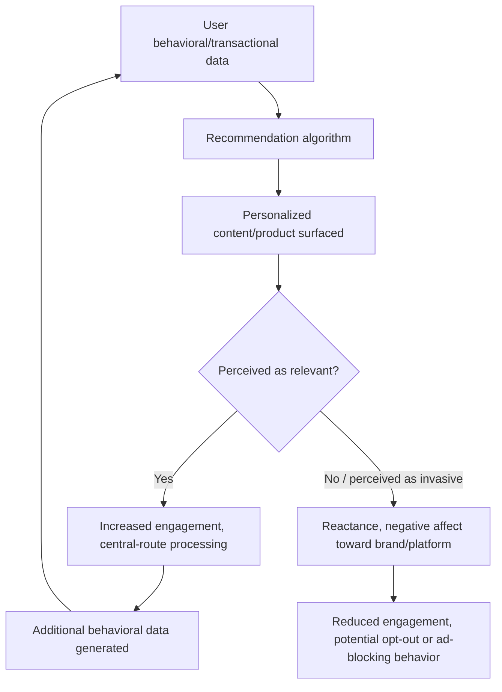

## Personalization and Recommendation Systems

### Definition and Scope

Personalization and recommendation systems refer to the algorithmic and psychological mechanisms by which e-commerce platforms tailor content, product suggestions, and messaging to individual users based on behavioral, transactional, and contextual data. From a marketing psychology perspective, the discipline concerns not only the technical architecture of recommendation algorithms but how personalized experiences alter consumer perception of relevance, trust, autonomy, and privacy — with effects that can be either persuasion-enhancing or reactance-triggering depending on execution.

### Core Psychological Mechanisms

#### Relevance and Reduced Cognitive Load

Personalization operates on the principle that pre-filtering options to match inferred individual preference reduces the cognitive burden of the active evaluation stage of the consumer decision journey. By narrowing an otherwise overwhelming catalog to a smaller, higher-relevance subset, recommendation systems function as an algorithmic countermeasure to **choice overload** (Iyengar and Lepper) — provided the personalization is perceived as genuinely relevant rather than intrusive or inaccurate.

#### The Elaboration Likelihood Model and Personalized Message Processing

Personalized content (e.g., "Recommended because you viewed X") can shift how a message is processed under the **Elaboration Likelihood Model**: personal relevance is a well-established antecedent of motivation to elaborate, meaning personalized recommendations are more likely to receive central-route (effortful, detail-oriented) processing than generic mass-market messaging, which tends to be processed peripherally. This makes personalized recommendations potentially more persuasive per exposure, though also more exposed to scrutiny — an inaccurate or poorly matched personalized recommendation can produce a stronger negative reaction than an equivalently poor generic one, since it violates a specific relevance expectation the platform itself created.

#### Reactance Theory and the Privacy-Personalization Paradox

Effective personalization requires behavioral data collection, which creates a documented tension known as the **privacy-personalization paradox**: consumers generally value personalized experiences but simultaneously express discomfort when they perceive the underlying data collection as invasive or when personalization is presented in a way that reveals more inference than expected (the "creepiness" reaction).

This reaction is explainable via **psychological reactance theory** (Brehm) — when consumers perceive that a system "knows too much" or displays inferred information in a way that feels like a violation of expected privacy boundaries, the perceived threat to autonomy and information control triggers a defensive, negative response, even if the underlying recommendation is objectively accurate and useful. [Inference: the precise threshold at which personalization is perceived as "creepy" rather than "helpful" varies significantly by individual privacy sensitivity, cultural context, and the specific data signal revealed, and has not been reduced to a fixed, universally applicable rule.]

#### Mere Exposure and Repetition via Retargeting

Personalized retargeting (showing ads for previously viewed products across subsequent browsing sessions) leverages the **mere exposure effect** to reinforce brand/product familiarity after initial consideration. However, retargeting effectiveness is bounded by a documented **wear-out effect**: excessive repetition of the same retargeted ad can shift from reinforcing familiarity to producing irritation and negative affect transfer toward the brand, particularly when the consumer has already purchased the item or lost interest, a common execution failure in poorly frequency-capped retargeting campaigns.

### Recommendation System Architectures (Technical Overview)

Recommendation systems typically use one or a hybrid of the following algorithmic approaches, each with distinct psychological implications for the resulting user experience:

| Approach | Mechanism | Psychological Implication |
| --- | --- | --- |
| Collaborative filtering | Recommends based on patterns from similar users ("users who bought X also bought Y") | Leverages social proof indirectly; can create filter-reinforcing loops |
| Content-based filtering | Recommends based on attributes of items the user previously engaged with | High perceived relevance for stated preferences; limited serendipity/discovery |
| Hybrid systems | Combine collaborative and content-based signals, often with additional contextual data | Balances relevance with discovery; industry-standard in mature platforms |
| Knowledge-based systems | Uses explicit rules/constraints (e.g., stated budget, specific requirements) rather than inferred behavior | Reduces "creepiness" perception since inputs are user-stated, not inferred |
| Session-based/contextual recommendation | Uses real-time in-session behavior rather than long-term profile history | Feels immediately relevant; lower long-term privacy-inference perception |

### Personalization Feedback Loop

### The Filter Bubble / Narrowing Effect

A secondary concern in personalization psychology is the **filter bubble** phenomenon: heavy reliance on collaborative and content-based filtering can progressively narrow the range of options a consumer is exposed to, reinforcing existing preferences rather than introducing novel discovery. In a commercial context, this can reduce cross-category exposure and long-term customer lifetime value expansion, even while short-term relevance and conversion metrics for the narrowed recommendation set appear strong. Mature recommendation systems typically counterbalance this with deliberate "exploration" mechanisms (occasionally surfacing lower-confidence but novel recommendations) to avoid over-narrowing. [Unverified: the magnitude of filter-bubble effects specifically in commercial recommendation contexts (as opposed to media/news contexts, where the concept originated) is less extensively documented and may vary by platform design.]

### Transparency and Explainability Effects

Providing an explanation for why a recommendation was surfaced (e.g., "Because you viewed...", "Customers who bought... also bought...") has a measurable effect on trust and acceptance:

- **Explained recommendations** tend to be perceived as more trustworthy and less "creepy," since the stated rationale gives the consumer an interpretable causal story rather than an opaque inference, reducing the autonomy-threat perception associated with reactance.
- **Unexplained but highly specific recommendations** (e.g., inferring a private life event from indirect behavioral signals without disclosed reasoning) carry higher creepiness risk precisely because the inference appears to exceed what the consumer believes they explicitly disclosed.

### Practical Application Example

An online retailer's homepage recommendation module shows strong click-through rates in aggregate analytics, but customer support has logged a rising number of complaints describing the personalized recommendations as "creepy" or "too targeted," alongside an uptick in privacy-settings opt-outs.

**Diagnosis under the personalization psychology framework**:

- Aggregate CTR success does not capture the **privacy-personalization paradox** dynamic — a subset of users may be experiencing strong relevance-driven engagement (high elaboration, high CTR) while a different subset experiences reactance from the same underlying data usage, and the complaint/opt-out signal indicates this second group's negative response is not visible in top-line engagement metrics alone.

**Corrective actions aligned to mechanism**:

1. Add visible, simple explanations to recommendation modules (e.g., "Because you viewed [Product]") to shift perception from opaque inference to interpretable relevance, reducing the reactance-triggering "how did it know that" response.
2. Segment recommendation logic to rely more heavily on **explicit, user-stated signals** (search history, stated preferences, wishlist activity) rather than more inferential cross-session behavioral tracking for users who have shown privacy-sensitivity signals (e.g., prior opt-out attempts, ad-blocker usage where detectable).
3. Introduce frequency capping and staleness rules for retargeted recommendations (e.g., suppress recommending an item the user has already purchased, and reduce repetition after a defined number of exposures) to mitigate wear-out effects.
4. Review the granularity of any user-facing personalization disclosure or privacy settings interface to ensure users have visible, easy control over personalization intensity, which per reactance theory should reduce the autonomy-threat perception independent of the underlying algorithm's actual behavior.

### Measurement Considerations

- **Click-through and conversion rate by recommendation module**: standard effectiveness metric, but should be segmented rather than viewed only in aggregate to detect masked negative subgroup reactions.
- **Opt-out and privacy-setting adjustment rates**: a direct behavioral indicator of reactance-driven response to personalization, often a leading indicator preceding broader engagement decline.
- **Diversity/novelty metrics in recommended sets**: tracking category and item diversity within recommendations over time to detect filter-bubble narrowing, which aggregate CTR alone will not surface.
- **Sentiment analysis of customer service/social complaints**: qualitative signal capturing "creepiness" or over-targeting perception that is not directly captured by standard engagement analytics.
- **A/B testing of explanation presence/absence**: isolating the incremental trust and conversion effect of adding recommendation rationale text.

[Behavior may vary: the specific balance between personalization benefit and privacy-reactance cost is highly dependent on product category sensitivity (e.g., health or financial products carry substantially higher creepiness risk than general retail), platform data transparency practices, and regional privacy regulation and consumer expectations, and should be evaluated against a business's own user research rather than treated as fixed across all contexts.]

**Related Topics**

- Collaborative filtering, content-based filtering, and hybrid recommendation architectures
- Psychological reactance theory and the privacy-personalization paradox
- Filter bubble effects and exploration/exploitation balance in recommendation design
- Retargeting frequency capping and ad wear-out effects
- Elaboration Likelihood Model and personal relevance as an elaboration driver
- Data privacy regulation and consumer consent design (e.g., GDPR, CCPA disclosure norms)
- Explainable AI (XAI) principles applied to consumer-facing recommendation systems