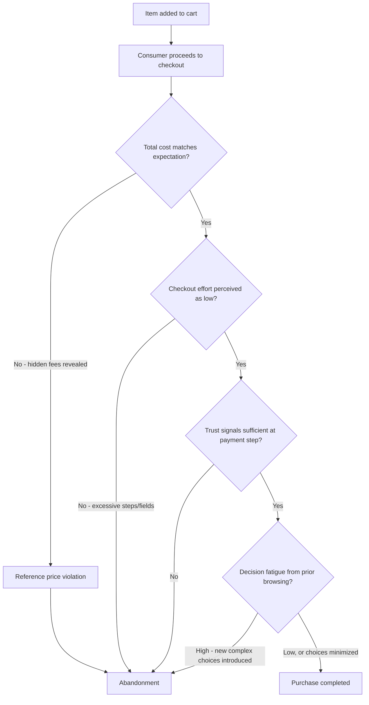

## Checkout Psychology and Cart Abandonment

### Definition and Scope

Checkout psychology examines the cognitive and emotional factors operating at the final transactional stage of an online purchase, where consumers convert purchase intent (signaled by adding an item to cart) into completed payment. Cart abandonment — the discontinuation of a purchase after cart addition but before completion — represents the most measurable failure point in e-commerce conversion, and is driven by a distinct set of psychological mechanisms concentrated at the highest-commitment, highest-scrutiny moment in the consumer decision journey.

### Core Psychological Mechanisms

#### Peak Perceived Risk at the Point of Commitment

Perceived transaction risk — financial, functional, and psychological — is typically highest immediately before final payment commitment, since this is the point where the cost of the decision becomes irreversible (or perceived as such) rather than hypothetical. This aligns with **prospect theory**'s framing: up to the point of payment, the consumer is contemplating a potential loss (money) in exchange for a potential gain (the product), and the loss becomes concrete and salient precisely at the payment-entry step, which can trigger last-moment hesitation even after extensive prior positive evaluation.

#### Reference Price Violation via Hidden Costs

**Drip pricing** — the practice of revealing additional costs (shipping, taxes, fees) only at the checkout stage rather than earlier in the journey — produces a direct **reference price violation**. The consumer's mental "the price is X" anchor, formed during product browsing, is disrupted by a higher total revealed late in the process. Because this violation occurs at the highest-commitment stage, and because behavioral economics research on loss aversion suggests that a late-revealed additional cost is processed more negatively than the same total price would have been if disclosed upfront, unexpected costs at checkout are consistently identified as a leading cause of cart abandonment across e-commerce research and industry benchmarking. [Note: specific percentage figures cited for unexpected-cost-driven abandonment vary across studies and survey methodologies and should be treated as directional rather than as a single fixed statistic.]

#### Cognitive Load from Process Friction

Each additional step, form field, or decision point in the checkout flow imposes incremental cognitive and effort cost. This reflects a direct application of **effort-based decision theory**: consumers implicitly weigh the remaining effort required to complete a task against the strength of their motivation to complete it, and each friction point (mandatory account creation, excessive form fields, unclear progress indicators, multi-page flows) creates an additional opportunity for the effort cost to exceed the motivation at that specific moment, particularly for time-pressured or lower-involvement purchases.

#### Decision Fatigue

Checkout often follows an extended active-evaluation phase (browsing, comparing, reading reviews), meaning the consumer may already be experiencing **decision fatigue** — the depletion of self-regulatory/decision-making capacity from prior effortful choices — by the time they reach checkout. Under decision fatigue, additional choices presented at checkout (shipping speed options, insurance add-ons, account preferences) are more likely to be met with avoidance (abandonment) or default-selection reliance than careful evaluation, making checkout an especially poor location to introduce new complex choices relative to earlier stages of the journey.

#### Trust and Security Perception at Payment Entry

Entering payment information is the specific behavioral act most directly tied to perceived financial vulnerability. Absence of visible trust signals (security badges, familiar payment logos, clear encryption indicators) at this exact step can trigger heightened scrutiny and hesitation, since this is the moment where the abstract concept of "is this site trustworthy" becomes concretely consequential rather than a general background consideration held during earlier browsing.

### The Cart Abandonment Decision Point

### Major Categories of Abandonment Drivers

| Driver Category | Mechanism | Example |
| --- | --- | --- |
| Unexpected costs | Reference price violation, loss aversion | Shipping/tax revealed only at final step |
| Mandatory account creation | Effort cost, perceived commitment escalation | Forced registration before purchase completion |
| Checkout complexity | Cognitive load, effort-motivation mismatch | Multi-page flow, excessive form fields |
| Limited payment options | Removal of preferred low-friction payment method | No digital wallet or buy-now-pay-later option |
| Security/trust concerns | Heightened perceived risk at point of financial commitment | Absence of recognizable security indicators |
| Comparison shopping intent | Cart used as a "save for later" tool rather than firm purchase intent | Adding to cart while still in active evaluation across competing sites |
| Technical friction | Direct task-completion failure independent of psychological factors | Site errors, slow load times, mobile display issues |
| Return policy ambiguity | Unresolved functional risk perception | Unclear or restrictive return terms discovered late |

Note that not all cart additions represent firm purchase intent — a documented proportion of cart activity reflects browsing, price-tracking, or wish-listing behavior rather than genuine abandoned purchase intent, meaning raw cart abandonment rate should be interpreted alongside session-intent signals rather than treated as a pure measure of "lost sales."

### Checkout Friction Reduction Techniques and Their Mechanism

- **Upfront total cost disclosure** (showing estimated shipping/tax before the final checkout page): directly prevents reference-price violation by aligning the anchor formed during browsing with the eventual actual total.
- **Guest checkout options**: removes the effort and perceived-commitment cost of mandatory account creation, addressing the effort-motivation mismatch specifically for lower-involvement or first-time buyers.
- **Progress indicators**: reduce uncertainty about remaining effort required, which can mitigate abandonment driven by an unclear or seemingly open-ended process length, consistent with research on the motivating effect of visible goal proximity (the "goal-gradient effect" — effort and persistence increase as perceived distance to a goal decreases, but only when that distance is visible and legible to begin with).
- **Autofill and saved payment/address information**: reduces both cognitive and physical effort cost, particularly impactful on mobile devices where manual form entry carries substantially higher friction than desktop.
- **Multiple payment method support** (cards, digital wallets, buy-now-pay-later): removes friction for consumers whose preferred low-effort payment method would otherwise be unavailable, and BNPL options specifically can reduce the immediate perceived financial loss magnitude by deferring/splitting payment.
- **Visible security and trust badges at the payment step specifically** (not just elsewhere on the site): addresses the risk-perception spike concentrated at this exact interaction point rather than relying on trust established earlier in the session.
- **Simplified, single-page or minimal-step checkout flows**: directly reduces the number of discrete effort/decision points where abandonment can occur.

### Cart Abandonment Recovery Mechanisms

Post-abandonment recovery tactics operate on distinct psychological triggers from pre-abandonment prevention:

- **Abandoned cart emails/retargeting**: leverage the mere exposure effect and serve as a re-triggering mechanism for consumers whose abandonment was due to interruption or distraction rather than firm decision reversal.
- **Time-limited recovery incentives** (e.g., a discount code offered in a follow-up email): introduce scarcity/urgency framing to counteract any cooling of purchase motivation that occurred during the abandonment gap, though frequent or predictable discount-triggering via abandonment can train price-sensitive segments to deliberately abandon carts in anticipation of a subsequent discount offer — a documented unintended incentive-conditioning risk of over-relying on this tactic. [Inference: the prevalence and scale of this "strategic abandonment" behavior among consumers is plausible given documented promotional conditioning effects generally, but has not been extensively quantified specifically for cart-abandonment discount tactics in isolation.]
- **Retained cart contents on return visit**: reduces the effort cost of re-initiating the purchase, supporting the loyalty-loop-style bypass of re-evaluation for a consumer who had already completed active evaluation prior to abandonment.

### Practical Application Example

An online electronics retailer identifies a high cart abandonment rate concentrated specifically at the shipping-cost display step of its checkout flow, based on funnel analytics showing a sharp drop-off at that exact page.

**Diagnosis under the checkout psychology framework**:

- The precise location of the drop-off (immediately upon shipping cost reveal, rather than distributed evenly across the checkout flow) strongly implicates a **reference price violation** rather than general checkout complexity or trust concerns, since the abandonment is tightly coupled to a specific cost-disclosure event rather than a process-length or security-related friction point.

**Corrective actions aligned to mechanism**:

1. Move shipping cost estimation to the product page or cart page (before the formal checkout flow begins), so the reference price anchor formed during browsing already includes the accurate total, preventing the late-stage violation entirely.
2. Consider a free-shipping threshold promotion (e.g., "Free shipping over $50") displayed early in the journey, which reframes shipping cost as an avoidable choice rather than an unavoidable late-revealed fee, additionally incentivizing basket-size increases.
3. A/B test the specific cost-disclosure placement change in isolation from other checkout modifications, to confirm the causal link between disclosure timing and the observed abandonment concentration before investing in broader checkout redesign.

### Measurement Considerations

- **Cart abandonment rate**: proportion of carts created that do not result in completed purchase, typically calculated within a defined session or time window; industry benchmark figures vary substantially by source, device type, and product category, and should be treated as broad reference ranges rather than precise universal norms.
- **Step-level funnel drop-off analysis**: abandonment rate isolated by specific checkout page/step, essential for distinguishing which mechanism (cost disclosure, form friction, payment step trust) is the actual driver rather than treating abandonment as a single undifferentiated event.
- **Cart-to-purchase time lag**: time elapsed between cart addition and either purchase completion or abandonment, useful for distinguishing impulse-driven quick abandonment from extended comparison-shopping behavior.
- **Recovery campaign conversion rate**: proportion of abandoned carts recovered via email/retargeting, segmented by whether an incentive was included, to evaluate both effectiveness and the risk of incentive-conditioning behavior over time.
- **Device-segmented abandonment analysis**: mobile checkout flows typically carry higher friction cost per form field than desktop, and abandonment rate differences by device often reveal device-specific UX friction not visible in aggregate figures.

[Behavior may vary: the relative weight of each abandonment driver (cost surprise vs. process friction vs. trust concerns) differs by product category, price point, device, and customer segment, and specific abandonment rate and recovery conversion figures should be derived from a business's own funnel analytics rather than assumed to match general industry benchmarks.]

**Related Topics**

- Drip pricing and reference price effects in e-commerce
- Goal-gradient effect and progress indicator design
- Decision fatigue and choice sequencing in multi-step processes
- Buy-now-pay-later psychology and payment method friction
- Abandoned cart email and retargeting campaign design
- Mobile checkout UX and form-field friction reduction
- Free shipping threshold promotions and basket-size incentives