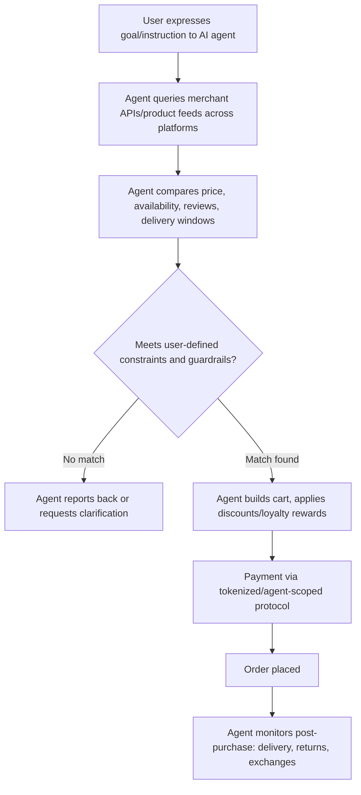

## Agentic Commerce and AI Shopping Assistants

### Definition and Scope

Agentic commerce refers to purchasing processes in which an autonomous AI agent — rather than a human directly navigating a website — searches, compares, and completes transactions on a consumer's behalf, based on a goal or instruction rather than a manually executed sequence of clicks. This is distinguished from earlier conversational commerce chatbots by the presence of genuine multi-step autonomy: an agentic system can plan a sequence of actions, call external APIs, interpret results, and execute a transaction within user-defined constraints, rather than simply answering questions or routing a human toward a manual checkout. Chatbots respond to user input using scripts or limited AI and provide information without executing transactions, whereas AI agents are goal-directed systems that plan sequences, call APIs, interpret results, and perform workflows such as checkout, refunds, and subscription management within user-defined limits. [Invisibletech](https://invisibletech.ai/blog/agentic-commerce-2026)

### Why This Matters Now

Consumer readiness driven by habitual trust in recommendation algorithms and personal assistants, maturing LLM capabilities that understand preferences, contexts and constraints, and new industry standards that allow retailers, platforms and agents to interoperate are together accelerating agentic commerce adoption. Projections vary by source, but Morgan Stanley has predicted that nearly half of online shoppers will use AI shopping agents by 2030, accounting for approximately 25% of their spending, and McKinsey projects this channel could drive $3–5 trillion globally by 2030. [Note: these are forward-looking industry projections, not observed outcomes, and should be treated as directional estimates subject to revision.] [7 AI Trends Shaping Agentic Commerce in 2026 +2](https://commercetools.com/blog/ai-trends-shaping-agentic-commerce)

### The Agentic Commerce Transaction Flow

A consumer tells an AI assistant what they need, either through a chat interface, voice command, or preset preferences, with the instruction ranging from specific ("reorder my usual coffee beans") to exploratory ("find a birthday gift for someone who likes cooking, under $75"). From there, the agent proceeds through a broadly consistent multi-stage flow: [Fin](https://fin.ai/learn/what-is-agentic-commerce)

Transaction execution involves the agent building a cart, applying relevant discounts or loyalty rewards, handling payment through tokenized protocols, and placing the order, with guardrails like spending limits, approval thresholds, and merchant-scoped payment tokens keeping the human in control of policy while the agent handles execution. Post-purchase management involves the agent monitoring order status, handling delivery notifications, and initiating returns or exchanges if needed. [Fin](https://fin.ai/learn/what-is-agentic-commerce)

### Key Protocols and Infrastructure

Several competing and complementary standards have emerged to let agents interoperate with merchant systems:

| Protocol | Developer(s) | Role |
| --- | --- | --- |
| Agentic Commerce Protocol (ACP) | Stripe and OpenAI | Live since September 2025 in ChatGPT; excels at conversational discovery and checkout |
| Universal Commerce Protocol (UCP) | Google-led coalition | Announced January 2026, coming to Google Search AI Mode and Gemini, backed by Walmart, Target, Shopify, and 20+ other partners |
| Model Context Protocol (MCP) | Anthropic | Provides the data connectivity layer that lets agents access real-time inventory, pricing, and product details |
| Visa Trusted Agent Protocol | Visa | Payment-network-level protocol for agentic checkout authentication |

ACP standardizes APIs and backend communication so AI agents can execute purchases, handle refunds, subscriptions, and payments in real-time, all within defined guardrails. Separately, UCP is positioned as an open standard that allows AI agents to interact with commerce backends more consistently across the shopping journey, addressing the problem that a common language is needed since bespoke per-merchant integrations would slow adoption. [Note: this is a fast-evolving standards landscape; specific protocol capabilities, adoption partners, and market share should be re-verified against current documentation before being treated as fixed, since this area changes rapidly even within 2026.] [Invisibletech](https://invisibletech.ai/blog/agentic-commerce-2026)[nShift](https://nshift.com/blog/agentic-commerce-ai-shopping-agents-2026)

### Instant Checkout and Live Deployments

Concrete deployments are already operating at scale rather than remaining purely conceptual: ChatGPT's Instant Checkout lets users buy products directly within ChatGPT conversations — when a user asks for product recommendations, the AI shopping assistant searches merchant product feeds, displays results with a Buy button, and processes payment via Stripe, without redirecting to the merchant's website. Adoption figures cited across sources include ChatGPT processing 50 million shopping queries daily as of February 2026, and Amazon's AI assistant Rufus serving 300 million users, while ChatGPT Shopping is live for all United States users, with Etsy and more than a million Shopify merchants connected, and Google's AI Mode with agentic checkout has been joined early by Wayfair, Chewy, and Etsy. [Unverified: specific usage statistics reported by vendors and industry blogs may reflect self-reported or estimated figures rather than independently audited data, and should be treated with appropriate caution.] [AI Shopping Assistant Guide 2026: Agentic Commerce Protocols - Opascope +2](https://opascope.com/insights/ai-shopping-assistant-guide-2026-agentic-commerce-protocols/)

### Psychological and Behavioral Implications

#### Disruption of the Traditional Decision Journey

Agentic commerce collapses several stages of the classical online consumer decision journey (need recognition, consideration set formation, active evaluation) into a single delegated instruction. This has direct implications for the persuasion mechanisms discussed elsewhere in this domain (search behavior, personalization, social proof): if an agent — not a human — is doing the comparison shopping and review-reading, the target of persuasion shifts from human cognitive biases (position bias, anchoring, social proof heuristics) toward the agent's own retrieval and ranking logic, which may or may not replicate human heuristic patterns. [Inference: the degree to which classical consumer psychology biases transfer to agent decision-making versus requiring entirely new "agent legibility" strategies is an actively developing area without established consensus.]

#### Agent Legibility as the New Persuasion Surface

AI shopping agents struggle with ambiguity because they need to compare and act quickly — if delivery windows, shipping costs, and returns terms are unclear or inconsistent, the agent can skip the offer without a human ever seeing it, which is why "agent legibility" matters: an offer needs to be comparable to machines, not only attractive to people. This represents a structural shift in marketing communications: persuasive copywriting and emotional brand storytelling, effective on human consumers, may have limited effect on an agent's purchase-decision logic, which instead weights structured, machine-readable attributes. [nShift](https://nshift.com/blog/agentic-commerce-ai-shopping-agents-2026)

#### Loss of Brand-Direct Engagement and Attribution

A significant consequence for marketers is the erosion of direct consumer touchpoints and behavioral data visibility: in agent-mediated commerce, the behavioral data stream starts at the add-to-cart moment — the discovery, the browse, the consideration, and the refined preferences all live inside the AI assistant itself, meaning attribution collapses, personalization breaks, and retail media visibility goes dark for the merchant. This directly undermines several mechanisms covered elsewhere in this domain (personalization systems, message consistency, retargeting) that depend on the brand having direct behavioral visibility into the consumer's evaluation process. [Metarouter](https://www.metarouter.io/post/agentic-commerce-trends-statistics)

#### Trust, Fraud, and Authentication Concerns

Agent-mediated purchasing introduces new trust and security dynamics distinct from human checkout psychology: 78% of financial institutions surveyed expect fraud to spike from AI shopping agents, and 2026 is expected to see authentication frameworks formalize through "Know Your Agent" protocols that distinguish legitimate shopping agents from malicious bots, with providers like Cloudflare pushing cryptographic verification via Signature-Input and Signature-Agent headers. Additionally, AI agents exhibit behavior patterns that traditional fraud detection systems flag as suspicious, such as rapid sequential orders, purchases across unrelated categories, and unusual velocity patterns, requiring fraud model recalibration. [Note: fraud-expectation statistics are drawn from institutional surveys and may reflect anticipatory concern rather than measured incident rates; treat as an indicator of industry sentiment rather than a confirmed outcome.] [Metarouter](https://www.metarouter.io/post/agentic-commerce-trends-statistics)[Metarouter](https://www.metarouter.io/post/agentic-commerce-trends-statistics)

### Merchant Adaptation Requirements

For a brand or retailer to remain visible and competitive as agentic commerce grows, several structural changes are commonly recommended across industry sources:

- **Structured, machine-readable product data**: using structured data markup such as JSON-LD with Schema.org to ensure that price, availability, shipping, and product attributes are explicitly machine-readable for AI assistants and shopping agents. [Invisibletech](https://invisibletech.ai/blog/agentic-commerce-2026)
- **Clear, consistent policy disclosure**: unambiguous shipping costs, delivery windows, and return terms, since agents will bypass offers with unclear or inconsistent terms rather than surfacing them for human judgment.
- **A "trust stack" approach**: combining a foundation of structured data, monitoring for agent traffic visibility, and governance for fraud defense. [Dropified](https://www.dropified.com/blog/agentic-commerce-in-2026-the-complete-guide-to-ai-shopping-agents-and-how-e-commerce-sellers-must-adapt/)
- **Dual on-site and off-site AI presence**: merchants increasingly need both protocols that make products discoverable to external agents and an on-site AI agent that can handle the conversational, complex, and context-dependent interactions that drive conversion, since the line between agentic commerce infrastructure and on-site customer experience is blurring. [Fin](https://fin.ai/learn/what-is-agentic-commerce)

### Comparison: Traditional E-Commerce vs. Agentic Commerce

| Dimension | Traditional E-Commerce | Agentic Commerce |
| --- | --- | --- |
| Primary actor navigating the journey | Human consumer | AI agent acting on consumer's instruction |
| Persuasion target | Human cognitive/emotional response | Agent's ranking/comparison logic ("agent legibility") |
| Data visibility for merchant | Full behavioral funnel (browse, cart, checkout) | Often begins only at add-to-cart; upstream behavior invisible |
| Discoverability driver | SEO, on-site UX, homepage design | Structured data, API completeness, machine-readable policies |
| Checkout friction relevant factors | Form length, trust badges, payment options | API latency, ambiguity in machine-readable terms |
| Fraud detection baseline | Human browsing/purchase velocity patterns | Requires recalibration for agent-typical velocity/category patterns |

### Practical Application Example

A mid-sized home goods retailer notices a growing share of referral-less, direct-purchase traffic with no corresponding browse-session history in its analytics — a pattern consistent with agent-mediated purchases bypassing the traditional funnel.

**Diagnosis under the agentic commerce framework**: This traffic pattern is consistent with the attribution collapse described above — purchases are likely originating from AI shopping assistants that queried the retailer's product feed directly rather than routing a human through the website's normal browse-to-cart funnel, meaning standard funnel analytics will undercount and mischaracterize this demand source.

**Adaptation actions aligned to mechanism**:

1. Audit and expand structured product data (JSON-LD/Schema.org markup) to ensure price, availability, and shipping terms are unambiguous and current, since incomplete or stale structured data risks the retailer being silently skipped by comparison-shopping agents.
2. Evaluate integration with at least one major agentic checkout protocol (ACP and/or UCP) given that most brands will need to support both protocols to remain visible across the current split ecosystem. [Opascope](https://opascope.com/insights/ai-shopping-assistant-guide-2026-agentic-commerce-protocols/)
3. Establish agent-traffic monitoring separate from standard human-session analytics, since standard attribution models will structurally undercount this channel's actual contribution to sales.

### Measurement Considerations

- **Agent-referred transaction share**: proportion of orders originating from recognized agentic checkout protocols versus traditional human browse sessions, requiring new tracking infrastructure since standard clickstream attribution does not capture pre-cart agent activity.
- **Structured data completeness/accuracy audits**: systematic checks that machine-readable product feeds match actual current pricing, availability, and policy terms, since discrepancies can cause agents to silently exclude an otherwise-competitive offer.
- **Agent traffic fraud-pattern monitoring**: recalibrated fraud detection thresholds that account for legitimate agent behavior patterns (rapid sequential queries, cross-category purchasing) distinct from human-driven fraud signals.
- **Post-purchase agent-mediated return/exchange rates**: tracking whether agent-initiated purchases show different return or satisfaction patterns than human-navigated purchases, which would have implications for how agents are actually interpreting product fit versus a human's own evaluation.

[Behavior may vary: this is an actively developing area as of 2026, with competing protocols, evolving adoption figures, and unsettled industry standards; specific statistics, protocol capabilities, and platform partnerships cited above should be re-verified against current sources given the pace of change, and should not be treated as stable, settled facts in the way that longer-established consumer psychology principles elsewhere in this domain can be.]

**Related Topics**

- Agent legibility and machine-readable product data standards (JSON-LD, Schema.org)
- Agentic Commerce Protocol (ACP) vs. Universal Commerce Protocol (UCP) technical comparison
- Fraud detection recalibration for agent-driven transaction patterns
- Attribution and marketing measurement in a post-clickstream, agent-mediated funnel
- Retail media and personalization strategy adaptation for reduced direct consumer visibility
- Trust, authentication, and "Know Your Agent" frameworks in payment networks
- Conversational commerce chatbots vs. autonomous AI shopping agents: capability boundaries