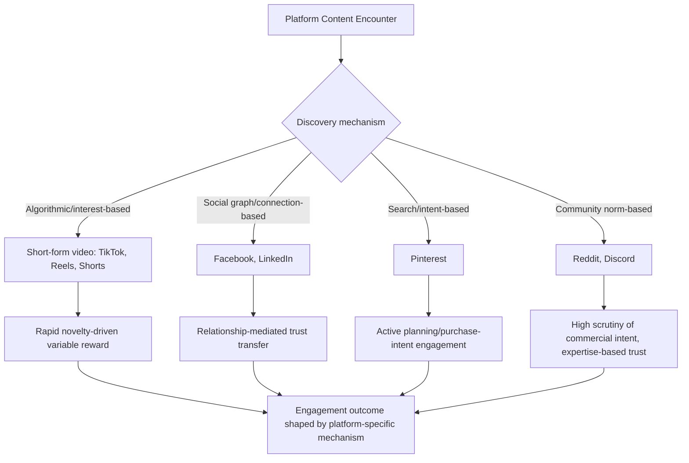

## Platform-Specific Engagement Psychology

### Definition and Scope

Platform-specific engagement psychology examines how the distinct design features, content formats, and algorithmic logics of individual social media platforms shape user attention, interaction behavior, and susceptibility to marketing influence. While general principles of social media psychology (social proof, parasocial relationships, variable reward) apply broadly, each platform's specific interface design, dominant content format, and community norms produce measurably different engagement patterns, requiring marketers to adapt strategy per platform rather than applying a single cross-platform psychological model.

### Core Cross-Platform Mechanisms Modulated by Platform Design

#### Variable Ratio Reinforcement and the Infinite Scroll

Most major platforms employ **variable ratio reinforcement schedules** — the same operant conditioning mechanism underlying slot machine engagement — where the reward (an interesting post, a like notification, a viral video) arrives unpredictably amid a stream of less rewarding content. This schedule produces the highest resistance to extinction of any reinforcement pattern, meaning users continue scrolling/checking behavior even through long stretches without reward, since the next scroll might contain the reward. The infinite scroll interface removes the natural stopping cues (page boundaries, end-of-content signals) that would otherwise prompt a user to disengage, extending session length beyond what a bounded interface would produce.

#### Social Validation Metrics and Self-Presentation

Visible engagement counts (likes, shares, comments, follower counts) function as quantified social proof and status signals. Their visibility shapes both content consumption (posts with higher visible engagement are perceived as more credible/interesting, per social proof theory) and content creation behavior (users adjust self-presentation to maximize anticipated validation, consistent with impression management theory in a digitally quantified context).

#### Parasocial Relationship Formation

Repeated, seemingly personal exposure to a content creator (via consistent posting, direct-address video formats, comment interaction) fosters **parasocial relationships** — one-sided emotional bonds where the audience member feels a sense of intimacy and familiarity with the creator despite no reciprocal personal relationship existing. Platform format directly affects the speed and depth of parasocial bond formation: synchronous or near-synchronous formats (live streaming, Stories) tend to accelerate parasocial intimacy relative to static or heavily edited long-form content, since real-time, less-polished interaction is processed as more authentic and personally directed.

### Platform-by-Platform Psychological Profiles

#### Short-Form Video Platforms (TikTok, Instagram Reels, YouTube Shorts)

- **Algorithmic discovery over social graph**: content distribution is driven primarily by an interest-based recommendation algorithm rather than follower relationships, meaning a new or small account can achieve significant reach without an established audience — a structural difference from follower-graph-dependent platforms that fundamentally changes brand strategy from audience-building toward content-optimization-for-algorithm.
- **Extremely rapid engagement/disengagement decisions**: the short-form format compresses the attention-capture window to typically the first one to three seconds of a video, requiring content hooks front-loaded far more aggressively than long-form formats, reflecting a compressed version of general attention-economy principles.
- **High novelty-seeking reinforcement**: the rapid, algorithmically curated succession of unrelated short videos maximizes novelty exposure per unit time, which is a particularly potent variable-reward configuration since novelty itself carries independent reward value in dopaminergic reward-prediction research, compounding the variable-ratio schedule's engagement power.
- **Trend/sound-based virality mechanics**: content built around shared audio, formats, or challenges leverages social proof and in-group participation signaling (using a trending sound/format signals cultural awareness and community membership), distinct from platforms where content is evaluated primarily on individual merit rather than trend participation.

#### Feed-Based Platforms with Strong Social Graphs (Facebook, LinkedIn)

- **Relationship-mediated trust transfer**: content visibility and credibility are more strongly tied to the poster's existing relationship to the viewer (friend, professional connection) than on algorithmic-discovery platforms, meaning peer/connection-shared content carries a stronger source-credibility advantage rooted in pre-existing interpersonal trust rather than purely platform-algorithm-conferred visibility.
- **Professional identity and impression management (LinkedIn specifically)**: engagement behavior on LinkedIn is shaped by professional self-presentation motives distinct from general social platforms — users are more likely to engage with content that reinforces desired professional identity signaling (thought leadership, career achievement) than purely entertainment-driven content, meaning marketing content that aligns with audience members' professional self-image performs disproportionately well relative to generically appealing content.
- **Longer content lifespan in feed algorithms**: content on these platforms, particularly LinkedIn, can continue generating engagement over a longer window than short-form video platforms' rapid content churn, altering optimal posting frequency and content-lifecycle expectations.

#### Visual/Aspirational Platforms (Instagram feed/grid, Pinterest)

- **Aspirational social comparison**: curated, idealized visual content on these platforms is associated with **upward social comparison** processes — users comparing themselves to often unrealistically polished representations of others' lives, appearances, or achievements — which has been linked in psychological research to both engagement (aspirational content can be highly attention-capturing) and, in some studies, negative affective consequences (lower self-esteem, body image concerns) from sustained exposure. [Inference: the causal strength and generalizability of social-comparison-driven negative affect from platform use specifically (as opposed to broader social comparison tendencies) remains an area of ongoing psychological research rather than fully settled consensus.]
- **Intent-driven discovery (Pinterest specifically)**: unlike platforms primarily used for passive entertainment consumption, Pinterest usage is more strongly associated with active planning and purchase-intent behavior (users searching for ideas ahead of a specific goal — home renovation, event planning, purchase decision), meaning engagement on this platform correlates more directly with the active-evaluation stage of the consumer decision journey than with top-of-funnel awareness alone.

#### Ephemeral Content Formats (Stories across platforms, Snapchat)

- **Scarcity-driven attention**: content that disappears after a defined period (typically 24 hours) leverages loss-aversion-adjacent urgency — the knowledge that content is temporarily available increases motivation to view promptly, a structural application of scarcity principles embedded directly into the content format itself rather than requiring explicit marketing scarcity messaging.
- **Lower production-quality expectation**: ephemeral formats carry an implicit norm of lower polish/authenticity relative to permanent feed content, which can paradoxically increase perceived authenticity and parasocial closeness, since less-produced content is processed as more genuine and less commercially calculated.

#### Community/Discussion-Based Platforms (Reddit, Discord)

- **In-group norm enforcement and skepticism of overt marketing**: these platforms typically have strong community norms against overt commercial content, and community members frequently apply higher scrutiny to detecting and calling out inauthentic or undisclosed marketing activity, meaning direct promotional content faces a substantially higher credibility discount than on platforms with weaker community self-policing norms. Marketing success on these platforms typically requires genuine community participation and value contribution rather than direct promotional messaging, reflecting an amplified version of the general source-credibility discount applied to any perceived self-interested communication.
- **Niche identity and expertise-based trust**: engagement and influence within these communities are often tied to demonstrated topic expertise and consistent community participation history rather than follower count or production quality, shifting the relevant trust-building mechanism toward sustained authentic contribution over time.

### Platform Engagement Mechanism Comparison

### Platform Comparison Table

| Platform Type | Primary Discovery Mechanism | Dominant Psychological Driver | Marketing Implication |
| --- | --- | --- | --- |
| Short-form video (TikTok, Reels, Shorts) | Algorithmic/interest-based | Novelty-driven variable reward, rapid hook attention | Front-load hooks; optimize for algorithm over follower count |
| Feed-based social graph (Facebook) | Connection-based | Relationship-mediated trust, moderate social proof | Peer-shared content outperforms brand-direct posts |
| Professional network (LinkedIn) | Connection + interest hybrid | Professional identity/impression management | Content aligning with professional self-image performs best |
| Visual/aspirational (Instagram grid) | Algorithmic + follower-based | Upward social comparison, aspirational engagement | High-polish aspirational content performs, with reactance risk if inauthentic |
| Intent-based visual (Pinterest) | Search/interest-based | Active planning, purchase-intent alignment | Strong fit for mid-to-late decision journey stages |
| Ephemeral (Stories, Snapchat) | Follower-based, time-limited | Scarcity-driven urgency, authenticity perception | Lower-polish, time-sensitive content performs well |
| Community/discussion (Reddit, Discord) | Community/topic-based | Expertise-based trust, high commercial-intent scrutiny | Requires genuine participation; overt promotion penalized |

### Practical Application Example

A skincare brand achieves strong engagement metrics on Instagram Reels (high view counts, moderate likes) but low engagement and several skeptical comments when the same core content is cross-posted, largely unedited, to a relevant skincare subreddit.

**Diagnosis under platform-specific engagement psychology**:

- The content's polish and brand-forward framing, well-suited to the algorithmic, novelty-driven discovery mechanism of Reels, directly conflicts with Reddit's community norm of skepticism toward overt commercial content and its expertise-based trust structure, triggering the higher source-credibility discount and community scrutiny characteristic of that platform type rather than being processed with the same tolerance for brand-forward content that Instagram's discovery mechanism accommodates.

**Corrective action aligned to mechanism**:

1. Do not directly cross-post identical branded content to community-based platforms; instead, participate authentically (answering genuine questions, contributing to relevant discussion threads) without leading with brand promotion, consistent with the expertise/participation-based trust model specific to this platform type.
2. If brand presence on Reddit is desired, consider verified brand account participation with transparent disclosure rather than organic-appearing promotional posts, since community platforms apply particularly severe credibility penalties to detected inauthentic/undisclosed commercial activity.
3. Reserve the original polished Reels-style content for platforms whose discovery and trust mechanisms are compatible with brand-forward, algorithmically distributed content.

### Measurement Considerations

- **Platform-specific engagement rate benchmarks**: raw engagement metrics (likes, comments, shares) are not directly comparable across platforms given differing baseline interaction norms and audience sizes; benchmarking should occur within-platform and within-category rather than via cross-platform raw comparison.
- **Discovery-source attribution**: distinguishing algorithmically-discovered engagement from follower/connection-based engagement, since these reflect different underlying psychological mechanisms and have different implications for scalability and audience-building strategy.
- **Sentiment and comment-quality analysis by platform**: particularly important on community/discussion platforms where a lower quantity of comments with high scrutiny/skepticism content carries different strategic meaning than the same comment volume on an algorithmically-driven platform.
- **Content lifespan tracking**: measuring how long content continues to generate engagement post-publication, since platforms differ substantially in typical content half-life, affecting optimal posting cadence and content investment decisions.

[Behavior may vary: platform algorithms, interface features, and community norms are subject to frequent change by platform operators, and specific engagement mechanics, discovery logic, and demographic usage patterns should be verified against current platform documentation and audience research rather than assumed static, since this domain evolves faster than most areas of consumer psychology.]

**Related Topics**

- Variable ratio reinforcement and behavioral addiction models in social media design
- Parasocial relationship theory and influencer marketing effectiveness
- Upward social comparison and mental health implications of visual social platforms
- Algorithmic content distribution vs. follower-graph-based reach models
- Community norm enforcement and undisclosed marketing detection
- Content format optimization (short-form hooks, ephemeral urgency, long-form authority building)
- Cross-platform content strategy and platform-native adaptation practices