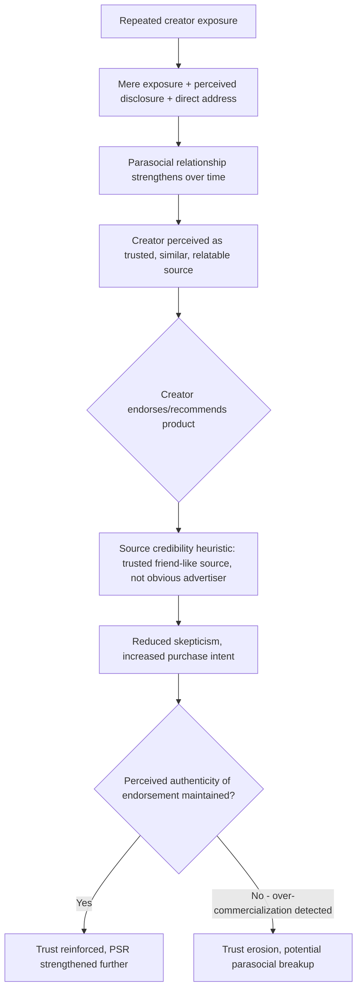

## Parasocial Relationships and Influencer Trust

### Definition and Scope

Parasocial relationships are one-sided psychological bonds in which an audience member experiences a sense of intimacy, familiarity, and friendship-like connection with a media figure or content creator who is unaware of the audience member's existence as an individual. Originally identified by Horton and Wohl (1956) in the context of television personalities, the concept has become central to influencer marketing psychology, since the perceived personal closeness a follower feels toward a creator directly mediates the trust, and therefore persuasive power, that creator holds when recommending products or brands.

### Core Psychological Mechanisms

#### Formation Mechanics of Parasocial Bonds

Parasocial relationships develop through repeated, consistent exposure that mimics the conditions of real interpersonal relationship formation, despite the fundamental one-directionality:

- **Repeated exposure and the mere exposure effect**: consistent, frequent content consumption from a specific creator increases familiarity and liking through the same mere exposure mechanism operating in general branding contexts, but personalized to an individual (perceived) personality rather than an abstract brand.
- **Perceived intimacy through disclosure**: creators who share personal details, struggles, or behind-the-scenes content trigger a psychological response similar to **self-disclosure reciprocity** in real relationships — audiences feel they are being let into a personal confidence, which accelerates perceived closeness even though the disclosure is one-directional and often strategically curated.
- **Direct-address communication style**: content formats using direct camera address, second-person language ("you"), and conversational tone simulate the interpersonal cues of face-to-face conversation, activating similar social-cognitive processing as an actual interpersonal exchange, per media psychology research on the "social realism" of direct-address formats.
- **Perceived responsiveness**: creators who reply to comments, reference audience feedback, or otherwise appear to notice and respond to their audience (even at a small individual scale relative to total audience size) generate a sense of reciprocity that strengthens the parasocial bond beyond what one-way broadcast content alone would produce.

#### Parasocial Interaction vs. Parasocial Relationship

The literature distinguishes between:

- **Parasocial interaction (PSI)**: the momentary experience of feeling a sense of connection during a specific viewing/exposure episode.
- **Parasocial relationship (PSR)**: the cumulative, enduring bond that develops over repeated parasocial interactions across time, functioning more like an ongoing relational schema than a single momentary experience.

This distinction matters for marketing application: single-exposure sponsored content can leverage momentary PSI (borrowing credibility from a positive viewing experience), but the stronger, more durable trust transfer associated with genuine influencer marketing effectiveness is generally attributed to accumulated PSR built over sustained audience relationship history rather than one-off exposure.

#### Trust Transfer Mechanism

#### Homophily and Perceived Similarity

**Homophily** — the tendency to trust and be influenced more by sources perceived as similar to oneself — is a significant amplifier of parasocial trust. Micro- and nano-influencers (smaller follower counts, often perceived as more "ordinary" and relatable) frequently generate higher perceived homophily than macro-influencers or celebrities, since audiences more readily project shared identity and circumstance onto a less obviously distant, less overtly commercialized figure. This is a primary psychological explanation for why smaller-audience influencers often achieve disproportionately high engagement and conversion rates relative to raw reach compared to celebrity endorsers, despite the smaller absolute audience size.

#### Source Credibility Dimensions Applied to Influencers

Classical source credibility theory identifies **trustworthiness** and **expertise** as the two core dimensions of persuasive source evaluation; influencer marketing adds a third dimension of particular salience in this context:

| Dimension | Description | Influencer Marketing Application |
| --- | --- | --- |
| Trustworthiness | Perceived honesty and lack of manipulative intent | Undermined by excessive or undisclosed sponsored content |
| Expertise | Perceived knowledge/competence in the relevant domain | Niche/topic-specific influencers carry higher expertise-based credibility for category-relevant endorsements |
| Attractiveness/similarity (homophily) | Perceived likability and shared identity with the audience | Drives parasocial bond strength independent of expertise |

### The Authenticity-Commercialization Tension

Sustained influencer trust depends on managing a fundamental tension: the audience's sense of a personal, non-commercial relationship (the basis of parasocial trust) is put at risk each time overtly commercial content is introduced, since sponsored content reintroduces the self-interest signal that source credibility theory identifies as a primary trust discount factor.

This produces several observable patterns:

- **Sponsorship frequency ceiling effects**: audiences appear to tolerate a certain proportion of sponsored-to-organic content before perceiving the creator as having shifted from "authentic person" to "advertising vehicle," at which point trust and engagement measurably decline. [Inference: the exact tolerance threshold varies substantially by platform, audience, niche, and disclosure practices, and has not been established as a fixed universal ratio in the research literature.]
- **Disclosure paradox**: mandatory sponsored-content disclosure (e.g., "#ad" labeling required by regulators such as the FTC) introduces an explicit self-interest signal that could theoretically reduce trust, yet research on disclosure effects suggests that transparent disclosure, particularly when paired with genuine product enthusiasm, can be processed as evidence of the creator's overall honesty (a "if they're honest about this, I can trust their other claims" inference) rather than uniformly reducing persuasion — though non-disclosure discovered after the fact produces a substantially more severe trust breach than upfront disclosure. [Inference: the net effect of disclosure on persuasion outcomes is moderated by audience expectations and creator history, and specific effect directions/magnitudes vary across studies.]
- **Perceived over-commercialization as parasocial breakup trigger**: a sufficiently strong perception that a creator has prioritized commercial interest over authentic connection can trigger a **parasocial breakup** — a documented phenomenon where audience members disengage or actively express betrayal-like reactions, drawing on emotional patterns similar to real relationship dissolution, given that the parasocial bond was psychologically processed as a genuine relationship.

### Influencer Tier Comparison

| Tier | Typical Follower Range | Parasocial Bond Strength | Perceived Homophily | Typical Marketing Use Case |
| --- | --- | --- | --- | --- |
| Nano-influencer | Under ~10K | Very high (close-knit, high responsiveness) | Very high | Niche community trust-building, high-authenticity campaigns |
| Micro-influencer | ~10K–100K | High | High | Cost-efficient engagement-focused campaigns, category expertise |
| Macro-influencer | ~100K–1M | Moderate | Moderate | Broader reach with retained relatability |
| Celebrity/mega-influencer | 1M+ | Lower per-follower depth, but high aspirational/status-based influence | Low (aspirational rather than similarity-based) | Broad awareness campaigns, brand prestige transfer |

[Inference: follower-count tier boundaries are industry conventions rather than fixed psychological thresholds, and actual parasocial bond strength depends heavily on individual creator behavior (responsiveness, disclosure style, content format) rather than follower count alone.]

### Practical Application Example

A skincare brand is deciding between a single large-scale campaign with a celebrity influencer (5M followers, high production-value content) versus a distributed campaign across twenty micro-influencers (10K–50K followers each) within the skincare/beauty niche.

**Application of parasocial trust principles**:

1. The celebrity option offers substantial reach and aspirational brand-prestige transfer (consistent with meaning-transfer mechanisms also seen in sponsorship psychology), but likely carries lower per-impression parasocial trust depth and lower topic-specific expertise credibility unless the celebrity has an established, credible connection to skincare specifically.
2. The micro-influencer distributed approach leverages higher per-audience-member parasocial bond strength and homophily, likely producing higher conversion rates per impression within each individual audience, at the cost of lower total reach and higher campaign coordination complexity (managing twenty separate relationships/content approvals rather than one).
3. A hybrid approach — using the celebrity for broad awareness/credibility halo and micro-influencers for close-to-purchase conversion-focused content — could be considered if budget allows, leveraging each tier's distinct psychological strength rather than treating "influencer marketing" as a single undifferentiated tactic.

**Execution consideration regardless of tier chosen**: any influencer selected should have a pre-existing, credible relationship to the skincare category (either genuine established interest/expertise or a natural content fit) to avoid the low-fit skepticism and reduced trust transfer associated with an incongruent sponsor-property pairing, a principle directly paralleling the congruence/fit effects discussed in event sponsorship psychology.

### Measurement Considerations

- **Engagement rate relative to follower count**: a standard proxy for parasocial bond strength and audience responsiveness, though raw engagement metrics can be inflated by inauthentic activity and should be validated against qualitative comment-sentiment analysis.
- **Sentiment analysis of comments on sponsored vs. organic content**: measuring whether sponsored content produces a detectable trust/sentiment discount relative to the same creator's organic content, which would indicate approaching the audience's sponsorship-tolerance ceiling.
- **Brand lift and purchase-intent surveys segmented by influencer tier**: isolating whether trust-transfer effects differ meaningfully by follower-count tier for a specific campaign and audience, since generalized industry patterns may not hold for every niche or brand.
- **Longitudinal engagement tracking post-campaign**: monitoring whether a creator's overall audience engagement and sentiment decline following a sponsored campaign, which would be a lagging indicator of parasocial trust erosion or perceived over-commercialization.
- **Disclosure compliance and audience reaction tracking**: monitoring both regulatory compliance (appropriate sponsored-content labeling) and audience sentiment specifically around disclosure moments, to calibrate disclosure approach to the specific audience's demonstrated tolerance and expectations.

[Behavior may vary: parasocial bond strength, sponsorship tolerance, and homophily effects differ substantially by platform, content niche, audience demographic, and individual creator behavior, and specific engagement or conversion figures should be derived from campaign-specific testing rather than assumed to generalize uniformly across all influencer marketing contexts.]

**Related Topics**

- Horton and Wohl's original parasocial interaction theory and media psychology foundations
- Source credibility theory: trustworthiness, expertise, and homophily dimensions
- FTC endorsement guidelines and sponsored content disclosure requirements
- Influencer tier strategy: nano/micro vs. macro/celebrity campaign design
- Parasocial breakup and audience trust-repair dynamics
- Platform-specific engagement psychology and format effects on parasocial bond formation
- Meaning transfer and congruence/fit effects in sponsor-creator pairing