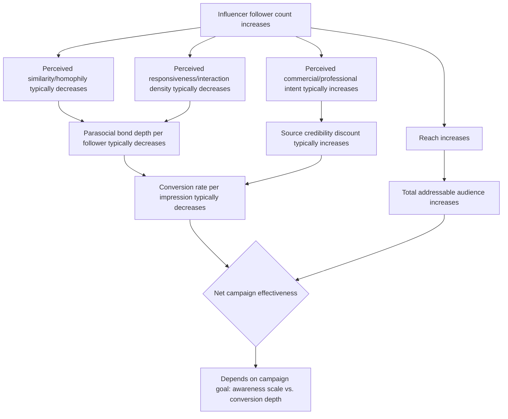

## Micro- and Nano-Influencer Effectiveness

### Definition and Scope

Micro- and nano-influencers are content creators with comparatively small but highly engaged audiences — typically classified as roughly 1,000 to 10,000 followers for nano-influencers and roughly 10,000 to 100,000 followers for micro-influencers, though exact tier boundaries vary by industry source and platform. Their marketing effectiveness is examined here as a distinct psychological phenomenon from celebrity or macro-influencer endorsement, since the mechanisms driving their disproportionate engagement and conversion performance relative to audience size differ meaningfully from the mechanisms underlying large-scale influencer or celebrity endorsement. [Note: specific follower-count tier boundaries are industry conventions rather than fixed psychological thresholds and are defined inconsistently across sources; treat the ranges above as approximate rather than precise.]

### Core Psychological Mechanisms

#### Homophily and Perceived Similarity

**Homophily** — the tendency to trust and be more readily influenced by sources perceived as similar to oneself in identity, circumstance, or lifestyle — is the central mechanism explaining micro/nano-influencer effectiveness. Smaller-audience creators are typically perceived as more "ordinary" and demographically or experientially closer to their audience than a celebrity or macro-influencer, whose scale and production value signal a categorically different (often aspirational, distant) social position. This higher perceived similarity increases the audience's willingness to project shared values and judgment onto the creator, strengthening the persuasive weight of their recommendations relative to a more distant, higher-status source.

#### Amplified Parasocial Bond Density

Because nano- and micro-influencers manage smaller absolute audiences, they are structurally able to sustain a higher rate of direct audience interaction (replying to comments, engaging with individual followers, referencing specific audience members) than a creator with a proportionally much larger audience. This higher **perceived responsiveness** accelerates and deepens parasocial relationship formation on a per-follower basis, since audience members are more likely to have had, or to plausibly imagine having, a genuine reciprocal interaction with the creator — a dynamic that is structurally difficult to replicate at celebrity scale regardless of the celebrity's genuine engagement effort.

#### Reduced Perceived Commercial Intent

Audiences generally infer a lower level of professional, commercially-driven motive from smaller creators than from creators whose scale suggests an established, revenue-optimized media operation. This lower presumed commercial intent reduces the **source credibility discount** that source credibility theory predicts for any source with a visible self-interest in the outcome of the persuasion attempt — a nano-influencer's product mention is more readily processed as a genuine, unprompted recommendation between peers than an equivalent mention from a creator whose scale and polish signal professional brand partnership as the default expectation.

#### Niche Expertise and Topic-Specific Credibility

Micro- and nano-influencers frequently build their (smaller) audience specifically around a narrow topic or niche interest, which can produce higher **topic-specific expertise credibility** than a broader-appeal macro-influencer or celebrity whose audience was built on general appeal rather than demonstrated subject-matter depth. A nano-influencer known specifically for skincare content, for example, may carry higher category-specific credibility for a skincare recommendation than a general-lifestyle celebrity with vastly larger reach but no established topical authority in that category.

### Mechanism Pathway: Scale vs. Trust Trade-off

### Comparative Effectiveness Patterns

| Metric Dimension | Nano/Micro-Influencer | Macro/Celebrity Influencer |
| --- | --- | --- |
| Absolute reach | Low to moderate | High |
| Engagement rate (relative to follower count) | Typically higher | Typically lower |
| Perceived homophily/similarity | High | Low to moderate |
| Perceived commercial intent | Lower | Higher (assumed professional partnership) |
| Cost per creator partnership | Low | High |
| Cost efficiency at scale (many creators) | Requires higher coordination effort | Single-point coordination, higher per-unit cost |
| Best-suited campaign objective | Trust-building, niche conversion, authentic advocacy | Broad awareness, brand prestige/aspirational transfer |

[Inference: the general direction of these comparative patterns is well supported across influencer marketing research and industry practice, but exact magnitudes (e.g., specific engagement rate multiples) vary substantially by platform, niche, campaign execution, and measurement methodology, and specific benchmark figures should not be treated as fixed constants applicable to every context.]

### The Engagement-Rate-vs-Reach Trade-off

A central strategic tension in influencer tier selection is that engagement rate (interactions per follower) and absolute reach (total follower count) tend to move in inverse directions as creator scale increases. This reflects an underlying trust-and-intimacy dynamic: as a creator's audience grows beyond a size where genuine individual-level interaction remains plausible, the parasocial bond depth per follower structurally dilutes, even if the creator's genuine effort at audience engagement remains constant. Marketers must therefore evaluate influencer tier selection against campaign objective rather than optimizing for either metric in isolation — a campaign prioritizing broad awareness may rationally accept lower per-impression trust in exchange for reach, while a campaign prioritizing conversion or trust-building in a specific niche may rationally accept lower reach in exchange for higher per-impression persuasive power.

### Distributed Micro-Influencer Campaign Strategy

A common strategic response to the scale-versus-trust trade-off is running distributed campaigns across many nano- or micro-influencers simultaneously rather than a single large-scale partnership, aiming to aggregate reach across many high-trust individual relationships rather than sacrificing trust depth for a single high-reach relationship. This approach introduces distinct operational and psychological considerations:

- **Aggregate reach vs. coordination complexity**: achieving comparable total reach to a single macro-influencer partnership typically requires managing dozens or hundreds of individual creator relationships, increasing coordination, quality-control, and brand-consistency management burden substantially relative to a single-partner campaign.
- **Message consistency risk**: distributing campaign messaging across many independent creators, each with their own voice and content style, introduces the risk of the positioning/claim-consistency failures discussed in message consistency frameworks — requiring clear briefing and governance to maintain core message alignment while preserving the authentic, individually-voiced content style that is itself part of the effectiveness mechanism.
- **Diversified risk exposure**: distributing partnership risk across many smaller creators reduces the brand's exposure to any single creator's reputational risk (a scandal or controversy involving one nano-influencer among fifty has proportionally less brand-wide impact than an equivalent event involving a single macro-influencer carrying the entire campaign), paralleling portfolio diversification logic also seen in sponsorship risk management.

### Practical Application Example

A specialty coffee equipment brand with a limited marketing budget is evaluating whether to allocate its entire influencer budget to one mid-tier lifestyle influencer (200K followers, broad general audience) or distribute the same budget across approximately fifteen nano-influencers within specific coffee-enthusiast, home-brewing, and specialty-food niches (2,000–8,000 followers each).

**Application of micro/nano-influencer effectiveness principles**:

1. The specialty, considered-purchase nature of the product category (home coffee equipment, a niche, higher-involvement purchase) aligns more naturally with the topic-specific expertise credibility and higher homophily available through niche nano-influencers than with a broad-appeal lifestyle influencer whose audience was not specifically self-selected around this interest area.
2. The lower perceived commercial intent typical of nano-influencer content is particularly valuable for a specialty/enthusiast product category, where audiences are likely to apply higher scrutiny to obviously sponsored, non-specialist endorsements (a dynamic paralleling community-platform skepticism of overt commercial content).
3. The distributed approach requires more coordination investment (fifteen separate briefs, content approvals, and relationship management processes rather than one), which should be weighed against the brand's operational capacity to manage that complexity, not treated as a purely strategic decision independent of execution resourcing.

### Measurement Considerations

- **Engagement rate normalized by follower count**: essential for fair comparison across influencer tiers, since raw engagement counts will structurally favor larger accounts regardless of true relative persuasive effectiveness.
- **Cost per engagement / cost per conversion by tier**: direct efficiency comparison metric that often favors nano/micro tiers on a per-unit basis, though total campaign reach and total conversions may still favor macro/celebrity partnerships for broad-awareness objectives.
- **Sentiment and authenticity perception in comments**: qualitative analysis of audience comment sentiment can reveal whether content is being received as genuine (supporting the homophily/low-commercial-intent hypothesis) or as recognizably sponsored/inauthentic, which would undermine the core mechanism this strategy depends on.
- **Attribution tracking across distributed campaigns**: unique discount codes or tracking links per creator are commonly used to isolate individual creator contribution within a distributed multi-creator campaign, since aggregate campaign-level metrics alone cannot reveal which specific creator relationships are driving disproportionate value.
- **Longitudinal brand sentiment tracking in the specific niche community**: monitoring whether sustained nano/micro-influencer activity within a niche builds cumulative community-level trust and brand association over time, beyond the isolated performance of any single campaign.

[Behavior may vary: the magnitude of the engagement-rate advantage typically attributed to micro/nano-influencers, and the specific follower-count thresholds at which these effects change, differ substantially across platforms, product categories, and measurement methodologies, and figures cited in industry benchmarking reports should be treated as directional reference points rather than precise, universally applicable constants.]

**Related Topics**

- Homophily and similarity-based persuasion in source credibility theory
- Parasocial relationship formation and audience interaction density
- Distributed multi-creator campaign management and message consistency risk
- Cost-per-engagement benchmarking across influencer tiers
- Niche community trust and topic-specific expertise credibility
- Sponsorship risk diversification and reputational exposure management
- Unique tracking codes and attribution methodology in influencer campaigns