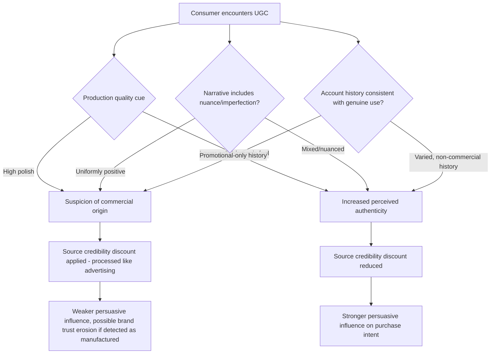

## User-Generated Content and Authenticity Signals

### Definition and Scope

User-generated content (UGC) refers to brand-relevant material — reviews, photos, videos, testimonials, unboxing content, social posts — created by ordinary consumers rather than by the brand itself or by compensated professional creators. Authenticity signals are the cues consumers use to judge whether content reflects genuine, unprompted experience rather than manufactured or incentivized promotion. Together, these constitute a distinct persuasion mechanism within social media and influencer marketing psychology, operating on source-independence logic that differs from both traditional brand advertising and compensated influencer endorsement.

### Core Psychological Mechanisms

#### Source Credibility Through Presumed Independence

UGC's primary psychological advantage is rooted in **source credibility theory**: content attributed to an ordinary consumer, with no apparent commercial relationship to the brand, carries a lower presumed self-interest than either brand-generated content or paid influencer content. Since self-interest is a well-established discount factor in persuasion processing (a source with an obvious stake in the outcome is trusted less than a disinterested one), UGC benefits from an inherent credibility advantage simply by virtue of its presumed origin, independent of the actual content quality or persuasive sophistication of the material itself.

#### Diagnosticity and the Halo of Ordinariness

Consumers use a range of stylistic and contextual cues to judge whether content is genuinely user-generated or covertly branded/staged, a process describable as inferring **diagnosticity** — how informative a given cue is about the true underlying nature (genuine vs. manufactured) of the content. Commonly weighted cues include:

- **Production quality**: lower polish (imperfect lighting, unedited footage, casual framing) is frequently interpreted as evidence of authenticity, since professional-grade production is associated with commercial intent, while a rougher aesthetic signals the content was not created with promotional resources or intent.
- **Narrative structure**: organic, tangential, or imperfect storytelling (including mention of product flaws or mixed experiences) is processed as more credible than uniformly positive, tightly structured narratives that resemble advertising copy structure, since real experiences are rarely uniformly positive and audiences apply an implicit expectation of some negativity or nuance in genuine accounts.
- **Contextual embedding**: content that appears within a plausible personal context (a product shown incidentally within a broader personal post, rather than isolated and centrally featured) is generally perceived as more organically motivated than content structured explicitly around product promotion.
- **Account history and behavior consistency**: an account with an established history of varied, non-commercial content is generally perceived as more credible when it does post brand-relevant content than an account that appears to exist primarily to generate promotional posts.

#### The Imperfection Effect and Negativity as a Credibility Signal

Counterintuitively, the inclusion of mild negative information or acknowledged product limitations within otherwise positive UGC or reviews can increase overall persuasiveness rather than decrease it — a pattern related to the **imperfection effect** in credibility research. A review or piece of content that is uniformly, uncritically positive is more likely to trigger suspicion of incentivization or fabrication (violating the audience's implicit expectation that genuine experiences include some nuance), whereas content acknowledging minor drawbacks alongside genuine praise is processed as more diagnostic of authentic, unbiased experience, thereby strengthening the credibility — and downstream persuasive weight — of the positive claims it does make.

#### Social Proof Aggregation from Distributed Sources

UGC aggregated at scale (large volumes of independent reviews, widespread organic social mentions, high-volume hashtag participation) functions as a distributed **social proof** signal distinct from any single piece of content's individual persuasive power. The perceived validity of this aggregate signal depends on the presumed independence of the individual contributors — if the volume is suspected to be artificially inflated (fake reviews, incentivized mass posting, bot activity), the aggregate signal's credibility collapses in the same way that a single detected inauthentic review can trigger broader skepticism toward an entire review corpus.

### Authenticity Assessment Pathway

### Categories of UGC and Their Relative Authenticity Weight

| UGC Type | Typical Authenticity Perception | Primary Mechanism |
| --- | --- | --- |
| Unprompted organic social posts | Highest | No detectable brand solicitation; strongest presumed independence |
| Verified purchase reviews | High | Verification reduces fake-review suspicion specifically |
| Solicited but uncompensated UGC (e.g., contest entries, hashtag campaigns) | Moderate to high | Some brand involvement, but no direct payment; audience awareness varies |
| Incentivized UGC (discount/product in exchange for content) | Moderate | Reduced independence; disclosure expectations apply |
| Brand-commissioned UGC-style content (professional creators mimicking UGC aesthetic) | Variable, risk of backlash if detected | Deliberately borrows UGC's credibility cues without genuine independence; discovery can trigger significant trust damage |

### The UGC-Style Content Risk: Manufactured Authenticity

A significant contemporary tension in this domain is the practice of brands or paid creators deliberately producing content styled to resemble organic UGC (intentionally lower production value, casual framing, testimonial structure) without genuine independent origin. This exploits the diagnosticity cues audiences use to infer authenticity, but carries asymmetric risk: if audiences discover that content styled as "authentic" was in fact brand-commissioned or undisclosed paid content, the resulting trust violation tends to be more severe than an equivalent violation involving content that never claimed organic authenticity in the first place, since the deception operates on two levels — the underlying commercial claim and the deliberate manipulation of the specific cues the audience uses to judge trustworthiness. This dynamic underlies regulatory disclosure requirements (such as FTC endorsement guidance) requiring clear identification of material connections between creators and brands, regardless of content styling.

### Practical Application Example

A direct-to-consumer cookware brand wants to build a UGC-driven marketing asset library but has only a small volume of organic customer-submitted content available.

**Diagnosis under the authenticity signal framework**: Simply commissioning professional creators to produce UGC-styled content (intentionally lower-polish videos mimicking organic customer content) risks the manufactured-authenticity backlash described above if the paid/commissioned nature is not clearly disclosed, and even with disclosure, deliberately imitating organic-content aesthetics can appear manipulative if discovered, given current audience sophistication in recognizing branded content patterns.

**Corrective actions aligned to mechanism**:

1. Actively solicit genuine customer content through low-friction mechanisms (post-purchase content requests, hashtag campaigns, review-with-photo incentives) rather than defaulting to manufactured UGC-style content, since genuinely sourced content retains the full source-independence credibility advantage.
2. Where incentivization is used to encourage genuine customers to create content (e.g., a discount for submitting a photo review), maintain clear, consistent disclosure practices and avoid incentive structures that could be perceived as buying specific positive sentiment rather than simply encouraging participation.
3. If professional content creation is used to supplement genuine UGC volume, maintain clear differentiation in framing (positioned as brand content, not disguised as organic customer content) rather than deliberately mimicking UGC's lower-polish aesthetic as a trust-borrowing tactic, since the discovery risk of the latter approach carries disproportionate downside relative to the credibility gained.
4. Actively surface and amplify existing imperfect, nuanced organic reviews (rather than filtering only for the most uniformly positive content) given that acknowledged minor drawbacks alongside genuine praise can strengthen rather than weaken the persuasive credibility of the overall review corpus.

### Measurement Considerations

- **UGC volume and velocity tracking**: monitoring organic content volume and growth rate as an indicator of genuine audience advocacy, distinguished from campaign-driven spikes that may reflect incentivized rather than purely organic participation.
- **Sentiment and nuance analysis**: assessing whether aggregated UGC/reviews display a plausible distribution of sentiment (including some negative or mixed content) versus a suspiciously uniform positive skew that could indicate curation, incentivization, or fabrication.
- **Authenticity perception surveys**: direct audience research asking whether specific content is perceived as genuine versus brand-influenced, useful for pre-testing UGC-style campaign content before wide deployment.
- **Disclosure compliance auditing**: systematic review of incentivized/commissioned content for appropriate and consistent disclosure, both for regulatory compliance and to preempt the more severe trust damage associated with discovered non-disclosure.
- **Conversion lift attributable to UGC display**: A/B testing product pages or campaigns with and without UGC integration (customer photos, review content) to isolate the incremental persuasive contribution of authenticity-signaling content specifically.

[Behavior may vary: the specific cues audiences weight most heavily when judging content authenticity, and the precise threshold at which incentivization or production quality triggers skepticism, differ by platform, product category, audience demographic, and cultural context, and should be validated through audience-specific research rather than assumed to apply uniformly across all UGC contexts.]

**Related Topics**

- Source credibility theory and self-interest discounting in persuasion
- FTC endorsement guidelines and material-connection disclosure requirements
- Fake review detection and aggregate social proof credibility
- Imperfection effect and negativity bias in review and testimonial processing
- Hashtag campaigns and low-friction UGC solicitation design
- Parasocial and homophily effects in perceived content authenticity
- Manufactured authenticity backlash and brand trust repair strategies