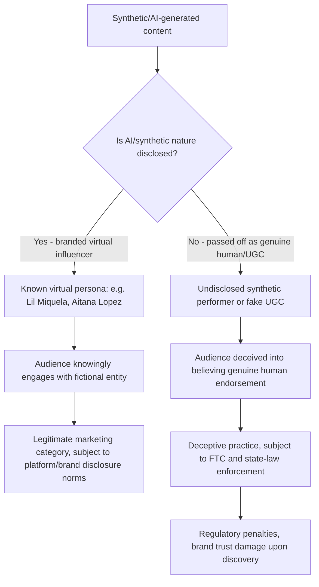

## Virtual and Synthetic Influencers

### Definition and Scope

Virtual influencers are computer-generated digital personas or characters — created using CGI, generative AI, or a combination of both — designed to interact with audiences on social media platforms in a manner functionally similar to human influencers, despite being entirely fictional or semi-fictional entities. Synthetic influencer content more broadly includes AI-generated human-like performers used to simulate genuine human endorsement or user-generated content without disclosed AI origin. This is a rapidly evolving area at the intersection of influencer marketing psychology, source credibility theory, and emerging AI-disclosure regulation, distinguished from earlier social media psychology topics by the introduction of a fundamentally novel question: how do trust, parasocial bonding, and authenticity signals function when the source is known, suspected, or discovered to not be human at all.

### Core Psychological Mechanisms

#### The Uncanny Valley and Human-Likeness Calibration

Research specifically on virtual influencer design has found that realistic virtual influencers can trigger psychological discomfort consistent with uncanny valley effects, while stylized or imperfect designs reduce unease and generate more consistent audience responses. This has direct design implications: virtual influencer creators face a calibration trade-off between higher realism (which can increase parasocial engagement potential but risks crossing into discomfort-inducing uncanny territory) and stylized/cartoonish design (which sacrifices some realism-driven engagement but avoids the uncanny valley risk entirely). [Note: this specific finding is drawn from a 2026 conference pre-study; as an emerging and non-peer-reviewed research area, findings should be treated as provisional rather than fully established consensus.]

#### Parasocial Bonding with Non-Human Sources

Despite audiences generally knowing (or being able to discover) that a virtual influencer is not a real person, documented parasocial engagement with virtual influencers still occurs, suggesting that at least some of the mechanisms underlying parasocial relationship formation (repeated exposure, direct-address content, consistent "personality" and narrative continuity) can operate even when the audience holds explicit knowledge of the source's fictional status. This raises an open psychological question distinct from human-influencer parasocial theory: whether virtual influencer parasocial bonds function primarily as a form of engaged fictional-character attachment (similar to attachment to a fictional media character) rather than the human-mimicking relational schema underlying traditional parasocial theory. [Inference: the precise psychological mechanism distinguishing virtual-influencer parasocial engagement from both human-influencer parasocial bonds and general fictional-character attachment is an active area of research without firm consensus.]

#### Advertising-Product Fit as the Dominant Effectiveness Driver

Research specifically examining AI identity disclosure in virtual influencer endorsements has found that advertising-product fit — the perceived congruence between the endorsed product and the influencer's established persona/content niche — is a stronger driver of endorsement effectiveness than whether AI identity disclosure is present, with findings suggesting that firms should prioritize advertising-product fit rather than treating AI identity disclosure as inherently disruptive to user engagement. This suggests that the congruence/fit mechanisms established in human-influencer and sponsorship psychology (discussed elsewhere in this domain) may transfer to virtual influencer contexts even when the non-human nature of the endorser is disclosed. [Note: this is a single study finding from an emerging research area and should not be treated as fully generalized or settled.]

#### The Trust Gap and Human Trust Persistence

Despite the technical sophistication of AI-generated personas, industry commentary suggests that peer-to-peer human testimonial and recommendation remains the most valuable promotion tool, with AI's primary marketing contribution framed as personalization at scale and content iteration speed rather than as a wholesale replacement for human-sourced trust. This suggests virtual/synthetic influencers may currently occupy a complementary rather than substitutive role relative to genuine human endorsement and UGC-based authenticity signals discussed elsewhere in this domain.

### Disclosed vs. Undisclosed Synthetic Content: A Critical Distinction

This topic area requires a sharp conceptual separation between two distinct practices with very different ethical, legal, and psychological profiles:

**Disclosed virtual influencers** (e.g., Lil Miquela, Lu do Magalu, Aitana López) operate as openly acknowledged fictional personas with established brand partnership histories — Lil Miquela has secured more than $10 million in brand deals with luxury brands such as Prada and BMW, while Lu do Magalu leads with more than 7 million Instagram followers and more than $2.5 million in 2026 earnings from retail partnerships. This represents a legitimate, disclosed category of digital marketing entity.

**Undisclosed synthetic performers**, by contrast, involve AI-generated content deliberately positioned as genuine human experience — reporting has documented AI content described as "user-generated" product promotions, such as AI influencers applying sunscreen or starring in unboxing videos, where it is not disclosed that the models are AI-generated. This is the deceptive practice category driving the regulatory response detailed below.

### Regulatory and Disclosure Landscape (2026)

This is a fast-moving legal area with several concurrent developments as of 2026:

- **New York's AI Transparency in Advertising Act**: signed December 11, 2025, took effect June 9, 2026, requiring conspicuous disclosure when an advertisement features a "synthetic performer" — defined as a digitally created, reproduced, or modified asset that gives the impression of a human performer but is not recognizable as a real identifiable person. The law requires disclosure to be placed directly in the visual or video creative rather than buried in a footer or terms page, with penalties starting at $1,000 for a first violation and $5,000 for each subsequent violation.
- **FTC enforcement**: the FTC's "Operation AI Comply" initiative has resulted in more than 12 enforcement actions since launch, with the FTC explicitly naming synthetic influencer content as a priority target for 2026; the maximum FTC civil penalty is $53,088 per violation for 2026, with each non-compliant post counted as a separate violation rather than a single campaign-wide fine.
- **EU AI Act**: transparency requirement provisions affecting businesses trading to EU consumers were set to take effect from August 2026.
- **UK regulatory position**: the UK's Advertising Standards Authority (ASA) has stated that under current rules, content must not be misleading and must be socially responsible, though the UK has not enacted synthetic-performer-specific legislation comparable to New York's law as of these reports.

[Note: this regulatory area is evolving rapidly and varies significantly by jurisdiction; specific penalty amounts, effective dates, and enforcement scope should be verified against current legal sources before being relied upon for compliance purposes, since this domain is subject to frequent legislative and enforcement change.]

### Documented Consumer Detection Difficulty

Empirical findings suggest substantial audience vulnerability to undisclosed synthetic content: an investigation by consumer magazine Which? found that 70 percent of people were unable to correctly identify what was and was not real when shown authentic and AI-generated videos side by side. This detection difficulty is central to why regulators have prioritized mandatory disclosure over relying on audience skepticism or media literacy alone as a protective mechanism.

### Market Scale and Growth

Industry sources indicate substantial and growing commercial adoption: virtual influencers reportedly deliver approximately 70 percent lower creator costs than human influencers according to one industry content-studio source, contributing to an estimated $15 billion in 2025 brand deals; the total number of verified AI-generated influencers across Instagram, TikTok, and YouTube reportedly surged by more than 40 percent in 2025 and was estimated to account for roughly 15 percent of all influencer marketing spending by the end of 2026 according to one media forecasting source; and the virtual influencer market overall was projected to reach the $1 billion threshold in 2026. [Unverified: these figures originate primarily from industry/vendor sources (AI content studios, media forecasting firms) rather than independently audited data, and should be treated as industry-reported estimates rather than confirmed figures.]

### Audience Attitudes Toward Virtual Influencers

Survey research on audience awareness and attitudes indicates a mixed but non-trivial engagement pattern: one survey found 79% of respondents had some degree of familiarity with virtual influencers, and 53% of respondents reported following at least one virtual influencer, with primary motivations including curiosity about the technology and creativity (49%) and entertainment value through storytelling, humor, or drama (36%). The same research found only 36% of respondents believed AI and virtual influencers should disclose their non-human nature in their social media profiles and bios, suggesting a substantial portion of the audience for openly-branded virtual influencers is engaging with informed awareness of the persona's fictional status rather than being deceived. [Note: this survey data is dated to a 2024 study cited in more recent reporting; attitudes in this fast-evolving space may have shifted since, and current sentiment should be reverified if precision matters for a specific application.]

### Comparison: Human, Disclosed Virtual, and Undisclosed Synthetic Influencers

| Dimension | Human Influencer | Disclosed Virtual Influencer | Undisclosed Synthetic Performer |
| --- | --- | --- | --- |
| Source credibility basis | Perceived personal genuine experience | Acknowledged fictional persona, brand/creative appeal | False presumption of genuine human experience |
| Parasocial bond type | Human-relational schema | Fictional-character-style engagement (emerging research area) | Exploits human-relational schema under false pretense |
| Legal/regulatory status | Standard endorsement disclosure rules apply | Generally legitimate with appropriate branding | Increasingly targeted by state law and FTC enforcement |
| Cost structure | Higher, scales with reach/tier | Substantially lower per reports (~70% cost reduction cited) | Variable; primary risk is legal/reputational, not cost |
| Discovery risk if deceptive practice used | Standard reputational risk if undisclosed sponsorship found | Low risk if properly disclosed as fictional from outset | High risk: legal penalties plus severe trust damage on discovery |

### Practical Application Example

A beauty brand is considering using an AI-generated persona to create "unboxing" and product-demo content styled to appear as genuine customer-generated content, without labeling the persona as AI-generated, based on the cost efficiency and content-iteration speed advantages reported for synthetic content production.

**Diagnosis under the regulatory and psychological framework above**: This approach falls squarely into the undisclosed synthetic performer category rather than the legitimate disclosed virtual influencer category, and directly mirrors the deceptive practice pattern documented in recent investigative reporting and now explicitly targeted by both New York's AI Transparency in Advertising Act (if the brand advertises to New York consumers) and the FTC's Operation AI Comply enforcement priority for 2026, carrying compounding per-post penalty exposure under current FTC guidance.

**Corrective actions aligned to mechanism**:

1. If a synthetic/AI-generated persona is used, disclose its AI-generated nature conspicuously within the content itself (not in a footer or bio-only disclosure), consistent with New York's requirement that disclosure appear "in the content, where the audience sees it."
2. Consider whether the goal is better served by an openly-branded virtual influencer persona (following the legitimate model of entities like Lil Miquela or Lu do Magalu) rather than content designed to be mistaken for genuine human UGC, since research suggests advertising-product fit — not disclosure avoidance — is the stronger driver of endorsement effectiveness, meaning disclosure need not sacrifice the marketing benefit being sought.
3. Build a disclosure checkpoint directly into campaign production workflows, given industry guidance recommending an explicit "AI-generated performer used?" field in creative briefs, mandatory creator/agency confirmation, and separated performance benchmarking between real-creator and AI-generated content, to avoid inadvertent non-compliance across a distributed content pipeline.

### Measurement Considerations

- **Disclosure compliance auditing**: systematic review of all synthetic/AI-generated content against applicable jurisdictional disclosure requirements (New York's synthetic performer law, FTC guidance, EU AI Act provisions), given the compounding per-post penalty structure recently established.
- **Audience trust/sentiment tracking specific to synthetic content**: given documented low spontaneous detection ability (the 70% misidentification rate cited above), brands cannot rely on audience skepticism alone and should track sentiment specifically following any disclosure or discovery event.
- **Advertising-product fit assessment**: applying the same congruence/fit evaluation used in human influencer and sponsorship contexts, given emerging research suggesting this remains the dominant effectiveness driver even under disclosure.
- **Cost-per-engagement comparison against human influencer benchmarks**: given the substantial reported cost differential, isolating whether engagement quality (not just volume/cost efficiency) holds up against human-influencer benchmarks for the specific brand and audience.
- **Separated performance tracking for AI-generated vs. human-generated content**: as recommended in current industry compliance guidance, to avoid conflating fundamentally different content categories in effectiveness reporting.

[Behavior may vary: this is an unusually fast-moving area combining emerging academic research, evolving platform norms, and active multi-jurisdictional regulatory development as of 2026; specific legal requirements, penalty structures, market-size figures, and research findings cited above should be reverified against current sources before being relied upon for compliance or strategic decisions, given the pace of change documented even within this single year.]

**Related Topics**

- Uncanny valley theory and human-likeness calibration in synthetic media design
- FTC endorsement guidelines and state-level AI disclosure legislation (New York AI Transparency in Advertising Act, EU AI Act)
- Advertising-product fit and congruence effects in endorsement psychology
- Parasocial relationship theory applied to fictional and non-human personas
- User-generated content authenticity signals and manufactured-authenticity backlash risk
- AI content detection and consumer media literacy research
- Creator economy cost structures and human vs. synthetic influencer ROI comparison