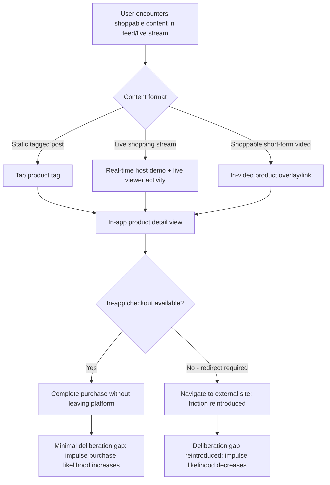

## Social Commerce and Shoppable Content

### Definition and Scope

Social commerce refers to the integration of purchasable transactions directly within social media platforms, collapsing the traditional gap between content discovery and purchase completion. Shoppable content encompasses the specific formats — tagged product posts, live shopping streams, in-app checkout flows, shoppable video — that enable this direct transaction path. From a marketing psychology perspective, this domain concerns how reducing the physical and temporal distance between inspiration and purchase alters impulse behavior, social proof processing, and the boundary between entertainment and commercial intent.

### Core Psychological Mechanisms

#### Friction Reduction and Impulse Purchase Facilitation

The defining psychological feature of social commerce is the near-elimination of the temporal and effort gap between product discovery (seeing content) and purchase initiation (tapping to buy), compared to traditional e-commerce where discovery on social media typically required navigating away to a separate retailer website. This directly amplifies **impulse purchase behavior**: consumer behavior research consistently shows that purchase likelihood decreases as the effort and time required between desire formation and purchase completion increases, since delay allows for deliberative, more resistant-to-impulse cognitive processing to intervene (a dynamic related to the broader psychological principle that immediate gratification opportunities bypass the more effortful, reflective evaluation associated with delayed or effortful purchase paths). In-platform checkout removes several of the specific friction points (site navigation, account creation, re-entering payment details) identified as cart abandonment drivers elsewhere in this domain, compounding the impulse-facilitation effect.

#### Social Proof Embedded at the Point of Purchase

Unlike traditional e-commerce, where social proof (reviews, ratings) is typically encountered on a separate product page, social commerce embeds social proof directly within the same content stream as the purchase trigger — visible like counts, comment activity, and creator/influencer endorsement co-occur with the shoppable trigger itself. This tight coupling means the social proof and purchase-decision moment are processed nearly simultaneously rather than sequentially, potentially strengthening social proof's persuasive influence by reducing the temporal gap in which competing considerations (price comparison, alternative research) could otherwise intervene.

#### Live Shopping and Real-Time Scarcity/Urgency

Live shopping streams (real-time video commerce combining a host, product demonstration, and immediate purchase capability) leverage several compounding mechanisms simultaneously:

- **Real-time parasocial engagement**: live format accelerates parasocial intimacy relative to pre-recorded content, since real-time interaction is processed as more authentic and personally responsive.
- **Synchronous social proof**: viewers can see other viewers purchasing or reacting in real time, creating a live-updating social proof signal distinct from the static, asynchronous review counts of traditional e-commerce.
- **Genuine time scarcity**: live-only availability windows or limited-quantity live offers introduce authentic (not merely simulated) time scarcity, since the live format itself imposes a real temporal boundary on the offer, differing from static "limited time" claims that can be perceived as manufactured urgency.

#### Entertainment-Commerce Blending and Reduced Commercial-Intent Salience

Shoppable content frequently embeds purchase functionality within primarily entertainment-oriented content (a creator's styling video, a cooking demonstration, a comedic skit featuring a product), which can reduce the audience's conscious salience of commercial intent relative to overtly advertisement-framed content. This lower salience of persuasive intent is relevant to **persuasion knowledge theory**, which holds that when audiences recognize they are the target of a persuasion attempt, they engage more critical/resistant processing; content that is primarily processed as entertainment, with shopping functionality present but not foregrounded, may reduce the activation of this resistance mechanism relative to clearly commercial formats. [Inference: the degree to which this entertainment-framing effect measurably reduces persuasion resistance in social commerce specifically, versus general native-advertising contexts, has not been extensively isolated in dedicated social-commerce research as distinct from broader native advertising literature.]

### Social Commerce Purchase Pathway

### Shoppable Content Format Comparison

| Format | Mechanism Emphasis | Psychological Driver |
| --- | --- | --- |
| Tagged/shoppable static posts | Passive discovery, low-friction tap-to-shop | Impulse facilitation via minimal path-to-purchase |
| Shoppable short-form video | Algorithmic discovery + embedded product link | Novelty-driven engagement combined with immediate purchase capability |
| Live shopping streams | Real-time host interaction, live social proof, genuine scarcity | Parasocial engagement, synchronous social proof, authentic urgency |
| In-app storefronts/shops | Curated brand-owned space within platform | Brand-controlled environment with reduced platform-algorithm dependency |
| Affiliate/creator shopping links | Creator endorsement tied directly to purchase action | Source credibility/parasocial trust transferred directly into transaction |
| AR try-on/virtual fitting shoppable content | Reduced functional-fit uncertainty before purchase | Addresses a key purchase-risk barrier specific to visual/wearable categories |

### The Compression of the Consumer Decision Journey

Social commerce structurally compresses several stages of the broader online consumer decision journey discussed elsewhere in this domain (need recognition, consideration set formation, active evaluation) into a single, often momentary interaction:

- **Need recognition and consideration set formation become nearly simultaneous**: algorithmically surfaced content often introduces both the need/desire and the specific product option at once, rather than a consumer independently recognizing a need and then searching for options.
- **Active evaluation is often minimal or skipped entirely**: the low-friction, immediate-purchase design of social commerce interfaces is structurally optimized to convert before extended deliberation occurs, which is effective for impulse-suited categories but carries elevated post-purchase dissonance and return-rate risk for higher-involvement or higher-consideration categories where consumers would typically expect more extensive evaluation.

This compression represents both the core commercial advantage of social commerce (conversion efficiency) and its central risk (reduced deliberation increasing buyer's remorse and return rates for purchases made with insufficient evaluation).

### Trust and Risk Considerations Specific to Social Commerce

- **Reduced pre-purchase information relative to traditional e-commerce**: in-feed shoppable content typically provides less detailed product information (specifications, extensive reviews, size guides) than a dedicated product page, meaning consumers may complete purchases with less functional-risk-reducing information than in traditional online shopping, elevating the importance of clear, accessible supplementary information within the abbreviated shoppable format.
- **Platform-mediated trust versus brand-direct trust**: purchases completed within a social platform's native checkout involve an additional layer of platform-level trust (payment security, dispute resolution, platform policy) distinct from the brand's own trust signals, meaning overall purchase confidence depends on both brand and platform credibility simultaneously.
- **Live shopping authenticity scrutiny**: live shopping hosts (whether brand employees or affiliated creators) are subject to the same source-credibility and disclosure considerations as influencer endorsement generally, with the added real-time performative pressure of a live format potentially amplifying either perceived enthusiasm-driven authenticity or, conversely, perceived high-pressure sales tactics depending on execution.

### Practical Application Example

A fashion brand launches a shoppable live stream event featuring a partnered creator demonstrating a new clothing line, with in-app checkout enabled, but observes a high post-purchase return rate for items bought during the live event compared to the brand's standard online store return rate.

**Diagnosis under the social commerce framework**: The elevated return rate is consistent with the decision-journey compression risk described above — the live shopping format's low-friction, high-immediacy purchase path likely encouraged purchases with less deliberation (size/fit consideration, careful review of product details) than the brand's standard product pages would typically prompt, particularly relevant for a fit-sensitive category like clothing where functional-risk uncertainty (does it fit correctly) is a primary driver of return behavior when insufficiently addressed pre-purchase.

**Corrective actions aligned to mechanism**:

1. Integrate AR virtual try-on or detailed sizing-guide overlays directly within the live shopping interface, addressing the functional-fit uncertainty that abbreviated shoppable formats typically under-address relative to traditional product pages.
2. Have the live host explicitly and repeatedly reference sizing/fit guidance during the stream, compensating conversationally for information that static shoppable formats would otherwise omit, leveraging the live format's real-time interactive capacity as a mitigation rather than only an urgency-amplification tool.
3. Evaluate whether a brief post-purchase, pre-shipment confirmation step (without fully reintroducing checkout friction) could reduce impulse-driven fit-related returns, balancing conversion-rate impact against return-cost reduction, ideally validated through controlled testing rather than assumption.

### Measurement Considerations

- **Conversion rate by shoppable format**: comparing purchase completion rates across static tagged posts, shoppable video, and live shopping to identify which formats and content types drive the strongest platform-specific conversion for a given brand and audience.
- **Time-to-purchase from content exposure**: measuring the interval between initial content view and purchase completion, useful for quantifying the degree of impulse-purchase compression occurring and identifying whether it correlates with subsequent return or satisfaction outcomes.
- **Return and dissonance-related metrics segmented by acquisition channel**: comparing return rates, customer service contact rates, and satisfaction scores for social-commerce-acquired purchases against traditional e-commerce channel purchases, to detect whether the decision-journey compression risk is materializing in practice for a specific brand/category.
- **Live shopping engagement-to-conversion metrics**: tracking concurrent viewer counts, real-time engagement (comments, reactions), and conversion timing during live events to assess whether synchronous social proof and urgency mechanisms are functioning as intended.
- **Platform-attributed versus brand-site-attributed sales tracking**: given that social commerce purchases often occur entirely within the platform's ecosystem, ensuring analytics infrastructure captures these transactions distinctly from traditional website-referred sales to avoid attribution gaps similar to those discussed in agentic commerce contexts.

[Behavior may vary: the relative strength of impulse-facilitation, social proof amplification, and decision-compression effects differs substantially by product category (particularly between low-involvement/low-risk and high-involvement/high-fit-risk categories), platform, and audience demographic, and specific conversion, return, and engagement figures should be derived from platform- and brand-specific testing rather than assumed to generalize uniformly across all social commerce contexts.]

**Related Topics**

- Impulse purchase psychology and friction-reduction checkout design
- Live shopping and real-time parasocial engagement mechanics
- Persuasion knowledge theory and native advertising resistance
- Cart abandonment and checkout friction principles applied to in-platform commerce
- Augmented reality try-on and functional-risk reduction in visual product categories
- Platform-mediated trust and payment security perception
- Creator affiliate links and source-credibility transfer into direct transactions