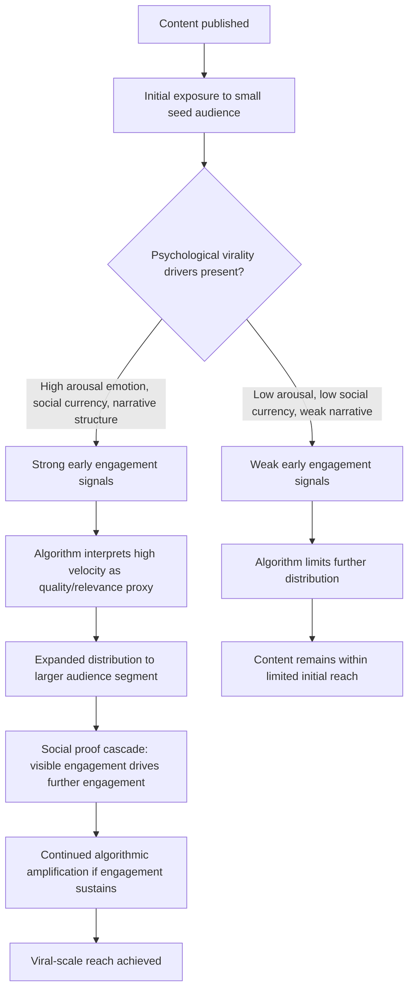

## Virality, Algorithmic Curation, and Platform Mechanics

### Definition and Scope

This topic examines the interaction between the psychological factors that make content shareable ("virality") and the technical/algorithmic systems that platforms use to determine which content receives distribution. Virality is not purely a content-quality phenomenon but an emergent outcome of psychological sharing motivations interacting with platform-specific ranking mechanics — meaning the same content can succeed or fail to spread depending on how well it aligns with both human sharing psychology and the particular algorithm's optimization targets at a given time.

### Core Psychological Mechanisms of Virality

#### Emotional Arousal and Sharing Behavior

Research on viral content (notably Berger and Milkman's work on emotional arousal and social transmission) has established that content evoking **high-arousal emotions** — whether positive (awe, amusement, excitement) or negative (anger, anxiety) — is shared substantially more than content evoking low-arousal emotions (sadness, contentment), even when valence (positive vs. negative) differs. This is explained by arousal's role in prompting action: high-arousal emotional states are physiologically activating and behavior-motivating, making the sharing action itself more likely to occur as an outlet for that arousal, whereas low-arousal states (even negative ones like sadness) are associated with passivity rather than active behavioral response.

#### Social Currency and Self-Presentation Motives

People share content partly to construct and manage their public image — a concept termed **social currency** in virality research. Sharing content that makes the sharer appear knowledgeable, funny, generous (providing useful information to their network), or aligned with a desirable identity functions as a form of impression management, consistent with broader self-presentation theory. Content that provides high social currency value to a potential sharer (making them look good by association with the share) is more likely to be shared than content offering no such self-presentational benefit, independent of the content's inherent quality or emotional impact.

#### Practical Value and Utility Sharing

A significant portion of sharing behavior is motivated by genuine helpfulness — sharing content because the sharer believes it will provide practical value to specific people in their network (a useful tip, a relevant deal, actionable information). This reflects a more altruistic/reciprocity-based sharing motivation distinct from the self-presentational social currency mechanism, though the two frequently co-occur (sharing something useful also often confers social currency simultaneously).

#### Narrative Transportation and Story Structure

Content structured as a compelling narrative — with tension, characters, and resolution — can induce **narrative transportation**, a state of cognitive and emotional absorption in a story that has been associated with increased persuasion and memorability in media psychology research, and by extension with increased motivation to share the experience with others. This favors content with clear storytelling structure over purely informational or static-fact content, even when conveying similar underlying information.

#### Social Proof Cascades and Network Effects

Virality is not solely a function of individual content characteristics but an emergent network phenomenon: once content begins accumulating visible engagement (likes, shares, comments), this visible momentum itself functions as a **social proof cascade** — subsequent viewers are more likely to engage further based on observing prior engagement, independent of their own independent assessment of the content's quality, in a self-reinforcing loop. This means early engagement velocity (how quickly initial engagement accumulates) is often a stronger predictor of eventual total reach than the content's intrinsic characteristics alone, since algorithmic systems (discussed below) frequently use early engagement signals as a primary input for determining broader distribution.

### Algorithmic Curation Mechanics

#### Core Optimization Objective: Engagement Maximization

Most major social platform algorithms are fundamentally optimized to maximize a measurable proxy for sustained user attention and engagement (time spent, interaction rate, session frequency), since platform business models are generally advertising-revenue-dependent and thus structurally incentivized toward attention maximization. This creates a systematic bias in what content algorithms favor: content that reliably generates strong engagement signals (regardless of whether that engagement reflects genuine value, controversy-driven reaction, or emotional exploitation) tends to receive amplified distribution, independent of content quality dimensions the algorithm does not directly measure (accuracy, social value, long-term user wellbeing).

#### Signal Types Used in Algorithmic Ranking

Recommendation algorithms typically weight a combination of signal types, though exact weighting formulas are proprietary and change frequently:

- **Explicit engagement signals**: likes, comments, shares, saves — direct user actions indicating interest or approval.
- **Implicit behavioral signals**: watch time/completion rate, rewatch behavior, scroll-past speed, dwell time — often weighted more heavily than explicit signals since they are harder to game and more directly reflect genuine attention capture.
- **Velocity/early-engagement signals**: the rate at which a piece of content accumulates engagement shortly after posting, frequently used as a strong early predictor for whether to expand distribution to larger audience segments, reflecting the social proof cascade dynamic in algorithmic form.
- **Network/relationship signals**: (on platforms with strong social graphs) whether engagement is coming from close connections versus distant or algorithmic-discovery audiences, which can be weighted differently depending on platform design philosophy.
- **Negative feedback signals**: explicit negative actions (hide, report, "not interested") that suppress further distribution, functioning as a counterbalancing signal against pure engagement-volume optimization.

#### Virality-Algorithm Interaction Pathway

### The Feedback Loop Between Creator Behavior and Algorithm Design

Because algorithmic distribution is heavily conditioned on early engagement signals, content creators and marketers are structurally incentivized to front-load psychological virality triggers (strong emotional hooks, immediate social-currency value, rapid narrative payoff) within the first few seconds or opening frame of content, since failure to capture engagement signals within the algorithm's early-evaluation window can prevent content from ever reaching the broader distribution stage regardless of the content's merit further in. This creates an observable convergence in content style across creators and platforms toward front-loaded hooks, pattern interrupts, and immediate stakes-establishment — a structural consequence of algorithm design interacting with virality psychology rather than a purely creative or aesthetic trend.

### Platform-Specific Algorithmic Philosophy Differences

| Platform Type | Algorithmic Emphasis | Implication for Content Strategy |
| --- | --- | --- |
| Interest-graph/discovery-driven (TikTok-style) | Heavy weighting of implicit engagement (completion rate, rewatch) from a broad, non-follower seed audience | Success achievable without established audience; content must earn distribution per-post |
| Social-graph-driven (Facebook-style) | Stronger weighting of connection-based engagement and relationship signals | Existing network relationships more influential; harder for unknown creators to break through algorithmically alone |
| Hybrid feed models | Blend of interest-based and graph-based signals with evolving relative weighting | Requires monitoring platform-specific shifts, since relative algorithm emphasis can change without public announcement |
| Search/intent-driven (Pinterest-style) | Query-relevance and long-tail discoverability over viral velocity | Content longevity and searchability matter more than rapid viral spread |

[Note: specific algorithmic weighting details for any platform are proprietary, undisclosed in full, and subject to frequent unannounced change; the categorizations above reflect general, widely-observed platform behavior patterns rather than confirmed technical specifications, and should be treated as directional understanding rather than precise documentation.]

### Risks and Unintended Consequences of Engagement-Optimized Curation

- **Amplification of high-arousal negative content**: since negative high-arousal emotions (outrage, anxiety) are strong sharing drivers, engagement-optimized algorithms can systematically favor divisive or inflammatory content over accurate or measured content, a dynamic with documented implications for misinformation spread and platform polarization concerns, independent of any specific marketer's intent.
- **Brand risk from algorithmic content-adjacency**: paid or organic brand content can be algorithmically placed near or following high-arousal, controversial organic content as a side effect of engagement-based sequencing, creating brand-safety risk not directly controlled by the marketer.
- **Short-termism in content strategy**: the structural incentive toward front-loaded, algorithm-optimized hooks can pressure marketing content away from longer-form brand storytelling or nuanced messaging toward algorithmically-favored but potentially less substantive formats, a tension directly relevant to the message consistency and brand equity considerations discussed elsewhere in this domain.

### Practical Application Example

A brand's organic social content team observes that videos following a specific structure (an immediate visual pattern-interrupt in the first two seconds, followed by a relatable problem statement, then a product-integrated solution) consistently outperform the team's other content in both reach and engagement rate, despite comparable production quality across all content.

**Diagnosis under the virality/algorithmic curation framework**: The outperforming structure is likely succeeding on two compounding levels simultaneously — the immediate pattern-interrupt captures the implicit engagement signals (preventing early scroll-past) that algorithms weight heavily in the initial distribution-evaluation window, while the relatable-problem narrative structure supports both social currency (viewers see the content as identity-relevant/shareable) and narrative transportation, jointly reinforcing both the algorithmic and human-psychological virality drivers rather than succeeding through either mechanism alone.

**Application of the framework going forward**:

1. Systematize the front-loaded hook structure as a content brief requirement rather than an inconsistently-applied stylistic choice, given its apparent alignment with the algorithm's early-signal evaluation window.
2. Avoid over-optimizing purely for the algorithmic signal at the expense of message consistency and brand positioning discussed elsewhere in this domain — a hook-optimized video that fails to deliver genuine social-currency or narrative value once past the hook risks high early engagement but poor completion/conversion, and potentially audience fatigue if the pattern becomes recognizably formulaic and inauthentic over repeated exposure.
3. Monitor whether the specific structural pattern's effectiveness is platform-specific or format-specific, since algorithmic emphasis (implicit engagement vs. graph-based signals) differs meaningfully across platform types, and a pattern optimized for one platform's algorithm may transfer poorly to a platform with different underlying ranking philosophy.

### Measurement Considerations

- **Engagement velocity tracking**: measuring the rate of engagement accumulation in the initial post-publication window specifically, since this often functions as a leading indicator of subsequent algorithmic distribution expansion, distinct from total eventual engagement.
- **Completion rate and rewatch behavior (implicit signals)**: for video content particularly, these often correlate more strongly with algorithmic amplification than explicit like/comment counts alone, and should be tracked as a primary optimization target rather than a secondary metric.
- **Share-to-view ratio segmented by content emotional tone**: testing whether high-arousal emotional content (positive or negative) shows the expected elevated sharing ratio predicted by virality research, calibrated to the specific brand's audience and category.
- **Content lifecycle and distribution curve analysis**: tracking whether content shows the characteristic rapid-acceleration-then-plateau pattern associated with algorithmic cascade amplification, versus a flatter, longer-tail distribution more typical of search/intent-driven discovery, to understand which mechanism is primarily driving a given platform's performance.
- **Brand-safety and content-adjacency monitoring**: tracking the algorithmic context in which brand content appears, particularly on platforms with less brand-controllable ad-placement sequencing, given the documented risk of high-arousal negative content amplification affecting adjacent brand safety.

[Behavior may vary: specific algorithmic weighting formulas are proprietary, undisclosed, and subject to frequent unannounced platform changes; virality psychology principles (arousal, social currency, narrative transportation) are more stable research findings, but their practical interaction with any specific platform's current algorithm should be validated through ongoing testing rather than assumed to remain constant, given how rapidly platform mechanics evolve relative to the underlying psychological research.]

**Related Topics**

- Berger and Milkman's STEPPS framework and emotional arousal in viral content research
- Social currency theory and self-presentation motives in sharing behavior
- Algorithmic amplification and misinformation/polarization concerns
- Platform-specific engagement psychology and format-native content design
- Narrative transportation theory in branded storytelling
- Brand safety and algorithmic content-adjacency risk management
- Front-loaded hook design and attention-economy content structuring