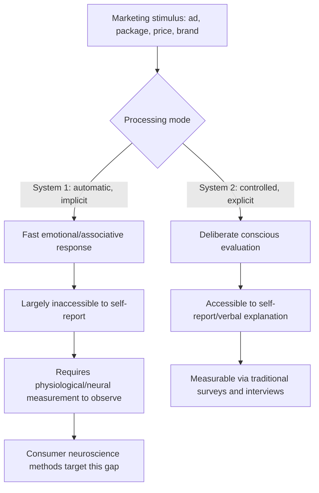

## Foundations of Consumer Neuroscience

### Definition and Scope

Consumer neuroscience (often used interchangeably with "neuromarketing" in applied contexts, though the terms carry a distinction discussed below) is the interdisciplinary field applying neuroscience theory and measurement methods to understand consumer decision-making, brand perception, and response to marketing stimuli. It sits at the intersection of cognitive neuroscience, psychology, and marketing, and is founded on the premise that direct or indirect measurement of neural and physiological activity can reveal aspects of consumer response — particularly automatic, non-conscious, or difficult-to-articulate reactions — that traditional self-report methods (surveys, focus groups) may fail to capture accurately.

### Terminological Distinction: Consumer Neuroscience vs. Neuromarketing

Though frequently used interchangeably in industry contexts, a meaningful distinction exists:

- **Consumer neuroscience** refers to the academic research discipline studying the neural and physiological bases of consumer behavior, typically conducted with rigorous experimental controls and often published in peer-reviewed academic venues.
- **Neuromarketing** typically refers to the commercial application of these methods and findings to specific marketing practice — testing ad creative, packaging design, or pricing strategy for a specific brand or campaign — often conducted by specialized commercial research firms with less methodological transparency and rigor than academic research, and with results generally proprietary rather than publicly validated.

This distinction matters for evaluating the credibility of any specific claim in this space: academic consumer neuroscience findings should generally be weighted more heavily than commercial neuromarketing case studies, which frequently lack published methodology, sample size transparency, or peer review, and marketers should apply appropriate skepticism to vendor-provided efficacy claims that are not independently verifiable.

### Core Theoretical Foundation: Dual-Process Theory

Much of consumer neuroscience is grounded in **dual-process theory** of cognition (popularized in consumer contexts partly through Daniel Kahneman's "System 1 / System 2" framework), which distinguishes between two broad modes of mental processing:

- **System 1 (automatic/implicit processing)**: fast, intuitive, effortless, largely unconscious, and heavily influenced by emotional and associative responses. Much purchase decision-making, particularly for low-involvement or habitual purchases, is theorized to be substantially driven by this mode.
- **System 2 (controlled/explicit processing)**: slow, deliberate, effortful, and consciously accessible — the mode engaged during careful comparison shopping, high-involvement purchase decisions, or explicit reasoning about a choice.

Consumer neuroscience's foundational rationale is that traditional self-report research methods (asking someone why they prefer a product) primarily access System 2 processing — because articulating a reason requires conscious, verbal reasoning — while a substantial portion of actual purchase-influencing mental activity occurs in System 1, which is not directly introspectively accessible and may be poorly or inaccurately reported even when a consumer sincerely attempts to explain their own preferences. This gap between self-reportable and actual underlying processing is the core justification for using direct physiological and neural measurement as a complementary or alternative research approach.

### Core Measurement Modalities

Consumer neuroscience employs a range of measurement techniques, each capturing different aspects of the underlying construct (neural activity, physiological arousal, or behavioral/attentional response) with distinct trade-offs in precision, cost, and interpretability:

| Method | What It Measures | Temporal Resolution | Typical Use Case |
| --- | --- | --- | --- |
| EEG (electroencephalography) | Electrical brain activity via scalp electrodes | High (millisecond-level) | Real-time emotional engagement/attention tracking during ad viewing |
| fMRI (functional magnetic resonance imaging) | Blood-oxygen-level changes indicating regional brain activity | Low-moderate (seconds) | Localizing specific brain regions associated with reward, valuation, or emotional response |
| Eye tracking | Gaze location, fixation duration, pupil dilation | High | Visual attention allocation on packaging, ads, or web pages |
| Facial coding/facial EMG | Micro-expressions and facial muscle activity indicating emotional valence | High | Measuring emotional reaction (positive/negative) to content in real time |
| Galvanic skin response (GSR)/electrodermal activity | Skin conductance changes indicating physiological arousal | Moderate | Measuring emotional intensity/arousal, independent of valence |
| Heart rate variability (HRV) | Cardiac rhythm variation indicating autonomic nervous system activity | Moderate | Broader arousal and stress-response measurement |
| Implicit Association Tests (IAT) | Reaction-time-based measurement of automatic associations | Moderate | Measuring implicit brand attitudes not accessible via direct questioning |

### Key Constructs Measured

#### Attention and Salience

Eye tracking and related attention-measurement methods address a foundational marketing question: what elements of a stimulus (ad, package, webpage) actually capture visual attention, and in what sequence, since content that is not attended to cannot exert any subsequent persuasive influence regardless of its intrinsic quality. This directly supports design decisions about visual hierarchy, placement, and salience of key brand or product elements.

#### Emotional Valence and Arousal

Most emotion-related consumer neuroscience measurement operates along two core dimensions drawn from affective science's **circumplex model of affect**:

- **Valence**: whether the emotional response is positive or negative.
- **Arousal**: the intensity or activation level of the emotional response, independent of valence.

This two-dimensional framework underlies why methods like facial coding (which can indicate valence via specific expression patterns) are often paired with methods like GSR (which indicates arousal intensity but not directionally whether that arousal is positive or negative), since a complete picture of emotional response typically requires assessing both dimensions rather than either alone.

#### Implicit Attitudes and Automatic Associations

Beyond momentary emotional reaction, consumer neuroscience is also concerned with measuring **implicit attitudes** — relatively stable automatic associations between a brand/product and evaluative concepts (good/bad, trustworthy/untrustworthy) that may differ from a consumer's explicitly stated attitude. Reaction-time-based implicit measurement methods operate on the principle that automatic associations produce faster or slower response times when a concept pairing is congruent versus incongruent with the underlying implicit association, providing an indirect behavioral window into associations the respondent may not consciously endorse or even be aware of holding.

#### Reward and Valuation Processing

fMRI-based consumer neuroscience research has examined activity in brain regions associated with reward processing and subjective value computation (a body of research sometimes referred to under the broader umbrella of "neuroeconomics") in response to pricing, branding, and purchase-decision stimuli, seeking to identify neural correlates of subjective value assessment that might predict purchase behavior beyond what self-reported preference ratings alone would predict. [Inference: while specific brain regions such as those associated with reward processing are frequently discussed in this literature, the reliability and predictive validity of using such neural activity as a practical forecasting tool for actual marketplace purchase behavior — as opposed to laboratory choice tasks — remains a genuinely contested and actively researched question rather than a settled finding.]

### Methodological Considerations and Limitations

Consumer neuroscience methods carry specific limitations that responsible application must account for:

- **Reverse inference problems**: inferring a specific psychological state (e.g., "this specific brain region was active, therefore the person felt positive emotion X") from observed neural activity is methodologically contested, since most brain regions are involved in multiple cognitive/emotional processes rather than mapping one-to-one with a single specific psychological construct — a limitation sometimes termed the "reverse inference" problem in cognitive neuroscience methodology critique.
- **Small sample sizes in commercial applications**: many commercial neuromarketing studies, particularly fMRI-based ones given their high per-participant cost, use small sample sizes that may limit statistical reliability and generalizability, a concern less applicable to well-powered academic research but frequently relevant to proprietary commercial vendor claims.
- **Ecological validity concerns**: laboratory measurement conditions (lying in an fMRI scanner, wearing EEG equipment) differ substantially from natural purchase environments, raising questions about whether measured responses generalize to real-world shopping behavior, an active methodological concern rather than a resolved issue.
- **Correlational, not necessarily causal or predictive, findings**: physiological/neural measures correlating with a stimulus does not automatically establish that the measured response causally drives, or reliably predicts, actual downstream purchase behavior — a gap between "this ad produced measurable emotional/neural response" and "this ad will increase sales" that requires additional validation to bridge.
- **Cost and accessibility trade-offs**: methods vary substantially in cost and required expertise (fMRI being the most expensive and technically demanding, eye tracking and facial coding being comparatively more accessible), which practically shapes which methods see broader commercial adoption regardless of which method might be theoretically most informative for a given research question.

### Complementary Role Relative to Traditional Research

Consumer neuroscience methods are generally best understood as complementary to, rather than a wholesale replacement for, traditional self-report research methods (surveys, focus groups, interviews), since:

- Self-report methods remain the most direct and often only practical way to understand explicit reasoning, stated preferences, and conscious decision criteria (System 2 processing), which remain genuinely relevant for many purchase decisions, particularly higher-involvement ones.
- Physiological/neural methods add value specifically where automatic, non-conscious, or difficult-to-articulate responses (System 1 processing) are hypothesized to play a significant role, or where self-report is suspected to be biased by social desirability, limited introspective access, or post-hoc rationalization.
- The strongest research designs typically **triangulate** across multiple method types (e.g., pairing eye tracking with post-exposure surveys, or facial coding with explicit preference ratings) to cross-validate findings, rather than relying on any single measurement modality in isolation.

### Practical Application Example

A beverage brand is deciding between two candidate package designs and has collected both explicit survey preference data (which favors Design A by a narrow margin) and eye-tracking data (which shows Design B captures attention to the brand logo more quickly and for longer duration).

**Application of the foundational framework**: This divergence is a canonical illustration of the System 1/System 2 gap consumer neuroscience is designed to address — the survey data reflects consciously articulated preference (System 2), while the eye-tracking data reflects automatic visual attention capture (a System 1-adjacent measure), and these need not align, since a design can capture more automatic attention without being the consciously preferred option, or vice versa.

**Recommended interpretation approach rather than treating either measure as automatically authoritative**:

1. Consider the actual point-of-purchase context: if the product will be viewed briefly on a crowded shelf (where automatic attention capture matters most for even being noticed and considered at all), the eye-tracking finding may be more practically relevant than the stated preference; if the purchase involves extended deliberate comparison (e.g., a considered specialty purchase), the explicit preference data may carry more predictive weight.
2. Avoid treating either single data source as a definitive verdict — triangulating with an additional measure (e.g., implicit association testing on brand attitude, or a controlled shelf-simulation purchase-intent test) would strengthen confidence in whichever direction the decision ultimately goes, consistent with the general methodological recommendation to combine measurement modalities rather than rely on one in isolation.
3. Recognize that neither measure alone establishes actual sales impact — a genuinely rigorous validation would require some form of market or controlled-test sales outcome data, since both the survey and eye-tracking measures are proxies for, not direct measures of, actual purchase behavior.

### Measurement Considerations

- **Method selection alignment with research question**: matching measurement modality to the specific construct of interest (attention → eye tracking; emotional valence → facial coding; arousal → GSR; implicit attitude → reaction-time tests) rather than defaulting to whichever method is most commercially available or fashionable.
- **Sample size and statistical power reporting**: particularly relevant when evaluating commercial neuromarketing vendor claims, where transparency about sample size and methodology should be a baseline expectation before treating findings as reliable.
- **Convergence across multiple methods**: findings that replicate across multiple independent measurement approaches (e.g., both facial coding and self-report indicating positive valence) should be weighted with substantially more confidence than a finding from a single method alone, given the methodological limitations inherent to any individual technique.
- **External/ecological validation**: where feasible, corroborating laboratory-based physiological findings against real-world behavioral outcomes (actual sales, real purchase behavior in a live test) to address the ecological validity and predictive-validity concerns inherent to controlled laboratory measurement.

[Behavior may vary: the predictive validity of specific consumer neuroscience measures for real-world purchase behavior is an active area of academic debate rather than a fully settled matter, and claims about the reliability or superiority of any particular method — especially those originating from commercial vendors with a direct interest in promoting their own methodology — should be evaluated with particular caution and, where possible, cross-checked against independently published, peer-reviewed research rather than accepted at face value.]

**Related Topics**

- Dual-process theory and System 1/System 2 decision-making frameworks
- EEG, fMRI, eye tracking, and facial coding: comparative methodology deep dives
- Implicit Association Test (IAT) design and interpretation in brand research
- Reverse inference and methodological critique in cognitive neuroscience
- Neuroeconomics and neural correlates of subjective value/reward processing
- Research triangulation: combining physiological and self-report methods
- Ethical considerations and informed consent in biometric consumer research