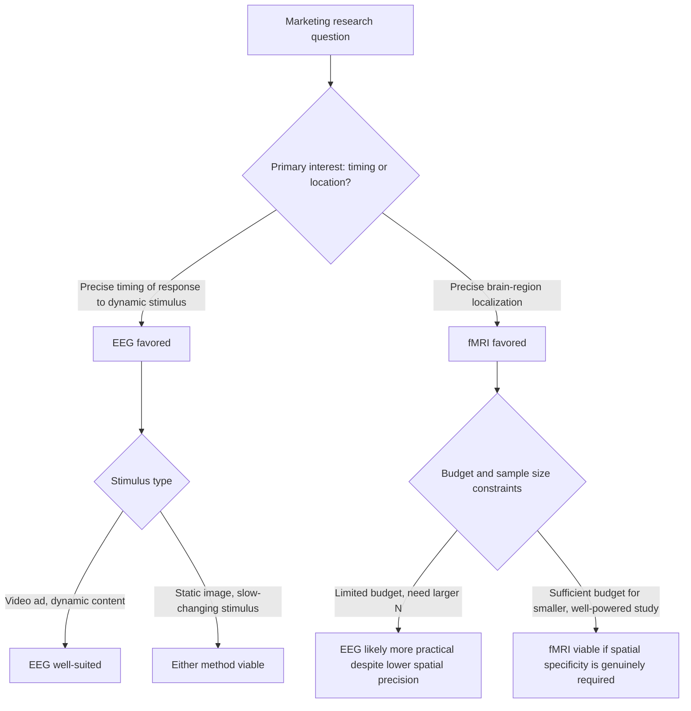

## EEG and fMRI in Marketing Research

### Definition and Scope

Electroencephalography (EEG) and functional magnetic resonance imaging (fMRI) are the two primary neuroimaging modalities used in consumer neuroscience to directly measure brain activity in response to marketing stimuli. Although both fall under the broader neuroimaging umbrella, they operate on fundamentally different physiological signals, offer distinct trade-offs in temporal and spatial resolution, and are suited to different research questions within marketing — making the choice between them a methodologically consequential decision rather than an interchangeable one.

### EEG: Technical Foundation

#### What EEG Measures

EEG measures electrical activity generated by populations of neurons firing synchronously in the brain, detected via electrodes placed on the scalp. Because electrical signals propagate through neural tissue and skull nearly instantaneously relative to the timescale of cognitive processes, EEG offers **millisecond-level temporal resolution** — it can capture the precise timing of neural responses as they unfold, making it well-suited to tracking rapid, moment-to-moment changes in cognitive and emotional state during exposure to dynamic stimuli such as video advertisements.

#### Key EEG-Derived Metrics in Marketing Research

- **Frontal asymmetry**: relative activity differences between left and right frontal brain regions, theorized in some affective neuroscience frameworks to relate to approach (left-frontal-associated) versus withdrawal (right-frontal-associated) motivational orientation, and applied in marketing contexts as a potential indicator of approach-oriented positive engagement versus avoidance-oriented negative reaction to a stimulus. [Inference: the frontal asymmetry approach/withdrawal model, while influential, remains a debated framework within affective neuroscience itself, and its specific application to marketing stimuli should be treated as one interpretive lens among others rather than a definitively validated measure of consumer approach/avoidance.]
- **Event-related potentials (ERPs)**: specific voltage fluctuations time-locked to a particular stimulus event (e.g., the moment a brand logo appears), used to study precise cognitive responses such as attention allocation or surprise/novelty detection at a millisecond-level timescale relative to the triggering stimulus.
- **Engagement/attention indices**: various proprietary and academic algorithms combine multiple EEG frequency bands (e.g., alpha, beta, theta wave activity) into composite indices intended to represent overall cognitive engagement or attentional intensity during stimulus exposure, frequently used in applied advertising-testing contexts.

#### EEG Strengths and Limitations for Marketing Applications

**Strengths**: relatively lower cost and greater portability than fMRI, tolerance for more naturalistic testing environments (participants can sit upright, view content on a screen much as they would in real life), and the temporal precision needed to track responses to dynamic, time-based content like video ads moment-by-moment.

**Limitations**: relatively poor **spatial resolution** — EEG can indicate that certain general brain regions are more or less active but cannot precisely localize activity to specific, small brain structures, limiting its usefulness for questions about which specific brain region (e.g., a particular reward-processing structure) is responsible for an observed response. EEG signals are also susceptible to artifacts from muscle movement, eye blinks, and electrical interference, requiring careful data cleaning that introduces additional methodological complexity and potential for inconsistent processing across studies/vendors.

### fMRI: Technical Foundation

#### What fMRI Measures

fMRI measures the **blood-oxygen-level-dependent (BOLD) signal** — changes in blood oxygenation that occur as an indirect consequence of increased neural activity in a given brain region, since more active neurons require more oxygenated blood delivery. Because this hemodynamic response unfolds over several seconds (much slower than the underlying neural firing itself), fMRI offers comparatively **poor temporal resolution** relative to EEG, but compensates with substantially superior **spatial resolution**, capable of localizing activity to specific, relatively small anatomical brain structures.

#### Key fMRI-Derived Constructs in Marketing Research

- **Reward and valuation regions**: fMRI research in the neuroeconomics tradition has examined activity in brain regions associated with reward processing and subjective value computation in response to pricing, branding, and product-choice stimuli, seeking neural correlates of value assessment that might extend beyond what self-reported preference alone captures.
- **Emotional processing regions**: activity in regions associated with emotional processing has been examined in response to advertising content, branding, and pricing information, used to infer emotional engagement at a neuroanatomically specific level unavailable to EEG's broader signal.
- **Self-referential processing**: some consumer neuroscience research has examined activity in brain regions associated with self-referential thought in response to personalized or identity-relevant marketing content, exploring whether brands successfully integrate into consumers' sense of self-concept at a neural level.

#### fMRI Strengths and Limitations for Marketing Applications

**Strengths**: precise spatial localization allows researchers to make claims about which specific brain structures are implicated in a given response, supporting more theoretically grounded inferences connected to the broader cognitive neuroscience literature on the function of those specific regions.

**Limitations**: substantially higher cost per participant than EEG or most other consumer neuroscience methods, requiring specialized facilities and technical expertise that limit sample sizes achievable within typical commercial research budgets. The scanning environment itself is highly unnatural (lying flat and immobile inside a loud, enclosed magnetic bore) with poor ecological validity relative to real shopping or media-consumption contexts. The slow hemodynamic response also makes fMRI poorly suited to studying rapid, dynamic stimuli with the moment-to-moment precision EEG offers, generally restricting fMRI marketing applications to static or slowly-changing stimuli, or to block-averaged designs that sacrifice fine-grained temporal detail.

### EEG vs. fMRI Comparison

| Dimension | EEG | fMRI |
| --- | --- | --- |
| What it measures | Electrical activity (direct neural signal) | Blood oxygenation changes (indirect neural correlate) |
| Temporal resolution | High (milliseconds) | Low (several seconds) |
| Spatial resolution | Low (general regions only) | High (specific anatomical structures) |
| Cost per participant | Relatively low | High |
| Portability/naturalistic setting | Higher — can be used in more realistic settings | Low — requires immobile scanner environment |
| Best suited for | Dynamic, time-based stimuli (video ads); moment-to-moment engagement tracking | Static or slow stimuli; localizing specific brain-region involvement |
| Typical sample sizes achievable | Larger (dozens to low hundreds feasible) | Smaller (often a few dozen or fewer, given cost) |
| Susceptibility to artifacts | Movement/muscle/eye-blink artifacts | Movement artifacts; claustrophobia/scanner-anxiety effects |

### Method Selection Pathway

### Methodological Considerations Specific to Marketing Applications

#### The Reverse Inference Problem

Both EEG and fMRI marketing research are subject to the **reverse inference** critique from cognitive neuroscience methodology: observing activity in a brain region or a particular EEG signature does not straightforwardly establish which specific psychological state produced it, since most brain regions and electrical signal patterns are involved in multiple distinct cognitive and emotional processes rather than mapping one-to-one onto a single construct like "liking a product." Marketing research claims that assert a direct causal or definitional link between a specific neural signature and a specific consumer psychological state should be evaluated with this limitation in mind, since the same measured signal is frequently consistent with multiple alternative psychological interpretations.

#### Ecological Validity Trade-offs

Both methods, but fMRI more severely, involve substantial departures from natural consumption or purchase environments (electrode caps, immobile scanning), raising the question of whether measured responses under these conditions generalize to real-world shopping or media-viewing behavior — an active methodological concern rather than a fully resolved issue in the field, and one that responsible interpretation of findings should account for rather than assume away.

#### Sample Size and Statistical Power in Commercial Applications

Given the substantially higher per-participant cost of fMRI, commercial neuromarketing studies using this method frequently employ smaller sample sizes than would be considered well-powered by typical academic neuroscience standards, which can limit the statistical reliability and generalizability of findings — a concern marketers should weigh when evaluating vendor claims based on proprietary fMRI studies without transparent methodology and sample size reporting.

#### Correlational Rather Than Predictive Validity

Findings from either method establishing that a stimulus produced a measurable neural response do not, by themselves, establish that this response reliably predicts actual downstream marketplace behavior (purchase decisions, brand loyalty, sales lift). Bridging this gap requires additional validation — ideally connecting neural/physiological measures to actual behavioral or sales outcomes — that is not automatically provided merely by demonstrating a statistically significant brain response to a stimulus in a laboratory setting.

### Practical Application Example

A marketing research team is evaluating three candidate 30-second video advertisements and needs to identify which specific moments within each ad successfully capture and sustain viewer attention and emotional engagement, in order to guide editing decisions before finalizing the ad for broad media placement.

**Method selection reasoning under this framework**: Given the need to understand moment-to-moment response across a dynamic, time-based 30-second video stimulus, EEG's millisecond-level temporal resolution is substantially better suited to this specific research question than fMRI's slow hemodynamic response, which would struggle to resolve engagement changes occurring within a rapidly-changing video at the granularity needed for scene-by-scene editing decisions. fMRI's superior spatial localization offers limited practical value for this particular editing-guidance use case, since the research question concerns when engagement rises and falls, not which specific brain structure is responsible.

**Recommended approach**: Use EEG (potentially combined with eye tracking and/or facial coding for methodological triangulation, consistent with the general recommendation to combine measurement modalities rather than rely on a single method) to generate a moment-by-moment engagement/attention trace across each ad's duration, identifying specific timestamps where engagement drops (candidate cut points) or peaks (candidate moments to preserve or emphasize), while remaining appropriately cautious about treating the resulting engagement index as a directly validated predictor of eventual ad sales effectiveness absent further outcome-linked validation.

### Measurement Considerations

- **Alignment of method to research question type**: as illustrated above, timing-sensitive questions favor EEG; region-specific questions favor fMRI; questions requiring neither may be better served by simpler, lower-cost methods (eye tracking, facial coding, self-report) than either neuroimaging approach.
- **Reporting transparency**: sample size, electrode/scanner specifications, data-cleaning/artifact-rejection procedures, and statistical analysis approach should be reported and scrutinized, particularly for commercial vendor studies making efficacy claims, given the field's documented variability in methodological rigor between academic and commercial applications.
- **Convergent validation with behavioral outcomes**: wherever feasible, neuroimaging findings should be validated against actual behavioral or sales data rather than treated as self-sufficient evidence of marketing effectiveness, given the correlational-not-predictive limitation discussed above.
- **Cost-benefit assessment relative to simpler methods**: given the substantially higher cost and complexity of both EEG and especially fMRI relative to eye tracking, facial coding, or well-designed self-report studies, marketers should evaluate whether the specific research question genuinely requires neuroimaging-level precision or whether comparable actionable insight could be obtained through simpler, more cost-effective and higher-sample-size methods.

[Behavior may vary: the interpretive validity of specific EEG metrics (such as frontal asymmetry) and fMRI region-based inferences remains an area of ongoing methodological debate within cognitive and affective neuroscience, and claims connecting specific neural signatures to specific consumer psychological states — particularly those originating from commercial vendors — should be evaluated with appropriate skepticism and cross-checked against independently published, peer-reviewed research rather than accepted without scrutiny.]

**Related Topics**

- Dual-process theory and the System 1/System 2 foundation of consumer neuroscience
- Frontal asymmetry and approach/withdrawal motivational models in affective neuroscience
- Neuroeconomics and neural correlates of subjective value and reward processing
- Reverse inference critique and methodological rigor in cognitive neuroscience
- Eye tracking and facial coding as complementary or alternative measurement methods
- Research triangulation across physiological, neural, and self-report methods
- Ethical and informed-consent considerations in biometric marketing research