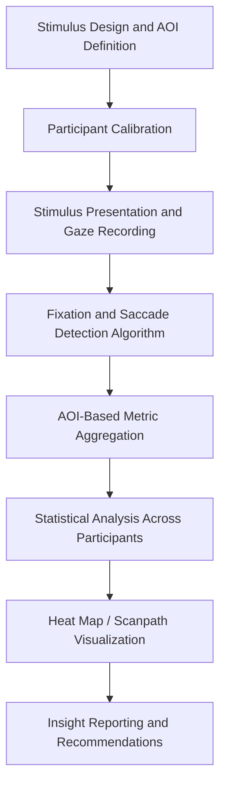

## Eye-Tracking and Visual Attention Studies

### Overview

Eye-tracking is a biometric research method that measures where, how long, and in what sequence a person looks at visual stimuli. In marketing and consumer psychology, it is used to quantify visual attention toward advertisements, packaging, websites, shelf displays, and video content, revealing patterns that self-reported surveys cannot capture because visual attention is largely pre-conscious and difficult for respondents to accurately describe.

### Underlying Psychological Principles

**Eye-Mind Hypothesis**

The foundational assumption in eye-tracking research is that there is a tight coupling between what the eyes fixate on and what the mind is processing at that moment. This is not absolute — peripheral vision and covert attention (attending to something without looking directly at it) mean gaze location is a strong but imperfect proxy for cognitive attention. [Unverified: the degree of eye-mind coupling varies by task type and individual, and some researchers argue covert attention shifts are common enough to introduce meaningful noise into interpretation.]

**Bottom-Up vs. Top-Down Attention**

- *Bottom-up (stimulus-driven) attention*: Captured automatically by salient visual features — high contrast, bright colors, motion, faces, and abrupt onsets. This drives initial fixations regardless of viewer goals.
- *Top-down (goal-driven) attention*: Guided by the viewer's own intentions, prior knowledge, and task (e.g., searching for a price tag versus browsing casually). Marketing eye-tracking studies typically manipulate or control for both.

**Pre-Attentive Processing**

Certain visual properties (color, orientation, size, motion) are processed within roughly 200–250ms, before conscious attention is deployed. Package design and ad layout exploit this to guide the eye toward brand elements before the viewer consciously "decides" to look.

### Core Eye Movement Metrics

**Fixations**

A fixation is a relatively stable gaze position (typically 200–300ms) where visual information is acquired. Key derived metrics:

- *Fixation count*: Number of fixations on an area of interest (AOI) — indicates how attention-grabbing an element is.
- *Fixation duration*: Time spent per fixation — longer durations are generally associated with deeper cognitive processing or difficulty extracting information, though the interpretation is context-dependent (a long fixation could mean high interest or high confusion).
- *Time to first fixation (TTFF)*: How quickly an element is noticed after stimulus onset — a common proxy for visual salience.

**Saccades**

Rapid, ballistic eye movements between fixations (20–40ms), during which almost no visual information is encoded (saccadic suppression). Saccade metrics include amplitude (distance covered) and direction, useful for reconstructing the scanpath.

**Scanpaths**

The full sequence of fixations and saccades over a stimulus, visualized as a path connecting numbered fixation points. Scanpaths reveal *order* of attention, not just amount — critical for understanding whether a shopper sees the brand name before or after the price.

**Pupillometry**

Pupil diameter changes are used as an index of cognitive load and emotional arousal (via the autonomic nervous system), independent of ambient light (which must be controlled for). Pupil dilation is associated with increased arousal or mental effort, though it is a non-specific marker — it cannot distinguish positive from negative arousal on its own. [Inference: in applied commercial studies, pupillometry is typically used as a supplementary arousal signal rather than a standalone measure, since isolating luminance effects requires careful stimulus control that many field studies do not implement rigorously.]

**Areas of Interest (AOIs)**

Researcher-defined regions of the stimulus (e.g., "logo," "price," "call-to-action button") used to aggregate fixation and dwell metrics per region for statistical comparison.

**Heat Maps and Gaze Plots**

- *Heat maps*: Aggregate visualizations across multiple participants showing density of fixations, typically color-graded from cool (low attention) to warm (high attention).
- *Gaze plots*: Individual-level scanpath visualizations showing sequence and duration (via circle size) of fixations for one participant or one trial.

### Common Study Designs in Marketing Research

**Print and Static Ad Testing**

Measures which elements (headline, image, logo, brand name, copy) attract attention first and longest. A frequent finding pattern in the literature is that images are fixated before text, and headlines before body copy, though exact ordering depends on layout and salience design.

**Package Design and Shelf Testing**

Simulates real shopping conditions (planogram shelf images or in-store/VR simulations) to measure:

- Time to locate the target brand among competitors ("findability")
- Which visual cues drive initial shelf scanning (color blocking, shape, logo)
- Attention allocated to competing products in the same visual field

**Website and UX Eye-Tracking**

Applies AOI and heat map analysis to web pages, commonly revealing the **F-pattern** (users scan in a horizontal line across the top, then a shorter horizontal line lower down, then scan vertically down the left side) and **Z-pattern** (used for simpler layouts with a single strong CTA) as recurring scan behaviors. [Unverified as universal — pattern occurrence is layout- and content-dependent, and later research has shown considerable deviation from these idealized patterns depending on content density and visual hierarchy.]

**Video and Commercial Testing**

Dynamic AOI tracking across frames to measure attention to brand logos, product shots, and key messaging moments, often synchronized with facial coding or GSR (galvanic skin response) for combined attention-plus-emotion analysis.

**Banner Blindness Studies**

A well-documented phenomenon where users unconsciously ignore content that visually resembles an advertisement (position, size, color patterns typical of ads), regardless of actual content relevance.

### Technical Setup and Equipment

**Remote (Screen-Based) Eye Trackers**

Infrared cameras mounted below or beside a monitor track corneal reflection and pupil position without contact. Common in usability labs and controlled ad-testing studios. Sampling rates for commercial units typically range from 60Hz to 250Hz+; research-grade systems can exceed 1000Hz.

**Eye-Tracking Glasses (Mobile/Wearable)**

Worn like glasses, combining a scene camera (recording the real-world field of view) with eye cameras, used for in-store shopping studies, real-world package interaction, and outdoor advertising exposure research.

**Webcam-Based Eye-Tracking**

Uses standard laptop/device webcams with computer-vision algorithms to estimate gaze, enabling large-scale, low-cost remote studies at the cost of reduced spatial accuracy compared to dedicated infrared trackers. [Inference: webcam-based accuracy is generally considered adequate for AOI-level analysis (e.g., "did they look at the logo region") but less suitable for fine-grained fixation sequencing, given the lower sampling rates and calibration precision typical of consumer webcams.]

**Calibration Process**

Before recording, participants fixate on a series of known screen points (typically 5, 9, or 13-point calibration) so the system can map raw pupil/corneal-reflection data to screen coordinates. Calibration drift over a session is a known accuracy concern in longer studies.

### Basic Analysis Workflow

**Fixation Detection Algorithms**

Raw gaze coordinate streams are converted into discrete fixations using classification algorithms, most commonly:

- *Velocity-Threshold Identification (I-VT)*: Classifies samples as fixations or saccades based on point-to-point angular velocity relative to a threshold.
- *Dispersion-Threshold Identification (I-DT)*: Groups consecutive samples into a fixation if they fall within a spatial dispersion window for a minimum duration.

These are typically handled by the eye-tracker vendor's software (e.g., Tobii Pro Lab, SMI BeGaze) rather than implemented from scratch by marketing researchers.

### Statistical Reporting Conventions

Typical dependent variables reported in a marketing eye-tracking study include mean fixation duration, fixation count, and time to first fixation per AOI, generally compared across conditions (e.g., two ad variants) using $t$-tests or ANOVA for between-subjects designs, or mixed-effects models when accounting for repeated measures across multiple stimuli per participant. A common summary statistic is percentage of participants who fixated on an AOI at all, distinguishing *reach* (did they see it) from *depth* (how long/often they looked).

$$\text{Attention Ratio (AOI)} = \frac{\text{Total Fixation Duration on AOI}}{\text{Total Fixation Duration on Stimulus}}$$

### Example

**Example: Comparing Two Package Designs**

A CPG brand tests two candidate package redesigns using a shelf-simulation eye-tracking study with 60 participants:

- Design A (bold color block, large logo) achieves TTFF of 0.8 seconds and is fixated by 92% of participants within the first 3 seconds of shelf exposure.
- Design B (minimalist, smaller logo) achieves TTFF of 2.1 seconds and is fixated by 61% of participants in the same window.
- Despite Design B's lower attention capture, post-exposure surveys show higher purchase-intent ratings among those who did fixate on it, suggesting a trade-off between *attention capture* and *message elaboration* — a common tension in package design decisions. [Inference: this attention-versus-elaboration trade-off is a general pattern documented in visual attention literature; exact outcomes for any specific design pair would need empirical validation rather than assumption.]

### Limitations and Methodological Considerations

- **Ecological validity**: Lab-based, screen-based studies may not replicate real shopping or browsing behavior, especially regarding time pressure, physical handling, and social context.
- **Sample size and generalizability**: Eye-tracking studies often run with smaller samples (20–60 participants is common) due to cost and lab time, raising statistical power concerns for subtle effects.
- **Gaze ≠ processing depth**: A fixation confirms visual exposure but not comprehension, memory encoding, or attitude change — eye-tracking is often paired with recall/recognition testing or implicit measures to address this gap.
- **Order and novelty effects**: Repeated exposure to similar stimuli within a session can create habituation, reducing fixation counts on later trials independent of stimulus quality.
- **Individual differences**: Reading ability, visual impairment (correctable with glasses/contacts under most trackers, though hard contact lenses can interfere), and cultural scanning habits (e.g., script directionality) can affect scanpaths and should be controlled or reported as covariates.

### Complementary Methods Often Paired with Eye-Tracking

- **Facial coding / FACS**: Adds emotional valence data to attention data.
- **EEG**: Adds temporal resolution on cognitive/emotional response timing.
- **GSR (galvanic skin response)**: Adds arousal intensity data.
- **Retrospective think-aloud with gaze replay**: Participants view their own scanpath recording and verbally explain their attention, bridging the gap between behavioral data and stated reasoning.

**Related Topics**

- Facial coding and emotion recognition (FACS) in ad testing
- EEG and neural response measurement for advertising
- Galvanic skin response (GSR) and arousal measurement
- Implicit association testing in brand perception
- Visual salience modeling and predictive attention algorithms (e.g., saliency maps)
- Shelf and planogram optimization research
- Website UX heat mapping tools (Hotjar, Crazy Egg) vs. true eye-tracking
- Banner blindness and ad avoidance behavior