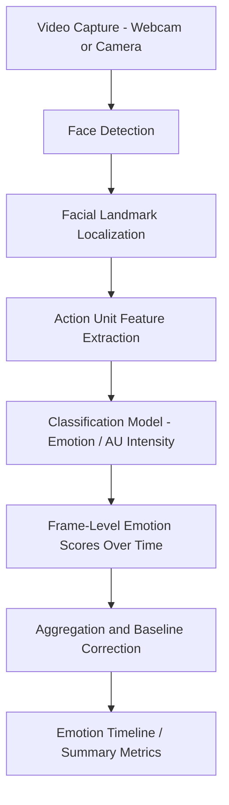

## Facial Coding and Automated Emotion Recognition

### Overview

Facial coding is a biometric research method that measures emotional response by analyzing facial muscle movements. In marketing research, it is used to capture moment-by-moment emotional reactions to ads, packaging, video content, and product experiences without relying on participants' ability or willingness to self-report their feelings accurately. Automated emotion recognition refers to the computer-vision and machine-learning systems that perform this coding algorithmically, at scale, replacing the manual human coders used in early facial coding research.

### Theoretical Foundations

**Facial Action Coding System (FACS)**

Developed by Paul Ekman and Wallace Friesen, FACS is the foundational taxonomy underlying most facial coding systems. It decomposes facial expressions into individual **Action Units (AUs)** — discrete muscle movements (e.g., AU6 = cheek raiser, AU12 = lip corner puller) — rather than coding whole expressions directly. Emotions are then inferred from specific combinations and intensities of AUs.

**Basic Emotion Theory**

Most commercial emotion-recognition tools are built around Ekman's proposed set of universal basic emotions — typically joy, surprise, anger, fear, disgust, sadness, and sometimes contempt and neutral — each associated with a theoretically distinct and cross-culturally recognizable facial signature. [Unverified as a settled scientific consensus: the universality claim underlying basic emotion theory has been substantially challenged in the psychological literature, with critics arguing that facial expressions are more context-dependent, culturally variable, and less discretely categorical than the basic-emotion model assumes. Vendors of commercial tools generally operate on the basic-emotion framework regardless of this ongoing debate.]

**Dimensional Models (Valence-Arousal)**

An alternative or complementary framework represents emotional states continuously along two axes — **valence** (positive to negative) and **arousal** (calm to excited) — rather than discrete categories. Many commercial platforms report both discrete emotion scores and a valence/arousal summary, since valence-arousal mapping is often more actionable for marketers (e.g., "did this ad feel positive and energizing?") than raw AU output.

### Core Technical Pipeline

**Face Detection**

The first stage identifies the presence and bounding box of a face in each video frame, typically using CNN-based detectors (historically Viola-Jones cascades; modern systems use deep-learning detectors such as MTCNN or SSD-based architectures).

**Facial Landmark Localization**

Once a face is detected, the system locates key structural points (eyes, eyebrows, nose, mouth corners, jawline) — commonly 68 or more landmark points — that serve as reference geometry for measuring muscle movement relative to a neutral baseline.

**Action Unit / Feature Extraction**

Movement of landmarks and localized texture changes (e.g., wrinkle patterns via Histogram of Oriented Gradients or learned CNN features) are converted into AU intensity estimates or direct emotion-relevant feature vectors.

**Classification**

A trained classifier (historically SVMs on handcrafted features; increasingly deep CNNs or transformer-based architectures trained end-to-end on labeled facial expression datasets) maps the extracted features to emotion probabilities per frame.

**Temporal Aggregation**

Frame-level scores (often at 15–30 samples per second, depending on video frame rate) are aggregated into a timeline, typically smoothed to reduce frame-to-frame noise, and summarized into metrics like peak emotion intensity, dominant emotion, and duration of expression.

### Key Metrics Reported in Marketing Studies

**Valence Score**

A continuous or time-series measure of overall positive-versus-negative expression, often the headline metric used to compare ad variants (e.g., "Ad A produced net positive valence for 68% of viewing time versus 41% for Ad B").

**Emotion Intensity/Probability Curves**

Per-emotion probability scores plotted across the duration of stimulus exposure, allowing researchers to pinpoint exactly which scene, line of dialogue, or visual moment triggered a spike in a specific emotion (e.g., a joy spike at the punchline of a humorous ad).

**Attention/Engagement Proxies**

Some platforms report a composite "engagement" score derived from expressiveness (how much facial activity occurs) combined with valence, used as a rough proxy for how emotionally involving the content is — distinct from visual attention as measured by eye-tracking.

**Peak Moments and Emotional Arc**

Identification of the strongest emotional peaks in a timeline, and characterization of the overall "emotional arc" of a video (e.g., builds tension then resolves into joy), used heavily in ad pre-testing and A/B comparison of edits.

### Common Study Designs in Marketing Research

**Ad Pre-Testing**

Participants view an ad (in-home via webcam or in a lab with a camera) while the system records and codes facial response in real time, synchronized frame-by-frame with the ad's timeline, so researchers can map exact scenes to emotional spikes or drops.

**Packaging and In-Store Reaction Testing**

Cameras (often paired with eye-tracking) capture facial response as participants view or physically handle packaging, used to detect moments of confusion, delight, or disgust that participants may not mention unprompted.

**Website/UX Emotional Response Testing**

Facial coding synchronized with click-stream and screen-recording data to identify moments of frustration (e.g., brow furrowing consistent with AU4, often associated with confusion or negative affect) during a checkout flow or form completion.

**Cross-Market Creative Testing**

Running the same ad through the same automated system across multiple countries to compare emotional response patterns, since automated scoring offers consistency advantages over manual human coders whose judgments can vary by rater and by cultural background. [Inference: while automated scoring improves consistency of measurement, it does not eliminate concerns about the underlying model's own training-data bias — most commercial systems are trained predominantly on Western facial expression datasets, which is a documented source of potential cross-cultural accuracy variance.]

### Comparison: Manual FACS Coding vs. Automated Systems

| Dimension | Manual FACS Coding | Automated Systems |
| --- | --- | --- |
| Speed | Slow — trained coders require significant time per minute of footage | Real-time or near-real-time |
| Cost | High (specialized human coder training and hours) | Lower marginal cost at scale |
| Consistency | Subject to inter-rater variability | Consistent given fixed model version |
| Granularity | Can capture subtle/ambiguous AUs with human judgment | May miss subtle or ambiguous expressions the model wasn't trained on |
| Scalability | Poor for large sample sizes | Strong — supports thousands of respondents |
| Transparency | Coding logic is explicit and auditable | Often a "black box" proprietary model |

### Practical Implementation Considerations

**Camera and Lighting Requirements**

Accuracy depends heavily on adequate, even lighting and a front-facing, unobstructed view of the face. Poor webcam quality, backlighting, extreme angles, glasses glare, or partial occlusion (hands near the face, masks) degrade landmark detection accuracy.

**Baseline/Neutral Calibration**

Many systems record a brief neutral-expression baseline before stimulus exposure to normalize for individual differences in resting facial structure and expressiveness, improving the accuracy of relative emotion-change measurement.

**Sampling and Data Volume**

At typical video frame rates, a 30-second ad can generate hundreds of data points per participant per emotion category, so marketing studies typically aggregate to a small number of key summary statistics (peak valence, average valence, key-moment flags) rather than reporting raw frame-level data to stakeholders.

**Consent and Privacy**

Facial data is biometric personal data under most privacy regulations (e.g., GDPR classifies it as a "special category" of data; various US state biometric privacy laws such as Illinois' BIPA impose specific consent and retention requirements). Marketing research vendors must obtain explicit informed consent, and many platforms process video locally or discard raw video after feature extraction to reduce compliance exposure. [Unverified: specific regulatory obligations vary significantly by jurisdiction and by whether raw video, derived features, or only aggregate scores are retained — researchers should verify current requirements for their specific jurisdiction and data-handling approach rather than assuming a single universal standard.]

### Example

**Example: Comparing Emotional Arcs of Two Ad Cuts**

A beverage brand tests a 30-second ad in two edits — a humor-led cut and a nostalgia-led cut — using automated facial coding on 150 online panel participants via webcam.

- The humor cut shows a sharp joy-probability spike (from a baseline of ~0.1 to a peak of ~0.65) at the 18-second mark, coinciding with a visual punchline, followed by rapid decay.
- The nostalgia cut shows a slower, sustained rise in positive valence (peaking around 0.4) beginning at the 10-second mark and holding through the ad's close, without a sharp single peak.
- Post-exposure brand recall testing shows the humor cut drives higher immediate recall of the punchline scene, while the nostalgia cut drives higher self-reported brand warmth — illustrating how peak-intensity emotional arcs and sustained-valence arcs can serve different campaign objectives. [Inference: this pattern of sharp-peak-driving-recall versus sustained-valence-driving-affect is a plausible and commonly cited finding in the affective advertising literature, but the specific numbers here are illustrative rather than drawn from a cited study.]

### Limitations and Methodological Considerations

- **Facial expression ≠ felt emotion**: A smile can be genuine (Duchenne smile, involving AU6 + AU12) or purely social/polite (non-Duchenne, AU12 only); most automated systems distinguish these to varying degrees, but misclassification risk remains, especially with subtle or "masked" expressions.
- **Basic-emotion model limitations**: As noted above, treating emotional expression as discretely categorizable into 6-8 universal emotions is a simplifying assumption disputed within affective science, meaning the underlying emotion labels output by these systems should be treated as useful business proxies rather than definitive psychological ground truth.
- **Demographic and cross-cultural accuracy variance**: Performance can vary across age, ethnicity, and cultural display-rule differences (norms governing how openly emotions are expressed), an active area of fairness and bias research in affective computing. [Unverified: the magnitude of this variance differs by vendor and model version, and reputable vendors continue to update training data to address known gaps — current published accuracy benchmarks for any specific commercial tool should be checked directly rather than assumed.]
- **Context stripping**: Facial coding typically analyzes the face in isolation from the full situational and conversational context that a human observer would use to interpret an expression, which can lead to misreads of ambiguous expressions (e.g., concentration vs. mild frustration can produce similar brow movements).
- **Webcam data quality in field studies**: Unlike lab studies, in-home webcam studies introduce substantial variance in lighting, camera angle, and video compression, which can reduce classification confidence without always being visible in the summary output provided to marketers.

### Complementary Methods Often Paired with Facial Coding

- **Eye-tracking**: Adds the "where" of attention to the "how they felt" of facial coding, often synchronized on the same timeline.
- **EEG**: Adds neural-level timing and can help disambiguate arousal direction.
- **GSR (galvanic skin response)**: Adds a non-facial arousal-intensity signal, useful for corroborating or contrasting facial valence readings.
- **Self-report (PrEmo, SAM scales)**: Adds explicit, conscious emotional labeling to complement the automated, involuntary signal, useful for triangulating cases where facial and self-reported emotion diverge.

**Related Topics**

- Facial Action Coding System (FACS) in depth
- Eye-tracking and visual attention studies
- Galvanic skin response (GSR) and arousal measurement
- EEG and neural response measurement for advertising
- Valence-arousal emotional models in consumer research
- Ethical and regulatory considerations in biometric marketing research
- Cross-cultural validity of emotion recognition systems
- Combining multi-modal biometric data streams (sensor fusion) in ad testing