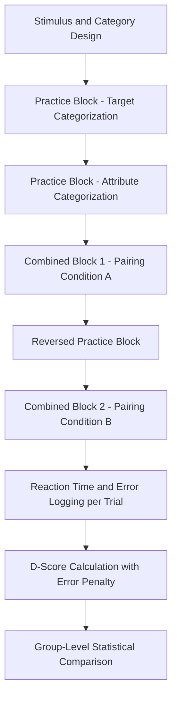

## Implicit Association and Reaction-Time Measures

### Overview

Implicit association and reaction-time measures are a family of research methods that infer automatic, unconscious cognitive associations between concepts (e.g., a brand and an attribute like "trustworthy") by measuring how quickly participants categorize stimuli under different pairing conditions. These methods sit in contrast to explicit self-report (surveys, interviews), which capture what people are willing and able to consciously articulate. In marketing, implicit measures are used because stated brand attitudes and preferences are often influenced by social desirability bias, limited introspective access, and post-hoc rationalization, whereas reaction-time-based associations are harder to consciously control.

### Theoretical Foundations

**Dual-Process Theory**

Most implicit measurement rests on dual-process models of cognition, which distinguish between:

- *System 1 (automatic/implicit)*: Fast, associative, effortless, and largely unconscious processing.
- *System 2 (controlled/explicit)*: Slow, deliberate, effortful, and consciously accessible reasoning.

Implicit reaction-time tasks are designed to tap System 1 associations before System 2 deliberation can intervene, typically by imposing strict response-time pressure (a few hundred milliseconds to a couple of seconds per trial).

**Associative Network Models of Memory**

These measures assume brand knowledge is stored as an associative network of interconnected nodes (brand, attributes, emotions, imagery). When two concepts are strongly linked in memory, activating one facilitates ("primes") faster processing of the other. Reaction-time differences are used as a behavioral signature of the strength of that underlying association.

### The Implicit Association Test (IAT)

**Core Logic**

The IAT, developed by Greenwald, McGhie, and Schwartz, measures the relative strength of association between two target concepts (e.g., Brand A vs. Brand B) and two attribute concepts (e.g., "positive" vs. "negative") by comparing reaction times across two combined sorting conditions.

**Standard IAT Procedure (Marketing Adaptation)**

1. **Practice Block 1**: Participants sort target concepts alone (e.g., press left key for Brand A images, right key for Brand B images).
2. **Practice Block 2**: Participants sort attribute words alone (e.g., left key for positive words, right key for negative words).
3. **Combined Block 1 (Congruent pairing)**: Categories are paired such that, for example, "Brand A + Positive" share one key and "Brand B + Negative" share the other.
4. **Reversed Practice Block**: Target key assignments are swapped.
5. **Combined Block 2 (Incongruent pairing)**: Now "Brand A + Negative" share one key and "Brand B + Positive" share the other.

**D-Score Calculation**

The core implicit measure is the **IAT effect (D-score)**, calculated as the difference in mean reaction time between the incongruent and congruent combined blocks, divided by the pooled standard deviation of those reaction times:

$$D = \frac{\overline{RT}_{\text{incongruent}} - \overline{RT}_{\text{congruent}}}{SD_{\text{pooled}}}$$

A positive D-score in the example above indicates faster responses when Brand A is paired with positive attributes than when paired with negative attributes, interpreted as a stronger implicit positive association with Brand A relative to Brand B. Error trials are typically penalized (via built-in latency penalties) rather than simply excluded, following standard IAT scoring algorithms established in the psychometric literature.

**Marketing Applications of the IAT**

- Measuring implicit brand attitude relative to a competitor
- Testing implicit associations between a brand and specific personality traits (e.g., "innovative" vs. "traditional")
- Assessing implicit self-brand connection (association between the brand and the self-concept)
- Detecting gaps between explicit (stated) and implicit (measured) brand preference, often called the **explicit-implicit gap**, used to flag brands with an attitude that consumers may be reluctant to state directly (relevant in categories with social stigma, such as certain financial products, health categories, or ethically sensitive purchases)

### Related Reaction-Time Paradigms

**Affective Priming Task (APT)**

Participants are briefly shown a prime (e.g., a brand logo) followed by a target word (positive or negative), and must categorize the target as quickly as possible. Faster categorization of congruent target words (positive target following a brand the person associates positively) versus incongruent ones indicates automatic affective association, without requiring the full dual-block IAT structure.

**Extrinsic Affective Simon Task (EAST)**

A variant designed to reduce some of the confounds present in the IAT by using a fixed, extrinsic color-based response rule (participants respond based on stimulus color, not concept category) while the actual stimuli being judged carry the concept of interest, aiming to more cleanly isolate automatic evaluation from task-switching costs.

**Single-Category IAT (SC-IAT) and Brief IAT (BIAT)**

Shortened variants of the standard IAT that evaluate a single target concept against attributes (rather than two contrasted target concepts), useful in market research settings where comparing a brand only to itself (not a named competitor) is preferred, or where survey length constraints make the full multi-block IAT impractical.

**Go/No-Go Association Task (GNAT)**

Participants respond ("go") to stimuli belonging to a target category paired with one attribute, and withhold response ("no-go") to others, with signal detection metrics (sensitivity, d') used instead of simple reaction time, offering an alternative to IAT scoring for isolating single-concept associations.

### Technical Implementation

**Software and Platforms**

Implicit measures are commonly deployed via specialized platforms such as Inquisit (Millisecond Software), PsychoPy, or web-based IAT frameworks (e.g., iatgen, built on jsPsych), which handle the precise millisecond-level timing, randomized trial-order counterbalancing, and standard scoring algorithms required for valid results. [Unverified: specific vendor feature sets and current pricing change over time and should be checked directly against current documentation rather than assumed from general familiarity with the category.]

**Timing Precision Requirements**

Because effects are measured in tens-to-hundreds of milliseconds, reaction-time studies require careful control of measurement precision — browser-based studies in particular must account for variable rendering and input latency across devices, which is a recognized methodological concern for online (as opposed to lab-controlled) implicit testing. [Inference: browser-based timing jitter is generally considered small enough not to invalidate group-level IAT effects for most commercial applications, but it does introduce more noise than lab-based keyboard/response-pad setups, which is why some rigorous implicit-measurement vendors still recommend controlled testing environments for high-stakes studies.]

**Counterbalancing**

Order of combined blocks (congruent-first vs. incongruent-first) must be counterbalanced across participants to control for practice/fatigue effects, since responses in the second combined block are typically faster regardless of condition due to task familiarity.

### Metrics and Outputs

| Metric | Description |
| --- | --- |
| D-score | Standardized implicit association strength (primary IAT outcome) |
| Mean RT per block | Raw reaction time, used in diagnostic/QA checks and some alternative scoring approaches |
| Error rate per block | Used for exclusion criteria and error-penalized scoring |
| Explicit-implicit gap | Difference between self-reported attitude score and D-score, often the most actionable output for marketers |
| Trial-level exclusion rate | Percentage of trials removed for being too fast (anticipatory) or too slow (attention lapse), per standard IAT data-cleaning conventions |

### Example

**Example: Brand vs. Competitor Implicit Attitude Test**

A financial services brand runs a Brand IAT comparing itself to its main competitor on the attribute dimensions "trustworthy" vs. "untrustworthy," with 400 online panelists.

- Explicit survey ratings show near parity: 52% prefer the brand, 48% prefer the competitor on stated trust ratings.
- The IAT D-score, however, shows a moderate implicit preference for the competitor (D = -0.35 on the brand's own scale), indicating faster response times pairing the competitor with "trustworthy" than the focal brand.
- This explicit-implicit gap suggests the brand may have an unaddressed implicit trust deficit not visible in standard survey tracking, prompting further investigation into brand imagery, PR history, or category-level associations. [Inference: this kind of explicit-implicit divergence is a commonly cited use case for implicit testing in applied brand tracking; the specific figures here are illustrative rather than from a cited real study.]

### Limitations and Methodological Considerations

- **Reliability concerns**: IAT test-retest reliability is generally lower than typical explicit self-report scales, a widely acknowledged issue in the psychometric literature on implicit measures, meaning single-administration IAT scores are better interpreted at the group/aggregate level than as a precise individual diagnostic.
- **Construct validity debate**: There is ongoing academic debate about what an IAT score actually reflects — an individual's personal association, versus cultural/environmental associations the individual has simply been exposed to without necessarily endorsing them (this critique is central to the "cultural knowledge vs. personal endorsement" debate in the IAT literature). [Unverified: this remains an actively contested area in social cognition research rather than a settled matter, and interpretations should be presented with appropriate caution in applied reporting.]
- **Predictive validity for actual behavior**: Meta-analytic findings on how strongly IAT scores predict real-world behavior (as opposed to other attitude measures or explicit self-report) have varied and been debated across studies; marketers should treat IAT results as one input among several rather than a standalone predictor of purchase behavior. [Unverified: predictive validity estimates differ meaningfully across the published meta-analyses on this topic, and citing a single effect size as definitive would overstate the certainty of the evidence.]
- **Practice and fatigue effects**: Longer implicit test batteries can introduce noise from participant fatigue, particularly in online panel settings where attention and environment are less controlled than in a lab.
- **Category and stimulus selection sensitivity**: Results can be sensitive to which specific exemplar stimuli (images, words) are chosen to represent each category, meaning study design decisions materially affect obtained scores and require careful pretesting.

### Complementary Methods Often Paired with Implicit Measures

- **Explicit brand attitude surveys**: Used directly alongside implicit measures to calculate the explicit-implicit gap.
- **Facial coding**: Adds a real-time emotional read to complement the cognitive-association read of the IAT.
- **EEG**: Adds neural timing data that can corroborate or extend reaction-time-based implicit findings.
- **Semantic priming / free association tasks**: Qualitative-adjacent methods that can help interpret and contextualize what an implicit association score is actually capturing for a given brand.

**Related Topics**

- Dual-process theory and System 1 / System 2 decision-making in consumer behavior
- Facial coding and automated emotion recognition
- Eye-tracking and visual attention studies
- EEG and neural response measurement for advertising
- Explicit vs. implicit attitude measurement design
- Priming effects in advertising and pricing perception
- Social desirability bias in survey research
- Psychometric reliability and validity standards in consumer research