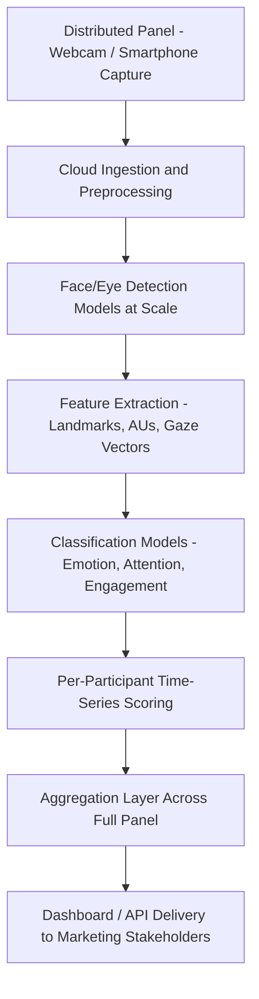

## AI-Scaled Biometric Analysis

### Overview

AI-scaled biometric analysis refers to the use of machine learning and cloud infrastructure to run traditionally lab-bound biometric research methods — eye-tracking, facial coding, EEG, GSR — across large, distributed participant panels, at speeds and sample sizes previously impractical with manual or hardware-intensive setups. Rather than a distinct measurement method of its own, this is best understood as the infrastructure and modeling layer that converts single-participant, lab-based neuromarketing techniques into panel-scale, production-grade research tools, typically by substituting specialized hardware with consumer devices (webcams, smartphones) and human coding with trained predictive models.

### Why Scaling Requires AI

**The Lab-Scale Bottleneck**

Traditional biometric methods (Tobii eye-trackers, FACS-certified human coders, clinical-grade EEG caps) require specialized equipment, trained technicians, and controlled lab environments. This constrains sample sizes to typically dozens of participants per study and limits geographic reach, making it difficult to run biometric research at the sample sizes (hundreds to thousands) that marketers expect from standard quantitative surveys.

**The Consumer-Hardware Substitution**

AI-scaled approaches replace specialized sensors with ubiquitous consumer hardware — a laptop or phone webcam substitutes for an infrared eye-tracker or a trained FACS coder — and compensate for the resulting lower signal quality and precision with machine learning models trained to extract the needed signal (gaze direction, facial AU activation, emotion classification) from lower-fidelity input at scale.

**The Coding Bottleneck**

Manual FACS coding of a single minute of video by a trained human coder can take a substantial multiple of that time to code properly; this does not scale to thousands of respondents. Convolutional neural networks and related computer-vision architectures trained on large labeled facial-expression datasets can perform equivalent classification in near real-time across large participant pools simultaneously.

### Core Architecture Pattern

**Distributed Data Collection**

Participants complete studies remotely via a standard web browser or mobile app, with video/interaction data streamed or uploaded to cloud infrastructure rather than recorded in a controlled lab setting. This is the key structural shift enabling panel sizes in the hundreds or thousands rather than dozens.

**Cloud-Based Model Inference**

Rather than running detection and classification models locally on lab equipment, AI-scaled platforms run inference in the cloud (often GPU-accelerated), allowing the same trained model to process many participants' data streams in parallel, and allowing the vendor to update and improve the underlying model without requiring hardware or software changes on the client side.

**Automated Quality Control**

At scale, manual review of every session for glare, poor lighting, or an out-of-frame face is impractical. AI-scaled platforms typically include automated data-quality classifiers that flag or discard low-confidence sessions (e.g., insufficient face visibility, extreme angle, tracking loss) before they reach aggregate reporting — a step that has no direct equivalent in small, closely supervised lab studies where a human moderator would simply catch these issues live.

**Real-Time or Near-Real-Time Processing**

Many platforms report emotion/attention scores back to the researcher within minutes to hours of data collection completing, compared to the days-to-weeks turnaround typical of manual FACS coding, enabling faster iterative ad-testing and optimization cycles.

### Methods Commonly Scaled via AI

**Webcam-Based Eye-Tracking at Scale**

Gaze-estimation models (frequently based on appearance-based deep learning approaches trained on large eye-image datasets) infer approximate gaze direction from standard webcam video, without requiring dedicated infrared hardware. This trades some spatial precision (adequate for AOI-level "did they look at the logo" analysis) for the ability to run studies with large, geographically distributed samples. See "Eye-tracking and visual attention studies" for the underlying measurement theory.

**Automated Facial Coding at Scale**

CNN-based (and increasingly transformer-based) emotion classifiers process webcam video across large panels, replacing the manual FACS coder. See "Facial coding and automated emotion recognition" for the underlying pipeline and theoretical basis — the "AI-scaled" distinction here is specifically about running that same pipeline as a cloud service across a large, self-administered, remote panel rather than in a supervised lab setting.

**Voice and Speech Emotion Analysis**

An adjacent modality using acoustic features (pitch, tempo, spectral characteristics) and, increasingly, transcribed-text sentiment, to infer emotional state from recorded verbal responses (e.g., open-ended survey answers or moderated interview audio), scaled the same way — cloud inference across many respondents rather than manual qualitative coding.

**Multi-Modal Sensor Fusion**

Some platforms combine two or more of the above signals (e.g., facial coding plus webcam eye-tracking plus response-time data from an accompanying survey) into a single composite engagement or emotional-response score, using a fusion model trained to weight each modality's contribution. This is a genuinely more complex modeling problem than single-modality scaling, since the model must handle asynchronous sampling rates and partial signal availability (a session might have good facial data but poor gaze data, for example).

### Data and Model Considerations

**Training Data and Generalization**

The accuracy of AI-scaled biometric models depends heavily on the diversity and representativeness of their training datasets across demographics, lighting conditions, camera qualities, and device types the panel will actually use in the field — a materially different challenge than validating a model in a single controlled lab environment. [Unverified: current published benchmark accuracy for any specific commercial platform's cross-demographic and cross-device performance should be checked directly against the vendor's own validation documentation rather than assumed, since this is an area where methodology and disclosure practices vary considerably across vendors.]

**Confidence Scoring and Data Cleaning**

Because remote, self-administered sessions have highly variable data quality, AI-scaled platforms typically attach a confidence score to each frame or session-level metric, and apply minimum-confidence thresholds before including a respondent's data in aggregate analysis — a data-cleaning step that is far more central to this method than to controlled lab studies.

**Model Versioning and Longitudinal Comparability**

Because the underlying classification models are periodically retrained and updated by the vendor, scores from a study run in one period may not be perfectly comparable to a study run on an updated model version months later, an operational consideration for brands running longitudinal ad-tracking studies. [Inference: this is a general characteristic of any vendor-managed ML-based measurement service rather than something unique to biometric marketing tools specifically, but it is worth flagging explicitly for tracking-study design since it is easy to overlook.]

### Comparison: Lab-Based vs. AI-Scaled Biometric Research

| Dimension | Lab-Based (Traditional) | AI-Scaled (Cloud/Panel-Based) |
| --- | --- | --- |
| Typical sample size | Dozens (20–60) | Hundreds to thousands |
| Hardware | Specialized (infrared eye-trackers, EEG caps, trained coders) | Consumer webcams/smartphones |
| Data quality control | Live, human-supervised | Automated confidence scoring post-hoc |
| Turnaround time | Days to weeks (especially with manual coding) | Minutes to hours to days |
| Precision/accuracy | Generally higher per-participant fidelity | Lower per-participant precision, offset by sample size |
| Cost per participant | High | Substantially lower |
| Geographic reach | Limited to lab locations (or costly mobile lab deployment) | Global, limited only by panel recruitment |

### Practical Implementation Path for a Marketing Team

1. **Define the measurement objective**: Attention capture, emotional response, implicit brand association, or a combination — this determines which underlying modality (eye-tracking, facial coding, IAT-style reaction-time, or fused) is appropriate.
2. **Select a panel-scale vendor or platform**: Evaluate based on published methodology transparency, sample diversity in training/validation data, data-quality/confidence-scoring practices, and integration options (API vs. dashboard-only).
3. **Design stimulus and AOI/segment structure**: Even at scale, the underlying study design principles from lab-based methods (AOI definition for eye-tracking, baseline calibration for facial coding) still apply and materially affect data quality.
4. **Pilot at small scale first**: Run a small pilot batch to validate data-quality rates and confidence-score distributions before committing to a full-panel field, since remote self-administered data collection can have meaningfully higher dropout/invalid-session rates than lab studies.
5. **Set minimum confidence/quality thresholds**: Establish exclusion criteria for low-confidence sessions before analysis, and report the exclusion rate transparently alongside results.
6. **Integrate with existing research stack**: Many platforms offer APIs to feed biometric scores into existing marketing analytics or experimentation dashboards alongside standard survey and behavioral data.

### Example

**Example: Panel-Scale Ad Testing Program**

A CPG company shifts from quarterly lab-based ad pre-testing (30 participants per ad, ~3 weeks turnaround including manual facial coding) to an AI-scaled webcam-based platform.

- New process: 500 participants per ad, automated facial coding and webcam gaze estimation, delivered within roughly 48 hours of fielding.
- The larger sample enables reliable sub-group analysis (e.g., emotional response by age band or region) that the lab-based sample size could not statistically support.
- Trade-off: per-participant data confidence is lower (some sessions flagged and excluded for poor webcam lighting), and the team must build tolerance for slightly noisier per-participant readings in exchange for statistical power across the larger sample. [Inference: this speed-and-scale-versus-per-participant-precision trade-off is the general and expected trade-off pattern when moving from lab-based to AI-scaled biometric methods; the specific figures here are illustrative.]

### Limitations and Methodological Considerations

- **Precision-for-scale trade-off**: As emphasized throughout, individual-session accuracy is generally lower than dedicated lab hardware; this is an inherent trade-off of the approach, not a flaw specific to any one vendor.
- **Model transparency and auditability**: Proprietary classification models are typically not open for independent audit, meaning marketers are relying on vendor-reported validation rather than being able to verify accuracy claims directly — a genuine limitation relative to methods with fully documented, publishable coding procedures (like manual FACS).
- **Consent and biometric privacy at scale**: Running biometric data collection across large, geographically distributed panels raises the same consent and biometric-privacy-law considerations discussed under facial coding, magnified by cross-jurisdictional complexity when panels span multiple countries with different biometric data regulations. [Unverified: applicable regulatory requirements vary by jurisdiction and are subject to ongoing legal change, so specific compliance obligations should be verified against current law for each panel market rather than assumed to be uniform.]
- **Device and environment heterogeneity**: Unlike a single controlled lab setup, a distributed panel introduces wide variance in camera quality, screen size, ambient lighting, and internet bandwidth, all of which can affect data quality in ways that are harder to standardize than in a lab.
- **Interpretability for stakeholders**: The move from raw human-auditable coding to model-generated scores can make it harder for non-technical marketing stakeholders to understand exactly how a reported emotion or attention score was derived, which places a premium on clear, honest vendor documentation and confidence-interval reporting.

### Complementary Methods and Positioning

AI-scaled biometric analysis is generally best understood as an infrastructure layer that sits on top of — rather than replaces — the underlying measurement methods covered elsewhere in this chapter (eye-tracking, facial coding, implicit association/reaction-time measures). It is frequently combined with:

- **Traditional survey data**: Fused into a single respondent-level dataset for combined explicit/implicit and behavioral analysis.
- **Behavioral/clickstream data**: For website and app testing, biometric signals are increasingly paired with real interaction data (scroll depth, click paths) collected in the same session.
- **Small-sample lab validation studies**: Some rigorous research programs periodically validate their AI-scaled panel results against a smaller, lab-based ground-truth sample to monitor for model drift or accuracy degradation over time.

**Related Topics**

- Eye-tracking and visual attention studies
- Facial coding and automated emotion recognition
- Implicit association and reaction-time measures
- EEG and neural response measurement for advertising
- Data quality and confidence scoring in remote biometric research
- Biometric data privacy regulation (GDPR, BIPA, and cross-jurisdictional compliance)
- Multi-modal sensor fusion in consumer neuroscience
- Longitudinal ad-tracking methodology and model-version comparability