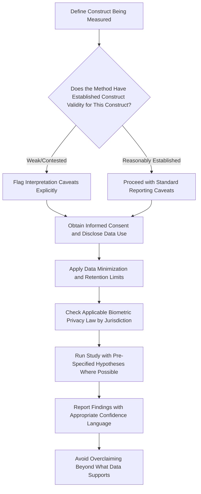

## Validity, Limitations, and Research Ethics

### Overview

This topic addresses the cross-cutting methodological and ethical considerations that apply across all neuromarketing and biometric research methods — eye-tracking, facial coding, implicit association testing, EEG, GSR, and AI-scaled variants of these. Rather than being a distinct measurement technique, this is the critical-evaluation framework marketers and researchers need to responsibly interpret biometric data, avoid overclaiming, and conduct such research within legal and ethical bounds.

### Validity Concepts Applied to Biometric Research

**Construct Validity**

The degree to which a measure actually captures the theoretical construct it claims to measure. This is a persistent challenge across neuromarketing methods:

- Pupil dilation is claimed to measure "cognitive load" or "arousal," but it is also affected by ambient light, making it a non-specific physiological signal rather than a pure measure of the intended construct.
- Facial expression is claimed to measure "felt emotion," but facial expressions can be social/performative (a polite smile) rather than reflecting genuine internal affective state, meaning the measured construct (visible facial muscle activation) is not identical to the target construct (subjective emotional experience).
- IAT scores are claimed to measure "implicit attitude," but as discussed in the implicit-measures topic, there is unresolved academic debate about whether IAT scores reflect personal attitude versus mere cultural-knowledge familiarity — a direct construct validity concern.

**Ecological Validity**

The degree to which findings generalize from the controlled research setting to real-world consumer behavior. Lab-based biometric studies (fixed seating distance for eye-tracking, calibrated lighting for facial coding, quiet rooms for EEG) create conditions quite different from how consumers actually encounter ads, packaging, or websites — distracted, on mobile devices, in variable lighting, often multitasking. [Inference: this gap between controlled measurement conditions and real-world exposure conditions is one of the most commonly raised critiques of lab-based neuromarketing research, though the degree to which it undermines any specific study's conclusions depends on how closely the study's conditions approximate the real use case being generalized to.]

**Predictive Validity**

Whether a biometric measure actually predicts a real business outcome of interest (sales lift, brand choice, ad recall) beyond what traditional survey-based measures already predict. This is the most commercially important validity question and also the hardest to establish rigorously, since it requires linking lab or panel-based biometric scores to independently measured downstream behavior (actual purchase data, verified ad recall weeks later) rather than another proxy measure collected in the same session. [Unverified: published effect sizes for the incremental predictive validity of specific biometric measures over traditional survey methods vary considerably across studies and vendors, and any specific quantitative claim (e.g., "eye-tracking predicts sales X% better than surveys") should be sourced and verified rather than treated as an established general fact, given how much this varies by category, method, and study design.]

**Convergent and Discriminant Validity**

Whether a given biometric measure correlates appropriately with other measures of the same underlying construct (convergent) while remaining distinguishable from measures of different constructs (discriminant). For example, if facial-coded valence and self-reported liking do not correlate at all across many studies, this raises a validity concern about at least one of the two measures (or about the assumption that they should track closely in the first place).

### Statistical and Design Limitations Common Across Methods

**Small Sample Sizes in Lab-Based Studies**

Traditional lab biometric studies (eye-tracking, EEG, manual facial coding) often run with sample sizes in the dozens due to cost and logistics, raising concerns about statistical power for detecting subtle or interaction effects, and about generalizability to the broader target population.

**Multiple Comparisons and Post-Hoc Pattern-Finding**

Biometric data streams (frame-by-frame emotion scores, moment-by-moment gaze data) generate large numbers of potential comparison points (which second spiked, which AOI drew more attention). Without pre-registered hypotheses about which specific timepoints or regions matter, there is a substantial risk of finding statistically "significant" patterns that are actually noise — a general methodological risk sometimes called the "garden of forking paths," which is especially relevant to time-series-rich biometric data.

**Individual Differences and Baseline Variance**

People vary widely in baseline facial expressiveness, resting pupil size, resting skin conductance, and general emotional reactivity, independent of the stimulus being tested. Studies that do not properly baseline-correct or account for these individual differences risk conflating stable individual traits with stimulus-driven effects.

**Demand Characteristics and Reactivity**

The very act of being observed or wired up to sensors can change participant behavior (a version of the general psychological phenomenon of reactivity to being studied), which is a validity concern especially relevant to methods requiring visible equipment (EEG caps, GSR electrodes) as opposed to passive webcam-based measures, which are less likely to trigger this kind of self-consciousness.

**Overclaiming and "Neuro-Hype"**

A well-documented pattern in the applied neuromarketing industry is marketing biometric findings with more scientific certainty and business impact than the underlying data actually supports — sometimes referred to critically as "neuro-hype" or "neuro-washing" in academic critiques of the commercial neuromarketing industry. Reputable vendors and researchers explicitly caveat single-study findings and avoid presenting biometric data as a definitive, singular "truth signal" superior to all other research methods. [Unverified: the prevalence and severity of overclaiming varies substantially across vendors and practitioners in the neuromarketing industry, and specific critique should be directed at specific claims rather than treated as a blanket indictment of the field.]

### Research Ethics Framework

**Informed Consent**

Participants must be clearly informed about what biometric data is being collected (facial video, eye movement, physiological signals), how it will be used, how long it will be retained, and whether it will be shared with third parties, before data collection begins. This is both a standard research-ethics requirement (rooted in human-subjects research principles such as those in the Belmont Report and analogous international frameworks) and, for biometric data specifically, frequently a distinct legal requirement under biometric privacy statutes.

**Data Minimization and Retention**

Ethical (and, in many jurisdictions, legal) practice favors collecting only the data needed for the stated research purpose, and discarding or anonymizing raw biometric data (e.g., raw facial video) once derived features (AU scores, emotion classifications) have been extracted, rather than retaining raw identifiable biometric recordings indefinitely.

**Anonymization and Re-Identification Risk**

Facial video and, to a lesser extent, gaze patterns and physiological signals, carry inherent re-identification risk even when nominally "anonymized," since a face itself is a direct biometric identifier. This distinguishes biometric research data from many other forms of survey data in terms of the privacy risk profile and the corresponding duty of care in storage and access control.

**Vulnerable Populations**

Extra ethical scrutiny applies when biometric research involves children, cognitively vulnerable populations, or other groups with diminished capacity to give fully informed consent, generally requiring additional safeguards (parental consent, simplified consent language, institutional ethics review) beyond standard adult-panel research protocols.

**Right to Withdraw**

Standard human-subjects research ethics require that participants can withdraw at any point without penalty, including requesting deletion of already-collected biometric data — a requirement that has specific technical implications for AI-scaled platforms (discussed in the prior topic), which must be able to locate and delete a specific individual's data from potentially large, distributed cloud storage systems.

**Manipulation vs. Measurement — the Ethical Line**

An important ethical distinction in neuromarketing is between using biometric methods to *measure* consumer response to inform better, more relevant marketing (broadly accepted as legitimate market research) versus using neuroscience-derived insight to deliberately *exploit* known cognitive vulnerabilities or bypass conscious deliberation in ways that could be considered manipulative or that target vulnerable populations unfairly. This distinction is widely discussed in academic and applied ethics literature on neuromarketing, though where exactly to draw the line in specific cases remains genuinely debated rather than settled by clear consensus. [Unverified: this is an area of live ethical and regulatory debate rather than one with a single agreed-upon bright-line standard across jurisdictions or professional bodies.]

### Regulatory and Legal Landscape

**Biometric-Specific Privacy Law**

Several jurisdictions have enacted laws specifically governing biometric data collection, notably imposing requirements around consent, disclosure, and data handling that go beyond general data-protection law (examples in the US include state-level biometric privacy statutes such as Illinois' BIPA; the EU's GDPR separately classifies biometric data used for identification purposes as a "special category" requiring heightened protection). [Unverified: the specific scope, applicability, and current status of any named law should be verified directly, as biometric privacy legislation is an active and evolving area with meaningful differences across jurisdictions and periodic legislative and judicial developments.]

**Industry Self-Regulation**

Professional bodies in the market research and neuromarketing space (e.g., research industry associations) have published ethical guidelines and codes of conduct addressing biometric and neuroscience-based research specifically, generally covering informed consent standards, data protection practices, and appropriate limits on claims made from such research. [Unverified: specific current guidelines should be checked against the relevant professional body's latest published standards, as these are periodically revised.]

**Cross-Border Data Transfer**

For AI-scaled biometric research run across international panels, data-transfer restrictions (e.g., restrictions on transferring EU biometric data outside the EU under GDPR-adjacent frameworks) add a further layer of compliance complexity that purely domestic lab-based studies do not typically encounter.

### A Practical Validity and Ethics Checklist

### Example

**Example: Responsible Interpretation of a Mixed-Method Study**

An agency runs a combined eye-tracking and facial-coding study on a new ad concept, finding strong visual attention to the logo (high fixation count, fast TTFF) but weak positive facial valence during the same viewing period.

- An overclaiming interpretation would report only the attention finding ("consumers are highly engaged with our brand!") while omitting the weak emotional response, presenting a partial picture as if it were comprehensively positive.
- A methodologically sound interpretation reports both findings together, explicitly notes that visual attention and emotional valence are measuring different constructs that do not necessarily move together, and recommends further investigation (e.g., a follow-up qualitative probe) into *why* attention was high but emotional response was flat, rather than asserting a causal explanation the biometric data alone cannot support.
- This illustrates the core ethical-and-validity discipline required in applied neuromarketing reporting: presenting the full pattern of results with construct-appropriate caveats, rather than selectively emphasizing the most commercially flattering finding. [Inference: this pattern of selective emphasis on favorable findings is a recognized general risk in applied commercial research reporting broadly, not unique to biometric methods, but it is particularly worth flagging here given the complexity and interpretability challenges specific to biometric data discussed throughout this chapter.]

### Summary Table: Key Limitations by Method

| Method | Primary Validity/Ethics Concern |
| --- | --- |
| Eye-tracking | Gaze location is an imperfect proxy for cognitive attention (covert attention exists) |
| Facial coding | Facial expression may not equal felt emotion (social/performative expressions) |
| Implicit association (IAT) | Contested construct validity (personal attitude vs. cultural knowledge); lower test-retest reliability than explicit measures |
| AI-scaled methods | Lower per-session precision; model transparency/auditability limits; cross-jurisdictional privacy compliance complexity |
| All methods | Risk of overclaiming business impact beyond what the data supports; small-sample lab statistical power concerns; informed consent and biometric data privacy obligations |

**Next Steps**

- Review construct, ecological, and predictive validity concepts as applied to each specific method covered earlier in this chapter
- Study applicable biometric privacy regulations (GDPR special categories, US state biometric statutes) relevant to target research markets
- Examine professional research-industry ethical guidelines for neuroscience-based market research
- Explore pre-registration practices as a safeguard against post-hoc pattern-finding in biometric time-series data
- Investigate published meta-analyses on predictive validity of biometric measures relative to traditional survey methods
- Consider multi-method triangulation (combining biometric with explicit self-report and behavioral data) as a mitigation strategy for single-method validity limitations