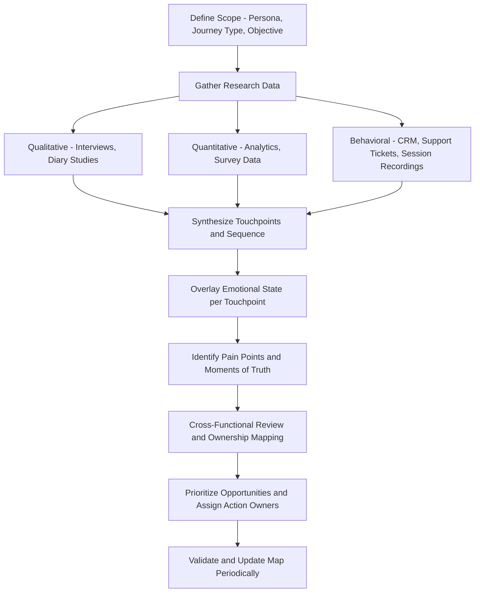

## Customer Journey Mapping and Touchpoints

### Overview

Customer journey mapping is a research and visualization method for documenting the complete sequence of interactions a customer has with a brand — across channels, over time, and across the full arc from initial awareness through to post-purchase and advocacy. A **touchpoint** is any discrete point of contact between a customer and the brand (an ad impression, a website visit, a customer service call, a physical store visit, a product-use moment). Journey mapping is a foundational customer experience (CX) discipline used to identify friction, moments of emotional significance, channel gaps, and opportunities for intervention across the full customer lifecycle, rather than analyzing any single interaction in isolation.

### Core Concepts

**Journey vs. Funnel**

A traditional marketing funnel presents customer progression as a linear, one-directional sequence (awareness → consideration → purchase). Journey mapping treats the customer path as non-linear and often cyclical — customers loop back, skip stages, re-enter consideration after purchase (for repeat or subscription products), and move across multiple touchpoints in parallel rather than in strict sequence. This distinction matters because a funnel view can obscure repeat-engagement patterns, post-purchase experience, and multi-channel behavior that a journey view is specifically designed to capture.

**Touchpoints**

Individual points of interaction, typically categorized by:

- *Channel*: Digital (website, app, email, social media, paid ads), physical (retail store, event, product packaging), and human (call center, sales rep, in-store staff)
- *Ownership*: Brand-owned (company website), partner-owned (a retailer selling the product), or customer-owned/earned (a friend's recommendation, a review site)
- *Journey stage*: Pre-purchase, purchase, and post-purchase touchpoints

**Moments of Truth**

A subset of touchpoints identified as disproportionately influential on the customer's overall perception and decision — a concept popularized in marketing through P&G's "First Moment of Truth" (the shelf/purchase decision) and "Second Moment of Truth" (the product-use experience), later extended by Google's proposed "Zero Moment of Truth" (online research prior to purchase). Journey mapping exercises typically aim to identify which touchpoints function as moments of truth for a given brand and category, since these merit disproportionate design and investment attention relative to lower-stakes touchpoints.

**Journey Stages (Common Framework)**

While specific stage labels vary by organization, a commonly used generalized structure includes:

1. **Awareness** — customer becomes aware the brand/category/solution exists
2. **Consideration** — customer actively evaluates options
3. **Decision/Purchase** — customer commits and transacts
4. **Onboarding/First Use** — customer's initial experience with the product/service
5. **Retention/Ongoing Use** — continued usage and engagement over time
6. **Advocacy/Loyalty** — customer recommends, reviews, or repurchases

**Emotional Journey Overlay**

A defining feature of mature journey maps (versus a simple touchpoint list) is an overlay tracking the customer's emotional state — often visualized as a line graph of sentiment (frustration, delight, confusion, satisfaction) plotted against the sequence of touchpoints, making it visually apparent where emotional dips (pain points) and peaks (delight moments) occur across the journey.

### Anatomy of a Journey Map

A typical journey map document/artifact includes the following components, usually organized as rows in a matrix with journey stages as columns:

| Component | Description |
| --- | --- |
| Stages | The high-level phases of the journey (as above) |
| Customer actions | What the customer is actually doing at each stage |
| Touchpoints | Specific channels/interactions occurring at each stage |
| Customer thoughts | What the customer is thinking (often derived from research, e.g., "Am I getting the best price?") |
| Customer emotions | Emotional state at each stage, often plotted as a curve |
| Pain points | Friction, confusion, or frustration identified at each stage |
| Opportunities | Identified areas for improvement or intervention |
| Internal ownership | Which team/department owns each touchpoint (critical for cross-functional accountability) |

### Journey Mapping Methodology

**Research Data Sources**

Robust journey maps are built from converging evidence across multiple data types rather than internal assumption alone:

- *Qualitative*: Customer interviews, contextual inquiry, diary studies (where participants log their experience in real time across an extended period)
- *Quantitative/Behavioral*: Web/app analytics (page paths, drop-off points), CRM interaction logs, customer support ticket themes, call center transcripts, session recordings and heatmaps
- *Survey-Based*: Post-touchpoint satisfaction surveys, NPS (Net Promoter Score) verbatims tied to specific journey stages

**Persona Alignment**

Journey maps are typically built per customer segment or persona rather than as a single generic map, since different customer types (e.g., a first-time buyer vs. a long-term loyal customer, or a price-sensitive segment vs. a premium segment) often follow meaningfully different paths and encounter different pain points.

**Cross-Functional Workshops**

Because touchpoints span multiple internal departments (marketing owns awareness-stage content, sales owns the purchase interaction, customer service owns support touchpoints, product owns the in-app experience), effective journey mapping is typically conducted as a cross-functional workshop exercise rather than a single-department deliverable, specifically to surface handoff gaps between departments where customers commonly experience friction.

### Types of Journey Maps

**Current-State Map**

Documents the journey as it actually exists today, based on research into real customer behavior and experience — the diagnostic starting point for most journey-mapping initiatives.

**Future-State Map**

Documents an aspirational, redesigned journey reflecting planned improvements, used to align stakeholders around a target experience and to structure a roadmap of initiatives needed to close the gap from current to future state.

**Day-in-the-Life Map**

A broader map that situates brand touchpoints within the customer's wider daily life and context (not just brand interactions), useful for identifying white-space opportunities where a brand could insert a relevant touchpoint that doesn't currently exist.

**Service Blueprint**

A more operationally detailed extension of a journey map that adds a "backstage" layer — the internal processes, systems, and staff actions required to deliver each customer-facing touchpoint — making it a preferred tool when the objective is operational redesign rather than purely customer-experience diagnosis.

### Journey Mapping and Omnichannel Considerations

**Channel Fragmentation**

Modern customer journeys typically span many touchpoints and channels before and after purchase, often switching between devices (mobile research, desktop purchase) and channels (social discovery, in-store fulfillment) within a single journey — a pattern generally referred to as **omnichannel behavior**, which complicates both measurement (attributing influence across touchpoints) and design (ensuring consistent experience across channels).

**Attribution Challenges**

Because customers interact with multiple touchpoints before converting, isolating the specific influence of any single touchpoint is methodologically difficult; this connects journey mapping to the broader discipline of marketing attribution modeling (multi-touch attribution, media mix modeling), which addresses the quantitative side of the "which touchpoints actually drove the outcome" question that journey mapping addresses more qualitatively/experientially.

**Journey Orchestration Platforms**

Marketing technology platforms (CDPs — customer data platforms — combined with journey orchestration and marketing automation tools) are increasingly used to operationalize journey maps by triggering personalized, touchpoint-specific actions (a follow-up email after cart abandonment, a retention offer after a support ticket) based on a customer's real-time position in their journey, connecting the strategic mapping exercise to tactical, automated execution. [Unverified: specific platform capabilities and market positioning change frequently in this fast-moving martech category, so any claims about a specific named platform's current features should be verified directly against current vendor documentation.]

### Example

**Example: SaaS Subscription Journey Map**

A B2B SaaS company maps the journey for a mid-market customer persona:

- **Awareness**: LinkedIn ad and industry webinar (customer emotion: neutral curiosity)
- **Consideration**: Website comparison page, free trial signup, sales demo call (emotion: cautious interest, some confusion over pricing tiers — flagged as a pain point)
- **Decision**: Contract negotiation with sales, procurement approval internally at the customer's company (emotion: mild frustration at contract turnaround time — flagged pain point, owned by Legal/Sales)
- **Onboarding**: Product setup, first login, initial support ticket about a configuration issue (emotion: dips sharply here — identified as the most significant pain point in the map, prompting an onboarding-flow redesign initiative)
- **Retention**: Monthly usage, quarterly business review call with customer success (emotion: recovers and stabilizes to satisfaction)
- **Advocacy**: Case study participation, referral to another company (emotion: high — identified as an underleveraged moment of truth, prompting a new referral-incentive program)

This map's sharpest emotional dip at onboarding — rather than at the pricing-confusion point in consideration — redirects the company's improvement investment toward onboarding flow redesign, illustrating how mapping the full emotional curve (rather than assuming the sales/pricing stage is the primary friction point) changes prioritization. [Inference: this is an illustrative example constructed to demonstrate the methodology, not data from a specific named company.]

### Common Pitfalls in Journey Mapping

- **Building maps from internal assumption rather than research**: A map built purely from internal stakeholder workshops without underlying customer research risks reflecting how the organization *thinks* the journey works rather than how customers actually experience it.
- **Treating the map as a one-time deliverable**: Customer journeys evolve as channels, competitors, and customer expectations change; maps that are never revisited become stale and can misdirect resources toward outdated pain points.
- **Insufficient cross-functional buy-in**: A map produced solely by the marketing team, without input or ownership commitment from sales, product, and support, often fails to drive actual organizational change since the identified pain points frequently sit in other departments' domains.
- **Over-generalizing a single persona's journey**: Applying one journey map to an entire heterogeneous customer base can obscure meaningfully different experiences across segments.
- **Stopping at diagnosis without prioritized action**: A journey map that identifies many pain points without prioritization criteria (impact, feasibility, cost) can result in analysis without follow-through.

### Complementary Frameworks

- **Service Blueprinting**: Adds the internal operational/systems layer behind each customer-facing touchpoint.
- **Jobs-to-be-Done (JTBD) Framework**: Complements journey mapping by focusing on the underlying customer motivation ("job") driving engagement at each stage, rather than just the sequence of actions.
- **Net Promoter Score (NPS) and Customer Satisfaction (CSAT) Tracking**: Provides ongoing quantitative pulse-checks that can validate or update the emotional-curve assumptions in a journey map over time.
- **Multi-Touch Attribution Modeling**: Provides the quantitative complement to the qualitative/experiential view of touchpoint influence that journey mapping offers.

**Related Topics**

- Service blueprinting and backstage process design
- Moments of truth and the Zero Moment of Truth (ZMOT) concept
- Omnichannel marketing strategy and channel consistency
- Multi-touch attribution and marketing mix modeling
- Customer Data Platforms (CDPs) and journey orchestration technology
- Net Promoter Score (NPS) and customer satisfaction measurement
- Jobs-to-be-Done (JTBD) framework
- Persona development and segmentation research methods