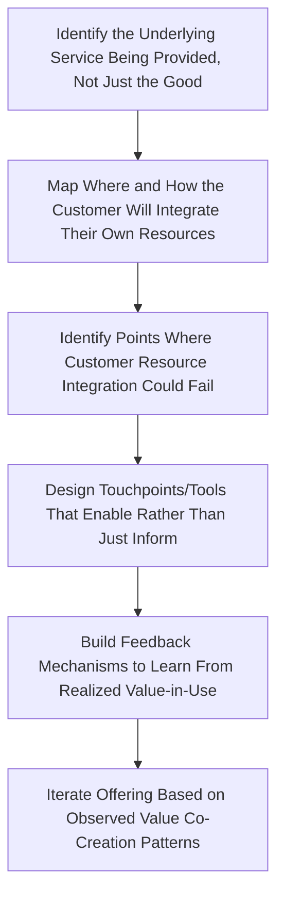

## Service-Dominant Logic and Co-Creation

### Overview

Service-Dominant (S-D) Logic is a marketing theory framework, introduced by Stephen Vargo and Robert Lusch in their influential 2004 article, that proposes services (rather than goods) as the fundamental basis of economic exchange. It represents a paradigm shift from viewing marketing as the exchange of tangible outputs to viewing marketing as a process of applying competences (knowledge and skills) for the benefit of another party, with value emerging through use and interaction rather than being embedded in a manufactured object. Co-creation is the closely related concept describing how value is generated jointly by the firm and the customer (and often other actors) rather than produced solely by the firm and simply delivered to a passive consumer.

### From Goods-Dominant to Service-Dominant Logic

**Goods-Dominant (G-D) Logic (the Traditional View)**

The conventional marketing paradigm that S-D logic positions itself against treats:

- Value as embedded in tangible goods during production ("value-in-exchange")
- The firm as the sole creator of value, with the customer as a passive recipient/consumer of that pre-made value
- Marketing's role as primarily persuading customers to purchase already-created value
- Services as a residual category — essentially "goods that lack tangibility"

**The Core Shift in S-D Logic**

S-D logic inverts these assumptions:

- All economic exchange is fundamentally about exchanging *service* (the application of competences for another's benefit), with goods understood as distribution mechanisms for service (a washing machine is a mechanism for delivering the service of "clean clothes," not an end in itself)
- Value is co-created by the firm and customer together, not created by the firm alone and delivered to the customer
- Value emerges specifically during use, in context ("value-in-use" / "value-in-context"), rather than being fixed at the point of production or exchange
- The customer is always a co-creator of value, never merely a passive recipient

### Foundational Premises of S-D Logic

Vargo and Lusch articulated the framework through a set of foundational premises (subsequently revised across multiple published updates). Key premises commonly cited in marketing curricula include:

1. **Service is the fundamental basis of exchange** — goods are merely a distribution mechanism for service provision.
2. **Value is co-created by multiple actors, always including the beneficiary** — the customer is never a passive recipient of value.
3. **All economic and social actors are resource integrators** — value emerges from actors combining and applying their own resources (knowledge, skills, other goods/services) together.
4. **Value is always uniquely and phenomenologically determined by the beneficiary** — value-in-use is experienced subjectively and contextually, meaning the "same" service can create different value for different customers or the same customer in different contexts.
5. **Operant resources are the fundamental source of competitive advantage** — S-D logic distinguishes *operand resources* (static resources that must be acted upon, like raw materials) from *operant resources* (dynamic resources that act upon other resources, like knowledge and skills), and argues operant resources are the true drivers of value creation and differentiation. [Unverified: the exact numbering and wording of the foundational premises has been revised by the original authors across several published updates since 2004, so the precise list should be checked against the current version of the framework if exact citation is required.]

### Co-Creation in Practice

**Value-in-Use vs. Value-in-Exchange**

The central practical implication of S-D logic is that a firm cannot unilaterally "deliver" value to a customer at the point of sale; value is only realized when the customer actually uses the offering in their own context, combined with their own resources, skills, and circumstances. A software product has no realized value sitting unused on a customer's device — value is co-created only when the customer applies it to their own task, in their own way.

**Resource Integration**

Customers are understood as active integrators of resources — combining the firm's offering with their own knowledge, other products/services, social networks, and effort to produce an outcome. This reframes the customer's role from "buyer of a finished product" to "active participant in producing their own outcome," with the firm's offering being one input among several the customer integrates.

**Co-Production vs. Co-Creation (Important Distinction)**

These terms are sometimes used loosely but have a meaningful conceptual distinction in the literature:

- *Co-production* refers to customer participation in the actual production/design process of the offering itself (e.g., customizing a product configuration, contributing to product design, self-service assembly).
- *Co-creation of value* is the broader S-D logic concept referring to value being jointly generated through use and interaction, which occurs even without direct customer participation in production (e.g., simply using a well-designed service in a way that fits the customer's context still constitutes co-creation of value-in-use).

### Practical Co-Creation Mechanisms in Marketing

**Customer Co-Design**

Directly involving customers in the design or configuration of products/services — mass customization platforms, open innovation contests, customer advisory panels providing input on new product development.

**User-Generated Content and Community Co-Creation**

Customers contributing content, reviews, tutorials, or peer support that becomes part of the brand's overall value proposition for other customers — a common mechanism in software (community forums, user-created plugins/extensions) and consumer brands (user-generated marketing content).

**Self-Service and Configuration Tools**

Interactive tools (product configurators, DIY platforms, self-service dashboards) that let the customer actively shape the final offering to their own context, embodying the S-D logic principle that the customer is integrating their own knowledge of their needs into the final realized value.

**Feedback Loops and Iterative Development**

Agile/iterative product development approaches that treat customer feedback as an ongoing input into the evolving offering (rather than a one-time market research exercise before launch), reflecting the S-D logic view of the customer as a continuous participant in value creation rather than a one-time transaction point.

**Platform and Ecosystem Business Models**

Multi-sided platforms (e.g., marketplaces connecting buyers and sellers, app-store ecosystems) are frequently analyzed through an S-D logic lens because they explicitly depend on multiple actors (platform operator, third-party developers/sellers, end users) jointly integrating resources to create value, rather than a single firm producing a finished good.

### Comparative Framework

| Dimension | Goods-Dominant Logic | Service-Dominant Logic |
| --- | --- | --- |
| Unit of exchange | Tangible goods | Application of competences (service) |
| Value creation | By the firm, embedded in the product | Co-created by firm and customer together |
| Customer role | Passive recipient/consumer | Active co-creator and resource integrator |
| Value location | Value-in-exchange (fixed at point of sale) | Value-in-use / value-in-context (emerges during use) |
| Source of advantage | Operand resources (tangible assets, raw materials) | Operant resources (knowledge, skills, capabilities) |
| Marketing's role | Persuade purchase of pre-created value | Facilitate and support the customer's value-creation process |

### Relationship to Customer Experience and Journey Design

S-D logic provides the theoretical underpinning for why modern customer experience (CX) practice emphasizes ongoing, contextual, and personalized engagement rather than a one-time transactional sale:

- If value is realized only during use (value-in-use), then the post-purchase journey (onboarding, ongoing usage, support) is where the *majority* of actual value creation occurs — directly justifying the heavy CX and journey-mapping investment in post-purchase stages discussed under "Customer journey mapping and touchpoints."
- If customers are active co-creators, then journey touchpoints should be designed to *enable* customer resource integration (good onboarding, intuitive self-service, responsive support) rather than purely to *persuade* or *inform*, reframing many CX touchpoints from persuasion moments into value-creation-support moments.
- Moments of truth (from journey mapping) can be reinterpreted through an S-D lens as moments where the customer's capacity to successfully integrate their own resources with the firm's offering is most at risk (e.g., a confusing onboarding flow is a moment where resource integration breaks down, not just a moment of poor "delivery").

### Practical Application Workflow

### Example

**Example: Reframing a Fitness App Through S-D Logic**

A G-D logic view of a fitness tracking app treats the product as a finished good: features, UI, and workout content are designed and "delivered" to the user, and success is measured by download and subscription numbers.

An S-D logic reframing recognizes:

- The actual value ("feeling fitter, achieving a goal") is co-created only when the user integrates the app with their own motivation, schedule, physical starting point, and effort — the app alone creates no value sitting unused.
- The company's role shifts from "deliver a complete fitness solution" to "provide resources (workout plans, tracking, community, reminders) that support the user's own resource integration process."
- This reframing motivates specific design choices: onboarding that adapts to the user's specific goals and constraints (supporting personalized resource integration), community features that let users co-create motivational content for each other (co-creation among customers, not just between firm and customer), and adaptive plans that respond to logged progress (supporting the iterative, context-specific nature of value-in-use).
- Success metrics shift accordingly from pure acquisition/download numbers toward engagement and outcome-realization metrics (workout completion rates, goal achievement, community participation) that more directly reflect whether value-in-use is actually being realized. [Inference: this fitness-app reframing is a constructed illustrative example applying S-D logic principles, not a case study of a specific named company.]

### Critiques and Limitations

- **Abstraction and practical applicability**: A commonly raised critique is that S-D logic operates at a high level of philosophical/theoretical abstraction, making it more useful as a conceptual reorientation for strategic thinking than as a directly operational tool with concrete metrics — practitioners often need to translate its premises into more specific frameworks (like journey mapping or JTBD) to apply it day-to-day.
- **Risk of definitional overreach**: Critics have noted that defining virtually all economic activity as "service" (including the exchange of tangible goods) can dilute the term's usefully distinguishing power, since a framework that redefines everything as one category can become harder to falsify or apply with precision.
- **Measurement challenges**: Because value-in-use is defined as inherently subjective, contextual, and beneficiary-determined, it is inherently harder to measure with standard quantitative marketing metrics than the more concrete "value-in-exchange" (price paid, units sold) it displaces conceptually — a genuine practical tension between the theory's insight and applied measurement needs. [Inference: this measurement-difficulty critique follows logically from the theory's own core claim about the subjective, context-dependent nature of value-in-use, rather than being an incidental implementation problem.]
- **Not universally adopted terminology**: While highly influential in academic marketing theory, S-D logic terminology (operant/operand resources, value-in-use) is not uniformly adopted across all applied marketing and CX practice, where related but differently labeled concepts (customer success, product-led growth, experience design) are often used to capture similar underlying ideas without explicit reference to the S-D logic framework.

### Complementary Frameworks

- **Customer Journey Mapping**: Provides the tactical touchpoint-level tool for identifying where resource-integration support is needed across the customer lifecycle.
- **Jobs-to-be-Done (JTBD)**: Complements S-D logic's emphasis on customer-context value by focusing specifically on the underlying "job" the customer is trying to accomplish through resource integration.
- **Customer Success Management**: An applied business function in SaaS and subscription businesses that operationalizes many S-D logic principles (ongoing value realization, proactive support of customer outcomes) without necessarily using S-D logic terminology directly.
- **Design Thinking and Co-Design Methodologies**: Provide practical facilitation techniques for structured customer co-creation sessions (co-design workshops, participatory design).

**Related Topics**

- Customer journey mapping and touchpoints
- Value-in-use and value-in-context measurement approaches
- Jobs-to-be-Done (JTBD) framework
- Customer success management in subscription/SaaS business models
- Platform and ecosystem business model design
- Open innovation and crowdsourced product development
- Resource-based view of the firm (operant vs. operand resources)
- Design thinking and participatory co-design methods