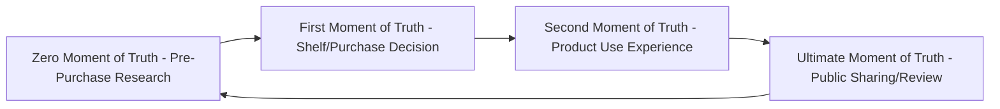
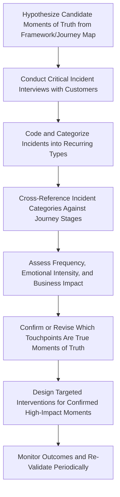

## Moments of Truth and Critical Incidents

### Overview

Moments of truth and critical incidents are two related but distinct concepts used to identify which specific customer interactions carry disproportionate weight in shaping overall satisfaction, loyalty, and brand perception. **Moments of truth** are touchpoints identified, generally in advance or through pattern analysis, as structurally high-stakes for a given business or category. **Critical incidents** are a research methodology for retrospectively identifying, from customers' own accounts, the specific interactions that most strongly drove a positive or negative outcome. Together they provide both a predictive framework (which touchpoints likely matter most) and an empirical method (which touchpoints customers actually report as mattering most) for prioritizing customer experience investment.

### Moments of Truth: Origins and Core Framework

**Origin of the Term**

The concept traces to Jan Carlzon, former CEO of Scandinavian Airlines (SAS), who popularized "moment of truth" in his account of a 1980s customer-service turnaround, describing each brief interaction between a customer and a frontline employee as an opportunity where the company's reputation is "won or lost" in that instant. [Unverified: while widely attributed to Carlzon in the business literature, the precise originating context and exact framing details are best confirmed against Carlzon's own published account for exact citation purposes.]

**The First and Second Moments of Truth (P&G Framework)**

Procter & Gamble popularized an influential two-part framework in the mid-2000s:

- **First Moment of Truth (FMOT)**: The instant a shopper encounters a product on the shelf (physical or, by extension, digital) and decides, typically within seconds, whether to purchase it — emphasizing the disproportionate importance of packaging, shelf presence, and immediate visual/informational cues at the point of purchase decision.
- **Second Moment of Truth (SMOT)**: The customer's experience actually using the product after purchase, which shapes satisfaction, repurchase intent, and word-of-mouth — emphasizing that the purchase decision is not the end of the influence process but the midpoint.

**The Zero Moment of Truth (ZMOT)**

Google introduced the **Zero Moment of Truth** concept to describe the research and information-gathering stage occurring *before* a shopper ever reaches the physical or digital shelf — online searches, review reading, comparison shopping, and social research that shape the decision before the FMOT occurs. This concept reflects the shift toward digital pre-purchase research as an increasingly decisive stage in the customer decision journey, effectively adding a stage earlier than the original P&G framework accounted for. [Unverified: as with any framework tied to a specific technology era, the exact continued relevance and terminology usage of ZMOT should be checked against current marketing discourse, since digital research behavior and the platforms mediating it continue to evolve since the concept's introduction.]

**Ultimate Moment of Truth (UMOT)**

A further extension sometimes referenced in marketing literature, describing the moment when a customer's post-use experience is shared publicly (a review, social post, or word-of-mouth account) — completing the loop by feeding back into other customers' Zero Moment of Truth research for future purchase decisions.

### Extended Moments of Truth Framework (Sequential View)

This sequential/cyclical view illustrates that the Ultimate Moment of Truth (public sharing) directly feeds the Zero Moment of Truth (pre-purchase research) of subsequent customers, creating a self-reinforcing loop connecting one customer's post-purchase experience to the next customer's pre-purchase research — a structural link that connects moments-of-truth theory directly to word-of-mouth and review-based marketing dynamics.

### Critical Incident Technique (CIT)

**Origin and Purpose**

The **Critical Incident Technique** is a qualitative research methodology originally developed by industrial psychologist John Flanagan in the context of aviation and occupational performance research, later widely adapted into service marketing and customer experience research. It involves asking customers to recall and describe, in their own words, specific incidents (not general impressions) that stood out as particularly satisfying or dissatisfying in their experience with a service or brand.

**Core Methodology**

1. **Elicit specific incidents**: Rather than asking "How satisfied are you with our service?" (a general attitude question), CIT asks customers to recall a *specific event*: "Describe a time when you were especially satisfied [or dissatisfied] with [service]. What happened? What led up to it? What made it stand out?"
2. **Capture detailed narrative**: Responses are recorded as detailed behavioral accounts — what happened, who was involved, what the outcome was — rather than abstract ratings.
3. **Categorize into incident types**: Collected incidents across many respondents are coded and grouped into recurring categories (e.g., "employee went out of way to solve problem," "system failure with no recovery," "unexpected delay with poor communication").
4. **Identify frequency and severity patterns**: Categories are analyzed for how often they occur and how strongly they are associated with satisfaction or dissatisfaction, surfacing which incident types most reliably predict strong positive or negative outcomes.

**Distinguishing CIT from General Satisfaction Surveys**

Standard satisfaction surveys (CSAT, NPS) capture an aggregate, generalized sentiment score but do not by themselves reveal *which specific event* drove that sentiment. CIT is specifically designed to surface the causal, event-level detail that aggregate satisfaction metrics cannot capture on their own, making it a complementary rather than competing method — CIT is often used to explain the "why" behind patterns first identified through quantitative satisfaction tracking.

### Service Failure and Recovery: A Key CIT-Derived Insight

**The Service Recovery Paradox**

A frequently cited finding emerging from critical-incident and service-failure research is that a customer who experiences a service failure that is then resolved exceptionally well can, in some circumstances, end up with *higher* satisfaction than a customer who experienced no failure at all — a phenomenon termed the **service recovery paradox**. [Unverified: this effect has been found inconsistently across studies in the service marketing literature — some research supports it under specific conditions (e.g., first-time failure, high-quality recovery), while other research finds it does not reliably replicate or that repeated failures erode any recovery benefit; it should be presented as a debated and conditional finding rather than a universal rule.]

**Implications for CX Design**

This line of research reframes failure-recovery moments (a specific, common category of critical incident) as genuine opportunities rather than purely defensive necessities — but the appropriate practical takeaway, given the mixed evidence above, is that recovery quality matters enormously when failures occur, not that firms should be indifferent to preventing failures in the first place on the assumption that good recovery will always offset them.

### Identifying and Prioritizing Moments of Truth in Practice

**Combining Predictive Framework and Empirical Method**

In applied CX work, moments-of-truth thinking (predicting which touchpoints are *structurally* likely to matter — purchase decision, first use, service failure/recovery) is typically combined with critical incident research (empirically confirming which touchpoints customers *actually* report as most memorable and influential for a specific brand/category), since structural assumptions about importance do not always match what turns out to be empirically most decisive for a given customer base.

**Prioritization Criteria**

Once candidate moments of truth are identified (through either framework-based prediction or CIT-based research), they are typically prioritized using criteria such as:

- *Frequency*: How often does this touchpoint occur across the customer base?
- *Emotional intensity*: How strong is the associated positive/negative sentiment (drawing on the emotional-curve overlay discussed in customer journey mapping)?
- *Business impact*: Is this touchpoint empirically linked to churn, repurchase, or advocacy behavior?
- *Controllability*: Can the organization realistically intervene and improve this touchpoint, or is it dependent on factors outside its control?

### Practical Application Workflow

### Example

**Example: Applying CIT to a Retail Banking Journey**

A retail bank conducts critical incident interviews with 80 customers, asking each to describe one especially satisfying and one especially dissatisfying interaction with the bank in the past year.

- Dissatisfying incidents cluster heavily around one category: unexpected fees or charges discovered without prior warning, frequently described with strong language about feeling "deceived" or "blindsided" — identified as a high-severity, high-frequency negative moment of truth.
- Satisfying incidents cluster around a different category: a staff member proactively resolving a problem the customer hadn't even fully articulated yet, often during a branch visit or phone call — identified as a high-impact positive moment, though less frequent than the negative fee-related pattern.
- This pattern, uncovered specifically through incident-level narrative research rather than general satisfaction scores, leads the bank to prioritize proactive fee-disclosure redesign (addressing the highest-frequency negative incident category) ahead of other candidate improvements that a purely framework-based "moments of truth" prediction (e.g., assuming the loan-application process was the primary pain point) might have prioritized instead. [Inference: this is a constructed illustrative example demonstrating the CIT methodology and its potential to surface non-obvious priorities, not data from a specific named institution.]

### Limitations and Methodological Considerations

- **Recall and self-report bias**: Critical incident data relies on customer memory and self-reported narrative, which is subject to recency bias (more recent incidents are recalled more easily) and can be shaped by the customer's current overall sentiment toward the brand at the time of the interview, rather than being a perfectly objective account of what happened.
- **Coding subjectivity**: Categorizing free-text incident narratives into discrete categories involves researcher judgment, introducing potential inter-coder reliability concerns similar to those discussed for manual facial coding in the neuromarketing chapter — well-designed CIT studies typically use multiple independent coders and report inter-rater agreement to address this.
- **Sample and category saturation**: CIT studies typically continue interviewing until "category saturation" is reached (new interviews stop revealing new incident categories), and studies that stop collecting data too early risk missing important but less frequently occurring incident types.
- **Contested universality of the service recovery paradox**: As noted above, this widely cited finding does not reliably replicate across all study conditions and should not be treated as a guaranteed effect when designing recovery-focused interventions.
- **Framework-based predictions can miss empirically dominant moments**: As the banking example illustrates, structurally intuitive assumptions about which touchpoints matter most (e.g., assuming the highest-friction visible process is the most important moment of truth) can be contradicted by what customers actually report as most influential, underscoring why empirical CIT research is a valuable complement to framework-based prediction alone.

### Complementary Methods and Frameworks

- **Customer Journey Mapping**: Provides the structural sequence and emotional-curve context within which moments of truth and critical incidents are situated and prioritized.
- **Net Promoter Score (NPS) and CSAT Tracking**: Provides the aggregate quantitative signal that critical incident research is often used to explain at the causal, event level.
- **Service Blueprinting**: Provides the internal operational view needed to design and implement interventions once a critical moment of truth has been identified.
- **Root Cause Analysis**: A complementary technique sometimes applied after CIT to further investigate *why* a given negative incident category recurs, tracing it back to underlying process or system failures.

**Related Topics**

- Customer journey mapping and touchpoints
- Service-dominant logic and co-creation
- Service blueprinting and backstage process design
- Net Promoter Score (NPS) and customer satisfaction measurement
- Service failure and recovery strategy
- Word-of-mouth and online review dynamics
- Qualitative coding methods and inter-rater reliability
- Root cause analysis in service operations