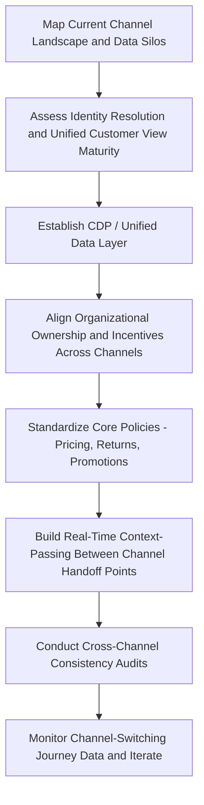

## Omnichannel Experience Consistency

### Overview

Omnichannel experience consistency refers to the design principle and operational discipline of ensuring a customer receives a coherent, continuous experience regardless of which channel or device they use to interact with a brand, and regardless of how many times they switch between channels within a single journey. It extends beyond simply being present on multiple channels (multichannel) to ensuring those channels are integrated, synchronized, and mutually aware of the customer's state — so that a customer can begin an interaction on one channel and continue it seamlessly on another without repetition, contradiction, or loss of context.

### Multichannel vs. Cross-Channel vs. Omnichannel

**Multichannel**

The brand operates across several independent channels (store, website, app, call center), but each channel functions as its own silo with separate data, inventory visibility, and customer history. A customer's cart on the website may not be visible to a call-center agent, and a return initiated in-store may not be reflected in the customer's online order history in real time.

**Cross-Channel**

Some data and processes are shared between specific channel pairs (e.g., online order pickup in-store), but integration is often built as point-to-point connections between two channels rather than a unified underlying system, which can create inconsistent experiences depending on which specific channel combination a customer uses.

**Omnichannel**

All channels are unified around a single, shared view of the customer, inventory, and interaction history, such that channel boundaries become invisible to the customer's experience — they can start a return online, continue the conversation with a store associate who has full context, and receive a follow-up email that reflects the resolution, all without re-explaining themselves. Omnichannel is best understood as the maturity end-state of channel integration, with multichannel and cross-channel representing earlier, more fragmented stages along the same continuum.

### Dimensions of Consistency

**Data Consistency**

The same customer record — profile, purchase history, preferences, current cart, open support tickets — must be accessible and current across every channel and every employee-facing system, requiring a unified underlying data architecture (commonly a Customer Data Platform, or CDP) rather than separate databases per channel.

**Visual and Brand Consistency**

Design language, tone of voice, and brand identity should be recognizably consistent across web, app, email, physical packaging, and in-store environments, so the brand feels like a single coherent entity rather than a collection of disconnected properties — a more traditional brand-management concern that remains foundational even as digital channel complexity increases.

**Functional/Process Consistency**

Core processes (returns, loyalty point redemption, price matching, promotions) should function equivalently and honor the same rules regardless of which channel the customer initiates them through, avoiding situations where a promotion is honored online but not in-store, or a return policy differs by channel in ways not clearly communicated upfront.

**Contextual/Conversational Continuity**

When a customer switches channels mid-interaction (e.g., starts a chat with a bot, escalates to a phone call), the new channel/agent should have access to the full prior context, so the customer is not asked to repeat information they've already provided — this is often the most operationally difficult dimension of consistency to achieve, since it requires real-time context-passing across systems that were often built independently.

**Pricing and Inventory Consistency**

Prices, promotions, and product availability should be accurately and consistently represented across channels in real time — a persistent operational challenge in categories with frequent inventory changes or channel-specific pricing strategies, where inconsistency can directly damage trust (a customer who sees a lower price in-app than in-store, without a clearly stated policy reason, may perceive this as unfair or deceptive).

### Technical and Organizational Architecture Requirements

**Customer Data Platform (CDP)**

A CDP consolidates customer data from every touchpoint (web analytics, app events, CRM records, POS transactions, support tickets, email engagement) into a single, persistent, unified customer profile accessible in real time across systems — widely regarded as the foundational technical infrastructure requirement for genuine omnichannel consistency, since without a unified data layer, each channel is structurally limited to its own partial view of the customer.

**Unified Commerce Platforms**

Retail-specific systems that unify inventory, order management, and point-of-sale data across online and physical channels, enabling capabilities like real-time inventory visibility across all locations and channels, and flexible fulfillment options (buy online/pick up in store, ship from store, endless-aisle ordering from a physical location for out-of-stock items).

**Real-Time Event Streaming**

Modern omnichannel architectures increasingly rely on real-time event-streaming infrastructure (rather than periodic batch data syncs) so that an action on one channel (adding to cart, completing a purchase, submitting a support ticket) is immediately reflected across all other channels, minimizing the window in which channels could show inconsistent state to the customer. [Inference: the specific streaming technology choices (e.g., particular message-queue or event-bus products) are implementation details that vary by organization's existing technology stack, and no single named technology should be assumed as a universal standard without verifying current vendor documentation for a specific implementation.]

**Master Data Management (MDM)**

Governance processes and systems ensuring there is a single authoritative "source of truth" for core entities (customer identity, product catalog, pricing rules) that all channel-specific systems reference, rather than each channel maintaining its own independently updated copy that can drift out of sync over time.

**Identity Resolution**

The technical and analytical process of recognizing that interactions occurring under different identifiers (an anonymous website visitor, a logged-in app user, an in-store loyalty card scan, an email click) all belong to the same underlying individual, which is a prerequisite for building the unified customer profile a CDP depends on, and is itself a non-trivial technical challenge, particularly for anonymous or cross-device behavior.

### Organizational Barriers to Consistency

**Channel-Siloed Ownership Structures**

Many organizations historically built separate teams, budgets, and even P&L accountability for e-commerce, retail/store operations, and call-center/support functions, creating structural incentives for each channel to optimize its own performance independently rather than collaborating on a unified customer experience — often a larger practical barrier to omnichannel consistency than any specific technology gap.

**Legacy System Fragmentation**

Established companies frequently operate on a patchwork of systems accumulated over time (a separate e-commerce platform, an older in-store POS system, a distinct CRM), each with its own data model, making true real-time unification a substantial technical integration undertaking rather than a simple software purchase.

**Incentive Misalignment**

If individual channel teams are measured and rewarded purely on their own channel's performance metrics (e.g., a store manager judged only on in-store sales), there is limited incentive to support behaviors that benefit the overall customer relationship but attribute the resulting sale to a different channel (e.g., a store associate helping a customer complete an online purchase, which then counts toward the e-commerce team's numbers instead of the store's).

### Measuring Omnichannel Experience Quality

**Channel-Switching Behavior Analysis**

Tracking how frequently and in what patterns customers move between channels within a single journey (informed by the customer journey mapping techniques discussed earlier in this chapter) helps identify where channel handoffs are working smoothly versus where drop-off or frustration occurs at transition points.

**Cross-Channel Attribution**

Measuring the influence of touchpoints across multiple channels on a single conversion outcome (connecting to the broader marketing attribution discipline), important specifically because siloed, single-channel measurement can systematically undervalue channels that primarily support rather than directly close conversions (e.g., in-store browsing that leads to a later online purchase).

**Consistency Audits**

Structured, periodic testing (sometimes via mystery shopping or systematic cross-channel comparison) checking whether pricing, promotions, product information, and policy communication are actually aligned across channels in practice, since automated systems can still drift out of sync due to update-timing gaps, caching issues, or manual override errors.

**Customer Effort Score (CES) at Channel-Switch Points**

A metric specifically measuring how much effort a customer had to expend at a channel-transition moment (e.g., "how easy was it to continue your return process when you called after starting online?") — a more targeted measurement than general satisfaction scores for diagnosing consistency-specific friction.

### Practical Implementation Workflow

### Example

**Example: Omnichannel Retail Return Scenario**

A customer purchases a jacket online, decides to return it, and interacts across three channels in sequence:

1. Initiates the return via the mobile app, which correctly shows the original order and generates a return authorization.
2. Visits a physical store to drop off the return in person rather than shipping it, and the store associate can immediately see the app-initiated return authorization without the customer needing to explain the situation from scratch — a direct demonstration of contextual continuity enabled by a unified data layer.
3. Receives a confirmation email once the store processes the physical return, and checks the app the same day to see the refund status accurately reflected, having been updated in near-real time from the in-store transaction system back into the same unified customer record the app originally drew from.

Each step depends on the underlying architecture components discussed above: identity resolution (recognizing the in-store customer as the same person who initiated the return in the app), a unified data layer (the store system and the app both reading from/writing to the same order record), and real-time synchronization (the app reflecting the store's processing without a multi-day lag). [Inference: this is a constructed illustrative example demonstrating the architecture and consistency principles in combination, not a case study of a specific named retailer's actual system.]

### Common Failure Patterns

- **"Frankenstein" channel integration**: Point-to-point integrations built incrementally over time between specific channel pairs, without an underlying unified architecture, which can achieve consistency for the specific integrated paths while still failing for less common channel combinations not explicitly built for.
- **Policy inconsistency without clear communication**: Differing rules across channels (return windows, price-matching, loyalty point redemption) that are not clearly and proactively communicated to the customer, which tends to generate a stronger sense of unfairness than if the policy were simply uniform, even when the underlying differing policies each have a legitimate business rationale.
- **Stale or lagging data sync**: Batch-based (rather than real-time) data synchronization between channel systems, creating windows where a customer's action on one channel is not yet visible on another, leading to contradictory information (e.g., an item shown as in-stock at a store location that has actually already sold out).
- **Treating omnichannel as a marketing initiative rather than an operational one**: Organizations that pursue omnichannel messaging (e.g., a unified marketing campaign look) without the underlying operational and data-architecture investment often achieve surface-level channel consistency in branding while the actual customer experience of switching channels remains fragmented underneath.

### Complementary Frameworks

- **Customer Journey Mapping**: Provides the touchpoint-sequence view needed to identify specific channel-switching moments requiring consistency attention.
- **Customer Data Platforms (CDPs)**: The core technical infrastructure enabling the unified customer view that omnichannel consistency depends on.
- **Service Blueprinting**: Useful for mapping the internal, cross-channel operational processes and system handoffs required to deliver a consistent front-stage experience.
- **Multi-Touch Attribution**: Addresses the measurement-side challenge of fairly valuing each channel's contribution within a cross-channel customer journey.

**Related Topics**

- Customer journey mapping and touchpoints
- Customer Data Platforms (CDPs) and identity resolution
- Service blueprinting and backstage process design
- Multi-touch attribution and marketing mix modeling
- Unified commerce and retail technology architecture
- Master data management (MDM) principles
- Organizational design for cross-functional customer experience ownership
- Customer effort score (CES) and friction measurement