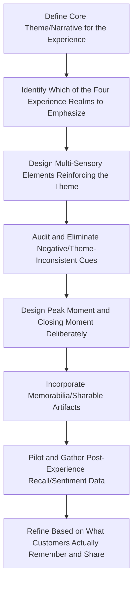

## The Experience Economy and Memorable Engagement

### Overview

The Experience Economy is a framework, introduced by B. Joseph Pine II and James H. Gilmore in their 1998 Harvard Business Review article and subsequent 1999 book of the same name, proposing that experiences constitute a distinct and increasingly dominant economic offering — beyond commodities, goods, and services — in which businesses create value by staging memorable events that engage individual customers in a personal, memorable way. It provides the strategic vocabulary for understanding why brands increasingly compete not just on product quality or service delivery, but on the quality and memorability of the overall engagement they orchestrate.

### The Progression of Economic Value

Pine and Gilmore frame economic history as a progression through four distinct stages of economic offering, each commanding progressively higher value by moving further from generic, undifferentiated output toward personalized, memorable engagement:

1. **Commodities**: Extracted or grown raw materials, undifferentiated and priced on fungible market terms (e.g., raw coffee beans sold by the pound on commodity markets).
2. **Goods**: Manufactured, tangible products made from commodities, differentiated by features and branding (e.g., packaged ground coffee sold in a retail store).
3. **Services**: Intangible activities performed on behalf of a customer, customized to their specific request (e.g., a cup of coffee made to order at a diner).
4. **Experiences**: Memorable events that engage customers in an inherently personal way, staged around a good or service but valued for the engagement itself rather than the underlying commodity/good/service alone (e.g., a themed, atmospheric café experience where the coffee is a supporting prop within a broader staged environment, commanding a substantially higher price than the coffee's raw ingredient or even standard service-level cost would justify).

**Transformations (Extended Progression)**

Pine and Gilmore later extended the framework with a proposed fifth stage — **transformations** — describing offerings where the value proposition is guiding the customer through a personal change (e.g., a fitness or educational program marketed around who the customer *becomes* through the experience, not merely the experience itself). [Unverified: while frequently cited as an extension of the original framework in later work and secondary literature, the transformations stage receives less consistent treatment across marketing curricula than the original four-stage economic progression, so its exact framing should be checked against the specific source being cited.]

### The Four Realms of Experience

A central analytical tool from the framework categorizes experiences along two dimensions, producing four distinct experiential "realms":

**Dimension 1: Participation**

- *Passive participation*: The customer does not directly affect the performance/event (e.g., watching a live theater performance).
- *Active participation*: The customer directly participates in and influences the event (e.g., participating in a hands-on cooking class).

**Dimension 2: Connection**

- *Absorption*: The customer's attention is drawn into the experience, but the customer remains outside the experience, observing it (e.g., watching a screen).
- *Immersion*: The customer becomes physically or virtually part of the experience itself, surrounded by it (e.g., a themed environment the customer walks through).

**The Four Resulting Realms**

|  | Absorption | Immersion |
| --- | --- | --- |
| **Passive Participation** | **Entertainment** (e.g., watching a concert) | **Esthetic** (e.g., visiting a scenic overlook, standing in an impressive architectural space) |
| **Active Participation** | **Educational** (e.g., taking an interactive workshop) | **Escapist** (e.g., participating in a themed immersive experience like an escape room or costumed role-play event) |

**Sweet Spot: Combining Realms**

Pine and Gilmore argue the richest, most memorable experiences typically draw on all four realms simultaneously rather than any single realm alone — a well-designed theme park attraction, for example, can be simultaneously entertaining (passive absorption of a show element), educational (active learning about a theme), escapist (immersive active participation in a themed narrative), and esthetic (immersive passive appreciation of themed environmental design).

### Design Principles for Staging Experiences

**Theme the Experience**

A well-designed experience is organized around a clear, focused theme that shapes and unifies every design element of the encounter, rather than being a loosely connected assortment of features — the theme functions as the organizing narrative logic for the entire staged encounter.

**Harmonize Impressions with Positive Cues**

Every sensory element and detail encountered throughout the experience should reinforce the intended theme (visual design, sound, scent, staff interaction style), since inconsistent or theme-irrelevant details can break the intended impression and reduce the sense of a coherent, deliberately crafted engagement.

**Eliminate Negative Cues**

Beyond simply adding positive theme-reinforcing elements, well-staged experiences actively identify and remove elements that contradict or undermine the intended theme (e.g., visible modern signage or generic corporate elements breaking an otherwise historically-themed environment).

**Mix in Memorabilia**

Physical or digital souvenirs (merchandise, photos, certificates, digital badges/records) that allow the customer to recall and re-experience the memory after the event has ended, extending the experience's value beyond its actual duration and often supporting sharing/advocacy behavior.

**Engage All Five Senses**

Multi-sensory design (sight, sound, smell, touch, taste, where applicable) intensifies and reinforces the memorability of an experience relative to single-sense engagement, since richer sensory encoding is more memorable and immersive. [Inference: this multi-sensory-design-improves-memorability claim aligns with broader cognitive psychology findings on multi-sensory memory encoding, though the specific magnitude of improvement in any given commercial application would depend on execution quality and is not something that can be asserted as a fixed, universal effect size.]

### Application to Marketing and Customer Experience

**Retail as Staged Experience**

Flagship retail stores increasingly function less as pure transaction points and more as staged brand experiences — architectural design, curated sensory environment, interactive product demonstration areas, and staff trained as "performers" of the brand narrative rather than purely transactional salespeople.

**Experiential Marketing and Events**

Brand-sponsored pop-up experiences, immersive activations, and experiential event marketing apply the experience-economy framework directly, treating the staged event itself (rather than any product sold at it) as the primary value delivered to attendees, with brand affinity and word-of-mouth as the return on the staging investment.

**Hospitality and Themed Environments**

Hotels, restaurants, and themed attractions are frequently cited as canonical experience-economy examples, since they explicitly compete on staged atmosphere and memorable engagement layered on top of the underlying commodity/service (a bed to sleep in, food to eat) that could otherwise be obtained at commodity or basic-service pricing elsewhere.

**Digital and Gamified Experiences**

Digital products increasingly apply experience-economy principles through gamification, immersive interface design, and narrative-driven onboarding, treating the user's interaction with the software itself as a staged experience rather than a purely functional transaction — connecting this framework to gamification and engagement-design practice in digital product marketing.

### Memorable Engagement: Underlying Psychological Rationale

**Memory as the Value Marker**

A central claim of the framework is that experiences are valued specifically because they create memories the customer carries forward, distinguishing an experience from a service by the criterion that a customer would pay for the memory itself, not merely the momentary utility of the transaction — this reframes the design objective from "satisfy the transaction" to "create something worth remembering."

**Peak-End Rule Relevance**

Behavioral research on how people evaluate past experiences (the peak-end rule, from behavioral economics/psychology, proposing that people judge an experience largely based on its most intense point and its ending, rather than the average of the entire experience) provides a psychological mechanism relevant to experience design: staging a strong peak moment and a strong closing moment may be more impactful for lasting memorability than uniformly distributing quality evenly across an entire experience duration. [Unverified: while the peak-end rule is a well-established finding in behavioral psychology research (associated with Daniel Kahneman and colleagues), its direct application as a design prescription for commercial experience staging is an inference connecting two related but separately-established bodies of work, rather than a claim tested specifically within experience-economy research itself.]

**Distinctiveness and Novelty**

Memorable experiences typically require some degree of novelty or distinctiveness relative to the customer's routine expectations, since highly routine, unremarkable interactions — even if functionally satisfactory — do not tend to generate durable memory encoding in the way a genuinely differentiated experience does.

### Practical Experience Design Workflow

### Example

**Example: Applying the Framework to a Retail Flagship Store Redesign**

A specialty outdoor-gear brand redesigns its flagship store using experience-economy principles:

- **Theme**: "Basecamp before the summit" — the store is organized as a staged pre-expedition environment rather than a standard retail floor plan.
- **Realm emphasis**: Combines the esthetic realm (immersive environmental design evoking a mountain basecamp) with the educational realm (active workshops on gear use and outdoor skills) and touches of the escapist realm (a simulated weather-testing chamber customers can step into to test jacket performance).
- **Sensory design**: Ambient soundscape of wind and mountain environments, tactile product-testing stations, and visual merchandising built around expedition photography rather than standard product-grid displays.
- **Memorabilia**: Customers completing the in-store weather-testing experience receive a printed "expedition readiness" card as a keepsake, reinforcing recall of the experience after leaving.
- **Peak/end design**: The weather-testing chamber is positioned as the experiential peak near the midpoint of the customer's path through the store, with a warmly staffed, low-pressure checkout conversation designed as the closing moment, reflecting deliberate application of peak-end considerations to the overall path design.

This redesign is intended to shift the store's role from a place to compare and buy standard goods into a staged experience customers remember and discuss, consistent with the framework's central thesis that memorable engagement — not the underlying product alone — becomes the differentiated and premium-priced value proposition. [Inference: this is a constructed illustrative example applying the framework's principles, not a case study of a specific named retailer's actual store design.]

### Critiques and Limitations

- **Overextension risk**: Critics have noted a risk of the "experience" label being applied loosely to marketing initiatives that are, in substance, standard service or promotional activity dressed in experiential language, without genuinely restructuring the underlying value proposition the framework describes — a form of conceptual dilution similar to critiques raised of other broad reframing theories in marketing.
- **Measurement difficulty**: Because the framework's central value claim (memorability, personal engagement) is inherently subjective and individually variable, it shares the same fundamental measurement challenge discussed for value-in-use under service-dominant logic — harder to quantify with standard transactional metrics than commodity, good, or even conventional service pricing.
- **Cost and scalability tension**: Genuinely staged, high-touch experiences (themed environments, personalized interaction, multi-sensory design) often carry substantially higher operational cost and complexity to deliver consistently at scale compared to standardized goods or services, creating a practical tension between experiential differentiation and the efficiency/consistency demands of large-scale operations.
- **Novelty decay**: Experiences that rely heavily on novelty for their memorability effect may face diminishing impact upon repeat exposure (a customer's second visit to the same staged experience is inherently less novel than the first), requiring ongoing refresh investment that a stable, standardized service offering does not face to the same degree.

### Complementary Frameworks

- **Service-Dominant Logic**: Provides a compatible theoretical lens, since a well-staged experience can be understood as facilitating especially rich customer resource integration and value-in-use, connecting the experience economy's staging principles to S-D logic's co-creation emphasis.
- **Customer Journey Mapping**: Provides the sequential structure within which peak moments and closing moments (informed by peak-end rule considerations) can be deliberately identified and designed.
- **Moments of Truth and Critical Incidents**: The experience economy's "peak moment" design concept overlaps conceptually with moments-of-truth thinking, though the experience economy frames it proactively (design a peak) rather than diagnostically (identify where sentiment currently peaks or dips).
- **Gamification and Engagement Design**: Provides digital-specific tactical tools for applying experience-economy staging principles within software and app-based customer interactions.

**Related Topics**

- Service-dominant logic and co-creation
- Customer journey mapping and touchpoints
- Moments of truth and critical incidents
- Peak-end rule and behavioral memory research
- Experiential marketing and event activation design
- Gamification in digital product and marketing design
- Sensory marketing and multi-sensory brand design
- Retail environment and flagship store design strategy