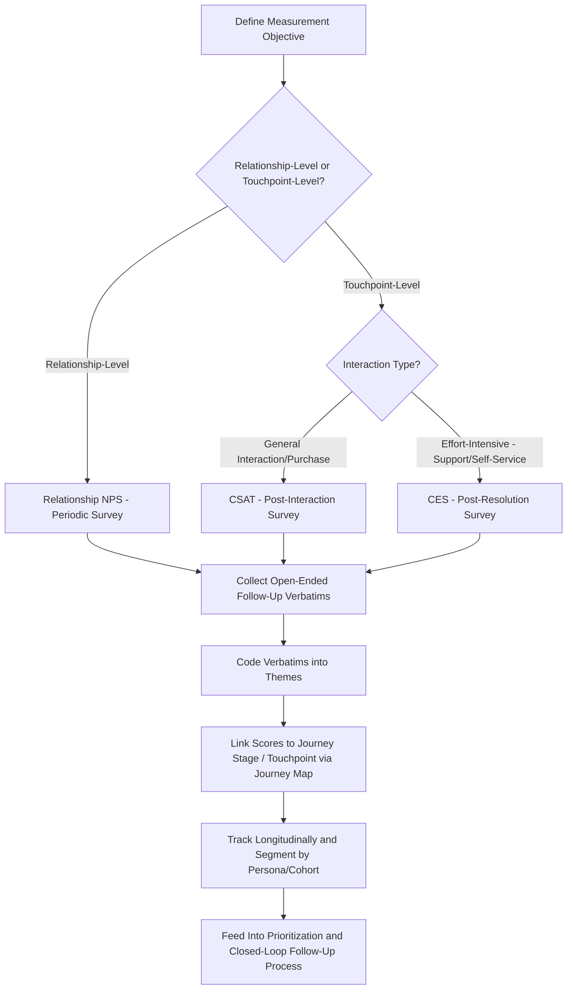
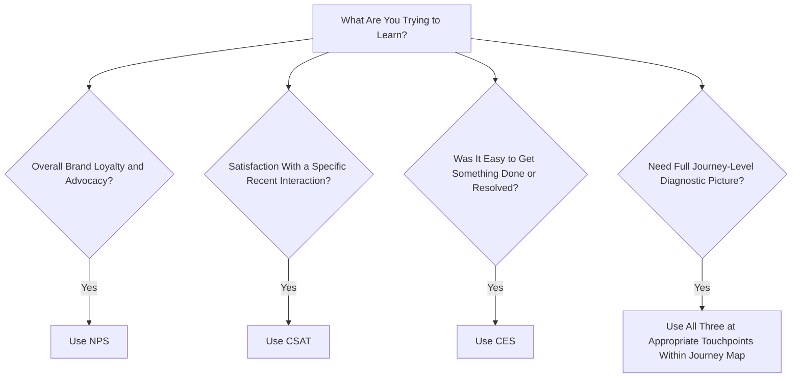

## CX Measurement: NPS, CSAT, and CES

### Overview

Net Promoter Score (NPS), Customer Satisfaction (CSAT), and Customer Effort Score (CES) are the three most widely used standardized quantitative metrics for tracking customer experience quality. Each is derived from a single-question survey instrument, uses a defined scoring methodology, and is designed to be tracked longitudinally and benchmarked across time periods, touchpoints, or competitors. They are complementary rather than interchangeable — each captures a conceptually distinct aspect of the customer relationship and is best suited to different measurement contexts.

### Net Promoter Score (NPS)

**Origin and Core Question**

Developed by Fred Reichheld and popularized through his 2003 Harvard Business Review article "The One Number You Need to Grow," NPS is based on a single survey question: *"On a scale of 0–10, how likely are you to recommend [company/product] to a friend or colleague?"*

**Scoring Methodology**

Respondents are categorized into three groups based on their 0–10 rating:

- **Promoters (9–10)**: Loyal enthusiasts who are likely to keep buying and refer others.
- **Passives (7–8)**: Satisfied but unenthusiastic customers, vulnerable to competitive offers.
- **Detractors (0–6)**: Unhappy customers who could damage the brand through negative word-of-mouth.

The NPS score itself is calculated as:

$$NPS = \%\text{Promoters} - \%\text{Detractors}$$

This produces a score ranging from -100 (every respondent is a detractor) to +100 (every respondent is a promoter). Note that Passives are excluded from the calculation numerator/subtraction entirely but still count in the denominator when calculating the percentages.

**Relationship NPS vs. Transactional NPS**

- *Relationship NPS*: Measured periodically (e.g., quarterly, annually) about the overall relationship with the brand, independent of any specific recent interaction — used for tracking overall brand health longitudinally.
- *Transactional NPS (tNPS)*: Measured immediately following a specific interaction or touchpoint (a purchase, a support call), used to diagnose satisfaction with that specific touchpoint rather than the overall relationship.

**The Follow-Up Question**

Best-practice NPS implementation includes an open-ended follow-up question ("What is the primary reason for your score?") immediately after the numeric rating, since the qualitative verbatim response is what actually explains *why* a score was given and provides the diagnostic detail needed to act on the score — the numeric score alone indicates magnitude of sentiment but not its cause.

### Customer Satisfaction (CSAT)

**Core Question**

CSAT measures satisfaction with a specific interaction, product, or overall experience, typically phrased as: *"How satisfied were you with [specific interaction/product/experience]?"* answered on a Likert-type scale, most commonly 1–5 or 1–7 (ranging from "very dissatisfied" to "very satisfied").

**Scoring Methodology**

CSAT is typically reported as the percentage of respondents selecting the top one or two boxes on the scale (a "top-box" or "top-two-box" scoring approach):

$$CSAT = \frac{\text{Number of satisfied responses (top box/boxes)}}{\text{Total number of responses}} \times 100$$

**Typical Application Points**

CSAT is most commonly deployed immediately after a specific, discrete interaction (a support ticket resolution, a purchase, a delivery) rather than as a general relationship measure, making it well-suited to touchpoint-level diagnostic tracking within a customer journey map, in contrast to NPS's more common use as a relationship-level or brand-level metric.

**Variability in Implementation**

Unlike NPS, which has a relatively standardized global question wording and scoring convention, CSAT implementations vary considerably across organizations in scale length (5-point vs. 7-point vs. 10-point), exact wording, and top-box threshold definition — meaning CSAT scores are generally not directly comparable across different companies or even across different survey instruments within the same company unless methodology is explicitly standardized. [Unverified: because there is no single universally standardized CSAT methodology in the way NPS has a widely adopted standard formula, any specific benchmark figure claiming to represent "average CSAT" across an industry should be treated with caution regarding methodological comparability.]

### Customer Effort Score (CES)

**Origin and Core Question**

Introduced through research published in Harvard Business Review by Matthew Dixon, Karen Freeman, and Nicholas Toman ("Stop Trying to Delight Your Customers," 2010), CES is based on the premise that reducing customer effort is a stronger driver of loyalty than exceeding expectations or delighting customers. The core question is typically phrased as: *"[Company] made it easy for me to handle my issue"* rated on an agreement scale (commonly 1–7, from "strongly disagree" to "strongly agree"), though some implementations phrase it as a direct effort question ("How much effort did you personally have to put forth to handle your request?").

**Scoring Methodology**

CES is typically reported as the average score across the rating scale, or as the percentage of respondents indicating low effort (high agreement with the "easy" framing), depending on the specific scale and wording variant used by the organization. Unlike NPS, there is no single universally standardized CES formula equivalent to the Promoters-minus-Detractors calculation — implementations vary in scale range and exact scoring convention.

**Underlying Research Rationale**

The research underlying CES specifically argued that most customer effort is generated by *negative* friction experiences (having to repeat information, being transferred between departments, unclear instructions) rather than by the mere absence of exceptional "delight" gestures — and that resolving these friction sources is a more efficient loyalty investment than investing in surprise-and-delight tactics, since eliminating negative friction was found in the underlying research to have a stronger relationship to loyalty than adding positive surprises. [Unverified: this finding is specific to the original published research context and time period; the relative importance of effort-reduction versus delight-generation may vary by industry, customer segment, and has been the subject of ongoing discussion and some methodological critique in subsequent service marketing literature, so it should not be treated as a universally fixed ranking across all contexts.]

**Best-Fit Application Points**

CES is most diagnostic immediately following effort-intensive interaction types specifically — customer support resolution, self-service task completion, returns/exchanges, onboarding/setup processes — where the central question of interest is genuinely about friction and ease rather than general emotional satisfaction or overall brand advocacy.

### Comparative Summary

| Dimension | NPS | CSAT | CES |
| --- | --- | --- | --- |
| Core question focus | Likelihood to recommend | Satisfaction with specific interaction | Ease of getting issue resolved |
| Typical scale | 0–10 | 1–5 or 1–7 | 1–7 (agreement) |
| Scoring method | %Promoters − %Detractors | % top-box/top-two-box | Average score or % low-effort |
| Best-fit measurement level | Relationship/brand-level (or transactional variant) | Specific touchpoint/transaction | Effort-intensive interactions (support, self-service) |
| Standardization across industry | High (widely standardized formula) | Low (varies by implementation) | Moderate (concept standardized, exact scale varies) |
| Primary diagnostic value | Overall loyalty/advocacy likelihood | Immediate reaction to a specific interaction | Friction/effort specifically as a loyalty driver |

### Measurement Architecture and Implementation

**Closed-Loop Follow-Up**

A widely recommended practice across all three metrics is "closing the loop" — proactively following up with detractors (NPS), dissatisfied respondents (CSAT), or high-effort respondents (CES) to understand and address their specific issue directly, converting the measurement exercise into an active service-recovery and relationship-management process rather than a purely passive tracking exercise.

**Segmentation and Longitudinal Tracking**

All three metrics are most actionable when segmented by customer persona, journey stage, product line, or channel, and tracked over time to identify trend direction — a single point-in-time score, in isolation, provides substantially less diagnostic value than a properly segmented trend line linked to specific business or experience changes.

**Verbatim Coding**

As with the Critical Incident Technique discussed earlier in this chapter, open-ended follow-up responses to any of these three metrics require systematic qualitative coding (categorizing verbatims into recurring themes) to convert free-text feedback into an actionable, quantifiable pattern of root causes — a step frequently under-invested in relative to the survey-fielding effort itself.

### Choosing the Right Metric for a Given Use Case

### Example

**Example: Multi-Metric CX Program for a Telecom Provider**

A telecom company implements a layered measurement program:

- **Relationship NPS**, fielded quarterly to the full customer base, tracks overall brand loyalty trend and is reported to executive leadership as the top-line CX health indicator.
- **CSAT**, fielded immediately after each in-store visit and each new-service-activation transaction, diagnoses satisfaction with those specific discrete interactions.
- **CES**, fielded immediately after every customer support call or chat resolution, specifically diagnoses friction in the support process, given the research basis linking support-effort reduction to loyalty.

Analysis reveals relationship NPS has been flat over several quarters despite improving CSAT scores at the point of new-service activation — but CES scores for support interactions have been declining. Because CES specifically targets a different (and, per the underlying research rationale, potentially more loyalty-relevant) type of friction than the activation-CSAT metric was capturing, this divergence directs investment specifically toward support-process effort-reduction rather than further investment in the already-improving activation experience, illustrating why relying on a single metric (in this case, CSAT alone) could have missed the actual driver of stagnant relationship-level loyalty. [Inference: this is a constructed illustrative example demonstrating how differentiated use of the three metrics can surface a diagnosis that a single metric would miss, not data from a specific named telecom company.]

### Limitations and Methodological Considerations

- **Single-item measurement limitations**: All three metrics rely on a single survey question to represent a complex, multidimensional experience, which trades diagnostic richness for simplicity and ease of longitudinal tracking — a deliberate design trade-off rather than an oversight, but one that means none of these metrics alone provides a complete picture without complementary qualitative research (such as the critical incident technique discussed earlier).
- **Response bias and survey fatigue**: Customers who respond to post-interaction surveys are not necessarily representative of the full customer base (those with strongly positive or strongly negative experiences may be more likely to respond than those with neutral experiences), and excessive survey frequency across multiple touchpoints can generate survey fatigue that further skews response rates and quality.
- **Cross-company and cross-industry comparability limits**: As noted above, CSAT and CES implementation variability substantially limits cross-organization benchmarking validity; even NPS, despite its more standardized formula, can vary somewhat in practice due to differences in exact question phrasing, timing, and sampling methodology.
- **Correlation with actual behavior is not guaranteed**: While all three metrics are marketed and researched as predictive of loyalty-related business outcomes (retention, repurchase, referral behavior), the strength of that predictive relationship varies by study, industry, and implementation quality, and should be validated against a company's own actual retention/growth data rather than assumed as a universal, fixed-strength relationship. [Unverified: published research on the predictive validity of NPS specifically in relation to actual company growth has been debated in the academic marketing literature since the metric's introduction, with some studies supporting a meaningful relationship and others raising methodological critiques of the original claims; this remains a genuinely contested area rather than settled consensus.]
- **Gaming and incentive distortion risk**: When these metrics are tied to individual employee performance evaluation or compensation, there is a documented risk of employees influencing which customers are asked to respond, or coaching customers toward high scores, which can distort the resulting data's validity as an honest measure of the underlying customer experience.

### Complementary Methods

- **Critical Incident Technique**: Provides the qualitative, event-level explanatory depth that these single-item quantitative scores cannot capture on their own.
- **Customer Journey Mapping**: Provides the structural framework for deciding at which specific touchpoints each metric should be deployed for maximum diagnostic value.
- **Text Analytics / Verbatim Coding Tools**: Provide the systematic method for converting open-ended follow-up responses into actionable, quantified thematic patterns at scale.
- **Behavioral/Revenue Data Linkage**: Connecting survey-based scores to actual downstream behavioral data (retention, repurchase, referral tracking) is necessary to validate that the metrics are genuinely predictive within a specific company's context, rather than relying solely on the general research literature's claims.

**Related Topics**

- Customer journey mapping and touchpoints
- Moments of truth and critical incidents
- Text analytics and verbatim coding methods
- Customer loyalty and retention modeling
- Survey methodology and response bias
- Closed-loop feedback and service recovery processes
- Employee incentive design and metric gaming risk
- Customer Data Platforms (CDPs) for linking survey and behavioral data