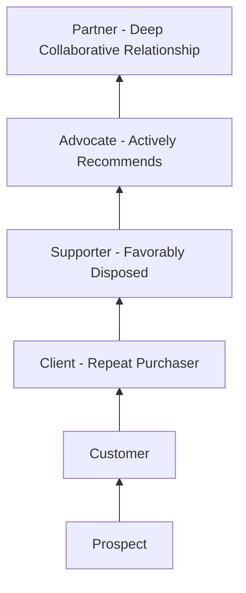

## Relationship Marketing Theory

### Overview

Relationship marketing is a strategic marketing paradigm that prioritizes building, maintaining, and enhancing long-term relationships with customers over the pursuit of discrete, individual transactions. It represents a foundational shift away from the transactional marketing paradigm — centered on the traditional marketing mix (product, price, place, promotion) applied to acquire one-time sales — toward a paradigm centered on customer lifetime value, trust, commitment, and mutual exchange sustained over repeated interactions. Relationship marketing theory provides the conceptual foundation underlying the applied disciplines of customer loyalty programs, retention strategy, and customer relationship management (CRM) covered elsewhere in this chapter.

### Origins and Theoretical Development

**Emergence from Services and B2B Marketing**

Relationship marketing theory emerged substantially from research in services marketing and industrial/B2B marketing during the 1980s, fields where the ongoing nature of the buyer-seller relationship (continued service delivery, repeated business transactions, personal selling relationships) made a purely transactional framing conceptually inadequate. Leonard Berry is widely credited with formally introducing the term "relationship marketing" in a 1983 conference paper in the context of services marketing. [Unverified: as with many foundational marketing concepts, the precise attribution and earliest use of the specific term has some variation in secondary accounts; Berry's 1983 contribution is the most commonly cited origin point in marketing textbooks, but should be verified against primary sourcing if precise historical attribution is required.]

**Contrast with Transactional Marketing**

Relationship marketing theory is most clearly understood in direct contrast to the transactional marketing paradigm it responds to:

| Dimension | Transactional Marketing | Relationship Marketing |
| --- | --- | --- |
| Time horizon | Short-term, single-sale focus | Long-term, ongoing relationship focus |
| Primary metric | Individual sale/transaction value | Customer lifetime value (CLV) |
| Customer role | One-time buyer | Ongoing partner in exchange |
| Marketing focus | Customer acquisition | Balanced acquisition and retention, often retention-weighted |
| Communication style | One-way, mass-market messaging | Two-way, personalized, ongoing dialogue |
| Success measure | Market share, sales volume | Customer retention, share of wallet, loyalty |

### Core Theoretical Constructs

**Trust**

Widely identified across the relationship marketing literature as a foundational construct — generally understood as a customer's confidence in the reliability and integrity of the exchange partner. Trust is theorized to reduce a customer's perceived risk in continuing the relationship and to be a necessary precondition for the deeper relational investment (commitment) that follows.

**Commitment**

Building on trust, commitment refers to an exchange partner's belief that the ongoing relationship is important enough to warrant maximum effort at maintaining it. The influential **Commitment-Trust Theory of Relationship Marketing**, developed by Robert Morgan and Shelby Hunt (1994), proposes trust and commitment as the two central mediating variables that explain why relationship marketing succeeds — arguing that trust and commitment, together, are what distinguish relationships characterized by cooperative, efficient, and effective exchange from those that are not.

**Relationship Commitment Types**

Later theoretical refinements (drawing partly on organizational behavior research on commitment) distinguish between:

- *Affective commitment*: Wanting to continue the relationship due to genuine positive attachment and identification with the brand/partner.
- *Calculative (or continuance) commitment*: Continuing the relationship because switching would be costly or inconvenient, rather than out of genuine positive attachment.

This distinction matters practically because these two commitment types are theorized to produce different customer behaviors — affective commitment is generally associated with more durable loyalty and positive word-of-mouth, whereas calculative commitment (sometimes described as a customer being "locked in" rather than genuinely loyal) can be more fragile and can convert to active dissatisfaction or switching the moment the switching-cost barrier is removed or a sufficiently attractive alternative appears. [Unverified: the precise behavioral distinctions and their relative strength/durability have been explored across multiple studies with varying findings depending on industry context and measurement approach, so specific quantitative comparisons between the two commitment types should be sourced to a specific study rather than treated as a fixed universal ratio.]

**Relationship Quality**

A higher-order construct, often operationalized as a composite of trust, satisfaction, and commitment together, used in academic research as a summary indicator of the overall health of a buyer-seller relationship, distinguishing genuinely strong relationships from merely repeated transactional patterns that lack the underlying relational substance.

**Mutual Value Exchange**

Relationship marketing theory emphasizes that sustainable long-term relationships require value to flow in both directions — the customer must perceive ongoing value from the relationship (not just at the point of initial acquisition), and the firm must realize sufficient value from the customer relationship (through repeat purchase, referral, or other contribution) to justify the ongoing relationship-maintenance investment.

### The Relationship Marketing Ladder of Loyalty

A commonly referenced applied model (associated with relationship marketing practitioner literature, notably work by Martin Christopher, Adrian Payne, and Moira Clark) depicts customer relationship progression as an ascending ladder:

This ladder framing emphasizes that relationship marketing's goal extends beyond converting a prospect into a one-time customer, toward progressively deepening the relationship through repeat engagement, favorable disposition, active advocacy, and — in the most developed relationships, particularly common in B2B contexts — a genuinely collaborative partnership.

### Six Markets Model

An influential extension of relationship marketing theory (associated with the Cranfield School of Management, notably work by Adrian Payne and colleagues) argues that a comprehensive relationship marketing strategy must manage relationships across six distinct stakeholder market domains, not customer relationships alone:

1. **Customer markets** — the traditional focus, relationships with actual and prospective customers.
2. **Referral markets** — relationships with sources of referrals (existing satisfied customers, intermediaries) who influence new customer acquisition.
3. **Supplier/alliance markets** — relationships with suppliers and strategic partners whose cooperation affects the firm's ability to deliver value.
4. **Recruitment markets** — relationships and reputation in the labor market, affecting the firm's ability to attract quality employees who ultimately deliver the customer relationship.
5. **Influence markets** — relationships with parties who shape broader stakeholder perception (media, industry analysts, regulatory bodies, financial community).
6. **Internal markets** — relationships and alignment among employees within the organization, based on the premise that internal relationship quality (internal marketing) is a precondition for the organization's capacity to deliver on external relationship promises.

This model broadens relationship marketing theory from a purely customer-facing discipline into an organization-wide strategic framework, reflecting the argument that customer relationship quality cannot be sustained in isolation from the health of these other interconnected stakeholder relationships.

### Relationship Marketing and Customer Lifetime Value (CLV)

Relationship marketing theory provides the conceptual justification for prioritizing **Customer Lifetime Value** as a core business metric — since the paradigm's central claim is that the cumulative value of an ongoing relationship (repeat purchases, reduced service cost from familiarity, referral-generated new customers, price tolerance from trust) typically exceeds the value capturable from any single transaction, a well-designed relationship marketing strategy should, in principle, be evaluated against long-run relationship value rather than short-term transaction-level profitability alone. This connects relationship marketing theory directly to the applied CLV modeling, loyalty program design, and retention strategy topics covered later in this chapter.

### Practical Applications of Relationship Marketing Theory

**Personalization and Two-Way Communication**

Moving beyond one-way mass messaging toward personalized, responsive, ongoing dialogue with individual customers — enabled at scale by CRM systems and customer data infrastructure — operationalizes the theory's emphasis on genuine, individualized relationship maintenance rather than generic mass-market transactional communication.

**Loyalty Programs**

Structured programs rewarding repeat engagement can be understood as an applied mechanism for building calculative commitment (through accumulated rewards/switching costs) and, when well-designed, affective commitment (through genuine value and recognition), directly operationalizing the trust-commitment theoretical framework in a concrete program structure.

**Customer Retention and Churn Management**

Proactive identification and intervention with at-risk customers (informed by churn-prediction modeling) reflects the theory's emphasis on the ongoing relationship-maintenance investment as a priority alongside — or, per relationship marketing's founding argument, often above — new customer acquisition spend.

**Relationship-Focused Metrics**

Adoption of the retention, loyalty, and lifetime-value metrics (in contrast to purely acquisition- and transaction-volume-focused metrics) in organizational performance measurement reflects the theoretical paradigm shift relationship marketing argues for, at the level of what an organization actually measures and rewards internally.

### Example

**Example: B2B Software Vendor Applying Relationship Marketing Theory**

A B2B software company restructures its go-to-market strategy around relationship marketing principles:

- Shifts sales compensation structure to weight renewal and expansion revenue alongside new-logo acquisition, operationalizing the theory's retention-and-acquisition balance rather than pure acquisition-focused incentives.
- Invests in a dedicated customer success function whose explicit mandate is building affective commitment (genuine perceived value and partnership) rather than relying solely on calculative commitment created by contract lock-in and switching costs.
- Applies the six markets model by explicitly tracking and investing in referral-market relationships (a formal customer-advocate program) and influence-market relationships (analyst relations) alongside direct customer relationship management, rather than treating customer relationships as the sole relevant market to manage.
- Tracks customer lifetime value and net revenue retention as headline strategic metrics, reflecting relationship marketing theory's argument that long-run relationship value, not single-contract transaction value, should guide strategic prioritization.

This restructuring illustrates how the abstract theoretical constructs (trust, commitment, six markets, CLV orientation) translate into concrete organizational and strategic choices. [Inference: this is a constructed illustrative example applying relationship marketing theory's constructs, not a case study of a specific named company.]

### Critiques and Limitations

- **Not universally appropriate**: Critics have noted that relationship marketing's intensive relationship-investment approach is not equally suited to every category or customer segment — some transactions (low-involvement, infrequent, or highly price-driven commodity purchases) may not generate sufficient customer lifetime value to justify heavy relationship-marketing investment, meaning the paradigm requires selective application (often guided by customer segmentation and lifetime-value analysis) rather than universal deployment across an entire customer base.
- **Risk of instrumentalizing "relationship" language**: A commonly raised critique is that some organizations adopt relationship marketing terminology and tactics (loyalty points, personalized emails) without genuinely building the underlying trust and commitment the theory describes, resulting in what critics sometimes call a merely transactional program dressed in relational language rather than an authentic relationship — echoing similar critiques raised of loosely-applied experience-economy and service-dominant-logic language elsewhere in this chapter.
- **Measurement and attribution complexity**: Because relationship marketing's central value claims (trust, commitment, long-run lifetime value) are harder to measure directly than short-term transactional metrics, organizations attempting to justify relationship-marketing investment internally often face genuine measurement and attribution challenges in isolating the relationship-marketing-specific contribution to long-run financial outcomes. [Inference: this measurement-difficulty critique parallels the analogous critiques raised for service-dominant logic's value-in-use construct and the experience economy's memorability construct, reflecting a broader pattern across several theoretical marketing frameworks in this chapter where the central value-creating construct is inherently harder to quantify than the transactional metrics it is meant to supersede.]
- **Potential customer fatigue from over-personalization**: Aggressive application of relationship-marketing-derived personalization and frequent communication can, if poorly calibrated, produce customer fatigue or a sense of surveillance/intrusiveness rather than the intended sense of valued relationship, an implementation risk distinct from the theory itself but relevant to its practical application.

### Complementary Frameworks

- **Customer Lifetime Value (CLV) Modeling**: Provides the quantitative framework for identifying which customer relationships justify the level of relationship-marketing investment the theory advocates.
- **Service-Dominant Logic**: Shares conceptual overlap in emphasizing ongoing, co-created value over one-time transactional exchange, providing a compatible theoretical lens.
- **Customer Journey Mapping and CX Measurement**: Provide the applied, touchpoint-level tools for actually operationalizing relationship quality and trust-building across the customer's ongoing experience with the brand.
- **CRM (Customer Relationship Management) Systems**: Provide the technical infrastructure enabling the personalized, ongoing, two-way relationship management that relationship marketing theory calls for at scale.

**Related Topics**

- Customer Lifetime Value (CLV) modeling and calculation
- Commitment-Trust Theory in depth
- Loyalty program design and mechanics
- Churn prediction and retention strategy
- Customer Relationship Management (CRM) systems and architecture
- Service-dominant logic and co-creation
- Six markets model and stakeholder relationship management
- Internal marketing and employee engagement's link to customer experience