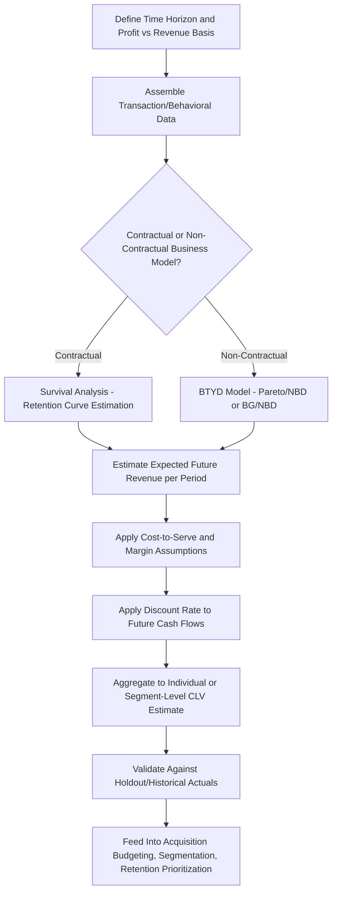

## Customer Lifetime Value Modeling

### Overview

Customer Lifetime Value (CLV, sometimes CLTV or LTV) is a predictive metric representing the total net value a business expects to derive from its entire relationship with a customer, from acquisition through the end of the relationship. CLV modeling provides the quantitative foundation for relationship marketing theory's central claim that long-run relationship value should guide strategic prioritization, and serves as a core input for customer acquisition budget-setting, retention investment decisions, segmentation, and loyalty program design.

### Core Conceptual Components

**Revenue vs. Profit-Based CLV**

CLV can be modeled as either the total revenue a customer generates over their lifetime, or — generally the more decision-useful version — the total *profit contribution* (revenue minus the cost to serve, including cost of goods, service costs, and marketing costs), since revenue-based CLV can overstate the value of high-revenue-but-high-cost-to-serve customers relative to their actual profitability.

**Historical vs. Predictive CLV**

- *Historical CLV*: A backward-looking calculation of value already realized from a customer to date — useful for retrospective analysis but not for forward-looking decisions like acquisition spend allocation.
- *Predictive CLV*: A forward-looking projection of expected future value, which is what most CLV modeling techniques and business applications are actually concerned with, since decisions (how much to spend acquiring a customer, which segments to prioritize for retention investment) require an estimate of value not yet realized.

**The Time Value of Money**

Because CLV projects value across multiple future periods, rigorous CLV models discount future cash flows to their present value using a discount rate, reflecting the standard financial principle that a dollar of profit received in the future is worth less than a dollar received today — a step frequently omitted in simplified CLV calculations but included in more financially rigorous implementations, particularly for long customer-relationship horizons where the discounting effect is material.

### Basic CLV Formula (Simplified)

For a relatively simple, non-contractual or subscription context, a commonly used simplified formula is:

$$CLV = \left( \frac{\text{Average Order Value} \times \text{Purchase Frequency}}{\text{Churn Rate}} \right) \times \text{Profit Margin}$$

Or, in an explicitly discounted, period-based form:

$$CLV = \sum_{t=0}^{T} \frac{(R_t - C_t) \times r_t}{(1+d)^t}$$

Where $R_t$ is revenue in period $t$, $C_t$ is cost to serve in period $t$, $r_t$ is the retention probability of the customer surviving to period $t$, $d$ is the discount rate, and $T$ is the projection horizon (which may be a fixed number of periods or an indefinite/infinite horizon in some model variants).

[Unverified: there is no single universally agreed "the" CLV formula — practitioners and academic literature use multiple formulations depending on business model (contractual/subscription vs. non-contractual/transactional), data availability, and desired sophistication, so the specific formula variant should be matched to the business context rather than treated as a single fixed standard.]

### Modeling Approaches by Business Context

**Contractual (Subscription) Context**

In subscription businesses (SaaS, streaming, membership models), customers have an explicit, observable churn event (contract cancellation), making retention/survival modeling relatively more tractable — retention curves can be directly estimated from observed cancellation data using survival analysis techniques.

**Non-Contractual (Transactional) Context**

In non-subscription retail or e-commerce contexts, there is no explicit cancellation event — a customer simply stops purchasing at some unobserved point, making "churn" inherently probabilistic and requiring different modeling techniques (discussed below) specifically designed to infer an implicit "alive" probability from purchase recency and frequency patterns rather than an observed cancellation event.

### Key Modeling Techniques

**Cohort-Based Aggregate Modeling**

The simplest common approach: group customers into cohorts (e.g., by acquisition month/channel), track average revenue and retention rate per cohort over successive periods, and extrapolate cohort-level trends forward. This approach is straightforward to implement and communicate but does not capture individual-level heterogeneity within a cohort, and is generally considered a starting point rather than a sophisticated predictive method.

**RFM-Based Approaches**

Recency, Frequency, and Monetary value (RFM) — how recently a customer purchased, how often, and how much they spend — are classic behavioral segmentation variables that also serve as inputs to CLV estimation, on the premise that customers with more recent, more frequent, and higher-value purchase histories are more likely to continue generating future value. RFM segments are often used as a simpler, interpretable proxy for more complex probabilistic CLV models, particularly in organizations without the data infrastructure or analytical resources for the more advanced techniques below.

**Probabilistic Buy-Till-You-Die (BTYD) Models**

A family of statistical models specifically developed for the non-contractual context, modeling two underlying latent (unobserved) processes simultaneously: (1) the rate at which an active customer makes purchases, and (2) the probability that a customer has become inactive ("died," in the model's terminology, meaning they've permanently stopped purchasing) at any given point, inferred probabilistically from the pattern and recency of their observed purchase history.

- **Pareto/NBD (Negative Binomial Distribution) model**: One of the most established and widely cited BTYD models, combining a Pareto distribution for customer "lifetime" (time until becoming inactive) with a Negative Binomial Distribution for purchase frequency while active, to jointly estimate the probability a customer is still active and their expected future purchase rate given their observed history.
- **BG/NBD (Beta-Geometric/NBD) model**: A widely used and computationally simpler alternative to Pareto/NBD, replacing the Pareto lifetime distribution with a Beta-Geometric formulation, offering similar predictive performance in many applications with reduced estimation complexity, and often paired with a **Gamma-Gamma model** to separately estimate expected monetary value per transaction, together producing a full BG/NBD + Gamma-Gamma CLV estimate. [Unverified: relative predictive performance between Pareto/NBD and BG/NBD variants has been compared across multiple published studies with mixed results depending on the specific dataset and business context, so neither should be assumed universally superior without validation on the specific data at hand.]

**Machine Learning-Based Approaches**

More recent CLV modeling increasingly applies supervised machine learning techniques (gradient-boosted trees, neural networks) trained on rich behavioral, transactional, and often demographic/firmographic feature sets to directly predict future value or churn probability, offering the potential to incorporate a much wider range of predictive signals (browsing behavior, support interaction history, marketing engagement) than the more parsimonious statistical BTYD models, at the cost of reduced interpretability and a greater data and engineering infrastructure requirement. [Inference: the appropriate choice between classical statistical BTYD models and machine-learning approaches generally depends on data volume, available feature richness, and the organization's need for model interpretability versus raw predictive accuracy — this is a standard general trade-off in predictive modeling rather than a finding specific to CLV modeling alone.]

**Survival Analysis for Contractual Churn**

In subscription contexts, survival analysis techniques (e.g., Kaplan-Meier estimation for retention curves, Cox proportional hazards models for identifying which customer attributes are associated with higher/lower churn hazard) are commonly applied to directly model the probability of a customer remaining active through successive time periods, which then feeds directly into the discounted-cash-flow CLV calculation.

### CLV Modeling Pipeline

### Applications of CLV Modeling

**Customer Acquisition Cost (CAC) Benchmarking**

CLV is most commonly used alongside Customer Acquisition Cost in a **CLV:CAC ratio**, providing a decision rule for whether acquisition spend is generating sustainable returns — a commonly cited rule-of-thumb benchmark in startup and growth marketing contexts is targeting a CLV:CAC ratio of at least 3:1, though the appropriate target ratio varies meaningfully by industry, margin structure, and payback-period tolerance, and should not be treated as a universal fixed standard applicable to every business model. [Unverified: the specific "3:1" figure is a widely circulated practitioner heuristic rather than a rigorously derived universal constant, and appropriate targets vary by capital intensity, growth stage, and industry.]

**Segmentation and Differentiated Investment**

CLV estimates allow customers to be segmented by projected future value (e.g., into high/medium/low CLV tiers), enabling differentiated retention investment, personalized offers, and customer service prioritization proportional to each segment's expected future contribution — a direct quantitative operationalization of relationship marketing theory's principle that not all customer relationships warrant equal investment.

**Marketing Channel and Campaign Evaluation**

Comparing CLV of customers acquired through different channels or campaigns (rather than evaluating channels solely on acquisition cost or initial conversion rate) surfaces cases where a channel produces cheaper but lower-lifetime-value customers, informing more holistic media-mix and channel-investment decisions than acquisition-cost metrics alone would support.

**Loyalty Program ROI Justification**

CLV modeling provides the quantitative basis for evaluating whether the cost of a loyalty program's rewards and operational overhead is justified by the incremental retention and spend lift it produces — connecting directly to the loyalty program design and mechanics topic elsewhere in this chapter.

### Example

**Example: BG/NBD-Based CLV Segmentation for an E-Commerce Retailer**

An online retailer with no subscription/contractual relationship applies a BG/NBD plus Gamma-Gamma model to its transaction history:

- The model estimates, for each customer, a probability of still being "alive" (active) based on their recency and frequency pattern, combined with an expected future purchase rate and expected average order value.
- Customers are segmented into CLV tiers: a "high-value active" tier (high estimated future value, high alive-probability) is prioritized for a premium loyalty tier and personalized outreach; a "high-value at-risk" tier (historically high spend, but declining recency suggesting a falling alive-probability) is flagged for targeted win-back campaigns; a "low-value" tier receives minimal incremental marketing investment.
- This differentiated treatment, driven directly by the probabilistic model's individual-level output rather than simple historical spend-to-date, allows marketing spend to be concentrated where projected future value justifies the investment, rather than treating all past-high-spend customers identically regardless of their currently inferred activity status. [Inference: this is a constructed illustrative example demonstrating the BTYD modeling approach and its segmentation application, not a case study of a specific named retailer.]

### Limitations and Methodological Considerations

- **Model assumption sensitivity**: BTYD and similar probabilistic models rest on specific distributional assumptions (e.g., the Pareto/NBD's assumption about how the timing of customer "death" is distributed) that may not hold precisely for every business context, and model outputs can be sensitive to how well these assumptions match actual underlying customer behavior — validation against holdout data is an important and sometimes under-implemented step.
- **New customer/limited-history problem**: All modeling approaches described here rely on some amount of observed purchase history to make individual-level predictions; very new customers with minimal transaction history are inherently harder to model with individual-level precision, often requiring supplementary approaches (cohort-level benchmarks, look-alike modeling based on similar customers) for early-lifecycle CLV estimation.
- **Stationarity assumption risk**: Most CLV models implicitly assume that historical purchase patterns are a reasonable guide to future behavior; significant business changes (pricing changes, new competitors, product line changes, macroeconomic shifts) can invalidate this assumption, meaning model outputs should be periodically re-validated rather than treated as permanently fixed forecasts.
- **Cost-to-serve data quality**: Profit-based CLV requires accurate allocation of service, support, and fulfillment costs to individual customers or segments, which is often harder to obtain with precision than revenue data, and inaccurate cost allocation can materially distort the resulting profit-based CLV estimates relative to a simpler (but less decision-accurate) revenue-only calculation.
- **Risk of over-reliance on a single point estimate**: Because CLV is inherently a probabilistic forecast with genuine uncertainty, presenting a single point-estimate figure to business stakeholders without accompanying confidence intervals or scenario ranges can create false precision and overconfidence in downstream budget or strategy decisions built on that number.

### Complementary Frameworks

- **Relationship Marketing Theory**: Provides the strategic rationale for why CLV — rather than transactional metrics alone — should guide customer investment decisions.
- **RFM Segmentation**: Serves both as a simpler standalone segmentation approach and as an input feature set for more sophisticated CLV models.
- **Churn Prediction Modeling**: Closely related and often overlapping methodology, particularly in contractual/subscription contexts, since churn probability is a direct input to forward-looking CLV.
- **Loyalty Program Design**: CLV modeling provides the quantitative ROI justification framework for loyalty program investment decisions.
- **Marketing Mix Modeling and Attribution**: Connects CLV-based customer valuation to channel- and campaign-level investment decisions.

**Related Topics**

- Relationship marketing theory
- Churn prediction and retention strategy
- RFM segmentation methodology
- Loyalty program design and mechanics
- Survival analysis techniques (Kaplan-Meier, Cox proportional hazards)
- Buy-Till-You-Die probabilistic models (Pareto/NBD, BG/NBD) in depth
- Customer Acquisition Cost (CAC) and unit economics
- Marketing mix modeling and channel-level ROI evaluation