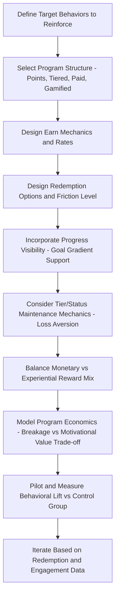

## Loyalty Program Psychology and Reward Design

### Overview

Loyalty program psychology examines the behavioral and cognitive mechanisms that make structured reward programs effective (or ineffective) at driving repeat purchase behavior, while reward design covers the practical structural choices — point systems, tier structures, reward types, redemption mechanics — that operationalize those psychological principles into an actual program. Effective loyalty program design draws heavily on behavioral economics and motivation psychology research, since a program's structure directly shapes which psychological drivers it activates and how durable the resulting behavior change is likely to be.

### Psychological Foundations

**Operant Conditioning and Variable Reinforcement**

At the most basic level, loyalty programs function as a reinforcement schedule, rewarding a target behavior (purchase) to increase its future frequency — drawing on foundational behaviorist psychology (B.F. Skinner's operant conditioning research). A key design-relevant finding from this literature is that **variable reinforcement schedules** (rewards delivered unpredictably rather than after a fixed number of actions) tend to produce more persistent and resistant-to-extinction behavior than fixed, fully predictable reward schedules — a principle some loyalty programs apply through surprise bonuses, randomized bonus-point events, or gamified chance-based reward elements layered on top of the predictable core earning structure.

**Endowed Progress Effect**

Research in behavioral marketing (notably associated with Joseph Nunes and Xavier Drèze) has found that giving customers a "head start" toward a goal — even an artificial one that doesn't change the actual number of purchases required — increases motivation to complete the goal, compared to presenting the same effective requirement as starting from zero. A commonly cited illustration from this research stream involves comparing a stamp card requiring 8 purchases with no head start against a stamp card requiring 10 purchases but issued with 2 stamps already pre-filled — the latter, despite requiring the same number of additional purchases, drove higher completion rates in the associated research. [Unverified: this specific example is closely associated with the published research on the endowed progress effect, but exact study parameters and effect sizes should be verified against the primary source if precise citation is needed; the general directional finding is well-established in the behavioral marketing literature.]

**Goal Gradient Effect**

Closely related research finds that the rate of progress toward a goal accelerates as the goal gets closer — people work harder and more frequently as they approach a reward threshold than they do at the start of the earning cycle. This principle informs loyalty program design choices like showing clear progress bars/indicators (making proximity to the next reward visually salient) and structuring tier or point thresholds to keep customers frequently within visible reach of a meaningful near-term milestone.

**Loss Aversion and Status Maintenance**

Drawing on prospect theory (Kahneman and Tversky), the psychological pain of losing an already-attained status or benefit is generally understood to be more motivationally powerful than the pleasure of gaining an equivalent new benefit. Tiered loyalty programs frequently leverage this by implementing tier-maintenance requirements (e.g., annual spend thresholds to retain a premium tier status), which can motivate continued engagement specifically to *avoid the loss* of already-earned status, distinct from and potentially more powerful than the motivation to earn that same status fresh.

**Sunk Cost and Switching Cost Effects**

Accumulated points or progress toward a reward represent a form of psychological (and sometimes literal) sunk investment that can increase reluctance to switch to a competing brand, since switching would mean forfeiting that accumulated value — this connects loyalty program mechanics directly to the "calculative commitment" construct discussed under relationship marketing theory, where continued engagement is driven partly by switching-cost considerations rather than purely by genuine brand affection.

**Self-Determination Theory and Intrinsic vs. Extrinsic Motivation**

Self-determination theory distinguishes intrinsic motivation (engaging in a behavior for its own inherent satisfaction) from extrinsic motivation (engaging due to an external reward or consequence). A relevant design tension is that poorly designed extrinsic reward programs can, in some circumstances, undermine pre-existing intrinsic motivation for a behavior (an effect sometimes called the "overjustification effect" in the broader motivation literature) — though this concern is generally considered most relevant to activities that already carried genuine intrinsic appeal before the extrinsic reward was introduced, and less directly applicable to ordinary transactional retail purchase behavior, which typically has limited pre-existing intrinsic motivation to be "crowded out" in the first place. [Unverified: the overjustification effect is a genuine and researched phenomenon in the motivation psychology literature, but its practical relevance and magnitude specifically within commercial loyalty program design (as opposed to the contexts, often involving children's play or creative tasks, where much of the original research was conducted) is less directly studied and should be treated as an inference/caution rather than an established finding specific to loyalty programs.]

### Loyalty Program Structural Types

**Points-Based Programs**

The most common structure: customers earn points per unit of spend (or per specific qualifying action), redeemable for rewards at defined point thresholds. Design variables include the earn rate (points per dollar), redemption value (dollar value per point at redemption), and whether earning applies uniformly or is weighted toward specific desired behaviors (e.g., bonus points for higher-margin products or off-peak purchase timing).

**Tiered Programs**

Customers progress through defined status tiers (e.g., Silver/Gold/Platinum) based on cumulative spend or activity, with each tier unlocking progressively better benefits. Tiered structures directly leverage the status-maintenance loss-aversion mechanism described above and additionally introduce a social-status/prestige dimension not present in flat points-only programs, since tier status is often visible to others (e.g., airline elite status recognized by staff) in ways that a simple points balance is not.

**Paid/Subscription Loyalty Programs**

Customers pay an upfront or recurring fee for immediate access to premium benefits (expedited shipping, exclusive pricing, bundled perks), rather than earning benefits progressively through accumulated spend. This structure shifts the underlying psychological mechanism somewhat — from progress-based motivation (endowed progress, goal gradient) toward value-justification motivation, where the ongoing behavioral driver is a felt need to "get one's money's worth" from the upfront membership investment, a dynamic related to but distinct from the sunk-cost mechanism in points-based programs.

**Coalition/Partner Programs**

Points or rewards can be earned and/or redeemed across a network of partner businesses rather than a single brand, broadening earning opportunities and redemption flexibility at the cost of diluting the exclusivity and brand-specific psychological connection that a single-brand program can build.

**Gamified Programs**

Programs incorporating game-design elements beyond simple linear point accumulation — badges, challenges, leaderboards, randomized bonus mechanics, streaks — drawing more explicitly on variable-reinforcement and competitive/social motivation principles, often layered on top of a core points or tier structure rather than replacing it entirely.

### Reward Design Considerations

**Reward Type: Monetary vs. Experiential**

Research in this area has explored whether monetary-equivalent rewards (discounts, cashback, redeemable-for-cash points) or experiential/non-monetary rewards (exclusive access, unique experiences, recognition) are more effective at driving loyalty and emotional brand connection, with some research suggesting experiential and status-based rewards can foster stronger affective attachment than purely monetary rewards of equivalent value, though the appropriate mix depends substantially on brand positioning and target customer segment. [Unverified: findings comparing monetary versus experiential reward effectiveness vary across studies and contexts, and the appropriate choice is genuinely context-dependent rather than resolved by a single universal finding favoring one reward type over the other.]

**Redemption Friction and the "Breakage" Trade-off**

Loyalty program economics involve a deliberate design tension between making redemption easy and accessible enough to feel genuinely valuable and motivating (supporting the goal-gradient and endowed-progress mechanisms) versus the commercial reality that unredeemed points/rewards ("breakage") represent a direct cost saving for the issuing company — overly difficult or restrictive redemption processes can undermine the psychological motivational value of the program even while temporarily improving short-term program cost economics, a trade-off that responsible program design must balance explicitly rather than optimizing purely for breakage minimization.

**Immediate vs. Delayed Gratification**

Reward structures that offer at least some immediate, tangible benefit (e.g., an instant small discount alongside a longer-term points-accumulation track) can address the psychological reality that purely long-horizon deferred rewards may not sufficiently motivate near-term behavior for customers with a strong present-bias in their decision-making (a well-established finding in behavioral economics regarding time-discounting), suggesting many effective programs blend immediate and delayed reward elements rather than relying exclusively on one or the other.

**Personalization of Rewards**

Rewards tailored to an individual customer's known preferences and purchase history (enabled by the CRM/CDP infrastructure discussed elsewhere in this chapter) are generally understood to be more motivationally effective than generic, one-size-fits-all reward catalogs, since a reward perceived as genuinely relevant to the individual carries higher subjective value than an equivalently-priced but poorly-targeted generic reward.

### Program Design Workflow

### Measuring Loyalty Program Effectiveness

**Incremental Lift Measurement**

Rigorous evaluation requires comparing program-member behavior against a genuinely comparable control or counterfactual (e.g., a holdout group not enrolled, or behavior in the period before program launch), since simply observing that enrolled members spend more than non-members conflates the program's actual causal effect with the fact that already-more-engaged customers may have self-selected into program enrollment in the first place — a classic selection-bias concern in loyalty program measurement.

**Redemption Rate and Breakage Tracking**

Monitoring what percentage of earned points/rewards are actually redeemed provides insight into both program cost economics (unredeemed value as a cost saving) and, when redemption rates are unexpectedly low, a potential signal that the program's psychological motivational value may be weaker than intended, since a program whose rewards are rarely pursued to completion may not be effectively engaging the goal-gradient and completion-motivation mechanisms it is designed around.

**Tier Migration and Retention Analysis**

For tiered programs, tracking the rate at which customers advance, maintain, or fall out of tiers over time provides insight into whether the tier-maintenance loss-aversion mechanism is functioning as intended, and whether tier thresholds are calibrated appropriately (thresholds set too easily reached may fail to meaningfully differentiate valuable customers; thresholds set too difficult may generate excessive tier-demotion and associated dissatisfaction).

**Link to CLV Modeling**

As referenced under customer lifetime value modeling, robust loyalty program evaluation ultimately connects program participation and behavior change to actual incremental lifetime-value impact, providing the financial justification (or disconfirmation) for the program's ongoing cost relative to its behavioral and retention benefit.

### Example

**Example: Redesigning a Coffee Chain's Loyalty Program**

A coffee retailer redesigns its loyalty program applying several of the principles above:

- Replaces a flat "buy 10, get 1 free" stamp-card structure with a points system that includes an endowed-progress-style welcome bonus (new members start with points equivalent to 2 stamps already earned toward their first reward).
- Introduces a visible progress bar in the mobile app showing proximity to the next reward threshold, designed to leverage the goal gradient effect by making near-term progress salient at each visit.
- Adds a tiered structure above the base points program, where reaching an annual spend threshold unlocks a "Gold" status with an exclusive early-access benefit to seasonal menu items — a largely experiential/status reward rather than a purely monetary one — with an annual tier-maintenance requirement designed to leverage loss-aversion for renewal motivation.
- Layers in occasional randomized "surprise double points" days, applying variable-reinforcement principles to reward scheduling.
- Measures the redesign's impact using a randomized holdout group who remain on the legacy program, allowing a genuine causal estimate of incremental visit frequency and average order value lift attributable to the new design, rather than relying on simple before/after enrolled-member comparison. [Inference: this is a constructed illustrative example combining several of the above psychological principles into a single program redesign, not a case study of a specific named coffee chain.]

### Limitations and Ethical Considerations

- **Diminishing psychological novelty over time**: As loyalty programs have become nearly ubiquitous across many retail and service categories, the differentiating psychological impact of any single program (particularly a generic points-for-purchases structure) may be diminished relative to an earlier era when such programs were more novel — an argument for continued innovation in reward design and personalization rather than assuming a program's initial psychological effectiveness will persist unchanged indefinitely. [Inference: this reflects a general pattern of novelty-effect decay common across many marketing tactics as they become industry-standard, rather than a finding specific to a particular study of loyalty program fatigue.]
- **Risk of rewarding already-loyal behavior rather than creating new loyalty (selection bias)**: As noted under measurement, a persistent methodological risk is that loyalty programs may disproportionately enroll and reward customers who were already going to be loyal regardless of the program, meaning naive program evaluation can overstate the program's true incremental causal effect on behavior.
- **Complexity and cognitive burden**: Overly complex point structures, redemption rules, or tier criteria can create cognitive friction that undermines rather than supports the motivational mechanisms described above, since customers who do not clearly understand how close they are to a reward, or what a reward is actually worth, cannot be effectively motivated by goal-gradient or endowed-progress framing that depends on that clarity.
- **Ethical considerations in reward-design manipulation**: Because loyalty program design deliberately applies psychological principles (loss aversion, variable reinforcement) with the specific intent of shaping repeat purchase behavior, there is a genuine ethical dimension to consider regarding the line between legitimate value-exchange incentive design and design that could be considered manipulative or exploitative of cognitive biases — particularly relevant for programs targeting categories or populations where compulsive purchase behavior could cause genuine customer harm (echoing the broader manipulation-versus-measurement ethical distinction raised in the neuromarketing ethics discussion earlier in this course).
- **Data privacy considerations**: Loyalty programs typically require substantial customer data collection (purchase history tied to individual identity) to enable personalization, connecting program design directly to the data privacy and consent considerations discussed under CDP/data infrastructure topics and, more explicitly, the biometric/personal-data ethics discussion in the neuromarketing chapter.

### Complementary Frameworks

- **Relationship Marketing Theory**: Provides the strategic rationale (trust, commitment, CLV orientation) that loyalty programs are designed to operationalize.
- **Customer Lifetime Value Modeling**: Provides the quantitative framework for evaluating whether a loyalty program's cost is justified by its incremental value impact.
- **Behavioral Economics (Prospect Theory, Present Bias)**: Provides the broader theoretical foundation for several of the specific psychological mechanisms (loss aversion, time discounting) applied in reward design.
- **Gamification Design Principles**: Provides more detailed tactical design patterns for programs incorporating game-like engagement mechanics beyond simple linear point accumulation.
- **CRM and Customer Data Platforms**: Provide the technical infrastructure required for the personalized reward targeting discussed above.

**Related Topics**

- Relationship marketing theory
- Customer lifetime value modeling
- Behavioral economics: prospect theory and loss aversion
- Gamification design principles in marketing
- Churn prediction and retention strategy
- CRM systems and personalization infrastructure
- Ethical considerations in behavioral design and "dark patterns"
- Selection bias and causal measurement in marketing program evaluation