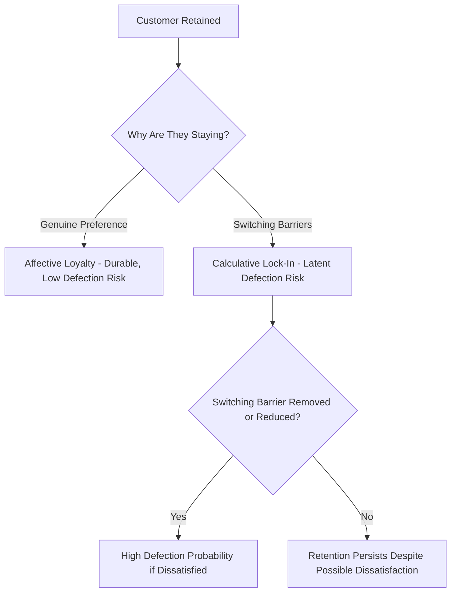

## Switching Costs and Lock-In Effects

### Overview

Switching costs are the real or perceived costs a customer incurs when moving from one provider, product, or service to a competing alternative. Lock-in effects describe the resulting state in which these costs are high enough to meaningfully constrain a customer's willingness or ability to switch, even when a genuinely preferable alternative exists. Together, these concepts provide an economic and psychological complement to relationship marketing theory's trust-and-commitment framework — while relationship marketing emphasizes building genuine (affective) loyalty, switching-cost theory explains how customer retention can also be sustained, at least in the near term, through structural and psychological barriers to exit rather than positive attachment alone.

### Typology of Switching Costs

**Procedural (Effort-Based) Switching Costs**

The time, effort, and learning required to evaluate alternatives, set up a new provider, and become proficient with a new system or process. This includes:

- *Evaluation costs*: Time and cognitive effort spent researching and comparing alternatives.
- *Learning costs*: Time required to become proficient with a new product/interface/process (a well-documented factor in enterprise software, where deep organizational familiarity with an incumbent system represents a substantial switching barrier).
- *Setup costs*: Effort required to configure, migrate data into, or integrate a new provider's offering.

**Financial Switching Costs**

Direct monetary costs associated with switching:

- *Sunk investment costs*: Value already invested in the current provider that would be lost or non-transferable upon switching (a customized enterprise software implementation, accumulated non-transferable loyalty points).
- *Termination/exit fees*: Explicit contractual penalties for ending a relationship early (early termination fees common in telecom and subscription contracts).
- *Transaction costs of switching itself*: Direct costs of the switching process (data migration fees, new equipment purchase).

**Relational Switching Costs**

Costs stemming from the loss of an interpersonal or brand relationship itself:

- *Personal relationship loss*: Value derived from an ongoing relationship with specific service personnel (a trusted financial advisor, a familiar hairstylist) that would not transfer to a new provider.
- *Brand relationship loss*: Loss of an emotional or identity-based connection to a brand, distinct from the practical/functional switching costs — this overlaps conceptually with the affective commitment construct from relationship marketing theory, though switching-cost theory frames it specifically as a cost of leaving rather than a positive driver of staying.

**Data and Content Lock-In**

A particularly significant switching cost category in digital products: accumulated data, content, or history stored within a platform (photos in a cloud service, purchase/watch history in a streaming platform, accumulated professional network connections in a social platform) that would be difficult, costly, or impossible to fully transfer to a competing platform, creating a switching barrier that grows in magnitude the longer a customer uses the service.

**Network Effects as a Switching Barrier**

Distinct from but related to the switching-cost categories above, network effects occur when a product or platform's value to any individual user increases as more users join it (e.g., a messaging app, a marketplace, a social network) — creating a structural barrier to switching not because of the individual's own accumulated investment, but because switching would mean losing access to the network of other users/participants who remain on the incumbent platform.

### Economic Theory Foundation

**Switching Costs in Industrial Organization Economics**

Switching cost theory has roots in industrial organization and competitive strategy economics, where it is analyzed as a structural factor affecting market competition dynamics — markets with high switching costs tend to exhibit reduced price competition for existing customers (since providers can extract more value from a locked-in installed base) while often exhibiting more aggressive price competition for new customer acquisition (since winning a new customer in a high-switching-cost market captures a more durable, defensible revenue stream than in a low-switching-cost market). [Unverified: the precise competitive dynamics predicted by switching-cost economic models can vary depending on additional market structure factors — such as the number of competing firms, the maturity of the market, and whether switching costs are symmetric or asymmetric across firms — so specific competitive outcomes should be assessed against the particular market's actual structure rather than assumed to follow uniformly from switching-cost presence alone.]

**The Installed Base and Pricing Power**

Firms operating in high-switching-cost markets can, in principle, exercise greater pricing power over their existing (locked-in) customer base than a purely competitive market without switching costs would allow, since raising prices moderately may not trigger the customer defection that would occur absent the switching barrier — a dynamic sometimes cited as a partial economic explanation for gradual price increases in mature subscription and platform businesses.

### Distinguishing Genuine Loyalty from Lock-In

**The Loyalty-Lock-In Distinction**

A conceptually important distinction, connecting directly back to relationship marketing theory's affective-versus-calculative commitment framework, is between:

- *Genuine (affective) loyalty*: A customer stays because they positively prefer the provider and would likely choose it again even absent switching barriers.
- *Lock-in (calculative retention)*: A customer stays primarily because switching costs make leaving impractical or costly, independent of their actual underlying preference — such a customer may be dissatisfied but retained, sometimes described in the literature as being in a state of "spurious loyalty" rather than true loyalty.

**Why This Distinction Matters Practically**

Customers retained primarily through lock-in rather than genuine preference represent a latent retention risk — they are more vulnerable to defection the moment a sufficiently compelling alternative reduces or eliminates the relevant switching barrier (e.g., a new competitor offering free data migration specifically to overcome the procedural switching cost that had been retaining customers), and in the interim, dissatisfied-but-locked-in customers are more likely to generate negative word-of-mouth and lower overall satisfaction scores than genuinely loyal customers, even while contributing similarly to near-term retention metrics — meaning retention metrics alone can mask an underlying vulnerability that satisfaction or NPS-style metrics (discussed under CX measurement) are better positioned to reveal.

### Strategic Applications and Design Choices

**Deliberate Switching-Cost Design (Firm Perspective)**

Firms can deliberately design products and business models to increase switching costs — data portability limitations, proprietary file formats, ecosystem lock-in (e.g., hardware/software/accessory ecosystems designed to work best together), long-term contracts with exit penalties, and loyalty-program point structures (as discussed in the prior topic) that would forfeit accumulated value upon switching.

**Ethical and Regulatory Tension**

Deliberately engineered switching costs — particularly data portability restrictions and interoperability limitations — have drawn increasing regulatory scrutiny in various jurisdictions, on the argument that artificially high switching costs can suppress genuine competition and consumer choice rather than reflecting legitimate product differentiation; this connects switching-cost strategy directly to competition-law and digital-platform-regulation considerations that vary by jurisdiction and are subject to ongoing legislative and regulatory change. [Unverified: specific regulatory developments regarding data portability and platform interoperability requirements are actively evolving across jurisdictions and should be verified against current law for any specific market rather than assumed static, given how much active legislative and enforcement activity is occurring in this area globally.]

**Reducing Switching Costs to Win Customers (Competitor Perspective)**

Challenger firms competing against an incumbent with high switching costs often explicitly design offers and services specifically targeting the dominant switching-cost barrier — free data migration services, contract buyout offers (paying a new customer's early-termination fee with their previous provider), and side-by-side compatibility/import tools — directly reducing the specific switching cost category that has been protecting the incumbent's installed base.

**Balancing Lock-In Strategy with Genuine Loyalty Investment**

Given the loyalty-versus-lock-in distinction above, a firm relying heavily on switching-cost-based retention without also investing in genuine relationship marketing (trust, commitment, satisfaction) may sustain retention metrics in the near term while accumulating a growing base of dissatisfied, merely-locked-in customers who represent both an ongoing reputational/word-of-mouth risk and a latent mass-defection vulnerability if a barrier-reducing competitive disruption occurs — suggesting that switching-cost strategy and relationship-marketing investment are best treated as complementary rather than substitutable retention approaches. [Inference: this complementary-rather-than-substitutable framing follows from combining the switching-cost and relationship-marketing theoretical frameworks discussed in this chapter, rather than being a finding from a single specific empirical study measuring the interaction between the two strategies directly.]

### Measurement Considerations

**Isolating Lock-In from Genuine Satisfaction in Retention Data**

Because standard retention/churn metrics alone cannot distinguish a genuinely satisfied retained customer from a merely locked-in one, rigorous measurement typically requires combining retention data with independent satisfaction measurement (NPS, CSAT, or qualitative research) to identify the "dissatisfied but retained" segment specifically — customers with low satisfaction scores but continued retention are a strong candidate signal for lock-in-driven rather than preference-driven retention.

**Willingness-to-Switch Survey Measures**

Direct survey measures asking customers to estimate their own switching intent or the perceived difficulty/cost of switching can supplement behavioral retention data, though such self-reported measures carry the general limitations of self-report methodology (respondents may not fully or accurately introspect on their own true switching costs and barriers).

**Competitive Win/Loss Analysis**

Tracking the specific reasons customers cite when they do successfully switch away (through exit surveys or win/loss interview programs) can retrospectively reveal which switching-cost barriers were and were not sufficient to retain customers, informing which barriers may be eroding or which competitor tactics are proving effective at overcoming them.

### Example

**Example: Enterprise Software Vendor Lock-In Dynamics**

An enterprise software company observes strong customer retention (low annual churn) but declining NPS scores among its existing customer base over several years.

- Investigation reveals retention is being sustained primarily by high procedural switching costs (deep organizational process integration and staff training built around the incumbent system) and data lock-in (years of accumulated historical data in a proprietary format with no straightforward export/migration path) — rather than by genuine ongoing satisfaction with the product.
- When a new competitor enters the market specifically offering a dedicated migration service and data-import tooling designed to neutralize both the procedural and data-lock-in switching costs, the incumbent experiences an accelerated wave of customer defections concentrated specifically among the previously-identified low-NPS, high-tenure customer segment — consistent with the theoretical prediction that dissatisfied-but-locked-in customers represent latent defection risk once the relevant barrier is sufficiently reduced.
- This experience prompts the incumbent to invest more heavily in genuine product satisfaction and customer success (relationship-marketing-oriented retention) rather than relying primarily on switching-cost-based retention going forward, alongside a strategic reassessment of how to reduce its own future vulnerability to this same defection dynamic. [Inference: this is a constructed illustrative example demonstrating the theoretical dynamics discussed above, not a case study of a specific named company.]

### Limitations and Ethical Considerations

- **Measurement difficulty in isolating true switching costs**: Precisely quantifying the magnitude of different switching-cost categories for a given customer base is methodologically challenging, since switching costs are partly subjective/perceived (how difficult a customer *believes* switching would be) rather than purely objective and measurable, and self-report measures of this perception carry standard self-report limitations.
- **Risk of strategic over-reliance on lock-in**: As discussed above, a firm strategy overly dependent on switching-cost-based retention, absent genuine product/relationship quality investment, carries meaningful long-term strategic risk if barriers erode or a sufficiently motivated competitor specifically targets the relevant switching-cost category.
- **Ethical and regulatory scrutiny of engineered lock-in**: Deliberately designing artificial (as opposed to naturally occurring) switching costs — particularly through data portability restriction or proprietary format lock-in with limited legitimate technical justification — raises genuine ethical questions about whether such design serves customer interests or primarily serves defensive competitive purposes, and is an area of active regulatory attention in various jurisdictions as noted above.
- **Cultural and category variation**: The relative importance of different switching-cost categories (procedural vs. financial vs. relational vs. network-effect-based) varies substantially by industry and customer type (e.g., data lock-in is far more central in cloud/SaaS and social-platform contexts than in most traditional retail categories), meaning generalized switching-cost strategy must be adapted to the specific competitive and technical context of the category in question rather than applied uniformly.

### Complementary Frameworks

- **Relationship Marketing Theory**: Provides the affective-commitment counterpart and the important loyalty-versus-lock-in conceptual distinction central to this topic.
- **Customer Lifetime Value Modeling**: Retention driven by lock-in versus genuine preference may carry different implied risk profiles for CLV projections, since lock-in-driven retention may be more fragile to competitive disruption than the model's baseline retention-curve assumptions would suggest.
- **Loyalty Program Design**: Loyalty program point/status structures are themselves a deliberate switching-cost mechanism, connecting the reward-design topic directly to this one.
- **CX Measurement (NPS, CSAT, CES)**: Provides the satisfaction-side measurement needed to distinguish genuinely loyal from merely locked-in retained customers, as discussed under measurement considerations above.
- **Network Effects and Platform Strategy**: Provides deeper treatment of the network-effect-specific switching barrier category referenced above.

**Related Topics**

- Relationship marketing theory
- Customer lifetime value modeling
- Loyalty program psychology and reward design
- CX measurement: NPS, CSAT, and CES
- Network effects and platform business strategy
- Competitive strategy and industrial organization economics
- Data portability regulation and digital platform competition policy
- Win/loss analysis and competitive churn research