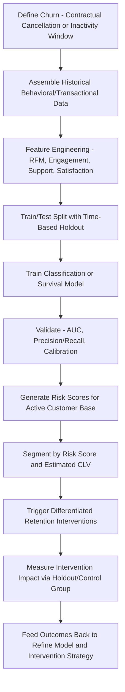
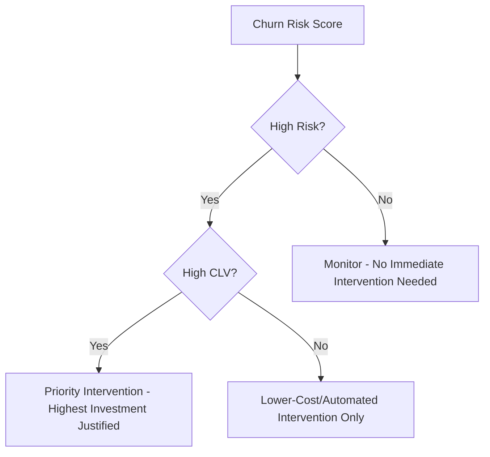

## Churn Prediction and Retention Interventions

### Overview

Churn prediction is the analytical practice of identifying which customers are at elevated risk of ending their relationship with a business before they actually do so, using statistical or machine learning models trained on historical behavioral and transactional data. Retention interventions are the proactive actions — offers, outreach, product changes — triggered by these predictions, designed to prevent or reduce the predicted churn from occurring. Together, churn prediction and retention interventions form the applied, operational counterpart to the theoretical relationship-marketing and CLV concepts discussed elsewhere in this chapter, converting predictive insight into concrete business action.

### Defining Churn

**Contractual (Explicit) Churn**

In subscription or membership businesses, churn has an unambiguous, directly observable definition: contract cancellation or non-renewal. This makes churn labeling for model training relatively straightforward, since the target outcome variable is directly present in the data.

**Non-Contractual (Implicit) Churn**

In transactional businesses without an explicit cancellation event (retail, e-commerce), churn must be operationally defined by the business — typically as a customer failing to make a purchase within some defined inactivity window (e.g., "no purchase in 180 days" for a typical repeat-purchase category). This definitional choice is itself a modeling decision with real consequences: a window set too short will misclassify normal-but-infrequent customers as churned, while a window set too long will delay actionable churn detection past the point where intervention is still effective. [Inference: the appropriate inactivity window is inherently category- and business-specific, determined by typical natural purchase-cycle length for the product category, rather than derivable from a single universal rule — a company selling groceries and one selling mattresses would appropriately define "churned" using very different inactivity windows.]

**Voluntary vs. Involuntary Churn**

- *Voluntary churn*: The customer actively chooses to leave (cancels, switches to a competitor, stops purchasing due to dissatisfaction or changed needs).
- *Involuntary churn*: The customer relationship ends due to a non-preference-driven cause, most commonly **payment failure** in subscription contexts (an expired credit card, insufficient funds) rather than a deliberate decision to leave.

This distinction matters significantly for intervention design, since involuntary churn is often addressed through operational/technical fixes (automated payment retry logic, card-update reminder campaigns, dunning management) rather than the persuasive retention offers appropriate for voluntary, preference-driven churn — conflating the two churn types in a single undifferentiated model and intervention strategy risks misdirecting resources.

### Churn Prediction Modeling Approaches

**Feature Engineering for Churn Models**

Predictive churn models typically draw on several categories of behavioral and transactional features:

- *Recency, Frequency, Monetary (RFM) features*: As discussed under CLV modeling, declining recency and frequency are among the most consistently predictive signal categories across churn modeling literature.
- *Engagement/usage features*: For digital products and subscriptions, declining feature usage, login frequency, or session duration often precedes formal cancellation and can serve as an earlier warning signal than purchase/billing data alone.
- *Support interaction features*: Frequency and sentiment of customer support contacts, particularly unresolved or escalated issues, are commonly predictive of elevated churn risk.
- *Satisfaction survey scores*: NPS, CSAT, and CES scores (discussed earlier in this chapter) can serve as direct model input features, connecting the CX measurement discipline to the churn prediction discipline.
- *Tenure and lifecycle stage*: Churn risk often varies systematically by relationship tenure — many subscription businesses observe elevated churn risk concentrated in the earliest months of a relationship (sometimes discussed as an "early churn" pattern), distinct from later-tenure churn drivers.
- *Contract and pricing features*: Contract type, recent price changes, and upcoming renewal or contract-end dates are frequently predictive, particularly for contractual businesses.

**Classification Model Approaches**

Churn prediction is fundamentally framed as a binary classification problem (will this customer churn within a defined future window, yes/no), commonly implemented using:

- *Logistic regression*: A simpler, highly interpretable baseline approach, often still used specifically because its coefficients are directly interpretable as the relative influence of each feature, which can be valuable for stakeholder communication and intervention-design rationale even when it is not the top-performing model by raw predictive accuracy.
- *Tree-based ensemble methods (Random Forest, Gradient Boosted Trees such as XGBoost/LightGBM)*: Commonly used in applied churn modeling for their strong out-of-box predictive performance on tabular behavioral data and their ability to capture non-linear feature interactions that simpler linear models miss.
- *Survival analysis models*: As discussed under CLV modeling, survival analysis (Cox proportional hazards, and related time-to-event modeling techniques) offers an alternative framing that models *when* churn is likely to occur (a hazard rate over time) rather than a simple binary yes/no prediction within a single fixed window, which can provide more nuanced timing information for intervention planning.
- *Deep learning approaches*: For businesses with very large volumes of granular behavioral/sequential data (e.g., detailed clickstream or usage-event sequences), sequence-modeling neural network architectures can capture more complex temporal usage patterns than traditional tabular feature-based models, at the cost of increased implementation complexity and reduced interpretability. [Inference: the marginal predictive benefit of deep learning approaches over well-tuned tree-based ensemble methods for churn prediction specifically depends heavily on data volume and the genuine presence of complex sequential patterns in the underlying behavior; for many standard tabular-feature churn problems, tree-based ensembles remain a strong and more interpretable baseline, and the choice should be validated empirically on the specific dataset rather than assumed in favor of model complexity.]

### Churn Modeling Pipeline

**Model Validation Considerations**

Churn models are typically validated using time-based (rather than random) train/test splits, since randomly shuffling customer records across time could allow the model to be evaluated on data that includes information effectively "from the future" relative to a training cutoff, producing an artificially inflated and unrealistic accuracy estimate — the standard approach trains on an earlier historical period and validates on a subsequent, genuinely out-of-time period to better approximate real deployment conditions.

**Class Imbalance**

Churned customers are frequently a minority class relative to retained customers in most datasets, which can bias naive model training toward simply predicting "not churned" for nearly everyone while still achieving a superficially high raw accuracy score — standard practice addresses this through appropriate resampling techniques, class-weighting, and evaluation metrics better suited to imbalanced classification (precision, recall, and area under the ROC curve, rather than raw accuracy alone).

### From Prediction to Action: Retention Intervention Design

**Risk-Value Segmentation**

A predicted churn probability alone is insufficient to determine appropriate action — retention intervention strategy typically combines churn-risk score with estimated customer lifetime value (from CLV modeling) to prioritize intervention effort, since intervening on a high-risk, low-CLV customer with an expensive retention offer may not be economically justified, whereas the same offer may be well justified for a high-risk, high-CLV customer.

**Intervention Types by Churn Cause**

- *Involuntary/payment-related churn*: Automated payment-retry logic, proactive card-expiration reminders, and simplified payment-update flows — largely operational/technical fixes rather than persuasive offers.
- *Price-sensitivity-driven churn*: Targeted discount or downgrade-to-lower-tier offers, allowing price-sensitive customers to remain at a reduced commitment level rather than churning entirely.
- *Dissatisfaction/service-issue-driven churn*: Proactive outreach from customer success or support specifically addressing the underlying service issue, connecting directly to the closed-loop feedback process discussed under CX measurement — this category benefits particularly from combining churn-risk scores with recent support-interaction or satisfaction-survey data to correctly diagnose the likely underlying cause before selecting an intervention.
- *Engagement-decline-driven churn (common in SaaS/digital products)*: Re-engagement campaigns highlighting underused features, personalized onboarding refreshers, or usage-based nudges designed to reconnect the customer with the product's core value proposition.
- *Competitive-switching-driven churn*: Retention offers or messaging specifically designed to counter the competitive alternative, sometimes informed by the switching-cost dynamics discussed in the prior topic (e.g., emphasizing the switching costs the customer would incur, or proactively addressing a specific switching barrier a competitor is known to be targeting).

**Timing of Intervention**

Predictive models that identify risk earlier in the churn process (before a cancellation request is actually initiated, for instance) generally allow for a broader and less reactive/defensive set of intervention options than models that only flag risk at or after the point of an explicit cancellation signal, when customer sentiment may already be firmly set and standard save-offer tactics have diminishing effectiveness.

**Avoiding Intervention Fatigue and Reactance**

Overly frequent or poorly targeted retention outreach (contacting customers who show only mild, normal usage fluctuation rather than genuine elevated risk) can create a negative psychological reaction (sometimes discussed in the behavioral literature as **reactance**, a motivational response against perceived manipulation or unwanted persuasion attempts), potentially accelerating rather than preventing churn — reinforcing the importance of appropriately calibrated risk thresholds and well-targeted, genuinely relevant intervention messaging rather than broad, undifferentiated retention-campaign blasting.

### Measuring Intervention Effectiveness

**Randomized Holdout Testing**

Rigorous measurement of retention intervention effectiveness requires a randomized control group of similarly at-risk customers who do *not* receive the intervention, allowing genuine causal estimation of the intervention's incremental retention lift — without this holdout comparison, observed retention among intervened customers cannot be reliably distinguished from customers who would have stayed regardless (a selection-bias concern directly analogous to the loyalty-program measurement challenge discussed in the prior topic).

**Cost-Benefit Analysis of Intervention Programs**

Given that interventions (discounts, outreach staff time, retention-offer costs) carry real direct costs, effective retention programs evaluate intervention cost against the CLV preserved by successfully retained customers, ensuring the overall program generates positive net financial return rather than simply maximizing raw retention rate regardless of cost — an economically unsustainable outcome if intervention costs exceed the incremental value retained.

**Model Monitoring and Drift**

Churn prediction models require ongoing monitoring for performance degradation over time (model drift), since changes in the underlying business (new competitors, pricing changes, product changes, or successful implementation of retention interventions that shift the population's behavior patterns) can gradually invalidate the relationships the model originally learned, requiring periodic retraining on more recent data.

### Example

**Example: SaaS Company Churn Prediction and Intervention Program**

A B2B SaaS company implements a churn prediction system:

- A gradient-boosted tree model trained on login frequency, feature-usage breadth, support-ticket volume/sentiment, and contract-renewal-date proximity produces a monthly churn-risk score for each active account.
- Accounts are segmented into a 2x2 matrix of churn-risk and CLV (using the company's existing BG/NBD-adjacent CLV model discussed in the CLV modeling topic), with high-risk/high-CLV accounts routed to a dedicated customer success manager for proactive, personalized outreach, while high-risk/low-CLV accounts receive a lower-cost automated re-engagement email sequence highlighting underused product features.
- A randomized holdout of 15% of high-risk/high-CLV accounts receives no proactive outreach (beyond standard support availability), allowing the company to measure the causal retention lift attributable to the customer success manager intervention rather than simply comparing intervened-versus-non-intervened accounts without a properly randomized comparison group.
- Results show the proactive intervention produces a measurable incremental retention lift specifically for accounts whose risk was driven by declining feature-usage breadth, but shows minimal incremental effect for accounts whose primary risk driver was proximity to a contract-renewal date with no other risk signals present — suggesting the underlying cause of predicted risk matters for intervention effectiveness, not just the risk score's magnitude alone, prompting the company to refine its intervention-routing logic to account for the specific predicted churn driver rather than risk score alone. [Inference: this is a constructed illustrative example demonstrating the full prediction-to-measurement pipeline and the practical value of cause-differentiated intervention design, not a case study of a specific named company.]

### Limitations and Methodological Considerations

- **Correlation vs. causal driver confusion**: A predictive model identifying that a feature (e.g., declining login frequency) is statistically associated with churn does not necessarily mean that feature is the *causal* driver of churn, versus simply a downstream symptom of an underlying cause (e.g., a customer's business circumstances changing) that the model cannot directly observe — this distinction matters for intervention design, since addressing a correlated symptom (e.g., sending login-encouragement emails) may not address the actual underlying cause of dissatisfaction or reduced need.
- **Selection bias in intervention effectiveness measurement**: As emphasized above, without proper randomized holdout design, intervention effectiveness measurement is vulnerable to the same fundamental selection-bias problem discussed under loyalty program measurement — customers selected for intervention are, by construction, a different (higher-risk) population than the overall base, making naive before/after or intervened/non-intervened comparisons unreliable without a genuine control group.
- **Model interpretability and stakeholder trust**: More complex models (deep learning, large ensemble methods) may achieve marginally higher predictive accuracy but can be harder for business stakeholders (customer success teams acting on the predictions) to trust and act on confidently without some degree of interpretability regarding *why* a given account was flagged as high-risk — a practical consideration sometimes leading organizations to favor moderately-interpretable methods (e.g., gradient-boosted trees with feature-importance and SHAP-value explanation techniques) over pure black-box approaches, even at some potential cost to raw predictive performance.
- **Risk of reactance from over-targeting**: As discussed above, poorly calibrated intervention thresholds or overly frequent retention outreach can create a counterproductive psychological reaction, meaning model precision (avoiding false-positive risk flags on customers who were not actually at meaningful risk) matters as much for intervention program success as raw predictive recall.
- **Involuntary churn conflation risk**: Models and intervention programs that do not explicitly distinguish involuntary (payment-failure) churn from voluntary churn risk misapplying persuasive retention-offer interventions to what is fundamentally an operational/technical problem better solved through payment-retry and card-update mechanisms.

### Complementary Frameworks

- **Customer Lifetime Value Modeling**: Provides the value-side input needed to prioritize intervention investment alongside churn-risk scores.
- **Relationship Marketing Theory and Switching Costs**: Provide the underlying theoretical explanation for *why* customers churn (declining trust/commitment) or don't (switching-cost barriers), informing intervention strategy design.
- **CX Measurement (NPS, CSAT, CES)**: Provides both direct predictive features for churn models and a complementary diagnostic lens for understanding underlying dissatisfaction driving voluntary churn.
- **Critical Incident Technique**: Can provide qualitative depth into the specific incidents driving churn among segments identified by quantitative churn models, addressing the correlation-versus-causation limitation noted above.
- **A/B Testing and Experimental Design**: Provides the methodological foundation for the randomized holdout testing required to validate intervention effectiveness.

**Related Topics**

- Customer lifetime value modeling
- Relationship marketing theory
- Switching costs and lock-in effects
- CX measurement: NPS, CSAT, and CES
- Critical incident technique and qualitative churn diagnosis
- A/B testing and experimental design for marketing interventions
- Survival analysis and time-to-event modeling
- Model interpretability techniques (SHAP, feature importance) in applied marketing analytics