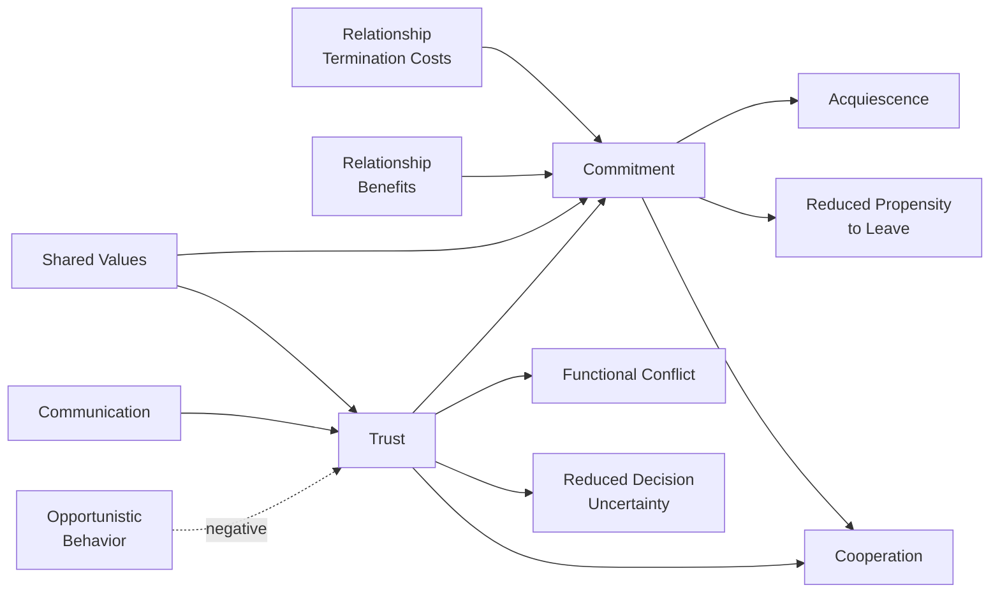
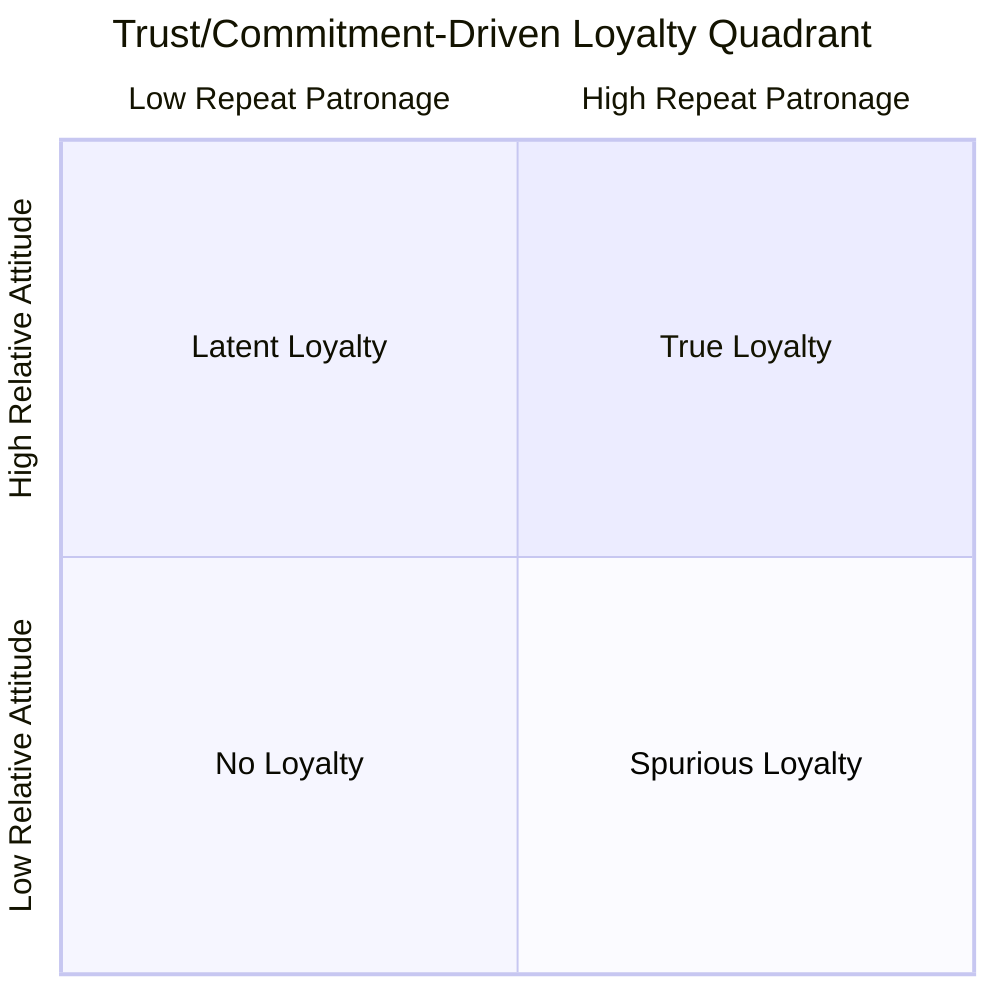

## Trust and Commitment in Long-Term Relationships

### Overview

Trust and commitment are the two central mediating constructs in relationship marketing theory, most famously formalized in the **Commitment-Trust Theory of Relationship Marketing** by Morgan and Hunt (1994). The theory argues that trust and commitment are the key variables that determine whether a buyer-seller relationship is successful, cooperative, and durable, because they encourage marketers to preserve relationship investments, resist attractive short-term alternatives, and view potentially risky actions as prudent because of a belief that partners will not act opportunistically.

This topic sits at the core of relationship marketing, loyalty, and retention because it explains the psychological mechanism by which repeated transactions evolve into durable relationships: trust reduces perceived risk, and commitment converts that reduced risk into willingness to invest, forgive, and stay.

---

### Core Definitions

**Trust** is the confidence one party has in an exchange partner's reliability and integrity. It has two components:

- **Credibility**: the belief that the partner has the required expertise to perform the job effectively and reliably.
- **Benevolence**: the belief that the partner has intentions and motives beneficial to the trusting party, even when new, unforeseen conditions arise that were not part of the original agreement.

**Commitment** is defined as an exchange partner believing that an ongoing relationship with another is so important as to warrant maximum efforts at maintaining it — that is, the committed party believes the relationship is worth working on to ensure it endures indefinitely.

**[Inference]** Because these are latent psychological constructs, they are typically operationalized in research and industry practice through multi-item survey scales (e.g., Likert-scale batteries) rather than observed directly.

---

### The Commitment-Trust Theory (KMV Model)

Morgan and Hunt's model is often called the **KMV model** (Key Mediating Variable model) because trust and commitment mediate between five antecedents and five outcomes.

**Antecedents of Trust and Commitment:**

| Antecedent | Effect | Mechanism |
| --- | --- | --- |
| Relationship termination costs | → Commitment | High switching costs increase perceived value of staying |
| Relationship benefits | → Commitment | Superior benefits relative to alternatives build attachment |
| Shared values | → Trust & Commitment | Common beliefs about what behaviors/goals are appropriate |
| Communication | → Trust | Timely, relevant information sharing reduces uncertainty |
| Opportunistic behavior | → Trust (negative) | Self-interest-seeking with guile erodes confidence |

**Outcomes of Trust and Commitment:**

1. **Acquiescence** — compliance with a partner's requests or policies
2. **Propensity to leave** (reduced) — lower likelihood of ending the relationship
3. **Cooperation** — coordinated, complementary actions to achieve mutual outcomes
4. **Functional conflict** (increased tolerance) — resolving disagreements amicably
5. **Decision-making uncertainty** (reduced) — confidence in evaluating relationship decisions

**Diagram (svg_diagram): KMV Model Structure**

---

### Trust: Deeper Mechanics

#### Sources of Trust

- **Calculative/Deterrence-based trust**: belief that the cost of cheating outweighs the benefit (contracts, penalties, reputational risk)
- **Knowledge-based trust**: built through repeated interaction history that allows prediction of partner behavior
- **Identification-based trust**: partners internalize each other's goals and values, the deepest and most durable form

**[Inference]** These three levels roughly correspond to a maturation path in relationship lifecycle: relationships often start calculative, move to knowledge-based through repeated satisfactory exchanges, and only a minority reach identification-based trust.

#### Trust Repair After Violation

Trust violations are categorized by attribution:

- **Competence-based violations** (an honest mistake, ability failure) — generally easier to repair via apology and demonstrated corrective competence
- **Integrity-based violations** (perceived dishonesty or bad intent) — harder to repair; require sustained behavioral change over time, not just verbal accounts

**Key Points**

- Apologies work better for competence violations; denials work better (when credible) for integrity violations — but denial that is later proven false causes catastrophic trust collapse.
- Trust, once broken, typically does not return to baseline even after repair; it follows an asymmetric "trust asymmetry" pattern where negative information is weighted more heavily than positive information of equal magnitude.

---

### Commitment: Three-Component Framework

Drawing from Allen and Meyer's organizational commitment research (adapted extensively to consumer/B2B relationship marketing):

1. **Affective commitment**: emotional attachment, identification, and involvement — "I want to stay because I like this relationship."
2. **Calculative (continuance) commitment**: recognition of the costs of leaving — "I have to stay because switching is costly."
3. **Normative commitment**: a felt obligation to continue — "I ought to stay because it's the right thing to do."

**Example**

A B2B software buyer may exhibit:

- **Affective**: genuine enthusiasm for the vendor's product roadmap and account team relationship
- **Calculative**: sunk costs in integration, employee training, and data migration effort
- **Normative**: a personal relationship with the sales rep who took a risk championing the buyer's initial (unproven) use case internally

**[Inference]** Affective commitment is generally associated with the strongest positive word-of-mouth and lowest price sensitivity, while purely calculative commitment (a "captive" customer) is associated with vulnerability to defection once switching costs are neutralized (e.g., a competitor subsidizes migration) and can even correlate with negative sentiment or complaint behavior, since the customer feels "locked in" rather than genuinely loyal.

---

### Trust and Commitment vs. Loyalty: Distinguishing Constructs

A common confusion in relationship marketing coursework is conflating trust, commitment, and loyalty.

| Construct | Definition | Behavioral vs. Attitudinal |
| --- | --- | --- |
| Trust | Confidence in partner reliability/benevolence | Primarily attitudinal/cognitive |
| Commitment | Desire/intent to maintain the relationship | Attitudinal, precedes behavior |
| Loyalty | Repeat patronage + favorable attitude | Behavioral (repeat purchase) + attitudinal |

Dick and Basu's loyalty framework maps directly onto this: **true loyalty** requires both high relative attitude (rooted in trust/commitment) and high repeat patronage. Without the attitudinal component, high repeat purchase is merely **spurious loyalty** (inertia, monopoly, convenience) — fragile and quick to erode once switching barriers drop.

**Diagram (svg_diagram): Loyalty Quadrant**

---

### Measurement: Representative Scale Items

**[Unverified]** Exact wordings vary by study; the following are illustrative, standard-style items adapted from commonly cited relationship marketing scales (e.g., Morgan & Hunt 1994; Garbarino & Johnson 1999):

**Trust items** (agree/disagree, 7-point Likert):

- "This company can be relied on to keep its promises."
- "This company has high integrity."
- "I trust this company to look out for my best interests."

**Commitment items:**

- "I feel a sense of loyalty to this company."
- "I am willing to put effort into maintaining my relationship with this company."
- "Even if this company's prices increased somewhat, I would continue to be a customer."

$$\text{Relationship Quality Index} = w_1(\text{Trust}) + w_2(\text{Commitment}) + w_3(\text{Satisfaction})$$

where $w_1$, $w_2$, $w_3$ are empirically derived weights that vary by industry context; **[Inference]** in high-involvement, high-risk service categories (e.g., financial services, healthcare), trust tends to carry disproportionate weight relative to satisfaction alone.

---

### Application to Marketing Practice

#### Building Trust

- **Transparency**: proactive disclosure of pricing, data use, sourcing, and limitations
- **Consistency**: reliable delivery on explicit and implicit promises (on-time delivery, service quality standardization)
- **Competence signaling**: certifications, third-party reviews, warranties, case studies
- **Benevolence signaling**: customer-first policies during adverse events (e.g., proactive refunds, flexible terms during hardship)

#### Building Commitment

- **Increase switching costs ethically**: loyalty programs, data/personalization lock-in (value-based, not punitive), integration depth
- **Increase relationship benefits**: exclusive access, tiered rewards, superior service recovery
- **Foster shared values**: brand purpose alignment, community-building, co-creation opportunities
- **Communicate proactively**: regular, relevant, two-way communication (not just promotional blasts)

**Next Steps**

A practical diagnostic sequence marketers use:

1. Audit current trust drivers (competence + benevolence perception via surveys/NPS verbatims)
2. Segment customers by commitment type (affective vs. calculative vs. normative) using behavioral + attitudinal data
3. Identify "at-risk" calculative-only segments before contract renewal/switching windows
4. Design interventions matched to commitment type (affective → community/recognition; calculative → cost/benefit reinforcement; normative → reciprocity/relationship history reminders)

---

### Common Pitfalls and Misapplications

- **Mistaking calculative commitment for genuine loyalty**: leads to overconfidence in retention metrics that collapse when a competitor removes switching friction.
- **Over-indexing on satisfaction as a proxy for trust/commitment**: satisfaction is transaction-specific and can be high even when trust is low (e.g., a satisfying single purchase from a distrusted brand).
- **Assuming trust repair is symmetric with trust building**: repair after an integrity violation generally requires substantially more time and consistent evidence than the original trust-building phase.
- **[Speculation]** Some practitioners assume digital/AI-mediated interactions (chatbots, automated service) build trust identically to human interactions; this remains a genuinely contested and evolving area in current research, particularly regarding whether benevolence attribution transfers to non-human agents.

---

### Related Topics

- Relationship Quality and Relationship Marketing Orientation (RMO)
- Service Recovery Paradox and Trust Repair Strategies
- Switching Costs and Switching Barriers Theory
- Dick and Basu's Loyalty Framework (attitudinal vs. behavioral loyalty)
- Social Exchange Theory and Reciprocity Norms
- Customer Lifetime Value (CLV) as an outcome of trust-commitment dynamics
- Brand Attachment Theory
- B2B Relationship Marketing and Key Account Management
- Psychological Contract Theory in Customer Relationships
- Net Promoter Score (NPS) vs. Trust/Commitment as Loyalty Predictors