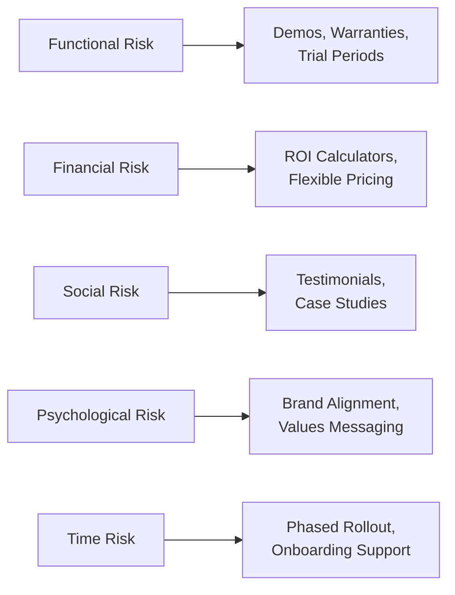
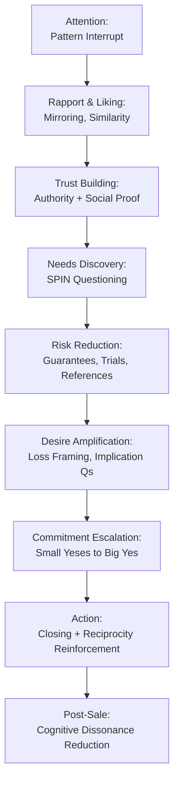

## Psychological Principles of Personal Selling

### Overview

Personal selling is the interpersonal arm of the promotional mix, and its effectiveness rests heavily on applied psychology: how salespeople build trust, interpret buyer cognition and emotion, manage social influence, and adapt communication to reduce resistance. This topic synthesizes the core psychological frameworks — persuasion principles, buyer decision psychology, communication theory, and trust-building mechanics — that underlie professional selling practice, from prospecting through post-sale relationship management.

---

### Foundational Model: AIDA and Its Psychological Layer

The classic AIDA model (Attention, Interest, Desire, Action) maps onto psychological states a buyer moves through:

| Stage | Psychological Mechanism | Salesperson Objective |
| --- | --- | --- |
| Attention | Selective perception, pattern interrupt | Break through cognitive filtering |
| Interest | Relevance appraisal, curiosity gap | Connect offering to a felt need |
| Desire | Emotional arousal, mental ownership | Create vivid, personalized value imagery |
| Action | Reduction of perceived risk, decision commitment | Lower friction, provide closing trigger |

**[Inference]** AIDA is a heuristic teaching model rather than an empirically validated stage-sequence of cognition; modern buyer behavior research (e.g., non-linear, iterative decision journeys) treats it as a simplification useful for training structure rather than a literal cognitive pipeline.

---

### Cialdini's Principles of Influence in Selling

Robert Cialdini's six (later seven) principles of persuasion are the most widely taught psychological toolkit in personal selling curricula.

1. **Reciprocity** — People feel obligated to return favors. *Application*: free samples, value-added consultations, unsolicited useful information before asking for the sale.
2. **Commitment and Consistency** — People act consistently with prior commitments. *Application*: securing small "yes" agreements early (needs confirmation, agreeing on pain points) before the larger ask.
3. **Social Proof** — People look to others' behavior under uncertainty. *Application*: testimonials, case studies, "customers like you" references, usage statistics.
4. **Liking** — People say yes to those they like. *Application*: similarity-building, genuine compliments, rapport, cooperative framing.
5. **Authority** — People defer to perceived experts. *Application*: credentials, industry data, third-party endorsements, demonstrated technical mastery.
6. **Scarcity** — People value what is scarce or time-limited. *Application*: limited-time offers, limited inventory, exclusive access — used ethically, not fabricated.
7. **Unity** (added in later work) — Shared identity ("we," not "you and I") increases persuasive power. *Application*: framing the salesperson as part of the buyer's team/tribe (e.g., "as a fellow small-business owner...").

**Key Points**

- These principles are most effective and most ethically defensible when they reflect genuine conditions (real scarcity, real expertise) rather than manufactured pressure; manufactured scarcity/urgency, when discovered, causes disproportionate trust damage (see trust asymmetry, covered under trust and commitment topics).
- **[Inference]** Overuse of any single principle without contextual fit (e.g., forcing scarcity language in a B2B enterprise sale with a 9-month cycle) tends to reduce credibility rather than increase conversion, since buyers pattern-match to manipulation tactics.

---

### Buyer Psychology: Needs, Motivation, and Risk

#### Maslow's Hierarchy Applied to Buying Motives

Salespeople commonly map product benefits to buyer motivational levels:

- **Physiological/Safety** → cost savings, security, reliability messaging
- **Belonging** → community, brand identity, peer alignment
- **Esteem** → status, recognition, competitive advantage
- **Self-actualization** → mastery, growth, purpose-driven value propositions

**[Inference]** In practice, B2B buying motives are frequently a blend of organizational (safety/efficiency) and personal (esteem/career risk) motives simultaneously — the "economic buyer" and the "psychological buyer" often coexist in the same individual.

#### Perceived Risk Theory

Buyers weigh several risk types before purchase, especially in high-involvement or B2B contexts:

- **Functional risk**: will it work as promised?
- **Financial risk**: is it worth the cost?
- **Social risk**: will others judge this choice negatively?
- **Psychological risk**: will this purchase clash with self-image?
- **Time risk**: is the implementation/learning cost acceptable?

Salespeople reduce perceived risk through guarantees, references, trial periods, phased implementation, and social proof — each risk type calls for a different reassurance tactic.

**Diagram (svg_diagram): Perceived Risk → Reassurance Mapping**

---

### Cognitive Biases Relevant to Selling

| Bias | Description | Sales Application |
| --- | --- | --- |
| Anchoring | First number presented skews subsequent judgment | Strategic initial price/quantity framing |
| Loss aversion | Losses felt more strongly than equivalent gains | Frame inaction as a loss ("cost of not switching") |
| Status quo bias | Preference for current state absent strong reason to change | Must overcome with clear differentiated value, not just parity |
| Confirmation bias | Buyers seek information confirming prior beliefs | Align messaging with buyer's existing worldview before introducing new information |
| Decoy effect | A third, inferior option makes a target option more attractive | Three-tier pricing structures (good/better/best) |
| Endowment effect | People value what they already "own" more highly | Trial periods increase perceived ownership and closing likelihood |

**[Inference]** These biases are well-documented in behavioral economics generally; their specific magnitude in live personal-selling contexts (as opposed to controlled lab studies) varies by product category, buyer sophistication, and cultural context, and practitioners should treat effect sizes as directional rather than fixed.

---

### Communication Psychology in Selling

#### SPIN Selling (Neil Rackham)

A question-sequencing framework grounded in psychological escalation of felt need:

1. **Situation** questions — establish facts and context
2. **Problem** questions — surface dissatisfaction or difficulties
3. **Implication** questions — expand the perceived consequences of the problem
4. **Need-payoff** questions — have the buyer articulate the value of solving it themselves

**[Inference]** The psychological logic is that self-generated value statements ("I would save X hours per week") are more persuasive and durable than salesperson-asserted claims, consistent with self-persuasion research showing people find their own conclusions more credible than externally imposed ones.

#### Active Listening and Rapport

- **Mirroring/matching**: subtly matching tone, pace, and body language to build unconscious rapport
- **Paraphrasing**: reflecting back the buyer's statements to confirm understanding and signal attentiveness
- **Open vs. closed questioning**: open questions early (discovery), closed questions later (confirmation, closing)

#### Nonverbal Communication

**[Unverified]** Popular claims that "55% of communication is nonverbal" (Mehrabian's rule) are frequently overgeneralized; Mehrabian's original research was narrowly scoped to communication of feelings/attitudes under specific experimental conditions, not communication in general. Personal selling training often cites this statistic imprecisely, and it should be treated with caution rather than as a universal rule.

---

### Elaboration Likelihood Model (ELM) in Selling

The ELM (Petty & Cacioppo) distinguishes two persuasion routes:

- **Central route**: high-involvement buyers process detailed arguments, data, and logic — relevant for complex B2B/technical sales.
- **Peripheral route**: low-involvement buyers rely on heuristic cues (salesperson likability, packaging, brand reputation) — relevant for low-stakes/routine purchases.

$$\text{Persuasion Effectiveness} = f(\text{Argument Quality} \times \text{Motivation to Process}) + f(\text{Peripheral Cues} \times (1 - \text{Motivation to Process}))$$

**Example**

Selling enterprise cybersecurity software (high involvement, high risk) requires central-route persuasion: technical whitepapers, compliance documentation, ROI models, and reference architecture reviews. Selling a office snack subscription (low involvement) can rely more heavily on peripheral cues: friendly rep demeanor, attractive packaging, easy trial signup.

---

### Trust and Ethical Persuasion Boundaries

Trust operates as a multiplier on all persuasion tactics above — the same technique (e.g., scarcity) builds long-term relationship value when genuine and destroys it when fabricated.

**Key ethical distinctions taught in sales psychology:**

- **Persuasion** (aligning genuine value with genuine need) vs. **manipulation** (creating false urgency, exploiting biases against the buyer's actual interest)
- **Consultative selling** (diagnosis before prescription) vs. **high-pressure selling** (prescription before diagnosis)
- Short-term transactional gains from manipulative tactics are generally traded off against long-term relationship/referral value — a core premise connecting sales psychology back to relationship marketing and customer lifetime value.

---

### The Buyer's Psychological Journey: A Composite Model

**Diagram (svg_diagram): Composite Sales Psychology Funnel**

#### Post-Purchase Psychology

- **Cognitive dissonance**: buyers often experience doubt after commitment, especially for high-involvement purchases; salespeople reduce this through reassurance communication, onboarding support, and reaffirming the decision's benefits.
- **[Inference]** Effective post-sale dissonance reduction is strongly linked to referral generation and renewal rates, since unresolved dissonance is a leading precursor to buyer's remorse and churn.

---

### Common Pitfalls and Misapplications

- **Confusing rapport with manipulation**: mirroring and liking tactics used without genuine value underneath produce short-term compliance but long-term distrust.
- **Applying scripted objection-handling universally**: buyer objections vary by underlying psychological driver (risk, budget, authority, need) and require diagnosis, not a single rebuttal template.
- **Over-reliance on peripheral-route tactics in high-involvement sales**: charisma alone rarely closes complex technical or enterprise sales lacking substantive argument quality.
- **[Speculation]** The rise of AI-assisted buyer research (buyers arriving pre-informed) is shifting some traditional persuasion-heavy selling stages earlier in the funnel toward self-service education, though the extent and permanence of this shift in personal-selling practice remains an area of ongoing debate rather than settled consensus.

---

### Next Steps

- Cialdini's Principles of Influence (deep dive, non-sales contexts)
- SPIN Selling Methodology (full framework and question design)
- Objection Handling Frameworks (Feel-Felt-Found, LAER model)
- Consultative Selling and Solution Selling
- Buyer Persona Development and Psychographic Segmentation
- Negotiation Psychology and Anchoring in Price Discussions
- Emotional Intelligence in Sales Performance
- Cognitive Dissonance Theory and Post-Purchase Behavior
- Trust and Commitment in Long-Term Relationships (B2B account management linkage)
- Neuromarketing Applications in Sales Training