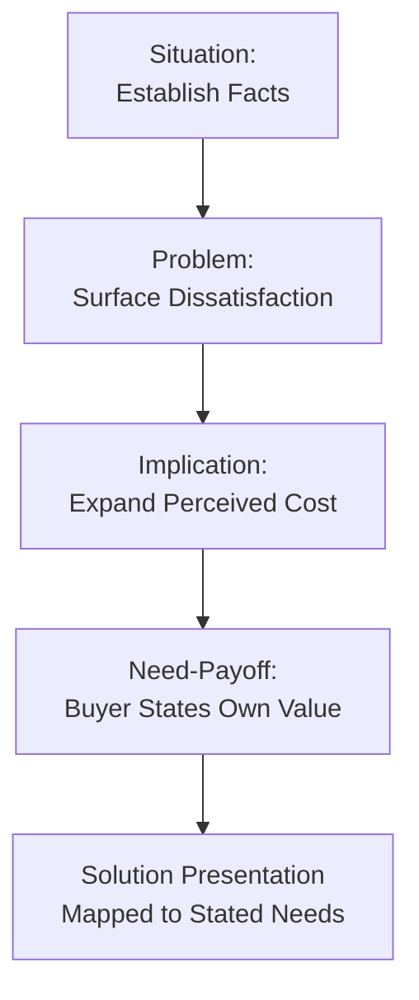

## Consultative and Needs-Based Selling

### Overview

Consultative selling is a customer-centric sales philosophy in which the salesperson acts as a diagnostic advisor rather than a product pitcher, prioritizing discovery of the buyer's actual needs before proposing solutions. Needs-based selling is the closely related discipline of structuring the entire sales process around explicit and latent buyer needs rather than product features. Together they represent the dominant paradigm shift in B2B and complex-sale psychology over the last several decades, moving away from persuasion-first models toward diagnosis-first models.

This approach is grounded in the psychological premise that buyers trust and act on conclusions they reach themselves more than conclusions asserted to them — making needs discovery not just a data-gathering step but a persuasion mechanism in its own right.

---

### Core Philosophy: Diagnosis Before Prescription

The foundational principle, often summarized with a medical analogy: a competent physician does not prescribe treatment before diagnosing the condition. Consultative selling applies this logic to commercial exchange.

**Key Points**

- The salesperson's primary early-stage role is diagnostic (asking, listening, clarifying), not persuasive (asserting, pitching, closing).
- Product/solution presentation is deliberately delayed until needs are established and, ideally, until the buyer has articulated those needs in their own words.
- **[Inference]** This sequencing reduces buyer resistance because premature pitching triggers reactance (psychological resistance to perceived persuasion attempts) before trust or relevance has been established.

---

### Historical Development

| Era/Framework | Contribution |
| --- | --- |
| Feature-Benefit Selling (mid-20th century) | Early move beyond pure product description toward benefit translation |
| Consultative Selling (Mack Hanan, 1970s) | Coined the term; positioned salespeople as "profit improvement" consultants |
| SPIN Selling (Neil Rackham, 1988) | Empirically derived question-sequencing model for large/complex sales |
| Solution Selling (Michael Bosworth, 1990s) | Formalized "pain chain" diagnosis and solution-mapping methodology |
| Challenger Sale (Dixon & Adamson, 2011) | Introduced "commercial teaching" — proactively reframing the buyer's understanding of their own need |

**[Inference]** The field has evolved from purely reactive needs-discovery (ask what they want) toward more proactive needs-shaping (teach them what they should want), reflecting a shift in how "needs" are psychologically understood — not always fully known or articulated by the buyer in advance.

---

### The SPIN Framework (Applied to Needs-Based Selling)

SPIN Selling remains the most empirically grounded needs-discovery methodology, based on Neil Rackham's large-scale study of sales call behavior.

1. **Situation questions** — establish factual context ("How is your team currently handling X?")
2. **Problem questions** — surface dissatisfaction ("What challenges come up with your current approach?")
3. **Implication questions** — expand the felt cost of the problem ("How does that delay affect downstream teams?")
4. **Need-payoff questions** — have the buyer state the value of resolution ("If that issue were solved, what would that mean for your quarterly targets?")

**Diagram (svg_diagram): SPIN Question Escalation**

**[Inference]** The psychological effect of Implication and Need-payoff questions is to convert a latent, low-urgency problem into an explicit, high-urgency need, using the buyer's own reasoning rather than salesperson assertion — consistent with self-persuasion research showing self-generated arguments are more resistant to counter-persuasion later in the buying cycle.

---

### Needs Typology in Consultative Selling

Distinguishing needs types is central to accurate diagnosis:

| Need Type | Description | Discovery Method |
| --- | --- | --- |
| Explicit needs | Clearly stated, specific requirements | Direct questioning |
| Implicit/latent needs | Underlying problems not yet articulated as needs | Problem and implication questioning |
| Functional needs | Task-level, practical requirements | Situation/process mapping |
| Emotional needs | Status, security, confidence, risk mitigation | Rapport-based, indirect exploration |
| Organizational needs | Business-level outcomes (revenue, efficiency, compliance) | Stakeholder mapping, business case discussion |
| Personal/political needs | Individual buyer's career risk, internal credibility | Relationship-building, trust-based disclosure |

**Example**

A procurement manager evaluating a new inventory management system may state an **explicit need** ("we need real-time stock visibility"), while harboring an unstated **personal need** (avoiding blame for last quarter's stockout that damaged their internal credibility). A consultative seller who only addresses the explicit need misses the deeper motivational driver influencing the final decision.

---

### The Consultative Selling Process

**Diagram (svg_diagram): Consultative Selling Process Flow**

1. **Pre-call research**: understanding the buyer's industry, role, and likely pain points before contact
2. **Rapport and trust establishment**: reducing social distance before diagnostic questioning begins
3. **Needs discovery**: structured, largely open-ended questioning
4. **Needs confirmation**: paraphrasing and validating the buyer's stated needs to demonstrate accurate listening and secure buy-in on the diagnosis
5. **Solution mapping**: presenting only the features/capabilities directly tied to confirmed needs (avoiding generic feature-dumping)
6. **Value justification**: quantifying impact in the buyer's own terms (cost savings, risk reduction, revenue growth)
7. **Objection resolution**: treating objections as unresolved needs or unaddressed risks rather than obstacles to overcome
8. **Mutual commitment**: securing a clear, bilateral next step rather than a one-sided pitch conclusion

---

### Active Listening as a Technical Skill

Consultative selling depends heavily on structured listening techniques, not passive hearing:

- **Paraphrasing**: restating the buyer's statement to confirm accurate understanding
- **Labeling emotions**: naming the underlying emotional state ("It sounds like this has been a frustrating bottleneck")
- **Silence tolerance**: deliberately pausing after questions to allow full buyer elaboration rather than filling silence with the seller's own voice
- **Open-question dominance**: using significantly more open ("what," "how," "tell me about") than closed ("do you," "is it") questions during discovery phases

**[Inference]** Sales training research generally associates a higher ratio of open-to-closed questions during discovery with more accurate needs diagnosis and higher buyer perception of being understood, though the optimal ratio varies by industry, deal complexity, and cultural communication norms.

---

### Consultative Selling vs. Transactional/Product Selling

| Dimension | Transactional Selling | Consultative Selling |
| --- | --- | --- |
| Primary focus | Product features and price | Buyer's business/personal outcomes |
| Sales conversation structure | Pitch-heavy, seller-talks-most | Question-heavy, buyer-talks-most |
| Relationship duration | Often single or few transactions | Designed for long-term, repeat engagement |
| Objection handling | Overcome/rebut | Diagnose and resolve underlying concern |
| Value basis | List price, feature comparison | Quantified business impact, ROI |
| Salesperson role | Vendor | Trusted advisor |

**[Inference]** Consultative selling is generally better suited to high-involvement, high-complexity, and high-value purchases (enterprise software, capital equipment, professional services) where diagnostic depth pays off; low-complexity, low-risk, high-volume transactions (commodity retail) often do not justify the time cost of full consultative discovery.

---

### The Challenger Sale: Extending Needs-Based Selling

Dixon and Adamson's Challenger Sale research introduced a nuance to pure needs-based selling: some of the highest-performing salespeople do not simply uncover existing needs — they proactively **teach** buyers to see a problem or opportunity they had not previously prioritized ("commercial teaching" or "insight selling").

**Key Points**

- This model argues that in complex B2B sales, buyers often cannot fully self-diagnose optimal solutions due to limited visibility into best practices or emerging risks.
- The Challenger approach layers three components: **Teach** (deliver a unique, valuable insight), **Tailor** (customize the message to stakeholder priorities), **Take Control** (comfortably assert opinion and push back when needed, rather than being purely accommodating).
- **[Inference]** This represents a partial tension with pure Rogerian/non-directive consultative models: Challenger selling blends needs discovery with proactive needs-shaping, which some sales psychology scholars treat as a distinct hybrid approach rather than a strict subtype of consultative selling.

---

### Psychological Mechanisms Underlying Effectiveness

- **Reactance reduction**: delaying pitching reduces the buyer's instinct to resist perceived persuasion attempts.
- **Self-persuasion**: buyer-articulated needs and value statements are internalized more strongly than seller-asserted claims.
- **Reciprocity**: genuine diagnostic effort and unbiased advice (including honestly noting when a solution is not a good fit) build a sense of obligation and goodwill.
- **Commitment and consistency**: buyer agreement at each discovery stage (confirmed needs, agreed value) creates incremental commitments that support a coherent path to the final decision.
- **Trust via benevolence signaling**: consultative behavior (asking, listening, occasionally recommending against overbuying) signals that the seller's interests are aligned with the buyer's, which supports the broader trust-and-commitment dynamics central to relationship marketing.

---

### Common Pitfalls and Misapplications

- **Scripted "consultative theater"**: mechanically running through SPIN-style questions without genuine listening produces a hollow, easily detected imitation that can damage trust more than a straightforward pitch.
- **Discovery without confirmation**: skipping the needs-confirmation step risks solution-mapping against a misread need, producing proposals that miss the mark despite thorough questioning.
- **Over-indexing on functional needs, ignoring political/personal needs**: especially in B2B, deals frequently stall not from functional misfit but from unaddressed internal stakeholder risk or credibility concerns.
- **Treating Challenger-style teaching as license to dominate the conversation**: effective commercial teaching still requires tailoring to the specific buyer context; generic "insight" pitches delivered without diagnostic grounding resemble product pitching with an added narrative layer.
- **[Speculation]** As buyers increasingly self-educate via digital research before ever engaging a salesperson, the early-stage discovery role of the salesperson may be shifting toward validation and refinement of a self-formed diagnosis rather than original discovery — though the extent of this shift and its implications for consultative selling methodology remain an area of active debate rather than settled practice.

---

### Related Topics

- SPIN Selling Methodology (full technical breakdown)
- The Challenger Sale and Commercial Insight Selling
- Solution Selling and Pain Chain Diagnosis
- Objection Handling Frameworks (Feel-Felt-Found, LAER)
- Stakeholder Mapping and Buying Center Dynamics (B2B)
- Value-Based Selling and ROI Justification Techniques
- Active Listening and Rapport-Building Techniques
- Psychological Principles of Personal Selling
- Trust and Commitment in Long-Term Relationships
- Negotiation Psychology in Complex Sales