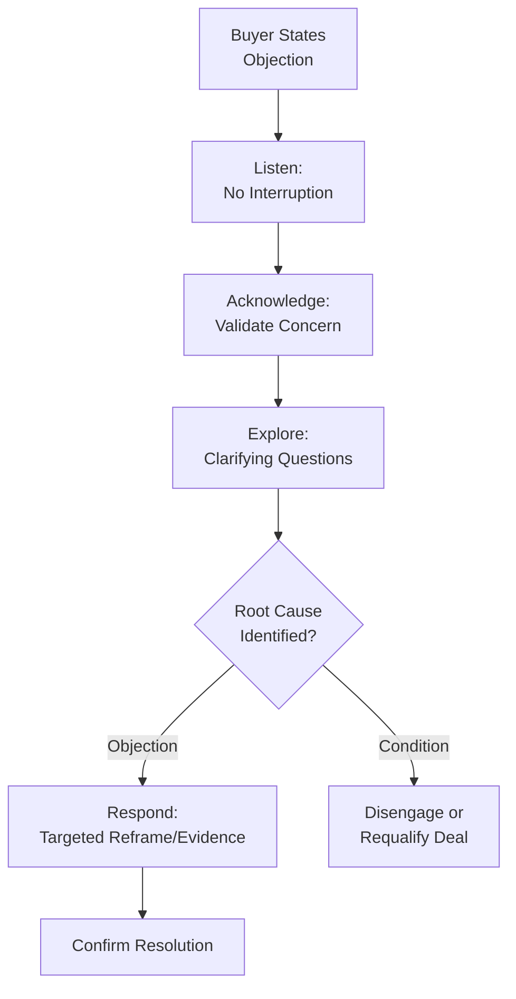
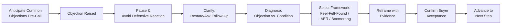

## Objection Handling and Reframing

### Overview

Objection handling is the sales discipline of identifying, diagnosing, and resolving buyer resistance during the sales process, while reframing is the cognitive technique of shifting how a buyer perceives a fact, cost, or risk without disputing the fact itself. Together they form a core psychological competency in persuasive selling: objections are treated not as rejections to overcome by force of argument, but as diagnostic signals revealing unresolved risk, unmet need, or unclear value — and reframing is the primary tool for resolving them without triggering defensive resistance.

---

### Psychological Nature of Objections

**Key Points**

- An objection is rarely a flat refusal; it is typically a request for more information, reassurance, or a signal of unaddressed risk.
- Objections often mask a deeper concern than the one stated — a stated price objection may actually encode uncertainty about value, risk, or internal approval difficulty.
- **[Inference]** Buyers frequently raise objections as a face-saving or socially acceptable way to express hesitation, since directly stating "I don't trust this" or "I'm afraid of making a bad decision" carries higher social/psychological cost than citing price or timing.

#### Objections vs. Conditions

A critical diagnostic distinction taught in sales psychology:

- **Objection**: a resolvable concern (misunderstanding, unaddressed risk, insufficient information) that can change with better information or reframing.
- **Condition**: a genuine, fixed disqualifier (no budget at all, no authority, product truly does not fit the need) that cannot be resolved through persuasion and should end pursuit of that deal.

**[Inference]** Misdiagnosing a condition as an objection wastes selling effort and can damage trust through perceived pushiness; misdiagnosing an objection as a condition causes premature disengagement from a winnable deal. Accurate diagnosis is arguably the single highest-leverage skill in this domain.

---

### Common Objection Categories

| Category | Underlying Psychological Driver | Example Statement |
| --- | --- | --- |
| Price/budget | Value uncertainty, loss aversion | "This is more than we budgeted for." |
| Timing | Status quo bias, risk deferral | "Let's revisit this next quarter." |
| Trust/credibility | Insufficient social proof or track record | "We haven't heard of your company." |
| Need/relevance | Unclear value mapping to felt problem | "I'm not sure this solves our issue." |
| Authority/process | Political or procedural risk | "I need to check with my team." |
| Competitor comparison | Anchoring to an alternative | "Vendor X offers something similar for less." |
| Change resistance | Switching cost aversion, endowment effect | "Our current system works fine." |

**[Inference]** Stated objections often cluster around price and timing not because these are the true root cause, but because they are the lowest-friction, socially acceptable objections to voice — reinforcing the need for diagnostic follow-up rather than literal, surface-level rebuttal.

---

### Objection Handling Frameworks

#### 1. Feel-Felt-Found

A classic empathy-based reframing structure:

- **Feel**: acknowledge the buyer's stated concern ("I understand how you feel...")
- **Felt**: normalize it via social proof ("Other clients have felt the same way...")
- **Found**: reframe with evidence ("...but what they found was...")

**Example**

Buyer: "This seems expensive compared to what we're paying now."

Seller: "I understand how you feel — cost is always a critical factor. Other clients in your industry felt the same way initially. What they found was that the reduced downtime paid back the price difference within the first two quarters."

**[Inference]** This framework is widely taught but can feel scripted or insincere if delivered without genuine supporting evidence; its effectiveness depends heavily on the credibility and specificity of the "Found" evidence, not the phrasing template itself.

#### 2. LAER Model

- **Listen**: fully hear the objection without interrupting or immediately rebutting
- **Acknowledge**: validate that the concern is reasonable, without necessarily agreeing with its conclusion
- **Explore**: ask clarifying questions to uncover the underlying driver
- **Respond**: address the diagnosed root cause, not just the surface statement

**Diagram (svg_diagram): LAER Objection Resolution Flow**

#### 3. Boomerang Method

Reframing the objection itself as a reason to buy rather than a reason to hesitate.

**Example**

Buyer: "Your implementation takes longer than competitors."

Seller: "That's actually because we handle full data migration and staff training in-house, which is exactly why our clients see fewer post-launch issues than with faster, lighter-touch implementations."

**[Inference]** This technique works best when the reframe is factually grounded in a genuine trade-off (thoroughness vs. speed) rather than spin; if the buyer perceives the reframe as evasive rather than substantively true, it can damage credibility.

#### 4. Preemptive/Prevention-Based Handling

Addressing common, predictable objections before the buyer raises them, within the presentation itself — reducing the objection's psychological force since it appears the seller has "already thought about it."

**[Inference]** Preemption is generally most effective for well-known, near-universal objections (e.g., a known price premium in the category); using it excessively across too many concerns can inadvertently seed doubts the buyer had not yet considered.

---

### Reframing: Underlying Cognitive Mechanism

Reframing draws on **framing effects** from behavioral economics (Kahneman & Tversky): the same underlying fact, presented through a different reference point or context, produces different perceived value or risk.

**Types of reframes commonly used in selling:**

| Reframe Type | Mechanism | Example |
| --- | --- | --- |
| Cost-to-value reframe | Shift focus from price to outcome per unit value | "$10,000/year" → "$27/day for eliminated downtime" |
| Loss vs. gain reframe | Present inaction as a loss rather than status quo as neutral | "Cost of switching" → "Cost of not switching" |
| Time-horizon reframe | Shift from short-term to long-term impact | "Higher upfront cost" → "Lower 3-year total cost of ownership" |
| Comparison reframe | Shift the anchor/reference point | Compare to cost of the problem, not cost of competitor |
| Risk reframe | Shift perceived risk of action vs. inaction | "Risk of adopting new tech" → "Risk of falling behind competitors" |

$$\text{Perceived Value} = \frac{\text{Perceived Benefit}}{\text{Perceived Cost}}$$

Reframing typically operates on the denominator or numerator interpretation rather than changing the actual numbers — e.g., recontextualizing "cost" as "investment" or "benefit" as "risk avoided" shifts the buyer's mental accounting without altering underlying facts.

**[Inference]** Because reframing works through reference-point manipulation rather than new information, ethical use requires that the reframe remain factually accurate; reframing that conceals a materially relevant fact (e.g., recasting a genuine defect as a "feature") crosses from persuasion into manipulation and creates trust-repair costs disproportionate to any short-term gain.

---

### Structured Objection-Handling Process

**Diagram (svg_diagram): Full Objection Handling Sequence**

1. **Anticipate**: prepare responses to predictable objections before the conversation
2. **Pause**: resist the instinct to counter immediately; a rushed rebuttal signals defensiveness
3. **Clarify**: ask a follow-up question to surface the objection's true root
4. **Diagnose**: determine whether it is a resolvable objection or a fixed condition
5. **Select framework**: apply the structure best suited to the objection type and relationship stage
6. **Reframe with evidence**: ground the reframe in credible, specific proof rather than generic reassurance
7. **Confirm**: check that the buyer genuinely accepts the resolution rather than merely disengaging from further pushback
8. **Advance**: move the conversation forward to the next commitment step

---

### Emotional and Nonverbal Dimensions

- **Tone management**: responding to objections with a calm, curious tone (versus defensive or dismissive tone) signals confidence and benevolence, reinforcing trust.
- **Avoiding argumentative language**: phrases like "but" or "you're wrong" trigger defensiveness; "and," "what I hear is," and "help me understand" maintain collaborative framing.
- **Validating before countering**: skipping acknowledgment and moving straight to rebuttal is a common novice error that triggers reactance (psychological resistance to perceived pressure).

---

### Common Pitfalls and Misapplications

- **Treating all objections as challenges to defeat**: an adversarial mindset increases buyer defensiveness and erodes the consultative trust relationship.
- **Scripted rebuttals without diagnosis**: reciting a memorized response to a surface-level objection without exploring its root cause often fails to resolve the buyer's actual concern, leading to recurring objections later in the cycle.
- **Reframing dishonestly**: stretching a reframe beyond what the facts support (e.g., disguising a genuine limitation as a strength without qualification) risks severe trust damage if discovered, consistent with the asymmetric weighting of negative information in trust repair.
- **Ignoring conditions**: continuing to "handle" a genuine disqualifying condition (e.g., no budget authority at all) wastes selling resources and can frustrate the buyer.
- **[Speculation]** Some sales research suggests that buyers who self-educate extensively before contacting a salesperson (common in digitally-driven B2B buying journeys) may arrive with pre-formed objections rooted in incomplete online research, requiring a diagnostic step focused on correcting misinformation rather than uncovering a previously undisclosed concern — though this dynamic and its optimal handling approach remain an evolving area of practice rather than settled methodology.

---

### Related Topics

- Consultative and Needs-Based Selling
- Psychological Principles of Personal Selling
- Framing Effects and Prospect Theory (Kahneman & Tversky)
- Negotiation Psychology and Anchoring Techniques
- Trust Repair After Violation (Competence vs. Integrity)
- Closing Techniques and Commitment Escalation
- Cognitive Biases in Buyer Decision-Making
- SPIN Selling Methodology
- The Challenger Sale and Commercial Insight Selling
- Emotional Intelligence in Sales Performance