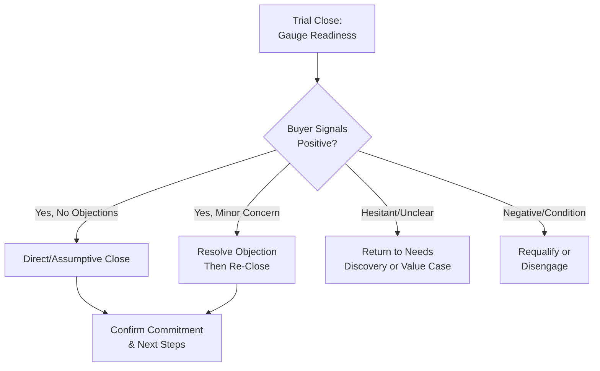

## Closing Techniques and Ethical Boundaries

### Overview

Closing is the stage of the sales process where the salesperson secures explicit buyer commitment to proceed — a purchase decision, contract signature, or defined next step. Psychologically, closing techniques operationalize commitment and consistency, loss aversion, and decision-facilitation principles to help buyers move from evaluation to action. Because closing sits at the point of maximum persuasive pressure in the sales cycle, it is also the stage most prone to ethical misuse, making the boundary between legitimate closing and manipulative pressure a central concern in sales psychology curricula.

---

### Psychological Function of Closing

**Key Points**

- Closing does not create desire or value; it removes residual friction (indecision, minor unresolved doubt, decision fatigue) that prevents an already-favorable buyer from acting.
- **[Inference]** A close cannot reliably compensate for insufficient needs discovery, unresolved objections, or absent trust — sales psychology generally treats late-stage closing pressure as a poor substitute for earlier-stage diagnostic and trust-building work, since pressure applied without underlying readiness tends to produce buyer's remorse, returns, or cancellations rather than durable commitment.
- Buyers frequently experience natural hesitation even when genuinely interested, driven by loss aversion (fear of a bad decision) and decision fatigue rather than true disinterest — the closer's role is to help the buyer resolve this hesitation, not manufacture urgency where none exists.

---

### Classic Closing Techniques

| Technique | Mechanism | Example Phrasing |
| --- | --- | --- |
| Assumptive close | Proceeds as if the decision is already made | "I'll get the onboarding scheduled for next Monday — does that work?" |
| Alternative choice close | Offers two acceptable options rather than yes/no | "Would you prefer the annual or quarterly billing plan?" |
| Summary close | Recaps agreed value points before asking for commitment | "So we've confirmed it solves X, saves Y, and fits your budget — shall we move forward?" |
| Urgency/scarcity close | Leverages genuine time or availability constraints | "This pricing is only available through end of quarter." |
| Trial close | Tests readiness before a full close attempt | "How does this look so far relative to what you needed?" |
| Question close | Response to buyer's final concern reframed as a close | Buyer: "Can it integrate with our CRM?" Seller: "If it can, are you ready to move forward?" |
| Now-or-never close | Emphasizes a specific, real deadline | "This bundle discount ends Friday." |
| Puppy dog close | Offers a trial/pilot period to reduce decision risk | "Try it for 30 days — if it's not a fit, no obligation." |

**[Inference]** The empirical effectiveness of any single closing technique is highly context-dependent (deal complexity, buyer sophistication, relationship stage); most contemporary sales psychology research treats closing less as a discrete "trick" and more as a natural culmination of a well-run discovery and value-alignment process.

---

### Diagram: Closing Readiness Assessment

**Diagram (svg_diagram): Closing Readiness Flow**

---

### Buying Signals: Reading Readiness

Effective closing depends on accurately reading verbal and behavioral buying signals rather than closing on a fixed script timeline.

**Verbal signals:**

- Detailed questions about implementation, timelines, or contract terms
- Use of possessive/future language ("when we start using this...")
- Requests to involve additional stakeholders in final decision-making

**Behavioral/nonverbal signals:**

- Increased engagement (leaning in, more animated tone, faster response pace)
- Requesting the proposal or pricing document in writing
- Reduced hedging language

**[Inference]** Premature closing attempts (before genuine buying signals appear) tend to trigger reactance, while overly delayed closing attempts after strong signals have appeared risk buyer disengagement or decision fatigue — timing calibration is a trained skill with meaningful variance across salespeople and contexts, rather than a fixed rule.

---

### The Ethical Boundary: Persuasion vs. Manipulation

Sales psychology draws a structural distinction between legitimate closing and manipulative pressure, typically along these dimensions:

| Dimension | Ethical Closing | Manipulative Closing |
| --- | --- | --- |
| Information | Complete, accurate disclosure | Omission or distortion of material facts |
| Urgency | Genuine time/availability constraint | Fabricated deadlines or fake scarcity |
| Pressure source | Buyer's own confirmed needs and value | Artificially induced anxiety or guilt |
| Reversibility | Buyer retains genuine ability to decline or delay | Structural obstacles designed to prevent reconsideration |
| Long-term orientation | Prioritizes fit and durable satisfaction | Prioritizes closing the single transaction regardless of fit |
| Consent quality | Buyer decision reflects informed understanding | Buyer decision reflects confusion, pressure, or incomplete information |

**[Inference]** This ethical line maps closely onto the trust-and-commitment framework in relationship marketing: manipulative closing may increase short-term conversion but is associated with higher return/cancellation rates, negative word-of-mouth, and long-term erosion of the customer relationship once the manipulation is recognized — the classic "win the battle, lose the war" trade-off documented across sales ethics literature.

---

### High-Pressure Tactics and Their Risks

Commonly cited manipulative or high-pressure tactics that sales psychology curricula flag as ethically problematic:

- **False scarcity/urgency**: fabricating limited availability or expiring offers not actually tied to real constraints.
- **Bait-and-switch**: advertising or discussing one offering to gain engagement, then redirecting to a different (often less favorable) one.
- **Artificial complexity/obfuscation**: deliberately complicating pricing or terms to prevent full buyer comprehension.
- **Isolation tactics**: discouraging the buyer from consulting other stakeholders, advisors, or comparison options before deciding.
- **Guilt-based pressure**: framing hesitation or decline as personally disappointing or unreasonable ("I thought you were serious about solving this").
- **Foot-in-the-door escalation misuse**: leveraging small agreed commitments to pressure disproportionate subsequent commitments not aligned with the buyer's actual interest.

**[Inference]** Regulatory and legal exposure (e.g., consumer protection statutes on deceptive trade practices, cooling-off period requirements in many jurisdictions for high-pressure sales contexts) adds a compliance dimension beyond pure sales ethics; specific legal thresholds vary significantly by jurisdiction and industry, and sales organizations typically require legal/compliance review rather than relying on general sales training alone for regulatory boundaries.

---

### Commitment and Consistency in Ethical Closing

Cialdini's commitment-consistency principle is central to legitimate closing: securing a sequence of genuine, informed small agreements (confirmed needs, accepted value points, resolved objections) builds a coherent, internally consistent path to the final decision.

$$P(\text{Close}) \propto \sum_{i=1}^{n} C_i$$

where $C_i$ represents each genuine, informed micro-commitment secured during the sales conversation. **[Inference]** This is a conceptual rather than a literally measured formula — the underlying research finding is that cumulative genuine agreement increases close likelihood, not that individual commitments sum with fixed, quantifiable weights.

The ethical distinction is that each $C_i$ must reflect the buyer's authentic assessment rather than a coerced or confused agreement — manufacturing false agreement at intermediate steps (e.g., rushing past an unclear "yes") undermines both the ethics and the durability of the eventual close.

---

### Post-Close Psychology: Reinforcement and Dissonance Management

- **Cognitive dissonance**: buyers, especially in high-involvement purchases, often experience post-decision doubt regardless of decision quality.
- **Reinforcement communication**: reaffirming the decision's rationale immediately after closing (recap of value, next steps, quick wins) reduces dissonance and buyer's remorse.
- **[Inference]** Ethical closing practice treats the close as the beginning of the relationship-management phase, not the end of the sales interaction — consistent with relationship marketing's emphasis on trust and commitment as durable, retention-linked constructs rather than one-time transactional outcomes.

---

### Common Pitfalls and Misapplications

- **Formulaic close application without readiness assessment**: applying a scripted closing technique regardless of buying signals often triggers resistance rather than commitment.
- **Confusing persistence with manipulation avoidance**: appropriately following up on a genuinely interested but delayed buyer is not manipulative; the ethical concern arises specifically from fabricated urgency or concealed information, not from persistence itself.
- **Over-reliance on urgency tactics**: frequent use of scarcity/urgency closes, especially when not genuinely time-bound, tends to reduce credibility over a salesperson's tenure with a given account or market.
- **Neglecting post-close reinforcement**: treating the close as the finish line rather than the start of the retention relationship increases early-stage churn and buyer's remorse.
- **[Speculation]** As buyers increasingly research pricing, reviews, and alternatives independently before final sales conversations, some sales psychology commentary suggests the "close" is becoming less a discrete persuasive event and more a confirmation/logistics step — though the degree and permanence of this shift across industries remains a debated and evolving observation rather than an established finding.

---

### Related Topics

- Objection Handling and Reframing
- Consultative and Needs-Based Selling
- Psychological Principles of Personal Selling
- Trust and Commitment in Long-Term Relationships
- Cialdini's Principles of Influence (Commitment and Consistency, Scarcity)
- Cognitive Dissonance Theory and Post-Purchase Behavior
- Sales Ethics and Consumer Protection Regulation
- Negotiation Psychology and Anchoring Techniques
- Buying Signals and Sales Call Analytics
- Customer Onboarding and Post-Sale Relationship Management