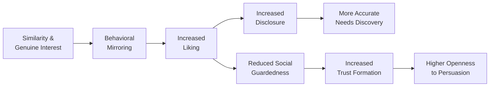

## Rapport Building and Behavioral Mirroring

### Overview

Rapport building is the process of establishing a sense of mutual trust, comfort, and connection between a salesperson and a buyer, forming the relational foundation on which all subsequent persuasion, needs discovery, and closing activity depends. Behavioral mirroring — the subtle matching of another person's verbal and nonverbal behavior — is one of the most extensively studied techniques for accelerating rapport formation. Both draw on social psychology research into liking, similarity, and nonconscious social bonding mechanisms.

---

### Psychological Foundations of Rapport

**Key Points**

- Rapport is generally understood in interpersonal communication research as composed of three interacting elements: **mutual attentiveness** (engaged, present interaction), **positivity** (mutual warmth and friendliness), and **coordination** (synchronized behavior and shared rhythm).
- Rapport functions as a precursor to trust: buyers are more willing to disclose genuine needs, concerns, and constraints to a salesperson with whom they feel rapport, which directly improves the accuracy and depth of subsequent needs discovery.
- **[Inference]** Because rapport lowers a buyer's social guardedness, it also increases susceptibility to influence generally — which is precisely why the ethical use of rapport-building techniques (as genuine relational investment, not tactical manipulation) is emphasized in sales psychology training.

---

### The Liking Principle and Similarity-Attraction

Cialdini's liking principle establishes that people are more easily persuaded by those they like, and liking is reliably increased by several well-documented factors:

- **Similarity**: shared background, interests, communication style, or values
- **Physical attractiveness**: a documented but ethically fraught influence factor, generally treated in professional training as a factor to be aware of rather than one to manipulate
- **Compliments**: genuine, specific praise increases liking, provided it is perceived as sincere
- **Familiarity/mere exposure**: repeated positive contact increases liking over time
- **Cooperation toward shared goals**: collaborative framing ("let's figure this out together") builds connection faster than adversarial framing

**[Inference]** In sales contexts, similarity-based rapport is most durable when grounded in genuinely shared characteristics or goals (e.g., authentic professional common ground) rather than performative or fabricated similarity, since buyers who later detect insincere rapport-building tend to experience a sharper trust penalty than if no rapport attempt had been made at all.

---

### Behavioral Mirroring: Mechanism and Evidence Base

Behavioral mirroring (also called mimicry or the "chameleon effect") refers to the largely nonconscious tendency for people to adopt the postures, gestures, mannerisms, and speech patterns of their interaction partners — and the deliberate, controlled use of this tendency by a salesperson to build rapport.

#### Types of Mirroring

| Mirroring Type | Description | Example |
| --- | --- | --- |
| Postural mirroring | Matching body position and posture | Adopting a similarly relaxed or upright seating position |
| Gestural mirroring | Matching hand movements and physical emphasis | Mirroring open-hand gestures during explanation |
| Verbal/linguistic mirroring | Matching vocabulary, pacing, and phrasing | Reusing the buyer's specific terminology (e.g., their internal project name) |
| Tonal/vocal mirroring | Matching speech pace, volume, and energy level | Slowing pace to match a deliberate, methodical speaker |
| Emotional mirroring | Reflecting the buyer's emotional tone | Matching measured seriousness when discussing a genuine business risk |

#### Underlying Psychological Research

**[Unverified]** The foundational academic reference most commonly cited in sales training is Chartrand and Bargh's (1999) "chameleon effect" research, which found that nonconscious mimicry increases liking and smoothness of interaction between conversation partners. This is a genuine area of published social psychology research; however, popularized sales-training claims about mirroring's persuasive magnitude often extend well beyond what the original experimental findings directly support, and effect sizes in live, high-stakes sales interactions (as opposed to controlled lab conversations) are less thoroughly documented.

**[Inference]** The general direction of the effect (matched behavior increases perceived rapport and liking) is broadly consistent with social psychology literature on interpersonal synchrony; the precise magnitude, durability, and applicability of specific "mirroring techniques" taught in sales training programs vary considerably in their empirical grounding, and should be treated as a reasonable, theory-supported heuristic rather than a precisely calibrated science.

---

### Diagram: Rapport-to-Trust Pathway

**Diagram (svg_diagram): Rapport Building Mechanism**

---

### Practical Rapport-Building Techniques

#### Verbal Techniques

- **Active listening cues**: verbal affirmations ("I see," "that makes sense") that signal engagement without interrupting flow
- **Paraphrasing and reflection**: restating the buyer's point in similar language to confirm understanding and demonstrate attentiveness
- **Finding genuine common ground**: referencing shared professional experience, mutual connections, or authentic points of alignment discovered through research or conversation
- **Calibrated self-disclosure**: appropriately sharing relevant personal or professional context to model reciprocal openness

#### Nonverbal Techniques

- **Eye contact calibration**: culturally appropriate, comfortable eye contact signaling attentiveness without appearing intense or evasive
- **Open body posture**: uncrossed arms, forward lean, relaxed shoulders signaling receptiveness
- **Matched energy level**: aligning enthusiasm and pace to the buyer's natural communication style rather than imposing a fixed "salesperson energy"

#### Contextual/Preparatory Techniques

- **Pre-call research**: understanding the buyer's professional background, company context, and likely priorities before the interaction, enabling more authentic and relevant rapport-building rather than generic small talk
- **Environment awareness**: noting visible context cues (in-person: office decor, industry awards; virtual: professional background, shared connections on LinkedIn) as genuine conversation starters

**Example**

A salesperson researching a prospect discovers they both attended the same regional industry conference the prior year. Opening the call with a genuine, specific reference to a session or speaker from that event ("I saw you were at the supply chain summit last fall — did you catch the panel on...") builds authentic rapport grounded in real shared experience, rather than generic flattery or fabricated similarity.

---

### Mirroring Do's and Don'ts

| Do | Don't |
| --- | --- |
| Mirror subtly, with a natural delay (not simultaneous) | Mirror immediately and obviously — often perceived as mimicking/mocking |
| Match general energy and pace | Copy exact words or unique verbal tics |
| Use mirroring to build comfort during discovery | Use mirroring as a substitute for genuine listening |
| Combine mirroring with authentic curiosity | Rely on mirroring alone without substantive value delivery |
| Adjust mirroring intensity to relationship stage | Apply identical mirroring intensity across all buyer personality types |

**[Inference]** Overt or poorly timed mirroring (near-simultaneous copying of specific words or gestures) is generally perceived as insincere or unsettling rather than rapport-building, since it becomes consciously detectable — the technique's effectiveness depends on it operating largely below the buyer's conscious awareness.

---

### Rapport Across Personality and Communication Styles

Many sales training programs incorporate behavioral style frameworks (e.g., DISC-based or social style models) to guide rapport calibration:

| Buyer Style (illustrative) | Rapport Approach |
| --- | --- |
| Direct/results-oriented | Efficient, low small-talk, respect their time, lead with outcomes |
| Analytical/detail-oriented | Data-driven rapport, demonstrate preparation and precision |
| Amiable/relationship-oriented | Warmer pacing, more personal conversation, emphasis on trust signals |
| Expressive/enthusiastic | Higher energy matching, storytelling, emphasis on vision and possibility |

**[Unverified]** Popular behavioral-style frameworks such as DISC are widely used in sales training but have faced substantive psychometric criticism in the academic personality-assessment literature regarding reliability and predictive validity; they are best treated as practical heuristics for adapting communication style rather than scientifically validated personality diagnostics.

---

### Rapport's Role in the Broader Sales and Relationship Marketing Context

- Rapport accelerates the early "credibility" and "liking" components of trust formation described in the Commitment-Trust Theory, but does not substitute for the competence and benevolence demonstrations required for durable trust.
- **[Inference]** Rapport built purely on interpersonal likability, without corresponding follow-through on competence (delivering as promised) and benevolence (acting in the buyer's interest under changing conditions), tends to produce short-term goodwill that does not convert into long-term commitment — consistent with the broader finding that trust and commitment require sustained behavioral evidence, not just initial relational warmth.

---

### Common Pitfalls and Misapplications

- **Treating rapport as a standalone closing technique**: rapport eases conversation but does not resolve legitimate objections or unmet needs; sales built on rapport alone without solution fit typically underperforms on retention.
- **Over-mirroring or mechanical mirroring**: consciously detectable mimicry undermines the nonconscious mechanism the technique depends on, producing discomfort rather than connection.
- **Generic rapport scripts**: templated small talk (unresearched, non-specific) reads as performative and can reduce rather than build trust with sophisticated buyers.
- **Ignoring cultural variation**: appropriate eye contact, physical proximity, directness, and small-talk norms vary substantially across cultures; **[Inference]** rapport techniques calibrated to one cultural context may be perceived as inappropriate or off-putting in another, making cultural awareness a prerequisite for effective cross-cultural rapport building.
- **[Speculation]** In increasingly video-call and asynchronous-communication-mediated selling environments, some practitioners suggest that traditional in-person mirroring cues (posture, physical proximity) are being partially replaced by verbal/linguistic mirroring and responsiveness cues (reply speed, tone matching in written communication); the extent to which these substitute effectively for in-person rapport mechanisms remains an open and evolving question rather than an established finding.

---

### Related Topics

- Psychological Principles of Personal Selling
- Consultative and Needs-Based Selling
- Trust and Commitment in Long-Term Relationships
- Cialdini's Principles of Influence (Liking, Reciprocity, Unity)
- Active Listening and Nonverbal Communication in Sales
- DISC and Social Style Frameworks in Sales Training
- Emotional Intelligence in Sales Performance
- Cross-Cultural Communication in Global Selling
- Nonverbal Communication and Body Language Research
- Customer Relationship Management (CRM) and Relationship Continuity