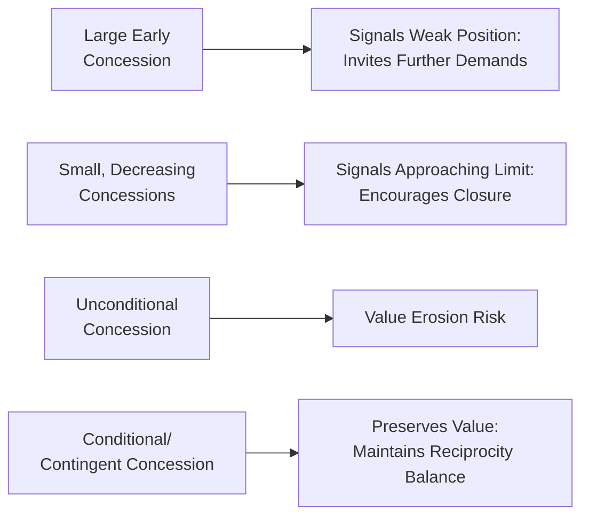
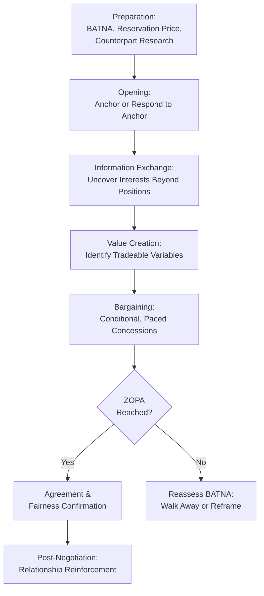

## Negotiation Psychology in Sales Contexts

### Overview

Negotiation psychology examines the cognitive, emotional, and social dynamics that shape how buyers and sellers reach agreement on price, terms, and conditions after value has been established. Unlike earlier-stage persuasion (which focuses on building desire and trust), negotiation psychology addresses the distinct challenge of resolving competing interests — allocating value between parties — while preserving the relationship and perceived fairness that underpin long-term commitment. It draws heavily on behavioral economics, game theory, and social psychology research on fairness, anchoring, and concession dynamics.

---

### Distinguishing Negotiation from Persuasion and Closing

**Key Points**

- Persuasion and consultative selling primarily build shared understanding of value; negotiation addresses the distribution of that value once both parties broadly agree a deal makes sense.
- Closing techniques facilitate a decision to proceed; negotiation determines the specific terms under which that decision is made.
- **[Inference]** Sales conversations often blur these stages in practice — real negotiations frequently reopen value questions rather than purely dividing an already-agreed pie — but distinguishing them analytically helps salespeople diagnose which skill set (value-building vs. distribution-management) a given moment in the conversation requires.

---

### Distributive vs. Integrative Negotiation

| Dimension | Distributive (Win-Lose) | Integrative (Win-Win) |
| --- | --- | --- |
| Underlying assumption | Fixed pie; one party's gain is the other's loss | Expandable pie; mutual gains possible through trade-offs |
| Typical focus | Price alone | Multiple variables (price, terms, timeline, scope, service levels) |
| Psychological posture | Competitive, guarded information sharing | Collaborative, more open information exchange |
| Relationship impact | Higher risk of relationship strain | Generally more conducive to durable relationships |
| Best suited to | One-time or low-relationship-value transactions | Ongoing B2B or high-relationship-value accounts |

**[Inference]** Because relationship marketing and long-term customer value are central concerns in most modern selling contexts, sales psychology training generally favors integrative approaches wherever multiple negotiable variables exist, reserving purely distributive tactics for genuinely single-variable, low-relationship-stake transactions.

---

### Anchoring in Sales Negotiation

Anchoring (Kahneman & Tversky) describes how an initial reference point disproportionately influences subsequent judgments, even when the anchor is arbitrary or non-diagnostic.

**Key Points**

- The first number introduced in a price negotiation — whether from list price, an initial offer, or even an incidental reference point — tends to skew the eventual settlement range toward itself.
- **[Inference]** This creates a general strategic incentive for the party with better information or stronger position to anchor first, though the empirical advantage of "anchoring first" can be attenuated by a well-prepared counterpart who has independently researched market reference points (e.g., competitor pricing, comparable deals) and is less susceptible to an unsupported anchor.
- Anchors framed with excessive precision (e.g., "$47,250" versus "$47,000" or "around $50,000") are documented in behavioral economics research as tending to appear more credible and are adjusted away from less readily by the counterpart, though this effect's magnitude in live commercial negotiations specifically is less thoroughly benchmarked than in controlled studies.

**Example**

A vendor initially quotes $120,000 for an enterprise contract with a target close price of $95,000. Even after significant negotiated concessions bring the price to $98,000, the buyer may perceive this as a strong win because the reference point ($120,000) anchors their sense of savings, despite the final price being close to the seller's original target.

---

### Concession Strategy and Reciprocity

Concessions in negotiation operate as a structured signaling system, not merely a mechanical trade of value:

- **Concession pacing**: rapid, large early concessions tend to signal weak initial positioning and invite further demands (anchoring the counterpart toward expecting more); smaller, decreasing concessions over time signal approaching the limit of flexibility.
- **Reciprocal concessions**: Cialdini's reciprocity principle applies directly — a concession from one party creates social pressure on the other to reciprocate, which is why skilled negotiators often frame concessions explicitly ("I can move on payment terms if we can agree on contract length") rather than giving unconditional concessions.
- **Conditional/contingent concessions**: linking every concession to a reciprocal ask preserves value and signals that further movement requires matched movement, discouraging one-sided erosion of position.

**Diagram (svg_diagram): Concession Pacing Signal**

---

### BATNA and Reservation Price

Grounded in Fisher and Ury's principled negotiation framework (*Getting to Yes*):

- **BATNA (Best Alternative to a Negotiated Agreement)**: the course of action a party will take if the current negotiation fails to reach agreement. A strong BATNA increases negotiating power and reduces psychological pressure to concede.
- **Reservation price**: the walk-away point beyond which a deal is worse than the BATNA and should be declined.
- **ZOPA (Zone of Possible Agreement)**: the range between each party's reservation price where a mutually acceptable deal can exist; no ZOPA means no rational agreement is possible without one party's position changing.

$$\text{ZOPA exists if: } \text{Buyer's Max Price} \geq \text{Seller's Min Price}$$

**[Inference]** Psychologically, a salesperson's confidence and resistance to pressure tactics during negotiation is strongly linked to how clearly they have internalized their own BATNA and reservation price beforehand; negotiators without a clear walk-away point are more susceptible to anchoring, urgency framing, and concession-cascade dynamics imposed by the counterpart.

---

### Framing Effects in Negotiation

Building on prospect theory, how terms are framed materially affects perceived value and willingness to agree, independent of the underlying economics:

| Frame | Example | Psychological Effect |
| --- | --- | --- |
| Gain frame | "You'll save $5,000/year" | Emphasizes positive outcome, generally lower risk-seeking response |
| Loss frame | "You'll continue losing $5,000/year without this" | Loss aversion typically produces stronger motivational pull than equivalent gain framing |
| Aggregated frame | "One combined annual fee of $60,000" | Reduces perceived frequency of cost, single decision point |
| Disaggregated frame | "Just $5,000/month" | Reduces per-instance perceived magnitude, may ease budget approval psychology |

**[Inference]** Loss-framed messaging is generally documented in behavioral economics research as producing a stronger response than equivalent gain-framed messaging (consistent with loss aversion), though the magnitude of this asymmetry varies by individual risk tolerance, cultural context, and the specific decision domain, and should not be treated as a universally fixed multiplier.

---

### Emotional Dynamics in Negotiation

- **Emotional contagion**: negotiators' emotional states (frustration, enthusiasm, urgency) can transfer between parties, influencing the overall tone and outcome of the interaction.
- **Strategic use of silence**: pausing after presenting an offer creates psychological pressure that often prompts the counterpart to fill the silence, sometimes with a concession or additional information.
- **Managing reactive devaluation**: buyers may discount the value of a concession specifically because it came easily from the "opposing" party; framing concessions as costly or significant (even when true) helps preserve their perceived value.
- **[Inference]** Excessive emotional display (visible frustration, impatience) during negotiation is generally associated with weaker perceived positioning and can trigger defensive escalation from the counterpart, while composed, unhurried demeanor is generally associated with stronger perceived leverage — though individual and cultural variation in appropriate emotional expression is significant.

---

### Fairness Perception and Relationship Preservation

Negotiation outcomes are evaluated not only on absolute value achieved but on **perceived fairness** of the process — a critical link back to trust and long-term relationship commitment.

**Key Points**

- **Procedural fairness**: buyers evaluate not just the final terms but whether the negotiation process itself felt transparent, respectful, and reasonable.
- **Distributive fairness**: perception of whether the final value split feels equitable given each party's contribution and constraints.
- **[Inference]** A negotiated outcome that is objectively favorable to the seller but perceived by the buyer as procedurally unfair (high-pressure tactics, opaque pricing, artificial deadlines) tends to damage the trust and commitment foundations needed for account renewal, upsell, and referral — connecting negotiation tactics directly to downstream customer lifetime value, not just deal-closing metrics.

---

### Structured Negotiation Process

**Diagram (svg_diagram): Sales Negotiation Process**

---

### Common Negotiation Tactics and Their Ethical Status

| Tactic | Description | Ethical Consideration |
| --- | --- | --- |
| Anchoring | Setting an initial reference point | Generally acceptable if grounded in defensible value rationale |
| Nibbling | Requesting small additional concessions after apparent agreement | Ethically contested; can damage trust if perceived as bad-faith |
| Good cop/bad cop | Using a second negotiator to apply pressure while another appears sympathetic | Widely regarded as manipulative; risks significant trust damage if recognized |
| Deadline pressure | Imposing artificial time constraints to force quick decisions | Ethical only if the deadline is genuine; fabricated deadlines fall under manipulative closing tactics |
| Limited authority ("I need approval") | Claiming inability to concede further without higher approval | Commonly used; ethically acceptable only when genuinely true, as false claims risk credibility loss if discovered |

**[Inference]** As with objection handling and closing, the ethical dividing line in negotiation tactics generally rests on whether the tactic relies on genuine constraints and accurate information versus fabricated pressure or concealed facts — the same trust-asymmetry principle (negative revelations weigh more heavily than positive ones) applies when manipulative tactics are later discovered by the counterpart.

---

### Common Pitfalls and Misapplications

- **Negotiating before value is established**: entering price negotiation before the buyer has internalized the value proposition collapses the conversation into pure price competition, disadvantaging sellers who compete on differentiated value rather than lowest cost.
- **Unconditional early concessions**: giving away value without securing reciprocal movement erodes both the deal's economics and the buyer's perception of the offering's worth.
- **Ignoring BATNA discipline**: negotiating without a clear walk-away point increases vulnerability to pressure tactics and unfavorable settlements.
- **Over-optimizing for the single deal over the relationship**: winning maximum value in one negotiation at the cost of perceived fairness can undermine renewal, upsell, and referral potential — a direct tension between short-term distributive gain and long-term relationship value.
- **[Speculation]** Increasing price transparency and buyer access to comparative market data (through online research and B2B pricing benchmarking tools) may be gradually reducing the effectiveness of traditional anchoring tactics in some sales categories, though the extent of this shift varies significantly by industry and remains an area of ongoing observation rather than firmly established finding.

---

### Related Topics

- Objection Handling and Reframing
- Closing Techniques and Ethical Boundaries
- Prospect Theory and Framing Effects (Kahneman & Tversky)
- Principled Negotiation and the Getting to Yes Framework
- BATNA Analysis and Negotiation Preparation
- Consultative and Needs-Based Selling
- Trust and Commitment in Long-Term Relationships
- Behavioral Economics in Pricing Strategy
- Cross-Cultural Negotiation Psychology
- Key Account Management and B2B Contract Renewal Strategy