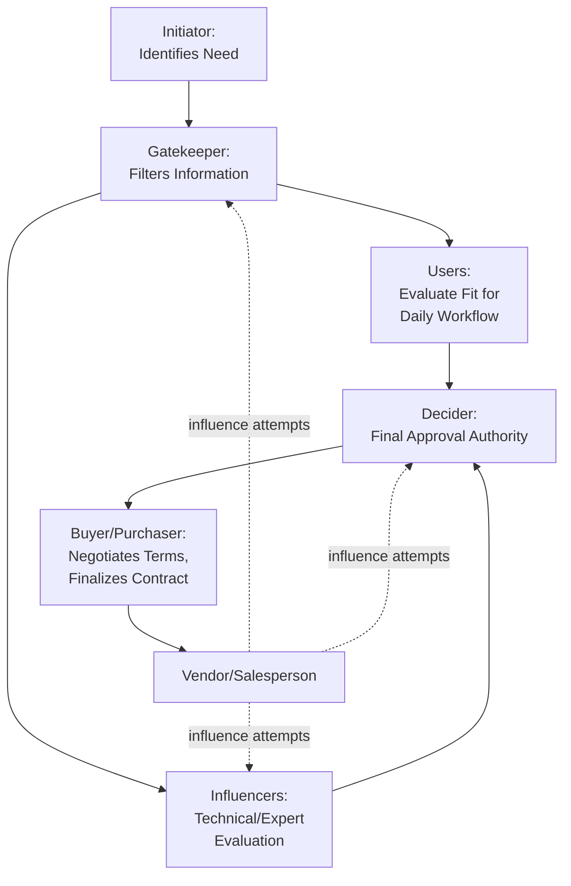

## The Buying Center and Stakeholder Roles


### Overview

The buying center (also called the decision-making unit, or DMU) is the informal, cross-functional group of individuals within an organization who participate in a B2B purchasing decision. Unlike consumer purchases typically involving a single decision-maker, organizational buying decisions are distributed across multiple people with distinct roles, motivations, and levels of influence — each shaped by both organizational objectives and individual psychological drivers. Understanding buying center dynamics is foundational to B2B sales psychology because it reframes the sales task from persuading a single buyer to navigating a multi-actor social and political system.

---

### Origins and Definition

The buying center concept originates from Webster and Wind's (1972) organizational buying behavior model, which framed industrial purchasing as a function of both organizational (task-related) and individual (non-task-related) variables acting on a group of participants rather than a lone decision-maker.

**Key Points**

- The buying center is not a formal organizational structure or fixed committee; its composition varies by purchase, often forming ad hoc around a specific buying decision and dissolving afterward.
- Buying center membership, size, and influence distribution shift depending on the purchase's complexity, cost, risk, and strategic importance.
- **[Inference]** Because the buying center is informal and often not fully visible on an organizational chart, accurately mapping it is itself a significant diagnostic task for B2B salespeople, frequently requiring active investigation rather than simple assumption based on job titles.

---

### The Six Classic Buying Center Roles

| Role | Function | Primary Psychological Concern |
| --- | --- | --- |
| **Initiator** | First identifies the need or requests a solution | Problem recognition, personal or departmental pain |
| **User** | Will directly use the product/service | Usability, day-to-day workflow impact |
| **Influencer** | Shapes decision criteria or provides expertise | Technical credibility, thoroughness of evaluation |
| **Decider** | Has final authority to approve the purchase | Overall risk, budget accountability, strategic fit |
| **Buyer/Purchaser** | Manages formal procurement, negotiates terms | Price, contract terms, vendor compliance |
| **Gatekeeper** | Controls information flow to other buying center members | Information filtering, access control, screening |

**[Inference]** A single individual frequently occupies more than one role simultaneously (e.g., a department head may be both User and Decider for a smaller purchase), while larger or more strategic purchases tend to disperse these roles across more distinct individuals — role consolidation versus dispersion is generally correlated with purchase complexity and organizational size.

---

### Diagram: Buying Center Role Interaction

**Diagram (svg_diagram): Buying Center Structure**



---

### Individual Psychological Motivations Within the Buying Center

Beyond formal organizational roles, each buying center member brings individual psychological motives that shape their evaluation, often distinct from — and sometimes in tension with — stated organizational criteria.

| Motivational Driver | Description | Example Manifestation |
| --- | --- | --- |
| Career risk aversion | Fear of being blamed for a poor decision | Preference for established, "safe" vendors over innovative but less-proven ones |
| Status and recognition | Desire for internal credit for a successful initiative | Championing a solution publicly to gain visibility |
| Workload/convenience | Preference for options requiring less personal effort | Resistance to solutions with high change-management burden |
| Departmental loyalty | Prioritizing one's own function's interests over enterprise-wide optimization | IT prioritizing security/control; sales prioritizing ease of use |
| Personal relationships | Trust in an existing vendor contact or internal champion | Preference influenced by a pre-existing relationship with a specific salesperson |

**[Inference]** This tension between organizational (task) motives and individual (non-task) motives is a central and well-established theme in B2B buying behavior research; effective B2B sales psychology generally requires addressing both layers — an organizationally optimal proposal can still fail if it creates unacceptable personal risk for a key buying center member.

---

### Stakeholder Mapping and Influence Assessment

B2B sales methodologies commonly formalize buying center analysis through structured stakeholder mapping, typically assessing each individual along two axes:

$$\text{Priority} = f(\text{Influence Level}, \text{Level of Support})$$

**Diagram (svg_diagram): Stakeholder Influence-Support Matrix**

```mermaid
quadrantChart
    title Stakeholder Influence vs. Support
    x-axis Low Support --> High Support
    y-axis Low Influence --> High Influence
    quadrant-1 Champions: Leverage & Equip
    quadrant-2 Coach/Convert: High Priority
    quadrant-3 Monitor: Low Priority
    quadrant-4 Keep Informed: Low Risk
```

- **Champions** (high influence, high support): internal advocates who actively promote the solution to other buying center members — often the salesperson's most valuable but also most vulnerable asset, since champion departure or job change can stall or kill a deal.
- **Blockers/detractors** (high influence, low support): stakeholders whose objections or resistance can veto or significantly delay the decision, requiring direct engagement rather than avoidance.
- **Coaches**: a distinct concept from champions — internal individuals (sometimes without formal decision authority) who provide the salesperson with candid information about the buying center's internal dynamics, politics, and true decision criteria.

**[Inference]** Coaches are particularly psychologically significant because they reduce the information asymmetry that otherwise disadvantages an external salesperson navigating an unfamiliar internal political landscape; cultivating a reliable coach is widely regarded in B2B sales methodology as one of the highest-leverage relationship investments in complex sales.

---

### Buying Center Dynamics Across the Purchase Process

Buying center composition and influence distribution are not static; they typically shift across purchase stages:

| Stage | Typically Dominant Role(s) | Psychological Focus |
| --- | --- | --- |
| Need recognition | Initiator, Users | Problem articulation, urgency |
| Information search | Influencers, Gatekeepers | Credibility assessment, option filtering |
| Evaluation of alternatives | Influencers, Users, Decider | Comparative risk/value assessment |
| Purchase decision | Decider, Buyer | Final risk tolerance, authority sign-off |
| Post-purchase/implementation | Users, Initiator | Adoption success, validation of the original decision |

**[Inference]** Salespeople who engage only the visible, formally titled "Decider" without cultivating relationships across the full buying center risk being blindsided by influencer or gatekeeper resistance introduced late in the process — a commonly cited failure pattern in complex B2B sales.

---

### Buyclass Framework: Purchase Type and Buying Center Complexity

Robinson, Faris, and Wind's Buygrid/Buyclass framework categorizes organizational purchases by novelty and complexity, which correlates with buying center size and formality:

- **Straight rebuy**: routine repurchase of a known item from an existing, satisfactory vendor. Minimal buying center involvement — often handled by a single purchaser with little re-evaluation.
- **Modified rebuy**: some change to specifications, price, or vendor terms triggers broader review. Moderate buying center involvement, often reactivating a subset of the original decision group.
- **New task**: an entirely novel purchase with no established precedent. Maximum buying center involvement, longest sales cycle, highest information-seeking activity, and typically the greatest number of distinct roles engaged.

**[Inference]** The "new task" scenario carries the highest degree of individual psychological uncertainty (least precedent, highest perceived risk) across buying center members, making trust-building, risk-reduction (references, pilots, guarantees), and multi-stakeholder consensus-building especially critical relative to routine rebuy scenarios.

---

### Practical Implications for Sales Strategy

**Key Points**

- **Multi-threading**: deliberately building relationships with multiple buying center members (not solely the primary contact) reduces vendor vulnerability to a single point of failure (e.g., champion leaving the company, gatekeeper blocking access).
- **Role-specific messaging**: value propositions should be tailored to each role's distinct concerns — Users care about workflow ease, Deciders care about strategic/financial risk, Influencers (often technical) care about specification fit, Buyers care about commercial terms.
- **Gatekeeper management**: rather than attempting to bypass gatekeepers (often counterproductive and relationship-damaging), effective sellers build genuine rapport with gatekeepers as legitimate stakeholders with their own informational needs and concerns.
- **[Inference]** Failure to identify a genuine Decider distinct from an enthusiastic but non-authoritative Influencer or User is a commonly cited cause of stalled B2B deals — sometimes described informally in sales training as mistaking a "coach" or "champion" for the actual final approver.

---

### Common Pitfalls and Misapplications

- **Single-threading**: relying on one primary contact without mapping the broader buying center creates significant deal risk if that contact loses influence, changes roles, or leaves the organization.
- **Ignoring individual (non-task) motives**: presenting only organizationally rational value propositions while ignoring personal risk, career, or political concerns of key stakeholders can stall objectively strong proposals.
- **Assuming static buying center composition**: failing to track how influence and role distribution shift across the purchase process can leave sellers unprepared for late-stage objections from previously peripheral stakeholders.
- **Overreliance on a single champion without validating true decision authority**: enthusiastic internal advocates are valuable but do not always possess or accurately represent final approval authority.
- **[Speculation]** In organizations with expanding formalized procurement and vendor-risk-management functions, some B2B sales research suggests buying centers may be trending toward larger, more procedurally formalized structures (with compliance, legal, and security stakeholders increasingly embedded even in previously simple purchases); the consistency and pace of this trend across industries remains an area of ongoing observation rather than a firmly established universal pattern.

---

### Related Topics

- Organizational Buying Behavior (Webster and Wind Model)
- Buygrid/Buyclass Framework (Straight Rebuy, Modified Rebuy, New Task)
- Consultative and Needs-Based Selling
- Multi-Threading and Account-Based Selling Strategy
- Champion and Coach Development in Complex Sales
- Negotiation Psychology in Sales Contexts
- Trust and Commitment in Long-Term Relationships
- Key Account Management and Enterprise Sales
- Procurement Psychology and Vendor Risk Assessment
- Organizational Politics and Internal Stakeholder Dynamics