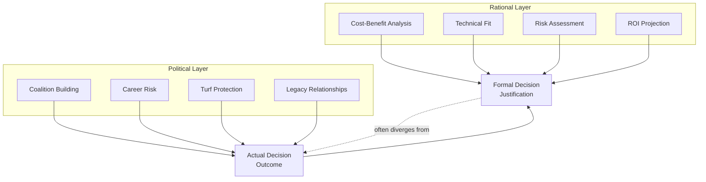
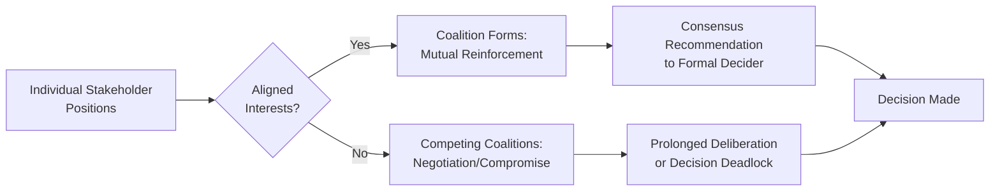

## Rational and Political Dynamics in B2B Decisions

### Overview

B2B purchasing decisions are conventionally modeled as rational, criteria-driven processes conducted by economically motivated organizational agents. In practice, organizational buying behavior research consistently finds that B2B decisions are shaped by a dual layer: **task-related rational dynamics** (objective specifications, cost-benefit analysis, risk assessment) and **non-task political dynamics** (internal power structures, personal agendas, coalition-building, and organizational culture). Understanding the interaction between these two layers is essential for explaining why the "best" solution on paper does not always win, and why B2B sales psychology must address organizational politics alongside product value.

---

### The Rational Layer: Task-Related Decision Criteria

The rational dimension of B2B buying reflects the organizationally sanctioned, formally justifiable basis for a decision — the criteria that would appear in a procurement scorecard or business case.

**Common rational evaluation criteria:**

- Total cost of ownership (TCO) versus initial price
- Technical specification fit and compatibility with existing systems
- Vendor reliability, financial stability, and track record
- Risk mitigation (compliance, security, business continuity)
- Projected ROI and payback period
- Service level agreements and support quality

**Key Points**

- Rational criteria provide the organizationally legitimate justification for a decision — the account that can be defended to superiors, auditors, or the board.
- **[Inference]** Even where political and personal motives substantially influence the actual decision, participants typically require a coherent rational narrative to formally justify the outcome, meaning sales conversations must supply sufficient rational cover even when non-task factors are the primary driver — a distinction between what *causes* a decision and what *justifies* it.

---

### The Political Layer: Non-Task Dynamics

Webster and Wind's original organizational buying framework explicitly distinguished task variables (rational, business-related) from non-task variables (individual, social, and organizational factors unrelated to the formal purchase criteria).

**Key political and individual dynamics:**

| Dynamic | Description | Psychological Driver |
| --- | --- | --- |
| Coalition-building | Stakeholders forming alliances to support or block a decision | Power consolidation, safety in numbers |
| Turf protection | Resistance to solutions perceived as reducing a department's control or headcount relevance | Status and authority preservation |
| Career risk calculation | Evaluating how a decision's outcome (success or failure) reflects on one's career | Loss aversion around professional reputation |
| Internal rivalry | Cross-departmental competition influencing vendor preference | Relative status, interdepartmental credit-seeking |
| Legacy relationships | Preference for incumbent vendors due to existing personal relationships | Familiarity, social capital preservation |
| Information control | Selective sharing of information to steer the outcome | Influence maximization, gatekeeping power |

**[Inference]** These political dynamics are not necessarily evidence of bad-faith or irrational behavior; from an individual participant's perspective, protecting career standing or departmental resources can be a locally rational response to organizational incentive structures, even when it diverges from the organization's aggregate interest.

---

### Diagram: Rational-Political Decision Interaction

**Diagram (svg_diagram): Dual-Layer B2B Decision Model**

---

### Why Rational Criteria Alone Fail to Predict Outcomes

**[Inference]** A recurring finding across organizational buying behavior research is that formally weighted, objective scoring models frequently fail to predict actual vendor selection, because such models capture only the rational layer while omitting political weight. Common explanatory patterns include:

- A technically superior but politically unsponsored solution loses to an inferior but well-championed alternative because no influential internal actor is willing to expend political capital advocating for it.
- A rationally justified switch from an incumbent vendor stalls indefinitely because the switching decision would implicitly indict the internal stakeholder who originally selected and championed the incumbent.
- A solution favored by one department is blocked by another department whose turf or resource allocation would be affected, even when the requesting department's business case is sound.

---

### The Role of Risk in Political Behavior

Organizational buying research consistently identifies **perceived personal risk** as a major driver of politically cautious behavior, often summarized informally as "no one gets fired for choosing the safe, established option."

**Key Points**

- Buying center members frequently weigh the asymmetric consequences of a decision: a failed innovative choice often carries greater personal career cost than a failed conventional choice, even if the probability-weighted expected value favors the innovative option.
- **[Inference]** This asymmetry (consistent with loss aversion and blame-avoidance research in behavioral economics) helps explain the persistent market advantage of established, well-known vendors over smaller or newer entrants with objectively comparable or superior offerings, independent of actual product quality differences.
- Risk-averse political behavior tends to intensify in organizations with punitive failure cultures and diminish in organizations with psychologically safe, experimentation-tolerant cultures — making organizational culture itself a relevant diagnostic factor for B2B sellers.

---

### Coalition Dynamics and Consensus Formation

Large or strategically significant B2B decisions typically require building sufficient internal consensus across a coalition of buying center members rather than persuading a single decision-maker.

**Diagram (svg_diagram): Coalition Formation Pathway**

**[Inference]** Sales approaches that address only rational value tend to underperform in politically complex decisions; methodologies emphasizing internal champion development, multi-threading, and coalition-support tools (e.g., internal business case templates a champion can use to build support with peers) are generally better suited to navigating this dynamic, since they equip internal advocates to do the political work the external seller cannot do directly.

---

### Organizational Culture as a Moderating Variable

The relative weight of rational versus political dynamics varies systematically with organizational characteristics:

| Organizational Characteristic | Tendency Toward |
| --- | --- |
| Highly formalized procurement processes (e.g., government, large enterprise) | More weight on documented rational criteria, though political dynamics still operate within the formal process (e.g., how scoring criteria are defined) |
| Founder-led or small/flat organizations | Greater relative weight on individual relationships and founder/executive preference |
| High-failure-cost industries (e.g., aerospace, healthcare, finance) | Stronger risk-aversion and incumbent-preference dynamics |
| Innovation-forward or growth-stage organizations | Greater tolerance for political risk-taking on novel vendors, though still subject to internal champion dynamics |

**[Inference]** These are general tendencies documented in organizational buying and procurement literature rather than fixed rules; specific organizations can deviate significantly from their industry's typical pattern based on individual leadership style and internal culture.

---

### Practical Implications for B2B Sales Strategy

**Key Points**

- **Dual-track value communication**: prepare both a rigorous rational business case (for formal justification and audit trail) and a politically aware engagement strategy (identifying and supporting champions, understanding rival coalitions, addressing individual risk concerns).
- **Champion enablement**: providing internal champions with polished, reusable materials (ROI calculators, competitive comparisons, executive summaries) helps them do the political work of building internal consensus without requiring the external seller's direct presence in every internal conversation.
- **Risk-reduction messaging tailored to political anxiety**: references, pilots, phased rollouts, and guarantees address not only functional risk but the personal/political risk of being blamed for a failed decision.
- **Identifying blockers' true motives**: resistance framed in rational terms (e.g., "the specifications don't quite fit") sometimes masks a political motive (e.g., turf protection, loyalty to an incumbent vendor relationship); accurate diagnosis (see objection handling) is critical to selecting an effective response.

---

### Common Pitfalls and Misapplications

- **Assuming the best product wins on merit alone**: underestimating political dynamics leads to surprise losses to objectively inferior competitors with stronger internal sponsorship.
- **Over-relying on a single champion without broader coalition awareness**: even a strong champion can be politically outmaneuvered by a rival coalition if the seller has not multi-threaded across the buying center.
- **Ignoring the distinction between decision cause and decision justification**: presenting only rational arguments to a buying center member whose true concern is personal risk or political standing fails to address the actual barrier.
- **Treating political dynamics as universally illegitimate or something to "defeat"**: political behavior often reflects locally rational responses to real organizational incentive structures; effective navigation requires working within this reality rather than moralizing against it.
- **[Speculation]** Increasing formalization of procurement functions (RFPs, vendor scorecards, third-party risk assessments) in many industries may be shifting some organizational decisions toward more codified rational weighting, though research and practitioner commentary suggest political dynamics persist substantially within and around these formalized processes (e.g., in how scoring criteria are defined or which vendors are invited to bid) rather than being eliminated by them — the net effect remains a debated and evolving area rather than a settled conclusion.

---

### Related Topics

- The Buying Center and Stakeholder Roles
- Organizational Buying Behavior (Webster and Wind Model)
- Champion and Coach Development in Complex Sales
- Risk Perception and Loss Aversion in Organizational Decisions
- Multi-Threading and Account-Based Selling Strategy
- Consultative and Needs-Based Selling
- Negotiation Psychology in Sales Contexts
- Organizational Culture and Procurement Behavior
- Trust and Commitment in Long-Term Relationships
- Key Account Management and Enterprise Sales