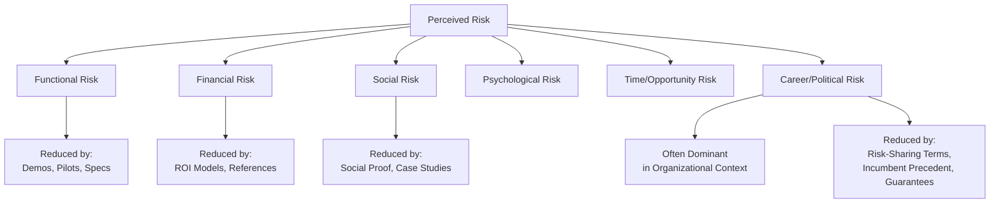
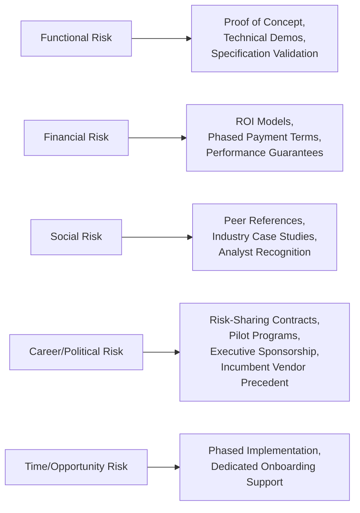

## Risk Perception in Organizational Purchasing

### Overview

Risk perception in organizational purchasing refers to the subjective assessment buying center members make of the potential negative consequences associated with a purchase decision, independent of the objective probability or magnitude of those consequences. Unlike consumer purchases, organizational buying typically involves higher stakes, longer time horizons, multiple accountable stakeholders, and consequences that extend beyond the individual decision-maker to teams, departments, and organizational performance — making risk perception a dominant psychological force in B2B buying behavior, often outweighing purely rational cost-benefit calculation.

---

### Theoretical Foundation: Perceived Risk Theory in B2B Contexts

Perceived risk theory, originally developed in consumer behavior research (Bauer, 1960) and extensively adapted to organizational buying, holds that buyers experience risk as a function of two components:

$$\text{Perceived Risk} = \text{Uncertainty of Outcome} \times \text{Magnitude of Consequences}$$

**Key Points**

- Uncertainty reflects the buyer's confidence in predicting whether the purchase will perform as expected.
- Magnitude of consequences reflects how severe the outcome would be if the purchase underperforms or fails.
- **[Inference]** In organizational contexts, both uncertainty and consequence magnitude are amplified relative to typical consumer purchases: uncertainty increases due to complexity and multiple interdependent systems, while consequence magnitude increases because failures can affect organizational performance, other stakeholders' work, and the buyer's professional standing simultaneously.

---

### Categories of Perceived Risk in Organizational Buying

| Risk Type | Description | Example Concern |
| --- | --- | --- |
| Functional/performance risk | Will the solution perform as specified? | "Will this ERP system actually integrate with our legacy systems?" |
| Financial risk | Will the investment deliver adequate return? | "Is the total cost of ownership justified by projected savings?" |
| Physical/safety risk | Could the product create safety hazards? | Relevant in industrial equipment, manufacturing inputs |
| Social risk | Will this decision be viewed unfavorably by peers or superiors? | "Will my department be seen as making a poor choice?" |
| Psychological risk | Does this decision conflict with the buyer's self-image or professional identity? | A risk-averse manager selecting an unconventional vendor |
| Time/opportunity risk | Will implementation consume excessive time or delay other priorities? | Concerns about lengthy onboarding diverting resources |
| Career/political risk | Could a failed decision damage the buyer's professional standing? | "If this vendor underperforms, will I be blamed?" |

**[Inference]** Career/political risk is frequently identified in B2B buying behavior research and practitioner literature as the most psychologically dominant risk category in organizational contexts, since it personalizes organizational consequences directly onto the individual buying center member's career trajectory — often outweighing purely financial or functional risk in its influence on final decisions.

---

### Diagram: Risk Perception Components

**Diagram (svg_diagram): Perceived Risk Structure in B2B Buying**

---

### Risk Aversion and the "Safe Choice" Phenomenon

A well-documented pattern in organizational buying behavior is the systematic preference for established, well-known vendors over smaller, newer, or less familiar alternatives — often informally summarized in sales and procurement literature as "no one gets fired for choosing the safe option" (a phrase widely associated with historical IT procurement culture, particularly regarding dominant incumbent vendors).

**Key Points**

- This preference reflects an asymmetric consequence structure: a failure with a well-known, widely adopted vendor is more easily attributed to unforeseeable circumstances, while a failure with a lesser-known or unconventional vendor is more easily attributed to poor judgment by the individual who selected it.
- **[Inference]** This dynamic is consistent with loss aversion and blame-avoidance research in behavioral economics: buying center members often weigh the asymmetric personal cost of a "blameworthy" failure (choosing an unconventional option that fails) more heavily than the probability-weighted expected value of a potentially superior but less established alternative.
- This creates a structural market advantage for incumbent and category-leading vendors independent of objective product superiority, and a corresponding challenge for smaller or newer vendors attempting to overcome this perception gap.

---

### Organizational and Individual Moderators of Risk Perception

Risk perception is not uniform across organizations or individuals; several factors systematically moderate its intensity:

| Moderator | Effect on Risk Perception |
| --- | --- |
| Organizational failure culture | Punitive cultures amplify risk aversion; psychologically safe/experimentation-tolerant cultures reduce it |
| Purchase novelty (new task vs. rebuy) | Higher perceived risk in novel, unprecedented purchase decisions |
| Purchase value/strategic importance | Higher stakes generally increase perceived risk and lengthen deliberation |
| Individual risk tolerance | Personality and role-based variation in baseline risk aversion among buying center members |
| Buyer experience/expertise | Greater domain expertise generally reduces perceived uncertainty for a given objective risk level |
| Time pressure | Urgent decisions can either suppress risk deliberation (rushed decisions) or amplify anxiety about inadequate diligence, depending on context |

**[Inference]** Because these moderators vary significantly across organizations and individuals, effective risk-reduction strategy in B2B selling generally requires diagnosing which specific risk types and which specific stakeholders are most risk-sensitive, rather than applying a uniform risk-mitigation approach across all buying center members.

---

### Risk Perception Across the Buyclass Framework

Building on the Buygrid/Buyclass model (straight rebuy, modified rebuy, new task), perceived risk varies systematically by purchase type:

| Purchase Type | Typical Risk Level | Dominant Risk Concern |
| --- | --- | --- |
| Straight rebuy | Low | Minimal; primarily continuity/consistency risk |
| Modified rebuy | Moderate | Functional risk from specification changes; some social risk if visible |
| New task | High | Full spectrum of risk types, with career/political risk often most acute due to lack of precedent |

**[Inference]** The elevated risk perception characteristic of new-task purchases explains why these purchases typically involve the largest buying centers, longest sales cycles, and greatest emphasis on external validation (references, analyst reports, peer benchmarking) relative to routine rebuy decisions.

---

### Risk-Reduction Strategies in B2B Selling

**Diagram (svg_diagram): Risk Mitigation Toolkit Mapped to Risk Type**

**Common risk-reduction mechanisms:**

- **Pilots and trials**: reducing commitment magnitude before full-scale adoption, directly lowering both financial and functional risk exposure
- **References and social proof**: particularly effective for social and career/political risk, since peer validation externalizes some of the decision's justificatory burden
- **Guarantees and risk-sharing contract structures**: performance-based pricing, money-back guarantees, or phased payment tied to milestones shift some downside risk from buyer to seller
- **Third-party validation**: analyst reports (e.g., industry research firms), certifications, and awards provide external credibility that reduces the individual buyer's perceived personal accountability for the choice
- **Executive sponsorship**: securing visible support from senior leadership on the buyer's side distributes accountability across a broader group, reducing individual career risk exposure

---

### Risk Perception and Trust: Interaction Effects

Risk perception and trust operate in an inverse relationship central to relationship marketing theory: as trust in a vendor's competence and benevolence increases, perceived risk associated with that vendor's offerings decreases, independent of the objective facts of the offering itself.

**[Inference]** This interaction explains why incumbent vendor relationships often persist even when a competitor's objective specifications are comparable or superior — accumulated trust from a track record of reliable performance functions as a risk-reduction mechanism that new entrants must overcome through alternative means (guarantees, pilots, references) since they lack an established trust history with that specific buyer.

---

### Common Pitfalls and Misapplications

- **Addressing only rational/functional risk while ignoring career/political risk**: a technically sound proposal can still fail if it leaves an influential stakeholder feeling personally exposed to blame.
- **Underestimating incumbent advantage**: attributing lost deals purely to price or features while overlooking the structural risk-aversion advantage held by established or well-known vendors.
- **Uniform risk-reduction strategy across all stakeholders**: applying the same reassurance tactics (e.g., only ROI data) to all buying center members regardless of their individually dominant risk concern reduces effectiveness.
- **Treating risk-averse behavior as irrational obstruction**: risk-averse stakeholder behavior often reflects a locally rational response to asymmetric personal consequences within the organization's incentive structure, rather than simple resistance to change.
- **[Speculation]** As organizations increasingly formalize vendor risk assessment (via dedicated procurement risk functions, security review processes, and compliance frameworks), some observers suggest that individually perceived risk may be gradually shifting toward more codified, institutionally assessed risk criteria; however, the extent to which this reduces the underlying psychological weight of personal career risk for individual buying center members remains an open and debated question rather than a settled finding.

---

### Related Topics

- The Buying Center and Stakeholder Roles
- Rational and Political Dynamics in B2B Decisions
- Trust and Commitment in Long-Term Relationships
- Perceived Risk Theory in Consumer Behavior
- Loss Aversion and Prospect Theory
- Buygrid/Buyclass Framework (Straight Rebuy, Modified Rebuy, New Task)
- Consultative and Needs-Based Selling
- Vendor Selection Criteria and Procurement Scorecards
- Organizational Culture and Risk Tolerance
- Key Account Management and Executive Sponsorship Strategy