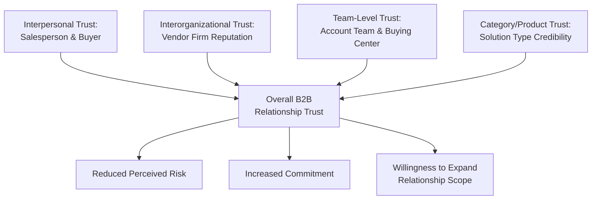
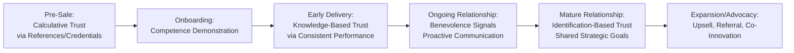

## Relationship and Trust-Building in B2B Contexts

### Overview

Relationship and trust-building in B2B contexts refers to the deliberate cultivation of durable, multi-level interpersonal and inter-organizational bonds between buying and selling firms, grounded in the psychological mechanisms of credibility, benevolence, and repeated positive exchange. B2B trust-building differs substantially from consumer-context trust in that it typically operates across multiple simultaneous relationship layers — individual-to-individual, individual-to-organization, and organization-to-organization — and unfolds over extended timeframes shaped by organizational risk, political dynamics, and buying center complexity covered elsewhere in this chapter.

---

### Why B2B Trust-Building Differs from Consumer Contexts

**Key Points**

- B2B relationships typically involve higher transaction values, longer sales cycles, multiple decision-makers, and greater switching costs, all of which amplify the perceived risk that trust must offset.
- B2B trust operates at multiple simultaneous levels: trust in the individual salesperson, trust in the account team, trust in the vendor organization as a whole, and trust in the product/service category itself.
- **[Inference]** Because organizational buyers are accountable to internal stakeholders for their vendor choices, B2B trust-building must address not only the buyer's own confidence but also provide the buyer with credible evidence they can use to justify that trust to others within their organization — linking directly to the rational-justification dynamic discussed in organizational decision-making.

---

### Multi-Level Trust Framework in B2B Relationships

**Diagram (svg_diagram): B2B Trust Levels**

| Trust Level | Description | Vulnerability |
| --- | --- | --- |
| Interpersonal | Trust in an individual salesperson or account manager | High vulnerability to personnel turnover on either side |
| Team-level | Trust in the broader account team supporting the relationship | More resilient than single-person trust; requires consistent cross-team standards |
| Interorganizational | Trust in the vendor company's brand, reputation, and track record | Most durable; survives individual personnel changes |
| Category-level | General trust in a solution category or approach | Affects openness to new vendors even before individual relationship begins |

**[Inference]** A common strategic objective in B2B relationship management is deliberately transitioning trust from the interpersonal level (vulnerable to a single account manager's departure) toward the team and organizational level, since interpersonal-only trust creates significant account continuity risk when key personnel changes occur on either side.

---

### Applying the Commitment-Trust Theory to B2B Relationships

The Morgan and Hunt Commitment-Trust framework (covered in relationship marketing generally) applies directly to B2B contexts, with several B2B-specific amplifications:

- **Communication**: B2B trust-building places particular weight on proactive, transparent communication regarding both successes and problems (e.g., proactively disclosing a service disruption before the client discovers it independently), since B2B relationships typically involve ongoing service delivery rather than discrete transactions.
- **Shared values**: B2B trust often develops through demonstrated alignment on business practices, quality standards, and strategic priorities over multiple interactions, rather than through a single value-alignment moment.
- **Relationship termination costs**: in B2B, termination costs are frequently substantial and mutual (integration investment, retraining, data migration, contractual penalties), which structurally increases commitment even independent of trust — a dynamic requiring careful distinction between genuine relational commitment and mere lock-in.

**[Inference]** Distinguishing genuine trust-based commitment from purely calculative, switching-cost-driven commitment is particularly important in B2B account management, since captive customers retained primarily through switching costs rather than genuine trust are more vulnerable to competitive displacement once a competitor offers to absorb those switching costs (e.g., subsidized migration, contract buyouts).

---

### Trust-Building Mechanisms Specific to B2B Contexts

#### Credibility (Competence-Based Trust)

- **Track record and case studies**: demonstrated success with comparable organizations, ideally within the same industry or use case
- **Technical expertise demonstration**: proof-of-concept engagements, technical workshops, solution architecture consultations
- **Certifications and compliance credentials**: industry-specific standards (e.g., security certifications, regulatory compliance) that provide externally verified competence signals
- **Transparency about limitations**: proactively acknowledging where a solution is not the best fit builds credibility precisely because it runs counter to a purely self-interested sales motive

#### Benevolence (Intention-Based Trust)

- **Proactive problem disclosure**: informing a client of an issue before they discover it independently signals prioritization of the relationship over short-term reputation management
- **Flexibility during unforeseen circumstances**: accommodating contract adjustments during genuine hardship (e.g., pandemic-related demand shifts) signals long-term relational orientation over rigid transactional enforcement
- **Consistent account team continuity**: maintaining stable points of contact rather than frequent account handoffs signals organizational investment in the specific relationship

**Example**

A SaaS vendor discovers a data processing delay affecting a subset of enterprise clients before any client notices independently. Proactively notifying affected clients, providing a clear remediation timeline, and offering service credits — even though the issue might have gone unnoticed — builds benevolence-based trust that a purely reactive response (waiting for client complaints) would not achieve.

---

### The Role of Account Management and Relationship Continuity

**Key Points**

- Dedicated account management structures (Key Account Management, Customer Success functions) exist substantially to operationalize sustained trust-building beyond the initial sale.
- **[Inference]** Regular, structured touchpoints (quarterly business reviews, proactive check-ins, executive relationship mapping) serve a dual function: they provide genuine value-delivery opportunities and they generate the repeated positive interaction history that knowledge-based trust requires to develop.
- Trust erosion in B2B relationships often stems not from single catastrophic failures but from accumulated minor inconsistencies (missed minor commitments, inconsistent communication quality across account team members) that gradually undermine confidence in reliability.

---

### Trust-Building Across the B2B Relationship Lifecycle

**Diagram (svg_diagram): B2B Trust Development Lifecycle**

1. **Pre-sale**: trust is largely calculative, based on external evidence (references, case studies, credentials) since no direct experience exists yet
2. **Onboarding**: initial competence demonstration through successful implementation sets the foundation for knowledge-based trust
3. **Early delivery**: repeated satisfactory service interactions build knowledge-based trust through accumulated predictability
4. **Ongoing relationship**: benevolence signals (proactive communication, flexibility, transparency) deepen trust beyond mere reliability
5. **Mature relationship**: identification-based trust may develop, characterized by shared strategic goals and mutual internalization of each other's objectives
6. **Expansion/advocacy**: high-trust relationships generate expansion revenue (upsell, cross-sell) and referral value, connecting directly to customer lifetime value outcomes

**[Inference]** Not all B2B relationships progress through every stage to identification-based trust; many remain at a stable knowledge-based trust level, which is often sufficient for reliable retention even without reaching the deepest relational tier.

---

### Trust-Building Amid Buying Center Complexity

Because B2B purchasing decisions involve multiple stakeholders, trust-building must be distributed across the buying center rather than concentrated in a single relationship:

- **Multi-threaded trust development**: building credibility and rapport with Users, Influencers, and the Decider independently, rather than relying solely on a single champion relationship
- **Coach cultivation**: internal coaches (distinct from champions) who provide candid insight into organizational dynamics represent a specific, high-value trust relationship built on mutual information exchange
- **Consistency across touchpoints**: ensuring that every account team member interacting with different buying center stakeholders reinforces the same reliability and value narrative, since inconsistent experiences across stakeholders undermine organization-level trust

**[Inference]** Trust deficits with even a single influential buying center member (e.g., a technical evaluator who had a poor implementation experience with a comparable past vendor) can undermine an otherwise strong overall relationship, underscoring why B2B trust-building requires attention to the full stakeholder map rather than the primary point of contact alone.

---

### Common Pitfalls and Misapplications

- **Concentrating trust in a single relationship**: over-reliance on one champion or account manager creates significant vulnerability to personnel turnover on either side of the relationship.
- **Confusing switching-cost lock-in with genuine trust-based commitment**: retention driven primarily by contractual or integration switching costs is more fragile than retention grounded in demonstrated competence and benevolence, and can mask underlying dissatisfaction until a competitor removes the switching barrier.
- **Inconsistent account team messaging**: allowing different team members to provide conflicting information or commitments to different buying center stakeholders undermines organizational-level trust even when individual relationships are strong.
- **Reactive rather than proactive communication**: waiting for problems to surface through client complaints rather than proactive disclosure signals lower benevolence and can trigger disproportionate trust damage upon discovery.
- **[Speculation]** As B2B buyers increasingly conduct independent digital research and rely on peer review platforms (e.g., G2, Gartner Peer Insights) before direct vendor engagement, some practitioner commentary suggests that category-level and reputation-based trust may be forming earlier in the relationship lifecycle — potentially before any direct interpersonal interaction occurs — though the extent to which this changes the fundamental trust-building sequence described above remains an evolving and debated area rather than an established finding.

---

### Related Topics

- Trust and Commitment in Long-Term Relationships
- The Buying Center and Stakeholder Roles
- Rational and Political Dynamics in B2B Decisions
- Risk Perception in Organizational Purchasing
- Key Account Management and Customer Success Strategy
- Champion and Coach Development in Complex Sales
- Customer Lifetime Value and B2B Retention Economics
- Service Recovery and Trust Repair Strategies
- Multi-Threading and Account-Based Selling Strategy
- Organizational Buying Behavior (Webster and Wind Model)