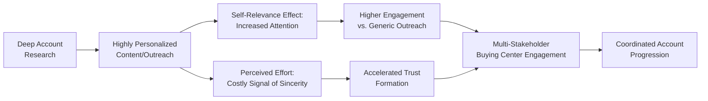
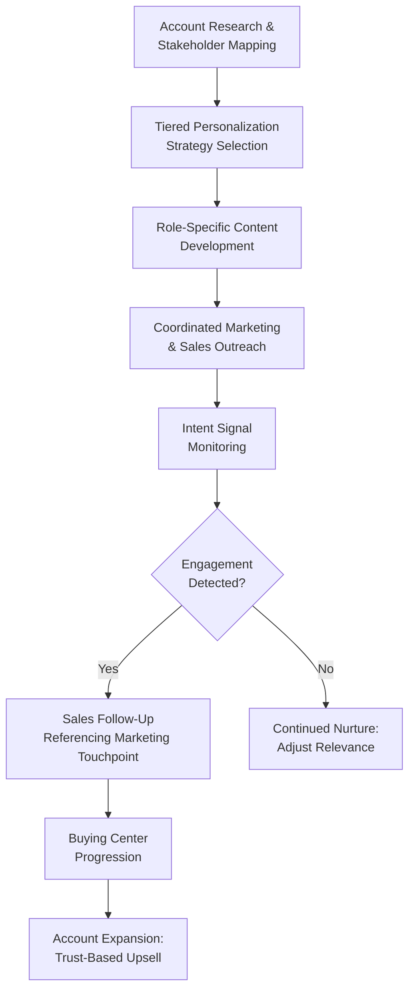

## Account-Based Marketing Psychology

### Overview

Account-based marketing (ABM) is a strategic B2B marketing approach that treats individual high-value accounts as markets of one, coordinating personalized marketing and sales efforts around the specific buying center, organizational context, and stakeholder psychology of each targeted account rather than pursuing broad, undifferentiated lead generation. The psychological foundation of ABM rests on personalization theory, multi-stakeholder influence dynamics, and the recognition that B2B purchasing decisions are made by groups of individuals with distinct psychological profiles rather than a single generic "buyer persona."

---

### Why ABM Requires a Distinct Psychological Approach

**Key Points**

- Traditional demand generation marketing optimizes for volume and broad appeal across a large, heterogeneous prospect pool; ABM optimizes for depth and precision within a small number of specifically targeted, high-value accounts.
- Because B2B purchasing decisions involve multiple buying center members with distinct roles and motivations (covered in the buying center topic), effective ABM psychology requires simultaneously addressing several different psychological profiles within a single coordinated campaign, rather than a single generic message.
- **[Inference]** This structurally shifts marketing psychology from mass persuasion principles (broad appeal, statistical optimization across large audiences) toward personalization and relevance principles (individual-level psychological resonance), which draws more heavily on relationship marketing and personal-selling psychology than on traditional broad-reach advertising theory.

---

### The Psychology of Personalization and Relevance

ABM's core psychological mechanism is relevance-driven attention and trust acceleration: highly personalized content and outreach signals genuine understanding of the recipient's specific context, which produces stronger engagement and trust formation than generic messaging.

**Underlying psychological principles:**

- **Self-relevance effect**: information perceived as directly relevant to oneself receives disproportionately greater attention and cognitive processing than generic information — a well-established finding in cognitive and social psychology.
- **Perceived effort as a trust signal**: highly personalized outreach (referencing specific company initiatives, named stakeholders, or industry-specific challenges) signals genuine investment, which functions similarly to a costly signal in game-theoretic terms — the effort itself communicates sincerity because it would not be worth investing in an insincere or low-value prospect.
- **Reciprocity via value-first engagement**: ABM programs frequently lead with tailored, genuinely useful content (custom research, account-specific insights) before any sales ask, invoking the reciprocity principle at an account level.

**[Inference]** The psychological premise underlying ABM's effectiveness is that in high-value, low-volume B2B contexts, the return on deep personalization (in trust, relevance, and differentiation from generic competitor outreach) outweighs the efficiency loss of not scaling to a broad audience — a trade-off that would not hold for lower-value, higher-volume transactional contexts.

---

### Diagram: ABM Psychological Mechanism

**Diagram (svg_diagram): ABM Relevance-to-Trust Pathway**

---

### ABM Tiers and Psychological Depth Trade-offs

ABM programs typically operate across three tiers, each representing a different balance between personalization depth and scale:

| Tier | Personalization Level | Typical Account Volume | Psychological Approach |
| --- | --- | --- | --- |
| Strategic (One-to-One) | Fully bespoke, individually researched | 1–10 accounts | Deep individual stakeholder psychology mapping; highly customized messaging per person |
| Lite (One-to-Few) | Segment-level personalization | 10–100 accounts | Shared psychological profiles across similar account clusters (e.g., by industry vertical) |
| Programmatic (One-to-Many) | Scaled personalization via data/technology | 100+ accounts | Behavioral and firmographic signals drive automated but still account-aware personalization |

**[Inference]** As ABM moves from strategic to programmatic tiers, the depth of individual psychological insight necessarily decreases in favor of scalable segmentation logic; this represents a genuine trade-off rather than a solved problem, and the appropriate tier selection depends on account value concentration (i.e., whether a small number of accounts represent a disproportionate share of potential revenue, which is common in many B2B markets following a Pareto-like distribution).

---

### Multi-Stakeholder Psychological Targeting

Because ABM explicitly targets entire buying centers rather than single contacts, campaigns are commonly structured around role-specific psychological messaging aligned with the stakeholder roles and motivations discussed in the buying center topic.

| Stakeholder Role | Psychological Messaging Focus | Example Content Type |
| --- | --- | --- |
| Economic buyer/Decider | Risk mitigation, ROI, strategic alignment | Executive briefings, business case templates |
| Technical influencer | Competence signaling, specification fit | Technical whitepapers, architecture documentation |
| End user | Ease of adoption, workflow improvement | Product demos, user testimonials |
| Champion | Internal credibility-building materials | Shareable one-pagers, internal presentation decks |
| Procurement/Buyer | Commercial terms, vendor comparison clarity | Pricing transparency, contract flexibility messaging |

**Example**

An ABM campaign targeting a mid-market manufacturing company might simultaneously deliver an ROI-focused executive brief to the CFO (Decider), a technical integration whitepaper to the IT director (Influencer), and a workflow-efficiency case study to plant operations managers (Users) — all coordinated under a consistent account-level narrative but psychologically tailored to each role's distinct concerns.

**[Inference]** Coordinating consistent messaging across differently tailored content for each stakeholder requires careful narrative alignment; excessive divergence in tone or claims across stakeholder-specific materials risks creating perceived inconsistency if buying center members compare notes internally, potentially undermining rather than building trust.

---

### Account Intelligence and the Psychology of "Being Known"

A core psychological driver of ABM effectiveness is the buyer's perception of being genuinely understood, as opposed to being processed through generic marketing automation.

**Key mechanisms:**

- **Intent data signals**: behavioral data (content consumption patterns, search behavior) used to infer where an account is in its buying journey, allowing marketing to align message timing with actual readiness rather than an arbitrary outreach cadence
- **Firmographic and technographic personalization**: referencing an account's specific industry challenges, technology stack, or recent company news signals genuine research investment
- **Trigger-event marketing**: timing outreach around specific organizational events (leadership changes, funding rounds, expansion announcements) that create genuine relevance and urgency

**[Inference]** The psychological risk in intent-data-driven personalization is a "creepiness" or over-surveillance perception if personalization signals more monitoring than the buyer is comfortable acknowledging (e.g., referencing very granular browsing behavior); effective ABM practice generally calibrates personalization to feel like informed relevance rather than invasive tracking, though the precise threshold varies by individual and cultural comfort with data usage.

---

### Sales-Marketing Alignment as a Psychological Amplifier

ABM's effectiveness depends heavily on tight coordination between marketing and sales functions, since disjointed messaging between marketing content and sales outreach undermines the consistency that builds trust.

**Key Points**

- **Consistent narrative continuity**: when sales outreach directly references and builds on prior marketing touchpoints (e.g., "I saw you downloaded our supply chain resilience report"), it reinforces the self-relevance effect and demonstrates organizational coordination rather than fragmented, siloed outreach.
- **[Inference]** Buying center members who receive inconsistent or apparently uncoordinated messaging from marketing versus sales within the same vendor organization may interpret this as a signal of poor organizational coherence, which can undermine interorganizational trust (per the multi-level B2B trust framework) even before a direct sales relationship has substantially developed.

---

### Diagram: ABM Full-Funnel Psychological Alignment

**Diagram (svg_diagram): ABM Coordinated Funnel**

---

### ABM's Connection to Long-Term Relationship Psychology

**[Inference]** ABM is often conceptually positioned not merely as a lead-generation tactic but as an extension of relationship marketing principles applied earlier in the funnel — beginning trust and rapport formation before a formal sales conversation occurs. This connects ABM psychology directly to the Commitment-Trust framework: personalization and demonstrated understanding function as early competence and benevolence signals, while consistent, coordinated engagement over the (often lengthy) B2B consideration period builds the knowledge-based trust foundation that formal sales conversations can then build upon.

---

### Common Pitfalls and Misapplications

- **Personalization theater**: superficial personalization (e.g., simply inserting a company name into a template) without genuine account-specific insight fails to produce the perceived-effort trust signal and can appear more insincere than generic messaging.
- **Over-surveillance perception**: excessively granular behavioral personalization can trigger discomfort rather than the intended relevance response if it signals more tracking than the buyer expects or is comfortable with.
- **Single-stakeholder focus within ABM**: applying ABM's account-level intent while still targeting only one contact undermines the multi-stakeholder psychological coordination that differentiates ABM from traditional single-contact outbound sales.
- **Sales-marketing misalignment**: uncoordinated messaging between marketing content and subsequent sales outreach undermines the narrative consistency that builds interorganizational trust.
- **Misapplying ABM tier to account value**: investing strategic-tier (one-to-one) personalization resources in lower-value accounts, or programmatic-tier generic personalization in genuinely strategic accounts, misallocates effort relative to the psychological depth each account's decision complexity warrants.
- **[Speculation]** As AI-assisted content generation and intent-data tools make deep personalization increasingly automatable at scale, some practitioners suggest the traditional trade-off between personalization depth and account volume may be narrowing; however, whether AI-generated personalization produces the same "costly signal" trust effect as genuinely human-researched, bespoke outreach — given that buyers may eventually recognize AI-generated personalization patterns — remains a genuinely open and actively debated question rather than an established finding.

---

### Related Topics

- The Buying Center and Stakeholder Roles
- Relationship and Trust-Building in B2B Contexts
- Rational and Political Dynamics in B2B Decisions
- Multi-Threading and Account-Based Selling Strategy
- Customer Lifetime Value and B2B Retention Economics
- Personalization Psychology and the Self-Relevance Effect
- Intent Data and Predictive Lead Scoring
- Sales and Marketing Alignment (Smarketing)
- Key Account Management and Enterprise Sales
- Champion and Coach Development in Complex Sales