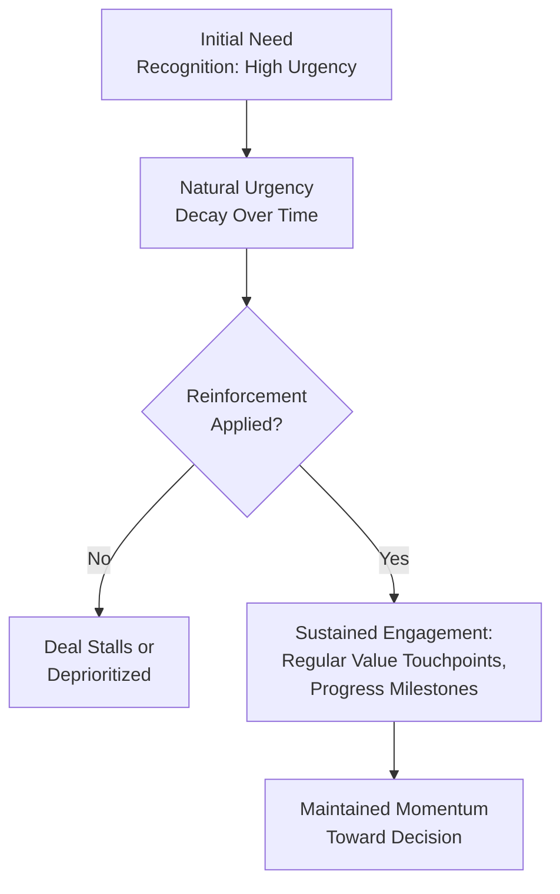
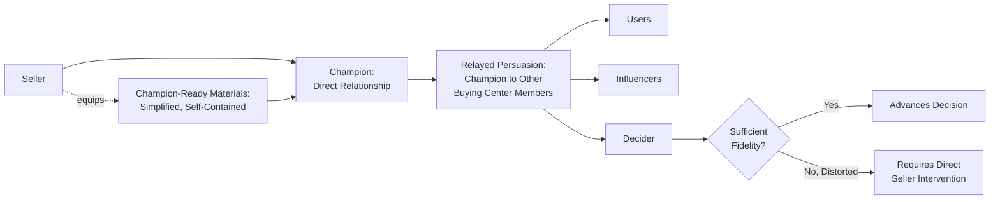
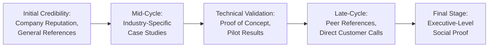

## Multi-Stakeholder Persuasion in Long Sales Cycles

### Overview

Multi-stakeholder persuasion in long sales cycles addresses the distinct psychological challenge of maintaining coherent influence across an extended time horizon involving multiple decision-makers, each engaged at different points, with different information levels, and often without the seller present for key internal deliberations. Unlike single-interaction persuasion models, long B2B sales cycles require managing persuasion as a distributed, asynchronous, and partially indirect process — where much of the actual influence work happens through internal champions and accumulated materials rather than direct seller-to-stakeholder interaction.

---

### The Distinct Psychological Challenge of Extended Timeframes

**Key Points**

- Long sales cycles (often spanning months to over a year for complex enterprise purchases) mean that no single persuasive interaction can carry the full weight of the decision; influence must be built and sustained cumulatively across many touchpoints.
- Stakeholders frequently join the buying center at different stages, meaning some participants receive full context and progressive persuasion exposure while others enter mid-process with significant information gaps.
- **[Inference]** Extended timeframes introduce genuine risks that single-interaction persuasion models do not address: stakeholder turnover, competing priorities displacing urgency, budget cycle changes, and gradual erosion of the initial emotional urgency that motivated the buying process to begin.

---

### Persuasion Decay and the Urgency Erosion Problem

A well-documented challenge in long B2B sales cycles is the natural decay of urgency and engagement over time, even among genuinely interested stakeholders.

**[Inference]** This decay is consistent with general psychological principles regarding motivation and salience: an initially vivid, urgent problem (which may have driven the Initiator's original need recognition) tends to lose motivational intensity as time passes and competing organizational priorities emerge, unless deliberately reinforced through ongoing engagement.

**Diagram (svg_diagram): Urgency Decay and Reinforcement**

**Common reinforcement mechanisms:**

- Scheduled milestone check-ins that create natural progress markers rather than open-ended waiting periods
- Ongoing delivery of new, relevant value (updated data, case studies, competitive intelligence) that refreshes engagement rather than repeating the same initial pitch
- Mutual action plans (jointly agreed timelines with defined responsibilities on both buyer and seller sides) that create structural accountability for maintaining pace

---

### The Distributed Persuasion Problem: Selling Through Champions

Because sellers cannot be present for every internal conversation within the buying center, a substantial portion of persuasion in long sales cycles occurs indirectly, through internal champions relaying the seller's value proposition to colleagues.

**Key Points**

- Champions inevitably compress, simplify, and sometimes imperfectly relay information compared to a seller's direct presentation, creating an information-fidelity challenge.
- **[Inference]** Effective long-cycle sales psychology therefore emphasizes equipping champions with polished, reusable, and simplified materials (executive summaries, one-page business cases, pre-built slide decks) specifically designed to survive being relayed by someone other than the original seller — recognizing that persuasion effectiveness depends partly on materials that function well independent of the seller's own communication skill.
- Champions themselves require psychological reinforcement across a long cycle: providing them with visible internal wins, position-supporting data, and responsiveness to their own questions sustains their motivation to continue expending political capital on the seller's behalf.

**Diagram (svg_diagram): Distributed Persuasion Pathway**

---

### Sequencing Persuasion Across Stakeholder Entry Points

Because different buying center members join the process at different stages, effective long-cycle persuasion requires deliberate sequencing rather than assuming uniform context across all stakeholders.

| Entry Point | Persuasion Challenge | Approach |
| --- | --- | --- |
| Early entrants (Initiators, early Influencers) | Have full context, may experience urgency decay over time | Sustained engagement, milestone reinforcement |
| Mid-process entrants (additional Influencers, procurement) | Lack full context, may raise previously resolved objections | Structured onboarding briefings, consolidated summary materials |
| Late entrants (final Decider, executive sign-off) | Minimal direct engagement history, evaluate largely on summarized business case | Concise, high-credibility executive-level materials; reliance on champion advocacy and social proof |

**[Inference]** Late-entering stakeholders, particularly senior Deciders who often engage only at the final approval stage, are especially reliant on the accumulated credibility of the process itself (champion enthusiasm, consolidated business case quality, peer references) rather than direct experience of the seller's persuasive skill — making the quality of distributed materials disproportionately important for this stakeholder group.

---

### Maintaining Message Consistency Across Time and Stakeholders

A structural risk in long, multi-stakeholder cycles is message drift — where the value proposition, pricing understanding, or scope shifts subtly across different conversations, creating confusion or perceived inconsistency when buying center members compare notes.

**Key Points**

- Consistent documentation (shared proposal versions, single source-of-truth pricing, unified value messaging) reduces the risk of internal confusion undermining trust.
- **[Inference]** Perceived inconsistency across a long sales cycle — even if unintentional (e.g., an evolving proposal scope discussed informally with one stakeholder but not communicated to others) — can be interpreted by buying center members as evasiveness or unreliability, directly damaging the integrity-based trust component central to the broader Commitment-Trust framework.

---

### Managing Multiple Concurrent Objections and Concerns

In long sales cycles, different stakeholders often raise different, sometimes conflicting, objections simultaneously rather than sequentially, requiring the seller to manage a portfolio of concerns rather than resolving one issue before the next arises.

**Example**

During a nine-month enterprise software evaluation, the technical Influencer may raise integration concerns in month two, procurement may raise contract term concerns in month five, and the Decider may raise budget-cycle timing concerns in month eight — each requiring distinct resolution approaches while maintaining overall narrative coherence across the extended timeline.

**[Inference]** This concurrent, multi-threaded objection landscape differs meaningfully from single-interaction objection handling (covered elsewhere in this chapter); it requires ongoing tracking (often via CRM opportunity management) of each stakeholder's specific concerns and resolution status, since forgetting or inconsistently addressing an earlier stakeholder's concern while focusing on a newer one can resurface unresolved doubt late in the process.

---

### Building Cumulative Social Proof Across the Cycle

Long sales cycles provide extended opportunity to progressively layer social proof and credibility-building evidence, rather than relying on a single upfront credibility pitch.

**Diagram (svg_diagram): Cumulative Credibility Building**

**[Inference]** Sequencing social proof from general (company-level reputation) to specific (peer reference calls, pilot results) generally aligns with how trust deepens across the relationship lifecycle — early-stage calculative trust based on external reputation gradually giving way to knowledge-based trust grounded in direct or peer-validated experience as the cycle progresses.

---

### Psychological Risks Specific to Long Cycles

| Risk | Description | Mitigation Approach |
| --- | --- | --- |
| Stakeholder turnover | A key champion or Decider leaves or changes roles mid-cycle | Multi-threading across multiple stakeholders reduces single-point-of-failure risk |
| Competing priority displacement | Organizational attention shifts to a new, more urgent initiative | Regular reinforcement of quantified cost-of-inaction |
| Budget cycle misalignment | Fiscal year or budget approval timing conflicts with sales cycle pace | Early alignment on budget cycle timing during discovery |
| Champion fatigue | Internal advocate's enthusiasm wanes without visible progress or support | Providing champions with periodic wins, responsiveness, and visible momentum |
| Competitive re-engagement | A competitor re-enters consideration during a prolonged evaluation gap | Sustained engagement cadence prevents extended silence that invites competitive intrusion |

**[Inference]** Multi-threading (maintaining active relationships across several buying center members rather than a single primary contact) is generally considered the most structurally important mitigation across nearly all of these risks, since it reduces the sales process's dependency on any single individual's continued availability, enthusiasm, or organizational standing.

---

### Structured Approaches: Mutual Action Plans

A widely used practical tool for managing long, multi-stakeholder cycles is the **Mutual Action Plan (MAP)** — a jointly developed, shared document outlining agreed milestones, responsibilities, and timelines for both buyer and seller across the remaining sales process.

**Key Points**

- MAPs create structural accountability and shared ownership of pace, reducing the seller's sole responsibility for maintaining momentum.
- They provide natural, non-arbitrary touchpoints for engagement, addressing the urgency-decay problem through built-in progress checkpoints rather than open-ended follow-up.
- **[Inference]** Because MAPs require the buyer's active participation in defining the timeline, they also function as an implicit graduated-commitment mechanism (consistent with commitment-and-consistency principles): each buyer-side milestone completion represents a small, self-generated commitment that reinforces continued engagement.

---

### Common Pitfalls and Misapplications

- **Treating the sales cycle as a single sustained pitch rather than a distributed, evolving process**: applying identical messaging and intensity throughout the cycle ignores the different psychological needs of early, mid, and late-stage engagement.
- **Neglecting champion support materials**: assuming a champion can effectively relay complex value propositions without simplified, purpose-built materials risks distorted or diluted internal advocacy.
- **Insufficient multi-threading**: relying on a single primary contact across a long cycle creates significant vulnerability to stakeholder turnover or waning individual enthusiasm.
- **Allowing urgency to fully decay without reinforcement**: passive waiting between touchpoints invites competing priorities and competitive re-engagement to displace the original initiative.
- **Inconsistent messaging across time or stakeholders**: allowing scope, pricing, or value claims to drift across different conversations creates internal confusion that can be misread as unreliability.
- **[Speculation]** As organizations increasingly conduct portions of evaluation asynchronously (shared documents, recorded demos, internal Slack discussions the seller cannot observe), some practitioner commentary suggests that sellers may be losing visibility into a growing share of the actual internal deliberation process; the degree to which this trend is altering optimal long-cycle persuasion strategy remains an open and evolving question rather than a settled finding.

---

### Related Topics

- The Buying Center and Stakeholder Roles
- Rational and Political Dynamics in B2B Decisions
- Relationship and Trust-Building in B2B Contexts
- Champion and Coach Development in Complex Sales
- Account-Based Marketing Psychology
- Consultative and Needs-Based Selling
- Objection Handling and Reframing
- Mutual Action Plans and Sales Process Management
- Multi-Threading and Account-Based Selling Strategy
- Customer Lifetime Value and B2B Retention Economics